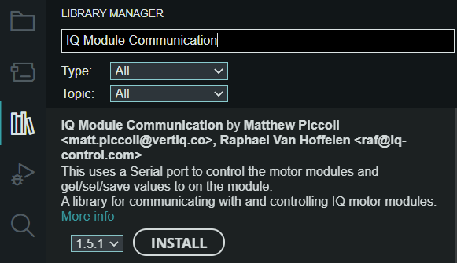

.. _getting_started_arduino_api:

*****************************
Getting Started with Arduino
*****************************

Installation
===============
Vertiq's Arduino API can be installed directly through the Arduino Library Manager under the name IQ Module Communication.

You can also find a zipped archive of the Arduino API on `our website <https://www.vertiq.co/support>`_.

For more information on installing Arduino libraries please read `the page linked here <https://www.arduino.cc/en/guide/libraries>`_.

Hardware Setup
=================
First, you must refer to your Arduino's specific pinout to identify the serial ports available on your board. Once you have selected the serial port you would like to 
use, locate the TX, RX, and GND pins. Now, ensure that your Arduino's TX signal is connected to your module's RX line, and vice versa. 
Also, ensure that you connect your Arduino's ground connection to your module's.

IQUART Communication
=======================

Configuring Serial Connection
--------------------------------
In order to communicate with your module with an Arduino, you must configure an ``IqSerial`` instance. The ``IqSerial`` object is responsible for all communication 
with the connected module, and can be attached to any available serial port on your Arduino. For example, to configure IQUART for Serial2 ``IqSerial ser(Serial2);``.

We now use our ``setup`` function to initialize the IqSerial object as well as our terminal serial peripheral. By default, we set our IqSerial baud rate to 115200 
(the default value for all Vertiq modules). In order to use a different baud rate with an IqSerial object, we can call ``ser.begin(<new baud rate>);``.

Communication with IQUART Clients
--------------------------------------
As mentioned in :ref:`getting_started_with_apis`, all Vertiq clients contain endpoints that can accept get, set, and save commands. This section 
discusses how to perform gets, sets, and saves through the Arduino API.

Before moving forward, please familiarize yourself with the clients available for your module's family and firmware style. You can find this information on your 
module's family page in the Supported IQUART Clients section.

Each IQUART client has a C++ object implementation to allow for easy communication. The client files can be found in our `C++ API's inc folder <https://github.com/iq-motion-control/iq-module-communication-cpp/tree/master/inc>`_. 
Inside each client object are the client's entries whose formats are specified by templated instantiation. 
For example, the :ref:`Power Monitor Client <power_monitor>` includes entries that contain float data ``ClientEntry<float> volts_;`` as well 
as entries that contain unsigned half-words ``ClientEntry<uint16_t> volts_raw_;``

In order to create an instance of IQUART client objects, you'll need to determine the correct module ID and create the object. 
For example, suppose you want to communicate with the Power Monitor Client of the module whose Module ID is 42. We can create that object by:

.. code-block:: cpp

   PowerMonitorClient power(42); // Object is initialized with target module ID 42

By default, all Vertiq modules have a Module ID of 0.

Getting
^^^^^^^^^^^^

The ``get`` function has the format ``ser.get(client.entry, location_to_store);`` and returns a boolean determining if data was returned or not.

In order to get data from a client's entry (such as the ``volts_`` entry mentioned above), you'll need an instance of that client, for example, ``PowerMonitorClient``. 
Then, we can call the ``get`` function on ``PowerMonitorClient``'s ``volts_`` entry. The following example requests, and prints the module's reported voltage on each loop:

.. code-block:: cpp

   #include <iq_module_communication.hpp>

   //Create our IqSerial instance on Serial1
   IqSerial ser(Serial1);

   //Create the client we need in order to read the module's input voltage
   PowerMonitorClient power(0);

   void setup() {
      // Initialize the IqSerial object
      ser.begin();

      // Initialize Serial (for displaying information on the terminal)
      Serial.begin(115200);
   }

   void loop() {
      //Create a variable that will store the gotten data
      float volts_now;

      //Check to see if we get a reply. If we do, print the result
      if(ser.get(power.volts_, volts_now)){
         Serial.println(volts_now);
      }
   }

Setting
^^^^^^^^^^^
The ``set`` function has the format ``ser.set(client.entry, value);``

The ``set`` function changes the value of the target entry to ``value``. A value set and not saved will not be retained after a power cycle.

Suppose we want to change the Propeller Motor Controller's timeout parameter to 3 seconds. 

.. image:: ../_static/api_pics/timeout_entry.png

We'll need a ``PropellerMotorControlClient`` ``prop_control`` initialized to our Module ID (in this case 0). To set a new timeout using only our ``setup`` function:

.. code-block:: cpp

   #include <iq_module_communication.hpp>
   //Create our IqSerial instance on Serial1
   IqSerial ser(Serial1);
   
   //Create the client we need in order to set/save the module's timeout
   PropellerMotorControlClient prop_control(0);

   void setup() {
      // Initialize the IqSerial object
      ser.begin();

      // Initialize Serial (for displaying information on the terminal)
      Serial.begin(115200);

      //Set the timeout value
      ser.set(prop_control.timeout_, 3.0);
   }

Note that we must call ``set`` with a data type matching that specified by the client entry (in this case a float). If you attempt to set the ``timeout_`` parameter with 3 only, you will get a compilation error.

Save
^^^^^^^^^
The ``save`` function has the format ``ser.save(client.entry);``

The save function takes the currently set entry value, and stores it in the module's persistent memory. Values that are saved are retained on power cycles.

Suppose we want to save the timeout value set above. To do so:

.. code-block:: cpp
   
   //Create our IqSerial instance on Serial1
   IqSerial ser(Serial1);

   //Create the client we need in order to set/save the module's timeout
   PropellerMotorControlClient prop_control(0);

   void setup() {
      // Initialize the IqSerial object
      ser.begin();

      // Initialize Serial (for displaying information on the terminal)
      Serial.begin(115200);

      //Set and save the timeout value
      ser.set(prop_control.timeout_, 3.0);
      ser.save(prop_control.timeout_);
   }

Next Steps
================
As the get, set, and save commands are the basis of all IQUART configuration and control, you now possess all of the base knowledge necessary to begin development with the Vertiq Arduino API.

A very basic example is provided here. It demonstrates the basics of setting up communication and a module object as well as how to set and get parameters.

.. warning::
    Please remove all propellers from any module you plan on testing. Failure to do so can result in harm to you or others around you. Further, please ensure that your module is secured to a stationary platform or surface before attempting to spin it. 

.. code-block:: cpp

   #include <iq_module_communication.hpp>

   //Module communication running on Serial1
   IqSerial ser(Serial1);

   //All IQUART Clients we will need for this basic example. Each is set to communicate with Module ID 0 (the default Vertiq value)
   TemperatureMonitorUcClient uc_temp(0);
   PropellerMotorControlClient prop_control(0);
   BrushlessDriveClient brushless_drive(0);

   void setup() {
      // Initialize the IqSerial object
      ser.begin();

      // Initialize Serial (for displaying information on the terminal)
      Serial.begin(115200);

      //Let's check our microcontroller temperature
      float uc_temp_now;
      if(ser.get(uc_temp.uc_temp_, uc_temp_now)){
         Serial.print("Microcontroller Temp Now: ");
         Serial.println(uc_temp_now);
      }

      //Wait 5 seconds before moving on
      delay(5000);
   }

   void loop() {
      //Spin very slowly
      ser.set(prop_control.ctrl_velocity_, 20.0);

      //Check our velocity
      float velocity_now;
      if(ser.get(brushless_drive.obs_velocity_, velocity_now)){
         Serial.print("Velocity Now: ");
         Serial.println(velocity_now);
      }
   }
