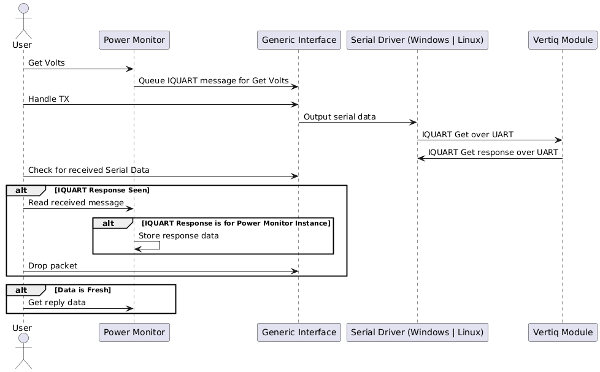

.. include:: ../text_colors.rst
.. toctree::

.. _getting_started_cpp_api:

****************************
Getting Started with C++
****************************

Installation
================
You can find Vertiq's C++ library on our `GitHub <https://github.com/iq-motion-control/iq-module-communication-cpp>`_. The code in the repository provides C++ 
representations of all :ref:`IQUART clients <iquart_client_reference_tables>` as well as the logic necessary to communicate over IQUART.

Hardware Setup
================
Information about required hardware for API communication can be found in the :ref:`Control Center documentation <connection_guide>`. The requirements for API communication 
are the same as those for the IQ Control Center.

.. _writing_serial_data:

Serial Connection Information
================================
The method of opening and using a serial connection varies depending on the operating system being used to run the C++ API. We will discuss opening a serial port on Windows and Linux here.

Windows
----------
For more information about serial connections on Windows, please read `Microsoft's documentation <https://learn.microsoft.com/en-us/windows/win32/devio/configuring-a-communications-resource>`_. 

Files to Include
^^^^^^^^^^^^^^^^^^^^
In order to open a serial port, you must include iostream, windows.h, and tchar.h in your C++ project.

.. code-block:: cpp

    #include <iostream>
    #include <windows.h>
    #include <tchar.h>

Configuring the Serial Port
^^^^^^^^^^^^^^^^^^^^^^^^^^^^^^^
In order to set up the specific serial port, you must create a HANDLE instance as well as a TCHAR instance set to your FTDI's COM port. 
Suppose your FTDI reports on COM4 you will configure your Windows variables as follows:

.. code-block:: cpp

    HANDLE com_port;
    TCHAR *pcCommPort = TEXT("COM4");
    
Now, we can start up and open the serial port so that we can communicate with the connected module. Suppose we want to open our COM port at 115200 baud with the same 
serial protocol configuration as all Vertiq modules. To do so:

.. code-block:: cpp
    
    com_port = CreateFile( pcCommPort,
                    GENERIC_READ | GENERIC_WRITE,
                    0,      //  must be opened with exclusive-access
                    NULL,   //  default security attributes
                    OPEN_EXISTING, //  must use OPEN_EXISTING
                    0,      //  not overlapped I/O
                    NULL ); //  hTemplate must be NULL for comm devices

    cout << com_port << endl;

    if (com_port== INVALID_HANDLE_VALUE)
        cout <<"Error in opening serial port" << endl;
    else
        cout << "opening serial port successful" << endl;

    DCB dcb = {0}; // Device-control block used to configure serial communications
    dcb.DCBlength = sizeof(DCB);
    GetCommState (com_port,&dcb);
    dcb.BaudRate  = CBR_115200; // Set baud rate to 115200
    dcb.ByteSize = 8;
    SetCommState (com_port,&dcb);

    //Set up a read timeout
    COMMTIMEOUTS timeouts;
    GetCommTimeouts(com_port, &timeouts);
    timeouts.ReadIntervalTimeout = 5;
    SetCommTimeouts(com_port, &timeouts);

Reading Data
^^^^^^^^^^^^^^^
Serial data received through the FTDI is stored in the file specified by the ``com_port`` parameter. In order to access the file's data:

.. code-block:: cpp

    uint8_t recv_bytes[64];
    DWORD dwBytesReceived;

    ReadFile(com_port, &recv_bytes, 64, &dwBytesReceived, 0);

Transmitting Data
^^^^^^^^^^^^^^^^^^^^

Serial data to be written to the module can be written to the file specified by the ``com_port`` parameter. In order to write data:

.. code-block:: cpp

    uint8_t packet_buf[64];
    uint8_t length = 0;
    DWORD bytes_written;

    // Fill in packet_buf with data (as described later using the API), and update length

    WriteFile(com_port, packet_buf, length, &bytes_written, NULL);

Linux (Ubuntu)
----------------

Files to Include
^^^^^^^^^^^^^^^^^^^^^^^
In these examples, we use the LibSerial library. For more information on getting started with LibSerial, please see `their documentation <https://libserial.readthedocs.io/en/latest/index.html>`_. 

Here, we will include the following for serial communication:

.. code-block:: cpp

    #include "libserial/SerialPort.h"
    #include "libserial/SerialStream.h"

    #include <string>
    #include <iostream>
    #include "unistd.h"

We also configure our namespace with:

.. code-block:: cpp

    using namespace LibSerial;

Configuring the Serial Port
^^^^^^^^^^^^^^^^^^^^^^^^^^^^^^^
In order to set up the specific serial port, you must know the name of the port connected to by your FTDI. In this example, we assume your port's name 
is “/dev/ttyUSB0”. Suppose your module communicates with a serial baud rate of 115200. To configure your ``SerialPort``	instance:

.. code-block:: cpp

    SerialPort my_serial_port("/dev/ttyUSB0");
    my_serial_port.SetBaudRate(BaudRate::BAUD_115200);

Reading Data
^^^^^^^^^^^^^^^^^
In order to read data in from the serial port, we use the provided ``Read`` function from ``LibSerial``. First, we create a byte array to store our data as well as 
a variable to store the length of the data. Then, we can check to see if there is data available with the ``LibSerial`` function ``GetNumberOfBytesAvailable``. 
Now, we read and store the data in our byte array.

.. code-block:: cpp

    // Serial Receive Buffer
    char read_buf[64];

    // How many bytes are in the read buffer
    uint8_t length = my_serial_port.GetNumberOfBytesAvailable();

    // Read the packet from Serial
    my_serial_port.Read(read_buf, length);

From here, we can hand the received data to our IQUART parser as covered later.

Transmitting Data
^^^^^^^^^^^^^^^^^^^^
In order to transmit data, we only need a byte string to write as well as the number of bytes to transmit. So, we create those as:

.. code-block:: cpp

    uint8_t packet_buf[64];
    uint8_t length = 0;

Now, we ask our IQUART ``GenericInterface`` for transmission data with ``GetTxBytes(packet_buf, length)`` (covered more below), 
and can send the data to the module with ``my_serial_port.Write(packet_buf, length);``.

.. _performing_iquart:

Performing IQUART Communication
================================

Now that we can read and write generic serial data through the Windows and Linux drivers, we can interface the operating system's read/write commands with our 
IQUART parser. This is done through the ``GenericInterface`` class. The ``GenericInterface`` is responsible for parsing IQUART data from incoming serial streams, 
and for forming and buffering IQUART messages for transmission.

In order to queue received serial data for IQUART parsing, we create a ``GenericInterface`` object ``com``, and use the function ``SetRxBytes``. ``SetRxBytes`` 
takes in a pointer to data bytes as well as the data length. So, on Windows, our full function for receiving IQUART data becomes:

.. code-block:: cpp

    uint8_t recv_bytes[64];
    DWORD dwBytesReceived;

    ReadFile(com_port, &recv_bytes, 64, &dwBytesReceived, 0);
    com.SetRxBytes(recv_bytes, dwBytesReceived);

In order to transmit queued IQUART data, we check our ``GenericInterface`` for data, and write it to our Windows serial file as above:

.. code-block:: cpp

    uint8_t packet_buf[64];
    uint8_t length = 0;
    DWORD bytes_written;

    // Get the packet from the com interface and place it into the packet buffer
    if(com.GetTxBytes(packet_buf, length)){
        WriteFile(com_port, packet_buf, length, &bytes_written, NULL);
    }

The process is identical on Linux systems, however, you must replace all Windows function calls with use of the ``LibSerial`` library as described above.

Communication with IQUART Clients
=====================================

As mentioned above, each IQUART client has a C++ object implementation to allow for easy communication. The client files can be found in the C++ API's ``inc`` folder. 
Inside each client object are the client's entries whose formats are specified by templated instantiation. For example, 
the :ref:`Power Monitor Client <power_monitor>` includes entries that contain float data ``ClientEntry<float> volts_;`` as well as entries 
that contain unsigned half-words ``ClientEntry<uint16_t> volts_raw_;``.

In order to create an instance of IQUART client objects, you'll need to include the correct header files, determine the correct module ID, and create the object. 
For example, suppose you want to communicate with the Power Monitor Client of the module whose Module ID is 42. We can create that object by:

.. code-block:: cpp

    #include "inc/power_monitor_client.hpp"
    PowerMonitorClient power(42); // Object is initialized with target module ID 42

.. note::
    All Vertiq modules have a default Module ID of 0. If you have not changed the module's Module ID, you must create your objects with 0 for the ``obj_idn`` parameter.

Getting
---------
In order to get data from a client's entry (such as the ``volts_`` entry mentioned above), you'll need an instance of ``PowerMonitorClient`` as well as a 
configured ``GenericInterface``. Then, we can call the ``get`` function on ``PowerMonitorClient``'s ``volts_`` entry. 
In this example, we have called our ``GenericInterface`` ``com``, and are using ``PowerMonitorClient power``. 
To add the get command to the serial transmission buffer, we run ``power.volts_.get(com)``. It is important to note that calling a ``get`` does not explicitly 
transmit anything over the serial line. You must extract the queued message from the generic interface and transmit it using the appropriate serial function as specified in :ref:`performing_iquart` above.

Once the module receives the transmitted get request, it will respond with the proper IQUART response message. Then, we can run the reception procedure illustrated in :ref:`performing_iquart` in order 
to add the received IQUART data to our reception buffer. Once there, we update our ``PowerMonitorClient`` with all received IQUART data, 
and allow it to determine what (if any) received data pertains to it. Then, we can throw away the now-processed IQUART packet.
Finally, we can check our client entry to see if it has received new data through the ``IsFresh`` function.

.. code-block:: cpp

    // Temporary Pointer to the packet data location
    uint8_t *packet_data;
    uint8_t packet_length;

    // Loads the packet data buffer with data received from the motor
    while(com.PeekPacket(&packet_data, &packet_length)){
        power.ReadMsg(packet_data, packet_length);
        com.DropPacket();
    }

If data was properly received and processed from the ``get`` request, we can access it by calling ``get_reply`` on our ``volts_`` entry in order to read the gotten value ``power.volts_.get_reply()``.

Note that by calling ``get_reply``, the entry's ``IsFresh`` flag is returned to 0. The following example illustrates how ``IsFresh`` works in relation to ``get`` and ``get_reply``. 
The functions ``handle_com_tx``, ``handle_com_rx``, and ``update_modules`` are given in full in :ref:`full_examples`.

.. code-block:: cpp
    //Create PowerMonitorClient power(0);

    //Configure serial communications for your OS

    //Queue a get message for Power Monitor Volts
    power.volts_.get(com);

    //Transmit the get
    handle_com_tx();

    //Handle receiving the data
    handle_com_rx();
    //Print out the current state of Power Monitor Volts parameter's IsFresh
    //We have not processed any data yet, so it should be false
    cout << "Power Monitor Volts IsFresh: " << power.volts_.IsFresh() << endl;

    //Now, allow the Power Monitor to process any received data
    update_modules();

    //At this point, we should have loaded a new value into power.volts_, and IsFresh should return true
    if(power.volts_.IsFresh()){
        cout << "Volts was fresh with value: " << power.volts_.get_reply() << endl;
    }

    //We've now called get_reply meaning we've processed the most recently received data. IsFresh should be false again
    cout << "Power Monitor Volts IsFresh: " << power.volts_.IsFresh() << endl;

The entire process of executing a ``get`` using the C++ library is described by the following sequence diagram:

	Process for Getting an Entry Value

Setting
---------
The process for setting is nearly identical to the first portion of a ``get``. Setting values, however, may require an additional input to the ``set`` function 
which is the value you would like to set. Values that do not indicate a **Data Type** in their client reference table do not take a value as an input parameter. 
For example, in the :ref:`Propeller Motor Controller client <propeller_motor_controller>`, the ``ctrl_volts`` parameter requires a value input of type float, but ``ctrl_coast`` 
requires no value input.

Suppose we create a ``PropellerMotorControlClient`` called ``prop_control``, and use our ``com`` ``GenericInterface`` instance. In order to queue a velocity command 
to 3.14 rad/s for transmission, we call ``prop_control.ctrl_velocity_.set(com, 3.14);``. In order to then queue a command for the module to coast, 
we can call ``prop_control.ctrl_coast_.set(com);``.

Processing data for output is the same as described as :ref:`above <performing_iquart>`, and is dependent on your operating system.

Suppose we want to change the Propeller Motor Controller's timeout parameter to 5 seconds. 

.. image:: ../_static/api_pics/timeout_entry.png

We'll need a ``PropellerMotorControlClient`` ``prop_control`` initialized to our Module ID (in this case 0). The function ``handle_com_tx`` is given in full in :ref:`full_examples`.

.. code-block:: cpp

    //Create PropellerMotorControlClient prop_control(0);
    //Configure serial communications for your OS

    //Queue a message that will set our module's timeout to 5 seconds
    prop_control.timeout_.set(com, 5);

    //Make sure the message gets out
    handle_com_tx();

Saving
---------
Sending a ``save`` command is identical to sending a  ``set`` command which does not accept a value parameter, only that ``set`` is replaced with ``save``. 
Suppose we want to change our :ref:`ESC Propeller Input Parser's <esc_propeller_input_parser_ref>` *volts_max* to 10, and then save that value. First, we create an instance 
of ``EscPropellerInputParserClient`` named ``esc_input_parser``. Then, we run the process to set the ``volts_max_`` parameter to 10. 
Now, we can queue a save command ``esc_input_parser.volts_max_.save(com);`` Once transmission is complete, the module's *volts_max* value is saved to its persistent memory.

Suppose we want to save the timeout value set above. To do so:

.. code-block:: cpp

    //Create PropellerMotorControlClient prop_control(0);
    //Configure serial communications for your OS

    //Queue a message that will set our module's timeout to 5 seconds
    prop_control.timeout_.set(com, 5);

    //Queue a message that will save our module's timeout
    prop_control.timeout_.save(com);

    //Make sure the message gets out
    handle_com_tx();

Special Case Setting - Packed Messages
------------------------------------------

Some IQUART clients, such as the IQUART Flight Controller Interface (IFCI) support ``PackedClientEntry`` instances. The ``PackedClientEntry packed_command_`` allows you 
to send :ref:`IFCI packets <controlling_ifci>` easily through the C++ API. In this instance, we provide the struct 
``IFCIPackedMessage``, and a helper function ``PackageIfciCommandsForTransmission`` to make it easier to create and send IFCI command messages. 
``PackedClientEntry`` instances still support a ``set`` function, only their footprint is ``client_object.packed_entry.set(CommunicationInterface &com, uint8_t * buf, uint8_t data_length);``. 
As with all ``set`` commands, this simply queues the bytes for transfer. The rest of the transmission process must happen to send the bytes over serial.

Let's suppose we want to send a packed IFCI command message that transmits 4 throttle commands, and request telemetry from the module with Module ID 3.

First, we need an instance of the ``IQUartFlightControllerInterfaceClient`` class which we will call 
``ifci`` with a target Module ID 0. Then, we create and fill an ``IFCIPackedMessage`` structure. Then we create a byte buffer and length parameter, 
and pass all three parameters into the ``PackageIfciCommandsForTransmission`` helper function.

.. code-block:: cpp

    IQUartFlightControllerInterfaceClient ifci(0);

    IFCIPackedMessage command;
    command.commands[0] = 11111; // Throttle 1
    command.commands[1] = 22222; // Throttle 2
    command.commands[2] = 33333; // Throttle 3
    command.commands[3] = 44444; // Throttle 4
    command.telem_byte = 3; // Request telemetry from Module ID 3
    command.num_cvs = 4; // We are sending 4 Control Values (in this case all throttle commands)

    uint8_t output_data[64];
    uint8_t output_data_len = 0;

    ifci.PackageIfciCommandsForTransmission(&command, output_data, &output_data_len);

Now, with our data prepared for transmission, we can call a ``set`` where ``com`` is our ``GenericInterface``:

.. code-block:: cpp

    ifci.packed_command_.set(com, output_data, output_data_len);

.. _full_examples:

Full Examples
===================

.. warning::
    Please remove all propellers from any module you plan on testing. Failure to do so can result in harm to you or others around you. Further, please ensure that your module is secured to a stationary platform or surface before attempting to spin it. 

.. note::
    Building and executing these examples are completely dependent on your system architecture, and there is no one way to accomplish it. As such, execution is not covered here.

Windows
------------

.. code-block:: cpp

    /*
    * This example C++ program uses the Power Monitor client to retrieve the Voltage of a motor.
    * The serial port setup for windows is based on the example provided by microsoft:
    *      https://learn.microsoft.com/en-us/windows/win32/devio/configuring-a-communications-resource
    *
    * Name: voltage_test.cpp
    * Last update: 7/15/2024 by Jordan Leiber
    * Author: Jordan Leiber
    */

    #include <iostream>
    #include <windows.h>
    #include <tchar.h>

    #include "inc/generic_interface.hpp"
    #include "inc/client_communication.hpp"
    #include "inc/power_monitor_client.hpp"
    #include "inc/propeller_motor_control_client.hpp"

    using namespace std;

    HANDLE com_port; // Handler for COM port
    TCHAR *pcCommPort = TEXT("COM3"); // Change COM4 to whichever port your motor is connected to
    GenericInterface com; // Interface used by com port to communicate with motor

    PowerMonitorClient power(0); // Client endpoint for voltage reading
    PropellerMotorControlClient prop_control(0); // Client endpoint for velocity control

    //  Send out any message data we have over the serial interface
    int handle_com_tx(){
        uint8_t packet_buf[64];
        uint8_t length = 0;
        DWORD bytes_written;

        // Get the packet from the com interface and place it into the packet buffer
        if(com.GetTxBytes(packet_buf, length)){
            WriteFile(com_port, packet_buf, length, &bytes_written, NULL);
        }

        return bytes_written;
    }

    // Grab any received data on the serial interface
    int handle_com_rx(){
        uint8_t recv_bytes[64];
        DWORD dwBytesReceived;

        ReadFile(com_port, &recv_bytes, 64, &dwBytesReceived, 0);
        com.SetRxBytes(recv_bytes, dwBytesReceived);

        return dwBytesReceived;
    }

    // Hand off any received data to each module so they can handle it
    void update_modules(){
        // Temporary Pointer to the packet data location
        uint8_t *packet_data;
        uint8_t packet_length;

        // Loads the packet data buffer with data receieved from the motor
        while(com.PeekPacket(&packet_data, &packet_length)){
            power.ReadMsg(packet_data, packet_length);
            com.DropPacket();
        }
    }

    // Handles communication with motor
    void send_message_and_process_reply(){
        handle_com_tx();
        handle_com_rx();
        update_modules();
    }

    // Sends the command to motor to get Voltage
    float get_voltage(){
        power.volts_.get(com);
        send_message_and_process_reply();

        //Let's make sure we actually got a response
        if(power.volts_.IsFresh()){
            return power.volts_.get_reply();
        }

        return 0;
    }

    int main(){
        com_port = CreateFile( pcCommPort,
                        GENERIC_READ | GENERIC_WRITE,
                        0,      //  must be opened with exclusive-access
                        NULL,   //  default security attributes
                        OPEN_EXISTING, //  must use OPEN_EXISTING
                        0,      //  not overlapped I/O
                        NULL ); //  hTemplate must be NULL for comm devices

        cout << com_port << endl;

        if (com_port== INVALID_HANDLE_VALUE)
            cout <<"Error in opening serial port" << endl;
        else
            cout << "opening serial port successful" << endl;

        DCB dcb = {0}; // Device-control block used to configure serial communications
        dcb.DCBlength = sizeof(DCB);
        GetCommState (com_port,&dcb);
        dcb.BaudRate  = CBR_115200; // Set baud rate to 115200
        dcb.ByteSize = 8;
        SetCommState (com_port,&dcb);

        //Set up a read timeout
        COMMTIMEOUTS timeouts;
        GetCommTimeouts(com_port, &timeouts);
        timeouts.ReadIntervalTimeout = 5;
        SetCommTimeouts(com_port, &timeouts);

        // Get and print the current Voltage reading of the motor
        float current_voltage = get_voltage();
        cout << "voltage: " << to_string(current_voltage) << endl;

        //Loop 5000 times setting a target velocity (send several times to avoid a timeout)
        for(uint16_t command = 0; command < 5000; command++){
            prop_control.ctrl_velocity_.set(com, 25); //Set the control velocity to 25 rad/s (notice that we require a value parameter here)
            handle_com_tx();
        }

        //Coast the module
        prop_control.ctrl_coast_.set(com); //Notice that we do not require a value parameter here
        handle_com_tx();

        return 0;
    }

Linux
----------

.. code-block:: cpp

    /*
    * Vertiq read motor coil temperature.
    *
    * This code shows how to use Serial over USB to read the
    * motor coil temperature
    *
    *
    * The circuit:
    * Connected to FTDI usb to Serial
    *
    * This example uses:
    *   - LibSerial (https://libserial.readthedocs.io/en/latest/index.html)
    *
    *   This demo works for POSIX supported systems and was ran using Linux Ubuntu 20.04.1 LTS
    *
    *
    * Created 2021/03/31 by Malik B. Parker
    *
    * This example code is in the public domain.
    */

    #include "generic_interface.hpp"
    #include "temperature_estimator_client.hpp"

    #include "libserial/SerialPort.h"
    #include "libserial/SerialStream.h"

    #include <string>
    #include <iostream>
    #include "unistd.h"

    using namespace LibSerial;

    int main(){

        // Setup the serial interface
        SerialPort my_serial_port("/dev/ttyUSB0");
        my_serial_port.SetBaudRate(BaudRate::BAUD_115200);

        // Make a communication interface object
        // This is what creates and parses packets
        GenericInterface com;

        // Make a Temperature Estimator Client object with obj_id 0
        TemperatureEstimatorClient temp(0);

        while(true){

            /**********************************************************************
            *********************** Sending Get Command **************************
            *********************************************************************/

            // Forms a packet in the com interface with the following:
            // type:        (77) Temperature Estimator ID Number
            // subtype:     ( 0) temp
            // obj/access   ( 0) get
            temp.temp_.get(com);

            uint8_t packet_buf[64];
            uint8_t length = 0;

            // Get the packet from the com interface and place it into the packet buffer
            if(com.GetTxBytes(packet_buf, length)){

                // C is a strong typed language -_-
                // so we need to convert to a string buffer to interface with LibSerial
                std::string string_buf((char*)packet_buf, length);

                // Send the get packet request to the motor
                my_serial_port.Write(string_buf);
            }

            /**********************************************************************
            ************************** Receiving Temp Value **********************
            *********************************************************************/

            // Need to wait for the Motor Controller to Respond
            usleep(5000);

            // Serial Receive Buffer
            std::string read_buf;

            // How many bytes are in the read buffer
            length = my_serial_port.GetNumberOfBytesAvailable();

            // Read the packet from Serial
            my_serial_port.Read(read_buf, length);

            // Again C is strongly types so we have to convert back to byte buffer
            uint8_t * cbuf = (uint8_t *) read_buf.c_str();

            // Transfer the buffer into the com interface
            com.SetRxBytes(cbuf, length);

            /**************************************************************************
            **************************  Reading the Value  ***************************
            *************************************************************************/

            // Temporary Pointer to the packet data location
            uint8_t *packet_data;
            uint8_t packet_length;

            // Loads the packet data buffer with data receieved from the motor
            com.PeekPacket(&packet_data, &packet_length);

            // Loads data into the temperature client
            temp.ReadMsg(packet_data, packet_length);

            com.DropPacket();

            //Let's see if we actually got a response
            if(temp.temp_.IsFresh()){
                // Reads the data from the temperature client
                float temperature = temp.temp_.get_reply();
                printf("Temperature: %f\n", temperature);
            }else{
                printf("Did not get a response\n");
            }
        }

        return 0;
    }

Full Arduino Code Example (w/ Arduino Serial)
=============================================

The below is a complete example of a program using the Arduino programming environment. This
example is to demonstrate how the C++ API can be useful in generic embedded as well as desktop environments. Simply interface a ``GenericInterface`` with your environment's serial 
data handler (in this case ``Serial1``), and you can use it to communicate via IQUART. Please note that Vertiq's :ref:`dedicated Arduino libraries <getting_started_arduino_api>` streamline the data transfer process, thus, actual Arduino programming is simpler than the below example. 
Please see the Arduino documentation if you intend on using the Arduino programming environment.
    
.. code-block:: Arduino

    /*
    * Vertiq spin and report demo.
    *
    * This code will command a motor to spin at various voltages and
    * simultaniously report the motor’s position and velocity over USB
    *
    *
    * The circuit:
    * Serial1 RX is directly connected to motor TX (Red)
    * Serial1 TX is directly connected to motor RX (White)
    *
    * Created 2018/10/8 by Matthew Piccoli
    *
    * This example code is in the public domain.
    */

    // USER SETABLE VALUES HERE------------------------------
    // Voltage step size
    const float kVoltageStep = 0.01f;
    // Max voltage
    const float kVoltageMax = 0.25f;
    // END USER SETABLE VALUES-------------------------------
    
    // Includes required for communication
    // Message forming interface
    #include <generic_interface.hpp>

    // Clients that speaks to module’s objects
    #include <brushless_drive_client.hpp>

    // Make a communication interface object
    GenericInterface com;

    // Make a objects that talk to the module
    BrushlessDriveClient mot(0);

    void setup() {
        // Initialize USB communicaiton
        Serial.begin(115200);
        Serial.print("Program starting");
        Serial.println();

        // Initialize the Serial peripheral for motor controller
        Serial1.begin(115200);
    }

    void loop() {
        static float voltage_to_set = 0.0f;
        static float voltage_sign = 1.0f;

        // Update voltage command
        if(abs(voltage_to_set) >= kVoltageMax){
            voltage_sign = -1*voltage_sign;
        }
        voltage_to_set += kVoltageStep*voltage_sign;

        SendMessages(voltage_to_set);
        ReceiveMessages();
        DoSomethingWithMessages();

        delay(100);
    }

    void SendMessages(float voltage_command){
        // This buffer is for passing around messages.
        uint8_t communication_buffer[64];
        // Stores length of message to send or receive
        uint8_t communication_length;

        // Generate the set message
        mot.drive_spin_volts_.set(com, voltage_command);

        // Generate the get message
        mot.obs_angle_.get(com);
        mot.obs_velocity_.get(com);

        // Grab outbound messages in the com queue, store into buffer
        // If it transferred something to communication_buffer...
        if(com.GetTxBytes(communication_buffer,communication_length)){
            // Use Arduino serial hardware to send messages
            Serial1.write(communication_buffer,communication_length);
        }

        Serial.print("Setting voltage: ");
        Serial.print(voltage_command);
        Serial.println();
    }

    void ReceiveMessages(){
        // This buffer is for passing around messages.
        uint8_t communication_buffer[64];
        // Stores length of message to send or receive
        uint8_t communication_length;
        // Reads however many bytes are currently available
        communication_length = Serial1.readBytes(communication_buffer, Serial1.available());
        // Puts the recently read bytes into coms receive queue
        com.SetRxBytes(communication_buffer,communication_length);

        uint8_t *rx_data; // temporary pointer to received type+data bytes
        uint8_t rx_length; // number of received type+data bytes

        // while we have message packets to parse
        while(com.PeekPacket(&rx_data,&rx_length)){
            // Share that packet with all client objects
            mot.ReadMsg(com,rx_data,rx_length);
            // Once were done with the message packet, drop it
            com.DropPacket();
        }
    }

    void DoSomethingWithMessages(){
        // Check if we have any fresh data
        // Checking for fresh data is not required, it simply
        // lets you know if you received a message that you
        // have not yet read.

        // Check for a new angle message
        if(mot.obs_angle_.IsFresh()) {
            Serial.print("Angle: ");
            Serial.print(mot.obs_angle_.get_reply());
            Serial.println();
        }

        // Check for a new velocity message
        if(mot.obs_velocity_.IsFresh()) {
            Serial.print("Velocity: ");
            Serial.print(mot.obs_velocity_.get_reply());
            Serial.println();
        }
    }