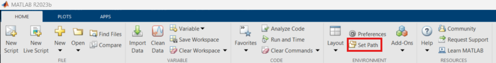

.. _getting_started_matlab_api:

*****************************
Getting Started with Matlab
*****************************

Installation
==================
In order to use the MATLAB API, you must first download the most recent version from our `Github <https://github.com/iq-motion-control/iq-module-communication-matlab/releases>`_. 
Once you have downloaded and extracted our MATLAB library, you must add its path to your MATLAB folder path. To do so:

1. Open MATLAB lab, and in the Home tab, find Set Path

2. Click Set Path, and select Add with Subfolders…

.. image:: ../_static/api_pics/add_with_subfolders.png

3. Navigate to the location of your extracted Vertiq Matlab library, and select it

In your MATLAB search path, you should now see the Matlab library folder as well as all of its subfolders. MATLAB will now check these locations in all projects in order to find all Vertiq specific functionality.

Hardware Setup
================
Information about required hardware for API communication can be found in the :ref:`Control Center documentation <connection_guide>`. The requirements for API communication 
are the same as those for the IQ Control Center.

Opening a Serial Connection
===============================
In order to connect with your USB-to-UART bridge, the MATLAB API provides the ``MessageInterface`` class. The ``MessageInterface`` class is initialized with a serial 
port name and a baud rate. The name of your serial port is dependent on your operating system. For example, in the hardware example above, the serial port name is 
“COM3,” and in Linux, it may be "/dev/ttyUSB0."

Suppose your FTDI reports on COM4, and you would like to communicate with your module at 921600 baud. To do so, we can create a ``MessageInterface`` ``com`` by 
running ``com = MessageInterface('COM4', 921600)``.

The ``MessageInterface`` is responsible for creating, transmitting, receiving, and decoding IQUART messages. All further communication is handled by ``com``.