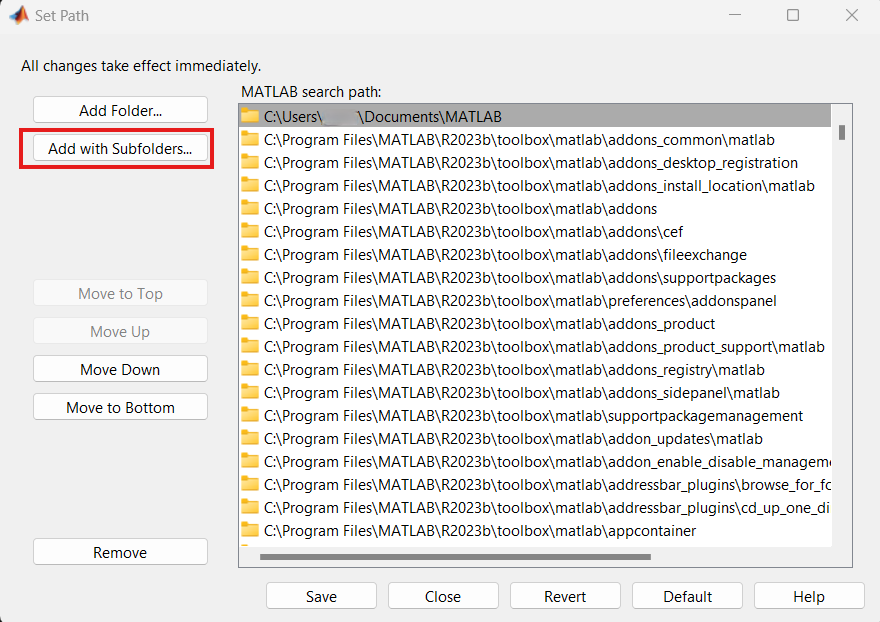
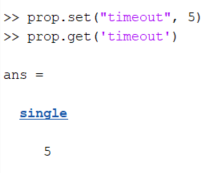

.. _getting_started_matlab_api:

*****************************
Getting Started with MATLAB
*****************************

Installation
==================
In order to use the MATLAB API, you must first download the most recent version from our `Github <https://github.com/iq-motion-control/iq-module-communication-matlab/releases>`_. 
Once you have downloaded and extracted our MATLAB library, you must add its path to your MATLAB folder path. To do so:

1. Open MATLAB, and in the Home tab, find Set Path

.. image:: ../_static/api_pics/set_path_icon.png

2. Click Set Path, and select Add with Subfolders…

3. Navigate to the location of your extracted Vertiq MATLAB library, and select it

In your MATLAB search path, you should now see the MATLAB library folder as well as all of its subfolders. MATLAB will now check these locations in all projects in order to find Vertiq specific functionality.

Hardware Setup
================
Information about required hardware for API communication can be found in the :ref:`Control Center documentation <connection_guide>`. The requirements for API communication 
are the same as those for the IQ Control Center.

IQUART Communication
===============================

Opening a Serial Connection
------------------------------

In order to connect with your USB-to-UART bridge, the MATLAB API provides the ``MessageInterface`` class. The ``MessageInterface`` class is initialized with a serial 
port name and a baud rate. The name of your serial port is dependent on your operating system. For example, in the hardware example above, the serial port name is 
“COM3,” and in Linux, it may be "/dev/ttyUSB0."

Suppose your FTDI reports on COM4, and you would like to communicate with your module at 921600 baud. To do so, we can create a ``MessageInterface`` ``com`` by 
running ``com = MessageInterface('COM4', 921600)``.

The ``MessageInterface`` is responsible for creating, transmitting, receiving, and decoding IQUART messages. All further communication is handled by ``com``.

Interacting with Clients and Endpoints
-------------------------------------------
As mentioned in :ref:`getting_started_with_apis`, all Vertiq clients contain endpoints that can accept get, set, and save commands. This section discusses how to perform gets, sets, and saves through the MATLAB API.

Before moving forward, please familiarize yourself with the clients available for your module's family and firmware style. You can find this information on your 
module's family page in the Supported IQUART Clients section.

Each Vertiq client has its own MATLAB implementation. You can find a full listing of available `MATLAB clients in the API <https://github.com/iq-motion-control/iq-module-communication-matlab/tree/master/iq/src/clients>`_. 
Each MATLAB client is linked with a json file stored in a `git submodule <https://github.com/iq-motion-control/client_files/tree/74284e59abbe86e2b6d629a3727163a28254fd70>`_ that specifies the entries within each client.

In order to create an instance of a client object, you must have at least a ``MessageInterface`` (``com``), and optionally a target Module ID (``obj_id``) 
and timeout (``timeout``). By default the MATLAB API assumes a Module ID of 0 and a timeout of 0.2.

Suppose we wanted to create an instance of the Microcontroller Temperature Monitor that uses our ``com`` instance created above, 
communicates with a module with Module ID 42, and we allow up to 0.5 seconds for responses. To do so, we'd create an instance 
of ``TemperatureMonitorUcClient`` with ``uc_temp = TemperatureMonitorUcClient(‘com’, com, ‘obj_id’, 42, ‘timeout’, 0.5);``

Now that we can create client instances, we can move on to interacting with client entries through more explicit commands such as gets, sets, and saves.

List
^^^^^^^^^^^
All MATLAB ``list`` commands have the format ``client_object.list()``.

``list`` returns a list of all parameters available from a client. For example, if we run ``list`` on an instance of ``PropellerMotorControlClient`` called ``prop``, we receive:

Get
^^^^^^
All MATLAB *get* commands have the format ``client_object.get("client_entry")``.

The ``get`` function returns the value of a single client entry returned by the module through IQUART. The values of “client_entry” are specified by the Short Name 
column found in the :ref:`Client Table Reference <iquart_client_reference_tables>`.

Suppose we want to monitor the module's input voltage. We can do this through the volts entry of the Power Monitor client.

Assuming we already have a functioning ``MessageInterface`` called ``com``, we create an instance of the ``PowerMonitorClient`` ``power = PowerMonitorClient('com', com);``. 
Then, we can request the module's input voltage with ``power.get(‘volts’)``. If everything is configured properly, the module will respond, and the response value returned by the ``get`` function. For example:

You can also treat the returned value as a normal parameter, and store it in a variable.

Get All
^^^^^^^^^^
All MATLAB get all commands have the format ``client_object.get_all()``.

The ``get_all`` function returns the value of all client entries returned by the module through IQUART. For example, running ``get_all`` on our ``PowerMonitorClient`` returns:

You can also treat the returned value as a normal parameter, and store it in a variable.

Set
^^^^^^
All MATLAB set commands have the format ``client_object.set("client_entry", “value”)``.

The set function changes the value of the target “client_entry” to value. A value set and not saved will not be retained after a power cycle.

Suppose we want to change the Propeller Motor Controller's timeout parameter to 5 seconds. 

.. image:: ../_static/api_pics/timeout_entry.png

To do so, create a ``PropellerMotorControlClient`` instance ``prop``. Then, run ``prop.set(“timeout”, 5)``. To confirm that the set was successful, we can run a ``get``.

Save
^^^^^^
All MATLAB save commands have the format ``client_object.save("client_entry")``.

The save function takes the currently set entry value, and stores it in the module's persistent memory. Values that are saved are retained on power cycles.

Suppose we want to save the timeout value set above. To do so, run ``prop.save('timeout')``.

Next Steps
==================

As the get, set, and save commands are the basis of all IQUART configuration and control, you now possess all of the base knowledge necessary to begin development with the Vertiq MATLAB API.

A very basic example is provided here. It demonstrates the basics of setting up communication and a module object as well as how to set and get parameters.

.. warning::
    Please remove all propellers from any module you plan on testing. Failure to do so can result in harm to you or others around you. Further, please ensure that your module is secured to a stationary platform or surface before attempting to spin it. 

.. code-block::

    %Create a MessageInterface to handle IQUART communication
    com = MessageInterface("COM3", 115200);

    %Create the clients that we need (all using default Module ID of 0)
    uc_temp = TemperatureMonitorUcClient('com', com);
    prop_control = PropellerMotorControlClient('com', com);
    brushless_drive = BrushlessDriveClient('com', com);

    %Check our temperature
    uc_temp.get("uc_temp")

    %Loop forever
    while 1
        %Spin slowly
        prop_control.set("ctrl_velocity", 20);

        %Check our velocity now
        brushless_drive.get("obs_velocity")
    end

