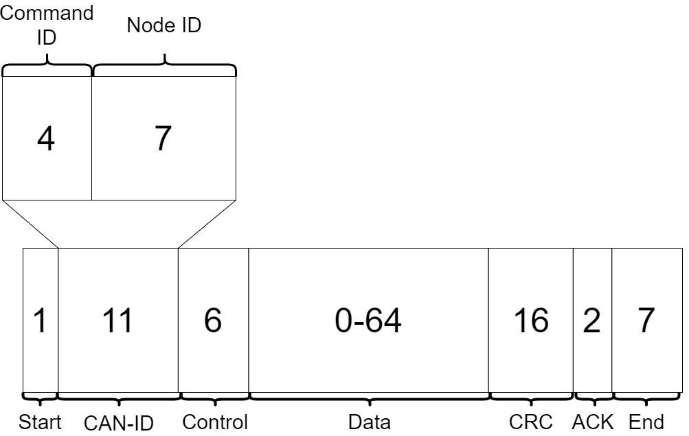
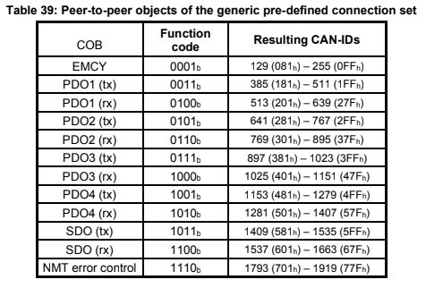
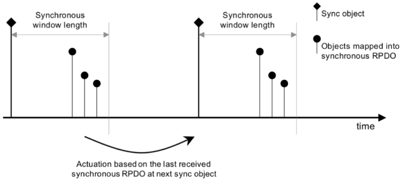
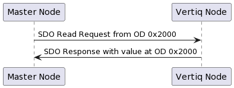

.. include:: ../text_colors.rst
.. toctree::

.. meta::
    :description: Detailed guide to CANOpen implementation on Vertiq Fortiq-42 modules, complying with CiA 301 standards. Covers Object Dictionary definitions, SDO/PDO communication, Node ID configuration via LSS, and a Fullmo Kickdrive integration tutorial.
    :keywords: CANOpen, Fortiq-42, CiA 301, SDO, PDO, Object Dictionary, LSS, Node ID, Fullmo Kickdrive, Motor Control, Automation, Network Management, EMCY

.. _canopen_protocol:

***********************************************
CANOpen
***********************************************

Module Support
================

CANOpen is supported by only the Fortiq-42 modules.

Speed Modules
**************

.. include:: ../manual/none_checked_table.rst

Servo Modules
**************

.. include:: ../manual/fortiq_only_table.rst

CANOpen Implementation
=======================
Vertiq's CANOpen implementation is based on the CAN in Automation (CiA) `301 standard <https://www.can-cia.org/groups/specifications/>`_. All Vertiq modules connect to the CAN bus as a slave node with a bitrate of 500kbps. The bitrate is fixed. 

Vertiq modules support standard message objects Emergency (EMCY), Process Data Object (PDO), Service Data Object (SDO), Network Management (NMT), as well as Layer Setting Services (LSS). 

CANOpen Frame
***************

CANOpen uses only the standard 11-bit CAN-ID CAN frame for communication. CANOpen splits the CAN-ID into a 4 bit function code, and a 7 bit node id:

	CANOpen frame with all values representing number of bits

Function Codes (Command IDs)
------------------------------
The possible function codes are summarized below: 

The *Resulting CAN-IDs* column represents the possible values for the resulting 11 bit CAN-ID from the combination of the function code and the node id.

Emergency Data Object Type (EMCY)
************************************
The emergency object is responsible for reporting internal CANOpen node errors. There are several predefined error codes in the CANOpen standard. A summary of these errors can be found `here <https://www.ni.com/docs/en-US/bundle/ni-industrial-communications-canopen/page/canopenhelp/canopen_emergencies_emcy.html>`__. 

Process Data Objects (PDO)
*********************************
The PDO service provides a method to request and receive real time data. PDO data transfers are unidirectional, meaning that a full data transfer is only completed in one direction. Vertiq's implementation of PDO objects requries a master node that can create, and periodically transmit, `SYNC messages <https://www.can-cia.org/can-knowledge/canopen-fd/sync-protocol/>`_. On reception of the SYNC message, the Vertiq node will send back both the current observed angle and velocity as a concatenated 8 Byte value. The first 4 Bytes represent the observed angle, and the last 4 represent the observed velocity. Both observed angle and velocity are float values. Syncronous PDO communication is described by the following image: 

Shown above is the standard synchronous PDO process. The master node is responsible for sending the *Sync object* shown by the diamond topped lines. Within the time alloted by the *Synchronous window length*, slave nodes send back the data stored in the mapped object directory entries. Using Vertiq modules as an example, on reception of the *Sync object*, the module will send back OD entries 0x2007 and 0x2008, observed angle and velocity. The objects returned by the slave node are illustrated as *Objects mapped into synchronous RPDO* in the image.

Service Data Objects (SDO)
****************************
The SDO service provides read/write access to a CANOpen node's Object Dictionary (OD) entries (see :ref:`Object Dictionary`). This is the simplest way to send information between nodes. One node starts a request to either upload or download (read or write) information from another node's OD, and the receiving node responds with either the requested data, or a confirmation that the write data was received and stored properly. SDO communication is used for motor control on Vertiq modules. 

The following is a high level description of an information request from OD entry 0x2000. For more information on the SDO specification, see the `301 standard <https://www.can-cia.org/groups/specifications/>`_.

Network Management (NMT)
**********************************
The NMT service is responsible for running the overall CANOpen state machine. Its state is reported in each producer heartbeat sent by the node. For more information about CANOpen's heartbeat service visit `this site <https://www.canopensolutions.com/english/about_canopen/Heartbeat-service.shtml>`_. 

More information on the NMT service can be found `on the CiA website <https://www.can-cia.org/can-knowledge/canopen/network-management/#:~:text=The%20CANopen%20NMT%20state%20machine,state%2C%20and%20a%20Stopped%20state.>`_. 

.. _Object Dictionary: 

Object Dictionary
******************

The Object Dictionary (OD) is the core data storage method in CANOpen. The CANOpen standard defines the following index structure for the locations of various forms of data:

	.. image:: ../_static/manual_images/fortiq/canopen/od_definition.png
		:height: 400

OD entries can be single variables, arrays of a single data type, or records with any number of different data types. All OD entries have an *index* in the dictionary, and arrays and records have additional *sub-indices* to access specific entries within the structure. The index and sub-index are the main methods of accessing an OD entry through SDO and PDO communication.

Vertiq Manufacturer Specific Object Dictionary
---------------------------------------------------
In order to interact with Vertiq specific parameters for motor control, you must interact with the entries beginning at 0x2000 (manufacturer-specific profile area). Vertiq’s manufacturer specific Object Dictionary objects are described in the following table:

.. table:: Vertiq Manufacturer Specific Object Dictionary

	+----------+-------------------+---------------------+--------------------------+-----------+------------+----------------------------------------------------------------------+
	| OD Index | Name / Subindex   | Data Name           | Units                    | Data Type | Access     | Description                                                          |
	+==========+===================+=====================+==========================+===========+============+======================================================================+
	| 0x2000   | Go to Position    |                     |                          |           |            |                                                                      |
	+----------+-------------------+---------------------+--------------------------+-----------+------------+----------------------------------------------------------------------+
	|          | 0x00              | Position            | :math:`\text{rad}`       | float     | SDO RW     | Move to a desired location, specified in radians, away from 0 rad    |
	+----------+-------------------+---------------------+--------------------------+-----------+------------+----------------------------------------------------------------------+
	| 0x2001   | Control PWM       |                     |                          |           |            |                                                                      |
	+----------+-------------------+---------------------+--------------------------+-----------+------------+----------------------------------------------------------------------+
	|          | 0x00              | PWM                 | :math:`\text{N/A}`       | float     | SDO RW     | Spin the motor at a specified PWM [-1, 1]                            |
	+----------+-------------------+---------------------+--------------------------+-----------+------------+----------------------------------------------------------------------+
	| 0x2002   | Control Volts     |                     |                          |           |            |                                                                      |
	+----------+-------------------+---------------------+--------------------------+-----------+------------+----------------------------------------------------------------------+
	|          | 0x00              | Voltage             | :math:`V`                | float     | SDO RW     | Spin the motor at a specified Voltage [-Vbat, Vbat]                  |
	+----------+-------------------+---------------------+--------------------------+-----------+------------+----------------------------------------------------------------------+
	| 0x2003   | Control Velocity  |                     |                          |           |            |                                                                      |
	+----------+-------------------+---------------------+--------------------------+-----------+------------+----------------------------------------------------------------------+
	|          | 0x00              | Velocity            | :math:`\frac{rad}{s}`    | float     | SDO RW     | Spin the motor at a specified Velocity                               |
	+----------+-------------------+---------------------+--------------------------+-----------+------------+----------------------------------------------------------------------+
	| 0x2004   | Trajectory        |                     |                          |           |            |                                                                      |
	+----------+-------------------+---------------------+--------------------------+-----------+------------+----------------------------------------------------------------------+
	|          | 0x00              | No. Entries         | :math:`\text{N/A}`       | uint8     |            | The number of entries in the Trajectory Object Directory Entry       |
	+----------+-------------------+---------------------+--------------------------+-----------+------------+----------------------------------------------------------------------+
	|          | 0x01              | Displacement        | :math:`\text{rad}`       | float     | SDO RW     | The desired ending position of the trajectory                        |
	+----------+-------------------+---------------------+--------------------------+-----------+------------+----------------------------------------------------------------------+
	|          | 0x02              | Angular Velocity    | :math:`\frac{rad}{s}`    | float     | SDO RW     | The maximum velocity with which to perform the trajectory            |
	+----------+-------------------+---------------------+--------------------------+-----------+------------+----------------------------------------------------------------------+
	|          | 0x03              | Acceleration        | :math:`s`                | float     | SDO RW     | The acceleration with which to reach the average trajectory velocity |
	+----------+-------------------+---------------------+--------------------------+-----------+------------+----------------------------------------------------------------------+
	|          | 0x04              | Trajectory Duration | :math:`\frac{rad}{s}`    | float     | SDO RW     | The length of time it should take to complete the trajectory         |
	+----------+-------------------+---------------------+--------------------------+-----------+------------+----------------------------------------------------------------------+
	|          | 0x05              | Average Velocity    | :math:`\frac{rad}{s^2}`  | float     | SDO RW     | The average velocity with which to complete the trajectory           |
	+----------+-------------------+---------------------+--------------------------+-----------+------------+----------------------------------------------------------------------+
	| 0x2005   | Stop Command      |                     |                          |           |            |                                                                      |
	+----------+-------------------+---------------------+--------------------------+-----------+------------+----------------------------------------------------------------------+
	|          | 0x00              | No. Entries         | :math:`\text{N/A}`       | uint8     | SDO RW     | The number of entries in the Stop Command Object Directory Entry     |
	+----------+-------------------+---------------------+--------------------------+-----------+------------+----------------------------------------------------------------------+
	|          | 0x01              | Coast               | :math:`\text{N/A}`       | uint8     | SDO RW     | A command to coast the motor                                         |
	+----------+-------------------+---------------------+--------------------------+-----------+------------+----------------------------------------------------------------------+
	|          | 0x02              | Brake               | :math:`\text{N/A}`       | uint8     | SDO RW     | A command to brake the motor                                         |
	+----------+-------------------+---------------------+--------------------------+-----------+------------+----------------------------------------------------------------------+
	| 0x2006   | Max Velocity      |                     |                          |           |            |                                                                      |
	+----------+-------------------+---------------------+--------------------------+-----------+------------+----------------------------------------------------------------------+
	|          | 0x00              | Velocity            | :math:`\frac{rad}{s}`    | float     | SDO RW     | The maximum velocity the motor may reach                             |
	+----------+-------------------+---------------------+--------------------------+-----------+------------+----------------------------------------------------------------------+
	| 0x2007   | Observed Angle    |                     |                          |           |            |                                                                      |
	+----------+-------------------+---------------------+--------------------------+-----------+------------+----------------------------------------------------------------------+
	|          | 0x00              | Observed Angle      | :math:`\text{rad}`       | float     | SDO/PDO RO | The current observed angle                                           |
	+----------+-------------------+---------------------+--------------------------+-----------+------------+----------------------------------------------------------------------+
	| 0x2008   | Observed Velocity |                     |                          |           |            |                                                                      |
	+----------+-------------------+---------------------+--------------------------+-----------+------------+----------------------------------------------------------------------+
	|          | 0x00              | Observed Velocity   | :math:`\frac{rad}{s}`    | float     | SDO/PDO RO | The current observed velocity                                        |
	+----------+-------------------+---------------------+--------------------------+-----------+------------+----------------------------------------------------------------------+

The *Access Column* specifies how each object dictionary entry may be accessed. All spin control parameters are read/write accessible via the Service Data Object (SDO) protocol. The real time variables *Observed Angle* and *Observed Velocity* are read only accessible through either SDO or the Process Data Object (PDO) Protocol. To interact via PDO, you must have a secondary CANOpen node capable of creating SYNC messages. Only after reception of a SYNC message will the observed angle and velocity be read via PDO. 

Node ID and Layer Setting Services (LSS)
*****************************************
All Fortiq modules default to a CANOpen Node-ID of 1. This value is user settable via the Layer Setting Services (LSS) protocol. Node ID changes via LSS will be saved to persistent memory, meaning you only need to change the value once in your initial system setup. Your Node ID may be changed at any time.

Please refer to `this document <https://us.nanotec.com/products/manual/PD4E_CANopen_EN/bus%252Fcan%252Flss.html?cHash=0bd15c1cd3340dfc546f95e5c1f85a12>`_ for further details on Layer Setting Services.

Please note, in order to change your Node-ID, the motor must be in LSS configuration mode, all LSS commands must contain 8 bytes of data, and Node ID must not be part of the COB-ID.

Sample CANOpen Project with Fullmo Kickdrive
=============================================

The following are images and descriptions of a project in `Fullmo Kickdrive <https://kickdrive.de/en/index.htm>`_. Fullmo Kickdrive is used to connect with a `PCAN-USB interface <https://www.peak-system.com/PCAN-USB.199.0.html?&L=1>`_ to a CAN bus with 1 or more connected Vertiq modules. 

.. _Spinning your Module:

Spinning your Module
*********************

#. Open Fullmo Kickdrive
#. Create a new project using CANopen Nodes Easy Setup 

	.. image:: ../_static/manual_images/fortiq/canopen/kickdrive_easy_setup_screen.png

#. Connect with the PCAN-USB interface using the CAN Interface tab. Make sure Communication Port is set to “peak” and Baud Rate to 500K

	.. image:: ../_static/manual_images/fortiq/canopen/kickdrive_startInterface.png

#. Select “Start Interface,” and the bar should turn green and read “Running”

	.. image:: ../_static/manual_images/fortiq/canopen/kickdrive_running.png

#. On the top bar, select the down arrow on User Level, and select Expert. The password to move forward is *expert*

	.. image:: ../_static/manual_images/fortiq/canopen/kickdrive_user_level.png

#. If connecting more than one motor, right click on CANopen Node 01, select Copy Module

#. Right click again and select Paste Module to create another CANopen Node
	
	.. image:: ../_static/manual_images/fortiq/canopen/kickdrive_multiple_motors.png

#. Connect your motor(s) to the CAN bus as in the diagram below, and power it/them on
	
	.. image:: ../_static/manual_images/fortiq/canopen/canopen_circuit.png
		:height: 400

#. Open the Object Editor tab from the Module list, and select Open Dict. 
	
	.. image:: ../_static/manual_images/fortiq/canopen/kickdrive_open_object_editor.png

#. Select the supplied fortiq.xdd file from `Vertiq’s website <https://www.vertiq.co/>`_

#. Set Node ID to 1 (or your current Node ID)

#. From the Object Dictionary, double click *controlVelocity*, it will open in the Object Editor

	.. image:: ../_static/manual_images/fortiq/canopen/kickdrive_open_od.png
		:height: 400

#. Double click the Value/Editor box and enter 10 (set up to set the velocity to 10 rad/sec)

#. Deselect the box, and reselect the whole entry so that it turns blue

#. Select Write, and your motor should begin to spin
	
#. To stop your motor, click the drop-down on *stopCommand*, and double click *Coast*

#. Set *Coast* to 1, and click Write

Changing your Node-ID
***********************

In order to change your module's Node-ID please first follow steps 1-8 from :ref:`Spinning your Module` to connect to the CAN bus

.. note::
	If you are connecting more than one module to the CANOpen bus, and desire independent control of each, you must set unique Node-IDs. To set unique Node-IDs, you must complete the following steps for **one module** at a time. Connecting multiple modules to the bus and performing these steps will change both nodes' Node-ID to the same value.

#. Open *CAN Sender*
	
	.. image:: ../_static/manual_images/fortiq/canopen/kickdrive_cansender.png

#. Replace the default program with the following (a script to set a Node ID to 5), and enter your desired *nodeId*

	.. code-block::

			nodeId = 5
			send canid(0x7E5),8,04 canunsigned8(1) 00 00 00 00 00
			send canid(0x7E5),8,11 canunsigned8(nodeId) 00 00 00 00 00

#. Click Play

#. In CAN Monitor, you should see 2 TX messages followed by a received message

	.. image:: ../_static/manual_images/fortiq/canopen/kickdrive_change_nodeid_response.png

#. Reboot your motor, and you should see its Node ID has changed

#. You will now be able to control multiple modules independently when all are properly connected to the CANOpen bus