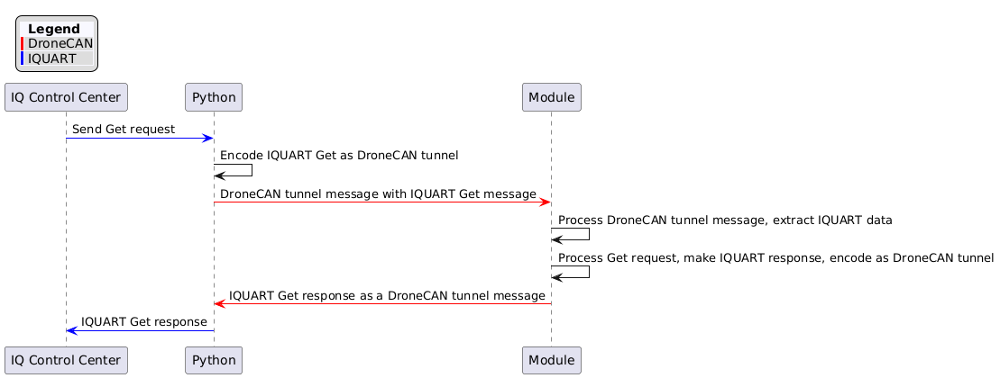
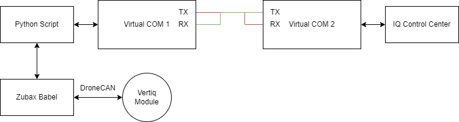
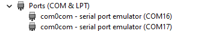
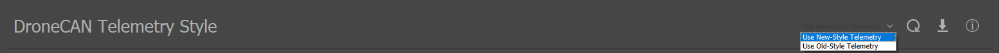

.. include:: ../text_colors.rst
.. toctree::

.. _dronecan_protocol:

##########
DroneCAN
##########

DroneCAN (previously known as UAVCAN or UAVCANv0), is an open protocol for communication over a CAN bus. DroneCAN is supported by both PX4
and Ardupilot flight controllers. Refer to the `DroneCAN documentation <https://dronecan.github.io/>`_ for more information on the protcol and the standard.

****************
Module Support
****************

Speed Modules
================

.. include:: ../manual/advanced_only_table.rst

Servo Modules
================
Servo modules do not support DroneCAN, as shown in the table below.

.. include:: ../manual/none_checked_table.rst

.. _standard_dronecan_support:

******************************
Standard DroneCAN Support
******************************
This section details the standard DroneCAN messages supported across all Vertiq DroneCAN modules. The structure and contents of these messages are defined by the 
DroneCAN specification. This section just provides details on how exactly Vertiq modules support them and some supplementary information. 

Details on the DroneCAN protocol can be found on the `DroneCAN specification <https://dronecan.github.io/Specification/1._Introduction/>`_. For a full listing of all standard messages 
specified by DroneCAN, see the `List of Standard Data Types <https://dronecan.github.io/Specification/7._List_of_standard_data_types/>`_ in the DroneCAN specification.

Broadcast Messages
=======================
These are `broadcast messages <https://dronecan.github.io/Specification/2._Basic_concepts/#message-broadcasting>`_ that are sent to or from the motors. Broadcast messages are not intended
for any specific node on the bus, data is simply transferred over the bus and is available for any node that is interested. Since they are broadcast, 
there is no response message sent. These messages typically make up the majority of communication on the bus during operation.

uavcan.protocol.NodeStatus (Data Type ID = 341)
------------------------------------------------------------------------
The DroneCAN protocol requires that all nodes on a DroneCAN network periodically publish their status using the Node Status message. Vertiq modules support this behavior to conform 
to the standard. A uavcan.protocol.NodeStatus message is published at 1 Hz during operation, reporting its health, current mode, and uptime.

Vertiq's Node Health Indications
^^^^^^^^^^^^^^^^^^^^^^^^^^^^^^^^^^

Vertiq modules support all four standard DroneCAN `health indications <https://dronecan.github.io/Specification/7._List_of_standard_data_types/#:~:text=fatal%20malfunction.%0Auint2-,health,-%23%0A%23%20Current%20mode.%0A%23%0A%23%20Mode>`_. Modules enter each state given the following:

Critical
""""""""""
#. The module's :ref:`total derate <derates>` reaches 0
#. Your module's drive mode is in lockout due to :ref:`power safety <power_safety>`

Warning
""""""""""
#. The module's supply voltage is greater than your drive's :ref:`v_max_start <brushless_drive>`. This typically indicates that the module is regenerating into a supply that cannot handle regenerated current, such as a typical benchtop power supply, and is limiting how much it regenerates to protect itself
#. Your microcontroller's temperature is within 10°C of your module's :ref:`microcontroller temperature derate <microcontroller_derate>` window
#. Your module's coil temperature is within 10°C of your module's :ref:`coil temperature derate <coil_temp_derate>` window

Error
""""""""
#. The module is actively in :ref:`timeout <manual_timeout>`
#. The module's :ref:`total derate <derates>` is less than 1 but greater than 0

Healthy
""""""""""
When none of the conditions of Critical, Warning, or Error are met, the module is considered Healthy.

Vertiq's Vendor Specific NodeStatus Code Breakdown
^^^^^^^^^^^^^^^^^^^^^^^^^^^^^^^^^^^^^^^^^^^^^^^^^^^

Vertiq's vendor specific NodeStatus bits are used to indicate the state of various possible module errors. The bits are broken down as follows:

* Bits [0, 7]: Indicate the value of :ref:`Power Safety's fault_now <power_safety_client_params>` value. Please refer to the linked documentation for an additional breakdown of these bits
* Bit 8: Indicates that the module's :ref:`speed derate <speed_derate>` is less than 1 but greater than 0. This means the motor is approaching an over-speed condition
* Bit 9: Indicates that the module's :ref:`microcontroller temperature derate <microcontroller_derate>` is less than 1 but greater than 0. This means that the microcontroller's temperature is getting dangerously high
* Bit 10: Indicates that the module's :ref:`coil temperature derate <coil_temp_derate>` is less than 1 but greater than 0. This means that the coil temperature is getting dangerously high
* Bit 11: Indicates that the module's measured voltage is greater than your drive's :ref:`v_max_start <brushless_drive>`. This typically indicates that the module is regenerating into a supply that cannot handle regenerated current, such as a typical benchtop power supply, and is limiting how much it regenerates to protect itself

Refer to the `uavcan.protocol.NodeStatus section of Standard Data Types <https://dronecan.github.io/Specification/7._List_of_standard_data_types/#nodestatus>`_ in the specification 
for more details.

.. _dronecan_support_esc_status:

uavcan.equipment.esc.Status (Data Type ID = 1034)
------------------------------------------------------------------------
This message is published periodically and provides telemetry updates on the state of the motor and its inputs. Specifically it contains information on:

* **Error Count**: This is a counter of CAN bus errors, specifically it details the number of transmit errors the motor has encountered.
* **Voltage**: The input voltage to the motor in volts
* **Current**: The current draw of the motor in amps
* **Temperature**: The temperature of the motor's coils in Kelvin or the motor's microcontroller temperature in Kelvin depending on the value of ``DroneCAN Telemetry Style``. Please see :ref:`status_extended` for more information.
* **RPM**: The current speed of the motor in RPM
* **Power Rating Percentage**: The PWM duty cycle percentage being applied to the motor, from 0% to 100%. Maximum power draw occurs at 100% duty cycle
* **ESC Index**: The ESC index of the motor that is broadcasting this update

The frequency that this message is published at is determined by the :ref:`dronecan_support_telemetry_frequency` configuration parameter.

Refer to the `uavcan.equipment.esc.Status section of Standard Data Types <https://dronecan.github.io/Specification/7._List_of_standard_data_types/#status-2>`_ in the specification 
for more details.

.. _dronecan_support_device_temperature:

uavcan.equipment.device.Temperature (Data Type ID = 1110)
------------------------------------------------------------------------

.. note:: 
	This message is transmitted only if ``DroneCAN Telemetry Style`` is configured to ``Use Old-Style Telemetry``. Please see :ref:`status_extended` for more information. 

This message is published periodically and provides updates on the temperature of the microcontroller used on the controller. The fields contained in this message are:

* **Device ID**: The ESC index of the motor sending this broadcast
* **Temperature**: The temperature of the microcontroller in Kelvin. Note that this is different from the temperature in the ESC status message, as that is the temperature of the coils.
* **Error Flags**: Indicates if the motor is overheating with the standard ERROR_FLAG_OVERHEATING flag. See the `error flag definitions <https://dronecan.github.io/Specification/7._List_of_standard_data_types/#temperature>`_ on the DroneCAN documentation.

The frequency that this message is published at is determined by the :ref:`dronecan_support_telemetry_frequency` configuration parameter.

Refer to the `uavcan.equipment.device.Temperature section of Standard Data Types <https://dronecan.github.io/Specification/7._List_of_standard_data_types/#temperature>`_ in the specification 
for more details.

.. _dronecan_messages_raw_command:

uavcan.equipment.esc.RawCommand (Data Type ID = 1030)
------------------------------------------------------------------------
Used to control the speed and direction of the motor. This message should be sent from the flight controller to the motors. The payload consists of a list of up to 20 values, 
with each value interpreted as a 14 bit signed integer. Each entry in the list corresponds to a motor with the given ESC index. E.g. The first entry in the list of raw commands 
will be read by the motor that has been assigned ESC index 0, the second entry will be read by the motor with ESC index 1, and so on. 

The values represent the speed and direction to command the motor to, normalized over a range of [-8192, 8191], with -8192 being full speed in reverse and 8191 being full speed forward.

Refer to the `uavcan.equipment.esc.RawCommand section of Standard Data Types <https://dronecan.github.io/Specification/7._List_of_standard_data_types/#rawcommand>`_ in the specification 
for more details

uavcan.tunnel.Broadcast (Data Type ID = 2010)
------------------------------------------------------------------------
DroneCAN's “tunnel” messages allow users to transmit arbitrary data bytes through the DroneCAN protocol. The tunnel broadcast message contains a byte representing the 
protocol being tunneled, a channel ID allowing for additional routing options, and an array of up to 60 bytes of data.

Vertiq modules are configured to accept broadcast messages with a protocol value of 0x55, and check the received data buffer for valid :ref:`IQUART data <uart_messaging>`. 
As such, the DroneCAN tunnel broadcast message allows users to transmit IQUART messages via DroneCAN. Vertiq modules do not support use of the channel ID for additional routing.

In this example, the module has no serial connection to :ref:`IQ Control Center <control_center_start_guide>`. Instead, the Control Center sends messages to a Python script which packages 
the IQUART bytes as a DroneCAN tunnel message, and transmits the message to the module. The module receives and decodes the IQUART message, and if necessary, 
forms a response as a DroneCAN tunnel message which is sent back to the Python script. Finally, the Python script pulls the IQUART response out of the module's 
tunnel message, and transmits the response to the Control Center via IQUART. 

A similar configuration is possible using a flight controller with a serial connection, CAN connection, and appropriate script running.

The process is summarized below.

This example requires an SLCAN device such as the `Zubax Babel <https://zubax.com/products/adapters/canface>`_ and any 
software that can emulate COM ports. In this example, we are using `com0com <https://com0com.sourceforge.net/>`_. Please note that the following example will only work on the Windows operating 
system, though a similar approach can be taken on Linux/UNIX.

We will use the virtual COM ports in order to create the following connections:

In order to create the required virtual COM ports using com0com, open com0com, and create a Virtual Port Pair. In this example, we've created COM16 and COM17 which, by default, are connected as depicted in the diagram above.

On Windows, you can confirm that these ports are reachable through Device Manager.

The Python script necessary to accomplish run this example is provided here. Run this script before attempting to connect with the Control Center: 

.. code-block:: python

	import time
	import iqmotion as iq
	import dronecan
	import serial

	slcan_port = "COM9" #Replace this value with the port connected to your SLCAN device
	control_center_ftdi_port = "COM17" # Replace this value with the port connected to a virtual COM port

	def make_node():
		for attempt in range(10):
			try:
				node = dronecan.make_node(slcan_port, node_id=126, baudrate=115200, bitrate=500000)
			except serial.SerialException:
				print("Trouble connecting to DroneCAN, waiting and trying again...")
				time.sleep(2)
				continue
			else:
				break

		return node

	def read_response_callback(event):
		if event:
			data = event.transfer.payload.buffer
			decode_gotten_data(data)
		else:
			print("Read request has timed out")

	def decode_gotten_data(data):
		received_iquart_data = []
		for byte in data:
			received_iquart_data.append(byte)

		packet_parse.add_to_out_queue(bytearray(received_iquart_data))
		packet_parse.send_now()

	def crc16(data: bytes):
		'''
		CRC-16 (CCITT) implemented with a precomputed lookup table
		'''
		table = [
			0x0000, 0x1021, 0x2042, 0x3063, 0x4084, 0x50A5, 0x60C6, 0x70E7, 0x8108, 0x9129, 0xA14A, 0xB16B, 0xC18C, 0xD1AD,
			0xE1CE, 0xF1EF,
			0x1231, 0x0210, 0x3273, 0x2252, 0x52B5, 0x4294, 0x72F7, 0x62D6, 0x9339, 0x8318, 0xB37B, 0xA35A, 0xD3BD, 0xC39C,
			0xF3FF, 0xE3DE,
			0x2462, 0x3443, 0x0420, 0x1401, 0x64E6, 0x74C7, 0x44A4, 0x5485, 0xA56A, 0xB54B, 0x8528, 0x9509, 0xE5EE, 0xF5CF,
			0xC5AC, 0xD58D,
			0x3653, 0x2672, 0x1611, 0x0630, 0x76D7, 0x66F6, 0x5695, 0x46B4, 0xB75B, 0xA77A, 0x9719, 0x8738, 0xF7DF, 0xE7FE,
			0xD79D, 0xC7BC,
			0x48C4, 0x58E5, 0x6886, 0x78A7, 0x0840, 0x1861, 0x2802, 0x3823, 0xC9CC, 0xD9ED, 0xE98E, 0xF9AF, 0x8948, 0x9969,
			0xA90A, 0xB92B,
			0x5AF5, 0x4AD4, 0x7AB7, 0x6A96, 0x1A71, 0x0A50, 0x3A33, 0x2A12, 0xDBFD, 0xCBDC, 0xFBBF, 0xEB9E, 0x9B79, 0x8B58,
			0xBB3B, 0xAB1A,
			0x6CA6, 0x7C87, 0x4CE4, 0x5CC5, 0x2C22, 0x3C03, 0x0C60, 0x1C41, 0xEDAE, 0xFD8F, 0xCDEC, 0xDDCD, 0xAD2A, 0xBD0B,
			0x8D68, 0x9D49,
			0x7E97, 0x6EB6, 0x5ED5, 0x4EF4, 0x3E13, 0x2E32, 0x1E51, 0x0E70, 0xFF9F, 0xEFBE, 0xDFDD, 0xCFFC, 0xBF1B, 0xAF3A,
			0x9F59, 0x8F78,
			0x9188, 0x81A9, 0xB1CA, 0xA1EB, 0xD10C, 0xC12D, 0xF14E, 0xE16F, 0x1080, 0x00A1, 0x30C2, 0x20E3, 0x5004, 0x4025,
			0x7046, 0x6067,
			0x83B9, 0x9398, 0xA3FB, 0xB3DA, 0xC33D, 0xD31C, 0xE37F, 0xF35E, 0x02B1, 0x1290, 0x22F3, 0x32D2, 0x4235, 0x5214,
			0x6277, 0x7256,
			0xB5EA, 0xA5CB, 0x95A8, 0x8589, 0xF56E, 0xE54F, 0xD52C, 0xC50D, 0x34E2, 0x24C3, 0x14A0, 0x0481, 0x7466, 0x6447,
			0x5424, 0x4405,
			0xA7DB, 0xB7FA, 0x8799, 0x97B8, 0xE75F, 0xF77E, 0xC71D, 0xD73C, 0x26D3, 0x36F2, 0x0691, 0x16B0, 0x6657, 0x7676,
			0x4615, 0x5634,
			0xD94C, 0xC96D, 0xF90E, 0xE92F, 0x99C8, 0x89E9, 0xB98A, 0xA9AB, 0x5844, 0x4865, 0x7806, 0x6827, 0x18C0, 0x08E1,
			0x3882, 0x28A3,
			0xCB7D, 0xDB5C, 0xEB3F, 0xFB1E, 0x8BF9, 0x9BD8, 0xABBB, 0xBB9A, 0x4A75, 0x5A54, 0x6A37, 0x7A16, 0x0AF1, 0x1AD0,
			0x2AB3, 0x3A92,
			0xFD2E, 0xED0F, 0xDD6C, 0xCD4D, 0xBDAA, 0xAD8B, 0x9DE8, 0x8DC9, 0x7C26, 0x6C07, 0x5C64, 0x4C45, 0x3CA2, 0x2C83,
			0x1CE0, 0x0CC1,
			0xEF1F, 0xFF3E, 0xCF5D, 0xDF7C, 0xAF9B, 0xBFBA, 0x8FD9, 0x9FF8, 0x6E17, 0x7E36, 0x4E55, 0x5E74, 0x2E93, 0x3EB2,
			0x0ED1, 0x1EF0
			]

		crc = 0xFFFF
		for byte in data:
			crc = (crc << 8) ^ table[(crc >> 8) ^ byte]
			crc &= 0xFFFF  # important, crc must stay 16bits all the way through
		return crc

	if __name__ == "__main__":
		#Create an object that can create/parse IQUART mesages
		packet_parse = iq.SerialCommunicator(control_center_ftdi_port)

		#Create a DroneCAN node, and start it up
		dronecan_node = make_node()

		#Add a callback function for when we receive Tunnel Broadcast mesasges
		dronecan_node.add_handler(dronecan.uavcan.tunnel.Broadcast, read_response_callback)

		while(1):
			#Process our DroneCAN node
			dronecan_node.spin(0)

			#If we got IQUART data, package it for DroneCAN and send it out
			packet_parse.read_bytes()
			message_byte_arr = packet_parse.extract_message()
			if(message_byte_arr is not None):
				buffer_to_send = list(packet_parse._make_packet(message_byte_arr))
				message = dronecan.uavcan.tunnel.Broadcast(protocol=dronecan.uavcan.tunnel.Protocol(protocol=0x55), channel_id=42, buffer=buffer_to_send)
				dronecan_node.broadcast(message)

While this script is running, your module is powered on and connected properly, and your virtual COM ports are configured correctly, you should be able to connect your module to IQ Control Center without a direct serial connection.

With the script active, navigate to the Control Center, and in Serial Port, select the virtual COM port not connected to your running script (in this case COM16). After you click CONNECT, you should see the 
Control Center perform its normal detection process, and connect with your module.

Refer to the `uavcan.tunnel.Broadcast section of Standard Data Types <https://dronecan.github.io/Specification/7._List_of_standard_data_types/#broadcast>`_ in the 
specification for more details.

.. _arming_status:

uavcan.equipment.safety.ArmingStatus (Data Type ID = 1100)
------------------------------------------------------------------------

.. note::
	The ArmingStatus message is not yet supported on all modules that support DroneCAN. Please check `vertiq.co <https://www.vertiq.co/>`_ to ensure that you are on the 
	latest firmware version available for your module to gain access to the most up to date features.

`DroneCAN's ArmingStatus message <https://dronecan.github.io/Specification/7._List_of_standard_data_types/#:~:text=uavcan.equipment.safety-,ArmingStatus,-Full%20name%3A>`_ broadcasts the overall system's arming state. For example, both PX4 and ArduPilot can transmit the ArmingStatus message. Vertiq 
modules are configured only to listen for, and not transmit, the ArmingStatus message. More information on configuring your module to update its arming state based on 
the ArmingStatus message can be found below in :ref:`dronecan_arming_and_bypass`. Information about configuring your flight controller to transmit the ArmingStatus 
message can be found in our :ref:`tutorial for integrating with flight controller DroneCAN <dronecan_fc_tutorial>`.

uavcan.equipment.indication.LightsCommand (Data Type ID = 1081)
------------------------------------------------------------------------
Vertiq modules do not publish this broadcast message, but they do listen for it. The content of this message can be used to dynamically control the white and RGB LEDs
on Vertiq's LED Boards. For more information on the LED Board, see :ref:`manual_led_support`.

As detailed by the `DroneCAN specification <https://dronecan.github.io/Specification/7._List_of_standard_data_types/#lightscommand>`_ this message contains an array of `SingleLightCommands <https://dronecan.github.io/Specification/7._List_of_standard_data_types/#singlelightcommand>`_
to be handled by the nodes on the bus. Each SingleLightCommand contains a light ID to indicate which light that command is for and a field that indicates either the intensity of the white LED or the color of the RGB LED depending on the targeted LED. For Vertiq modules, 
the light ID of each type of LED (RGB or White) is determined based on the ESC index. This allows the LEDs on each module on a bus to be uniquely addressable
as long as each module has a unique ESC index. The light IDs on each module are calculated as described in the example code block below:

.. code-block:: python

	#The base ID for an RGB LED is 1, and the base ID for a white LED is 2. From there, we can just apply the calculation below to determine 
	#what the light IDs for a module with a given ESC index should be. For example, if my module has an ESC Index of 1, 
	#then the White LED's light ID will be 1*3 + 2 = 5. The RGB LED's light ID will be 1*3+1 = 4
	RGB_LIGHT_TYPE_BASE_ID = 1
	WHITE_LIGHT_TYPE_BASE_ID  = 2

	light_id = (esc_index*3 + LIGHT_TYPE_BASE_ID)

Refer to the `uavcan.equipment.indication.LightsCommand section of Standard Data Types <https://dronecan.github.io/Specification/7._List_of_standard_data_types/#lightscommand>`_ in the specification for more details.

.. _status_extended: 

uavcan.equipment.esc.StatusExtended (Data Type ID = 1036)
------------------------------------------------------------------------
.. note:: 
	This message is published only if ``DroneCAN Telemetry Style`` is configured to ``Use New-Style Telemetry``. More information about telemetry style is found below.

This message is published periodically, and acts as an extension of uavcan.equipment.esc.Status. The extra information in this message is as follows:

* **Input Percent**: Input command to ESC, in percent, which is commanded using the setpoint messages. Range 0% to 100%
* **Output Percent**: Output command from ESC to motor, in percent. Range 0% to 100%
* **Motor Temperature °C**: Temperature of connected motor, in Celsius. Range is -256 to +255 C
* **Motor Angle**: Measured angle of connected angle sensor, in degrees. Range is 0 to 360
* **Status Flags**: Manufacturer-specific status flags currently active
     * Bit 0: Indicates the module's current arming state (see :ref:`manual_advanced_arming` for more information)
     * Bits[3:1]: Indicate the module's drive mode (see :ref:`brushless drive's <brushless_drive>` ``drive_mode`` for more information)
     * Bit 4: Indicates if the module is timed out (see :ref:`manual_timeout` for more)
     * Bit 5: Indicates if the last stow attempt was successful (see :ref:`manual_stow_position` for more information)
     * Bit 6: Indicates if the module is holding stow (see :ref:`manual_stow_position` for more information)
* **ESC Index**: The ESC index of the motor that is broadcasting this update

The frequency that this message is published at is determined by the :ref:`dronecan_support_telemetry_frequency` configuration parameter.

Please note that it is possible to disable this message, and fall back to the legacy transmission of uavcan.equipment.esc.Status and uavcan.equipment.device.Temperature as your 
telemetry sources. In IQ Control Center's Advanced tab, you'll find the ``DroneCAN Telemetry Style`` parameter. 

Setting this to ``Use New-Style Telemetry`` will output ESC Status and ESC Status Extended as your telemetry. In this case, the reported temperature through ESC Status is 
your module's coil temperature, and ESC Status Extended's reported temperature is the temperature of your module's microcontroller.

Setting this to ``Use Old-Style Telemetry`` will output ESC Status and Device Temperature as your telemetry. In this case, the reported temperature through ESC Status 
is your module's microcontroller temperature, and Device Temperature's reported temperature is the temperature of your module's coil.

.. note:: 
	We recommend using the ``Use New-Style Telemetry`` in order to receive the most telemetry data from your modules.

Service Requests
========================
Service requests are messages sent to a specific target node from another node, and to which the sending node expects to receive a response message.

uavcan.protocol.GetNodeInfo (Data Type ID = 1)
---------------------------------------------------------------
This request has no payload fields. The response message from the receiving node should include the status of the node as defined by the NodeStatus message, the 
software and hardware version of the node, and the name of the node. For Vertiq modules, the name of each node is currently “iq_motion.esc”.

Refer to the `uavcan.protocol.GetNodeInfo section of Standard Data Types <https://dronecan.github.io/Specification/7._List_of_standard_data_types/#getnodeinfo>`_ in the specification 
for more details

uavcan.protocol.dynamic_node_id.Allocation (Data Type ID = 1)
---------------------------------------------------------------

This message is used by both the dynamic node allocator and allocatee. Vertiq modules can only act as the DNA allocatee. It is used to carry out the DNA process which is 
covered in detail `here <https://dronecan.github.io/Specification/6._Application_level_functions/#:~:text=7%5D%20reason_text-,Dynamic%20node%20ID%20allocation,-In%20order%20to>`_. 
More information about configuring your Vertiq module to use dynamic node ID allocation, please refer to :ref:`dronecan_plug_and_play`.

Refer to `The uavcan.protocol.dynamic_node_id.Allocation section of the Standard Data Types <https://dronecan.github.io/Specification/7._List_of_standard_data_types/#getnodeinfo:~:text=uavcan.protocol.dynamic_node_id-,Allocation,-Full%20name%3A>`_ in the specification for more details on this message.

.. _dronecan_getset:

uavcan.protocol.param.GetSet (Data Type ID = 11)
---------------------------------------------------------------
Used to get or set the value of a configuration parameter using either the index or the name of the parameter. The configuration parameters currently available on standard 
Vertiq modules are listed in the :ref:`dronecan_configuration_parameters` section below. The request message should contain the index or name of the parameter 
(depending on how you are accessing it), and if performing a set operation, should contain the value to set to the parameter. **Parameter indices are not guaranteed to remain consistent across 
firmware versions. Indices should only be used for parameter discovery, when accessing the parameter directly it is recommended to always use the name.**

The response message will contain the value of the parameter, information about its default, minimum, and maximum values (if applicable), and the name of the parameter.

Refer to the `uavcan.protocol.param.GetSet section of Standard Data Types <https://dronecan.github.io/Specification/7._List_of_standard_data_types/#getset>`_ in the specification 
for more details.

uavcan.protocol.RestartNode (Data Type ID = 5)
---------------------------------------------------------------
This request has one field, its “magic number.” This field is an unsigned 40 bit integer. The magic number is used to identify that this is an intentional restart request, 
and we have also extended it to allow for two different types of reboots. One magic number performs a normal reboot that simply restarts into the normal application firmware, 
and the other reboots the device into the `ST bootloader <https://www.st.com/resource/en/application_note/cd00167594-stm32-microcontroller-system-memory-boot-mode-stmicroelectronics.pdf>`_, 
which allows it to be programmed with new firmware. The numbers for each are:

* Normal Reboot Magic Number = 0xACCE551B1E
* Reboot to Bootloader Magic Number = 0xBEEFCAFE

The response to this request contains one boolean field. This field will be true if the number received was a valid magic number and the motor is restarting, and false if the 
number received was not one of the valid numbers.

Refer to the `uavcan.protocol.RestartNode section of Standard Data Types <https://dronecan.github.io/Specification/7._List_of_standard_data_types/#restartnode>`_ in the specification 
for more details.

uavcan.protocol.file.BeginFirmwareUpdate (Data Type ID = 40)
---------------------------------------------------------------
On modules that support DroneCAN firmware updates, this command causes the module to enter into upgrade mode, and begin attempting to firmware update over DroneCAN. 
The request includes a source node ID and a file path on that source node. The module will attempt to get information on the file from the file server, and then begin reading the data from the upgrade file.

On modules that do not support DroneCAN firmware updates, the module will respond with an INVALID_MODE error code to this request.

Refer to the `uavcan.protocol.file.BeginFirmwareUpdate section of Standard Data Types <https://dronecan.github.io/Specification/7._List_of_standard_data_types/#beginfirmwareupdate>`_ in the 
specification for more details.

.. _dronecan_configuration_parameters:

Configuration Parameters
===========================
Configuration parameters are parameters that can configure the behavior of a Vertiq module and are available to read and modify over DroneCAN. The :ref:`uavcan.protocol.param.GetSet <dronecan_getset>` 
request can be used to access configuration parameters. The sections below cover the stadard configuration parameters available on Vertiq modules.

Node ID
-----------------------

.. table::

	+----------------+----------+
	| **Name**       | **Type** |
	+----------------+----------+
	| uavcan_node_id | Integer  |
	+----------------+----------+

This parameter defines the node ID of the module on the UAVCAN network. This ID is how the node identifies itself when sending and receiving messages. No two nodes should have 
the same node ID. ID 0 is reserved by the DroneCAN standard for unconfigured modules. A reboot is typically required after changing this parameter for the device to use the new node ID on the network.

This parameter can also be changed through the IQ Control Center if you wish to change this without using DroneCAN.

.. _dronecan_bitrate_parameter:

Bitrate
-----------------------
.. table::

	+----------------+----------+
	| **Name**       | **Type** |
	+----------------+----------+
	| bit_rate       | Integer  |
	+----------------+----------+

This parameter determines the DroneCAN bitrate that the module will use in bit/s. This parameter takes effect immediately when changed, so if this is changed it 
will most likely be necessary to reconnect to the bus as at the new bitrate to continue communicating with the module.

ESC Index
-----------------------
.. table::

	+----------------+----------+
	| **Name**       | **Type** |
	+----------------+----------+
	| esc_index      | Integer  |
	+----------------+----------+

This parameter defines the ESC index of the module. The ESC index is used when a Raw Command message is received to determine which value in the Raw Command should be read by the module.

This parameter can also be changed through the IQ Control Center if you wish to change this without using DroneCAN.

.. _zero_behavior:

Zero Behavior
-----------------------
.. table::

	+----------------+----------+
	| **Name**       | **Type** |
	+----------------+----------+
	| zero_behavior  | Integer  |
	+----------------+----------+

This parameter defines the behavior of the motor when it receives a zero setpoint in a Raw Command message, **but only if the module is** :ref:`bypassing arming on DroneCAN<dronecan_arming_and_bypass>`. 
If the module is using :ref:`normal arming <manual_advanced_arming>` with DroneCAN, the Zero Behavior is not used, instead the :ref:`disarm behavior <advanced_disarming_behavior>` provides
a similar functionality that integrates with arming and disarming.

There are three possible behaviors: Coast, Brake, and Normal Controller. By changing the integer value of Zero Behavior, the user can determine which of these behaviors is used.

Descriptions of each behavior and the integer value of the Zero Behavior parameter 
corresponding to them are given below:

* **Coast (Value = 0)**: The module will stop trying to drive the motor, releasing control and letting it simply coast to a stop.
* **Brake (Value = 1)**: The motor will stop suddenly on a zero setpoint instead of coasting gently to a stop. After stopping, it will then coast.
* **Normal Controller (Value = 2)**: The normal controller continues to run, and will try to drive the motor at 0% throttle. This can cause vibrating or twitching in velocity mode if the PID gains are high.

This parameter can also be changed through the IQ Control Center if you wish to change this without using DroneCAN.

.. _dronecan_support_telemetry_frequency:

Telemetry Frequency
-----------------------
.. table::

	+------------------+----------+
	| **Name**         | **Type** |
	+------------------+----------+
	| telem_frequency  | Integer  |
	+------------------+----------+

This parameter defines the frequency in Hz with which the telemetry messages (:ref:`uavcan.equipment.esc.Status <dronecan_support_esc_status>` 
and :ref:`uavcan.equipment.device.Temperature <dronecan_support_device_temperature>`) are broadcast by the module. 
For example, if this value were set to 10, the telemetry would be sent at a rate of 10 Hz. If this parameter is set to 0, no telemetry messages will be sent.

This parameter can also be changed through the IQ Control Center if you wish to change this without using DroneCAN.

Motor Armed
-----------------------
.. table::

	+------------------+----------+
	| **Name**         | **Type** |
	+------------------+----------+
	| motor_armed      | Integer  |
	+------------------+----------+

This parameter is available on modules that support :ref:`manual_advanced_arming`. It can be used to query and control the armed state of the module. See the 
section on :ref:`user arming commands over DroneCAN <arming_user_command_dronecan>` for more information.

Motor Stowed
-----------------------
.. table::

	+------------------+----------+
	| **Name**         | **Type** |
	+------------------+----------+
	| motor_stowed     | Integer  |
	+------------------+----------+

This parameter is available on modules that support :ref:`manual_stow_position`. It can be used to command and release stow on modules. See the section on
:ref:`manual stow over DroneCAN <trigger_manual_stow_dronecan>` for more information.

Stow Status
-----------------------
.. table::

	+------------------+----------+
	| **Name**         | **Type** |
	+------------------+----------+
	| stow_status      | Integer  |
	+------------------+----------+

This parameter is available on modules that support :ref:`manual_stow_position`. It reports on the current state of the stow feature on the module. See the
:ref:`stow_status` section for more information.

Stow Result
-----------------------
.. table::

	+------------------+----------+
	| **Name**         | **Type** |
	+------------------+----------+
	| stow_result      | Integer  |
	+------------------+----------+

This parameter is available on modules that support :ref:`manual_stow_position`. It reports on how the previous stow attempt ended. See the
:ref:`stow_result` section for more information.

.. note::
	The following parameters are not yet available on all modules that support DroneCAN. If you do not see these parameters, check `vertiq.co <https://www.vertiq.co/>`_ for a new firmware release for 
	your module. If you are on the latest release and do not have access to these parameters, future updates for your module may add support for these messages.

Module ID
-----------------------
.. table::

	+------------------+----------+
	| **Name**         | **Type** |
	+------------------+----------+
	| module_id        | Integer  |
	+------------------+----------+

This parameter defines the **module ID** of the connected module. Please note that this is different than the DroneCAN Node ID. Your module's Module ID parameter defines 
what IQUART messages to accept. You can find out more about IQUART at :ref:`uart_messaging`, and more about connecting to multiple modules via IQUART in our 
:ref:`IQ Control Center documentation <multi_module_config>`.

Motor Direction
-----------------------
.. table::

	+------------------+----------+
	| **Name**         | **Type** |
	+------------------+----------+
	| motor_direction  | Integer  |
	+------------------+----------+

Your module's motor direction defines, in part, how your module will interpret and react to throttle commands. Motor direction is covered in detail :ref:`in our throttle documentation <throttle_direction>`.

Motor direction is enumerated as:

1. Unconfigured
2. 3D Counter Clockwise
3. 3D Clockwise
4. 2D Counter Clockwise
5. 2D Clockwise 

Please note that if you are controlling your module with DroneCAN throttle commands, the 3D-2D distinction has no effect. All DroneCAN throttles are taken to be signed (3D), 
and ``motor_direction`` affects only whether positive throttles specify clockwise or counter clockwise spinning. For more on throttle mapping, see :ref:`throttle_mapping`.

Control Mode
-----------------------
.. table::

	+------------------+----------+
	| **Name**         | **Type** |
	+------------------+----------+
	| control_mode     | Integer  |
	+------------------+----------+

Mode determines how the module interprets received throttle commands, and is covered in detail at :ref:`throttle_mode`.

Control mode is enumerated as:

0. PWM
1. Voltage
2. Velocity
 
Max Volts
-----------------------
.. table::

	+------------------+----------+
	| **Name**         | **Type** |
	+------------------+----------+
	| max_volts        | Float    |
	+------------------+----------+

When ``control_mode`` is configured to voltage, ``max_volts`` defines the maximum allowable driving voltage. More information can be found at :ref:`max_volts`.

Max Velocity
-----------------------
.. table::

	+------------------+----------+
	| **Name**         | **Type** |
	+------------------+----------+
	| max_velocity     | Float    |
	+------------------+----------+

When ``control_mode`` is configured to velocity, ``max_velocity`` defines the maximum allowable angular velocity in rad/s. More information can be found at :ref:`max_velo`.

*********************************
Flight Controller Integration
*********************************
For guidance on integrating Vertiq modules with flight controllers using DroneCAN, see 
the :ref:`dronecan_fc_tutorial` tutorial.

.. _dronecan_arming_and_bypass:

*****************************
Arming and Arming Bypass
*****************************

Standard Arming
==========================
DroneCAN can use the same advanced arming procedure as all other throttle sources. The details of this arming procedure are covered in the :ref:`manual_advanced_arming` section.

.. _arm_with_armingstatus:

Arming with ArmingStatus
==========================

Vertiq modules can arm and disarm based off of DroneCAN's :ref:`ArmingStatus message <arming_status>`. This means that whenever your flight controller broadcasts an ArmingStatus 
``STATUS_FULLY_ARMED`` message, your module will transition from disarmed to armed, or if already armed, will remain armed. These transitions are not subject to the constraints 
set by your :ref:`arming throttle region <arming_throttle_regions>`, so any ``STATUS_FULLY_ARMED`` message will arm your module. When your flight controller broadcasts a ``STATUS_DISARMED`` message, your module 
will similarly transition from armed to disarmed.

Whether your module arms via the ArmingStatus message is configured through the ``arming_by_arming_status`` parameter in the :ref:`DroneCAN node client <uavcan_node>`. You can access this parameter through 
the Control Center's Advanced tab as ``Arming By DroneCAN ArmingStatus``.

Further, if you are using the ArmingStatus to arm, we highly recommend disabling your module's ability to :ref:`arm on throttle <arming_throttle_regions>`. Suppose your module is configured to arm on throttle as well as arm on 
ArmingStatus. Your flight controller may transmit throttle commands of 0% on boot-up while its ArmingState states disarmed. Then, your module's arming handler may attempt to arm on throttle, 
but will be quickly overwritten by an ArmingStatus disarm. This cycle will continue until the flight controller's throttle leaves your arming region. To avoid this behavior, simply disable arm 
on throttle. For the same reasons, we also recommend that you disable your module's ability to :ref:`disarm on throttle <arming_throttle_regions>`.

Arming Bypass
=================
Older Vertiq firmware does not include support for arming over DroneCAN. To maintain backwards compatibility, it is possible for users to toggle 
arming integration with DroneCAN on or off. This is called “arming bypass”. When Vertiq modules have arming bypass turned on for DroneCAN they will spin on any :ref:`DroneCAN throttle command <throttle_sources_dronecan>`, 
regardless of armed state. Additionally, when arming bypass is on DroneCAN throttle commands will not cause :ref:`arming or disarming transitions <arming_state_transitions>`. 
The :ref:`advanced arming <manual_advanced_arming>` features are completely ignored by DroneCAN when the arming bypass is on.

Arming bypass for DroneCAN can be controlled with the *DroneCAN Bypass Arming* parameter in the Advanced tab of the IQ Control Center, as shown below. When this parameter is set to *Bypass Arming*, 
arming bypass is on for DroneCAN, and when it is set to *Normal Arming*, DroneCAN will use the advanced arming feature like all other throttle sources.

.. figure:: ../_static/manual_images/dronecan/dronecan_bypass_arming.png
    :align: center
    :width: 60%
    :alt: DroneCAN Bypass Arming Parameter

    DroneCAN Bypass Arming Parameter in IQ Control Center

.. _dronecan_plug_and_play:

*************************************
Advanced Plug-And-Play Functionality
*************************************
Vertiq's DroneCAN nodes support Dynamic Node ID Allocation. The following sections walk you through configuring your modules to use 
both of this setting, as well as examples of the feature in use with both the DroneCAN GUI tool as well as a flight controller.

.. _dynamic_node_id_allocation:

Dynamic Node ID Allocation
===========================
All DroneCAN nodes must have a unique Node ID in order to communicate on the DroneCAN bus. Nodes can be given a unique ID manually, or they may request a dynamically 
generated Node ID from a Node ID Allocator. Please see the `DroneCAN specification <https://dronecan.github.io/Specification/6._Application_level_functions/#:~:text=7%5D%20reason_text-,Dynamic%20node%20ID%20allocation,-In%20order%20to>`_ 
for more information about ID Allocators. Vertiq's DroneCAN nodes can act as allocatees, and can initiate requests to the allocator to receive node ID.

In order to configure your module to use DNA rather than manually setting unique, static, node IDs, simply set its ``Node ID`` parameter to ``0``. According to the DroneCAN 
specification, a node ID of 0 indicates an anonymous node, and should be used for allocatees until they are issued a proper ID.

.. note::

	``Node ID`` can be configured in all methods available for DroneCAN configuration. Here, we'll show an example of configuration through the :ref:`DroneCAN GUI tool <dronecan_gui_basics>`:

	.. image:: ../_static/manual_images/dronecan/node_id_with_dronecan.PNG
		:height: 350

Please note that, if configured for DNA (``Node ID`` set and saved as ``0`` as above), your module will always boot up with DNA active. The ID allocated during DNA is not saved 
on reboot. Your DNA allocator server will allocate the same node ID on each handshake if it has saved your module's UID. For the best performance, we suggest configuring 
static, concrete, node IDs for each module you have connected, and only use DNA for initial setup. For example, if your DNA server provides the node ID 124, we recommend 
manually setting and saving your module's node ID to 124 with the same methods available as above. 

Receiving a Dynamically Allocated Node ID with the DroneCAN GUI
--------------------------------------------------------------------
The :ref:`DroneCAN GUI tool <dronecan_gui_basics>` provides an easy-to-use node ID server. Simply click the rocket icon in the bottom right hand side to start the server:

Once your module is powered on and connected to the GUI tool, your module will automatically begin requesting a node ID from the server, and the two will complete the 
handshake necessary to obtain a dynamically allocated node ID.

As seen through the CAN bus monitor tool, we see our node is allocated the ID 125, and immediately starts reporting its node status and ESC telemetry:

You will see the node ID and its associated UID in the DNA server window:

Receiving a Dynamically Allocated Node ID with PX4 and ArduPilot
--------------------------------------------------------------------

PX4
^^^^^^^
The following is performed on PX4 version 1.15.1

1. Open `QGroundControl <http://qgroundcontrol.com/>`_, and connect your flight controller
2. Navigate to Vehicle Setup
3. Select Parameters, and scroll down until you find UAVCAN
4. In the UAVCAN settings, you will find ``UAVCAN_ENABLE``. Set this value to ``Sensors and Actuators (ESCs) Automatic Config``, save, and reboot
5. Navigate to the MAVLink Console in Analyze Tools
6. Enter ``uavcan status`` 
   
   a. If you have not connected your module with your flight controller, you will not see any nodes listed
   b. If you have already connected your module, you should see your node, and its allocated ID, listed as shown below

7. If you have not already, connect and power on your module
8. Once again, enter ``uavcan status``, and you should see your module has connected with the flight controller with a dynamically allocated ID

9. Now, if you reboot your module, and check ``uavcan status`` again, you'll find that PX4 allocates the same ID again

ArduPilot
^^^^^^^^^^^^^
The following is performed on ArduCopter version v4.5.7

1. Open `Mission Planner <https://ardupilot.org/planner/>`_, and connect your flight controller
2. Configure DroneCAN as described in :ref:`dronecan_with_ardupilot`
3. If you have not already, connect and power on your module
4. Navigate to the DroneCAN configuration tool as described in :ref:`configuring_with_ardupilot`
5. You should see your module with its allocated node ID as follows

6. Now, if you reboot your module, and check the DroneCAN configuration window again, you'll find that ArduPilot allocates the same ID again