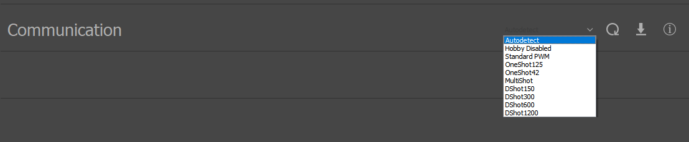

.. include:: ../text_colors.rst
.. toctree::

.. _timer_based_protocol:

***************************************************
Timer Based Protocols - PWM, DSHOT, and More
***************************************************

Timer based protocols (previously hobby protocols) refer to an array of different protocols commonly used by drone hobbyists for controlling ESCs. Vertiq modules support the following selection of the 
most popular of these protocols:

* PWM (1000-2000us pulses)
* DSHOT (150, 300, 600, 1200)
* OneShot (42, 125)
* Multishot

Details on these protocols and how Vertiq modules support them is provided below.

.. note::

    Please note that no two timer based protocols can be used together as :ref:`redundant throttle sources <redundant_throttle_manual>`. Only one 
    timer based protocol can be accepted at any time.

Module Support
===============

Speed Modules
**************

.. include:: ../manual/all_checked_table.rst

Servo Modules
**************

.. include:: ../manual/all_checked_table.rst

Supported Timer Based Protocols
=================================

.. _hobby_standard_pwm:

Standard PWM
*************
Standard PWM refers to a very commonly used analog protocol that uses a 1000 microsecond to 2000 microsecond pulse to send throttle commands. This pulse encodes a number 
from 0.0 to 1.0, where typically, a 1000 microsecond pulse represents 0.0, a 1500 microsecond pulse represents 0.50, and a 2000 microsecond pulse represents 1.0.

So, for example, the 1700us pulse shown below represents a 0.7 command using default settings. The flight controller in this example is configured 
to transmit this 1700us pulse at 400Hz:

Exactly how Vertiq modules convert this number into a command 
depends on the module's configurations. Refer to the :ref:`throttle_mapping` section for more details on mapping throttle to module commands in the :ref:`throttle_def` section.

The endpoints, 1000us to 2000us, can be calibrated to change how the module interprets incoming pulse widths. For example, you could calibrate your module such that 1200us represents 0.0 with 
2000us still being the high end (1.0). The 1700us pulse illustrated above would now represent a 0.625 command. To learn more about PWM calibration, please refer to :ref:`hobby_calibration_tutorial`.

.. _hobby_dshot:

DSHOT
******
DSHOT is a digital protocol that is gaining in popularity and is supported by a wide range of flight controllers. For in depth details about the DSHOT protocol, please refer to 
`“D-SHOT - The Missing Handbook” article from Chris Landa <https://brushlesswhoop.com/dshot-and-bidirectional-dshot/>`_.

The 11 bit throttle sent in a DSHOT message is treated as a value 0.0 to 1.0 by Vertiq modules. With 11 bits, DSHOT throttles can be any value from 0 to 2047. The final 47 values 
are reserved for special behaviors leaving 2000 for throttle. So, on receiving a DSHOT throttle of 2000, the module will apply a 1.0 command, 0 a 0.0 command, and, for example, 
260 a 0.13 command. Refer to the :ref:`throttle_mapping` section for more details on mapping throttle to module commands in the :ref:`throttle_def` section.

**Vertiq modules support DSHOT, but they do not support Bidirectional DSHOT.** See the linked article from Chris Landa above for more details on the difference between the two protocols. 

DSHOT has various different speeds, currently Vertiq modules support:

* DSHOT150
* DSHOT300
* DSHOT600
* DSHOT1200

.. _hobby_other_protocols:

Additional Protocols
*********************
Vertiq modules also support several other, less commonly used, timer based protocols:

* OneShot125
* OneShot42
* Multishot

Similarly to `Standard PWM`_, the commands sent by these protocols are interpreted by a Vertiq module as encoding a number between 0.0 to 1.0. Exactly how Vertiq modules convert 
this number into a throttle command depends on the configurations of the module. Refer to the :ref:`throttle_mapping` section for more details on that mapping for speed modules and 
the :ref:`throttle_def` section for more details on how a speed module defines a throttle command.

.. _timer_based_v_serial_flowchart:

Interaction with Serial Communication
======================================
The connector used for inputting timer based protocols on Vertiq modules is also used for serial communication. Serial communication is used for connecting to the 
modules with IQ Control Center or interacting with them using the Vertiq APIs. **Because the connector is shared between timer based protocols and serial communication, only one of them can be active at any time.** On startup, the module will 
look for valid messages of either the currently configured timer based protocol or the Vertiq serial protocol :ref:`IQUART <uart_messaging>`. **When it detects the first valid message of 
either type, it will lock-on to that type of communication, and stop listening for any other types of messages on that physical interface. This behavior is slightly different 
when using the** *Autodetect* **setting for the** *Communication* **parameter**. See more :ref:`below <the_communication_parameter>`.

For example, if after startup a DSHOT message is the first thing sent to the module, and the module is set to use *Autodetect*, it will then only listen for 
additional DSHOT messages, ignoring any serial communication (as well as all other timer based protocols). The module must be rebooted before you can switch which protocol it will listen to. **This means that you cannot connect to 
the IQ Control Center after controlling the module with a timer based protocol unless you reboot, and vice versa.** This behavior is summarized in the diagram below.

Also, note that for modules that support DroneCAN, DroneCAN uses a separate physical interface from timer based protocols and serial communication, so DroneCAN communication can still be used when using timer based protocols.

.. image:: ../_static/tutorial_images/pwm_flight_controller/comms_flow.png

.. _the_communication_parameter:

The Communication Parameter
******************************

As mentioned above, the *Communication* parameter can affect how the module reacts to receiving different protocols. This parameter is available in the Control Center's general tab:

When this parameter is set to ``Autodetect``, the behavior described in the diagram above applies. Otherwise, by default, the module will only listen for the timer based protocol 
specified by the configured value as well as listening for IQUART messages. So, if *Communication* is set to DShot600, and you send PWM signals to the module, the module will **not** 
lock on to timer based protocols, and it will still accept IQUART messages. The rest of the behavior is the same as before. The module will lock on to the first received 
protocol (IQUART or DShot600 in this example), and will stop listening for the other. If configured to ``Hobby Disabled``, the module will never listen for any timer based protocols,
and will only react to IQUART on the shared RX line.

In summary, the *Communication* protocol defines the **timer based protocol** the module should listen for. It will always listen for both IQUART and the selected protocol 
(unless configured for ``Hobby Disabled``) until the module receives one message of either the protocol specified by *Communication* or IQUART. After that first reception, the module 
will only listen for the first received protocol (if IQUART is received before a timer based signal, the module will only react to IQUART and vice versa).

Module Configuration
======================
The :ref:`hobby_fc_tutorial` tutorial details important configuration parameters to set on speed modules when using PWM and DSHOT. 
Though that tutorial is focused on integration with flight controllers, the information on module configuration for using timer based protocols is applicable for any kind of setup.

Analog Protocol Calibration
=============================
The :ref:`hobby_calibration_tutorial` tutorial on analog protocol calibration covers all of the steps of the Vertiq calibration procedure for speed modules and describes how to trim and reset 
the calibrated endpoints.

Arming
========
Timer based protocols use the same advanced arming procedure as all other throttle sources on speed modules. The details of this arming procedure are covered in the :ref:`manual_advanced_arming` section.