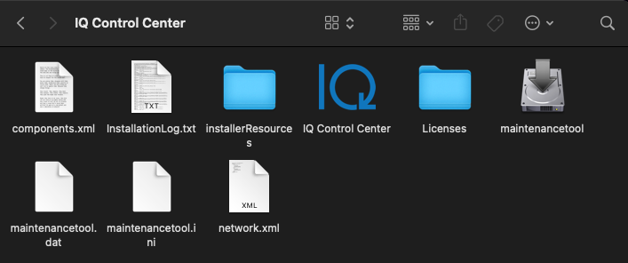
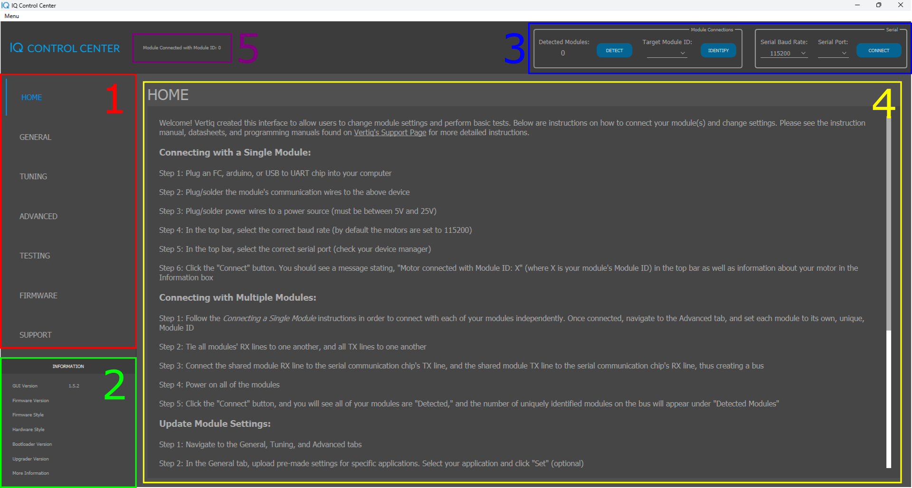
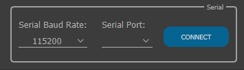
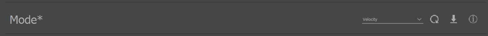
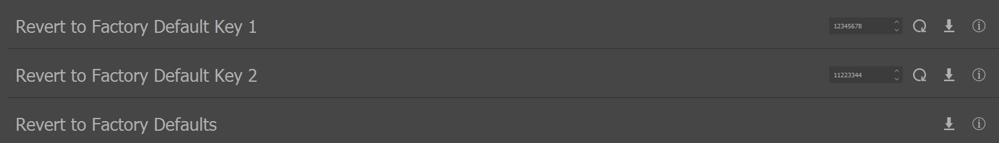
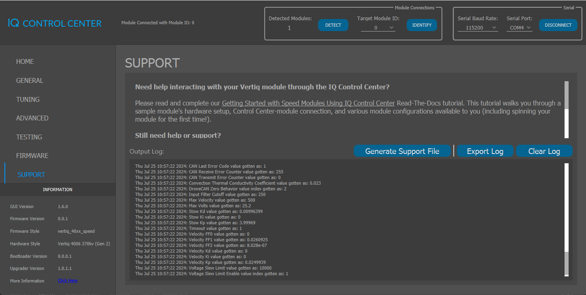
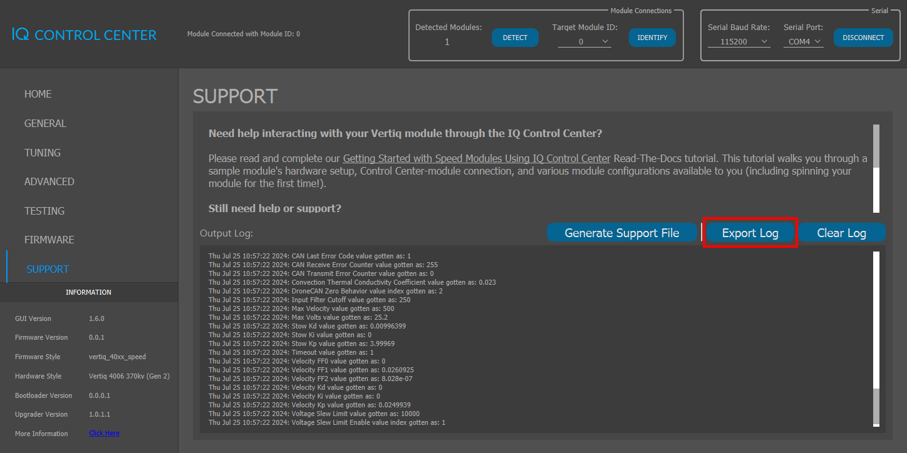
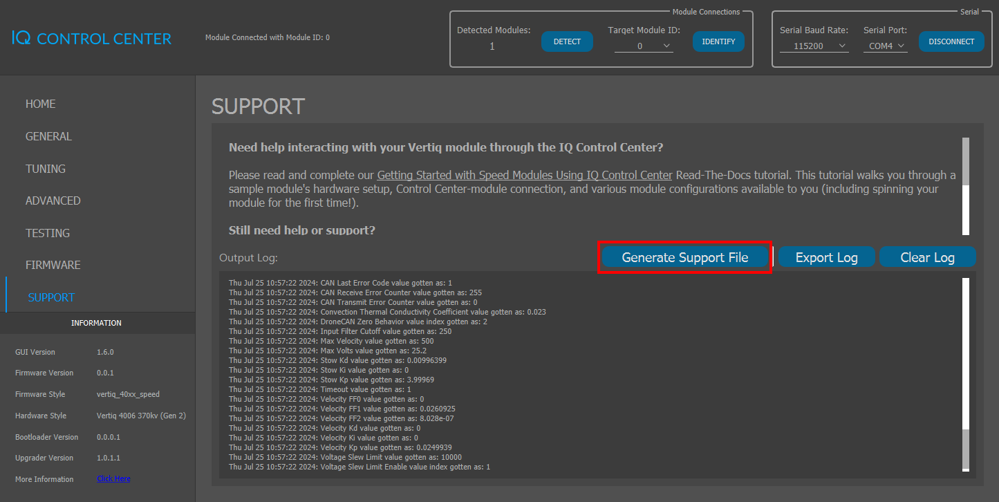
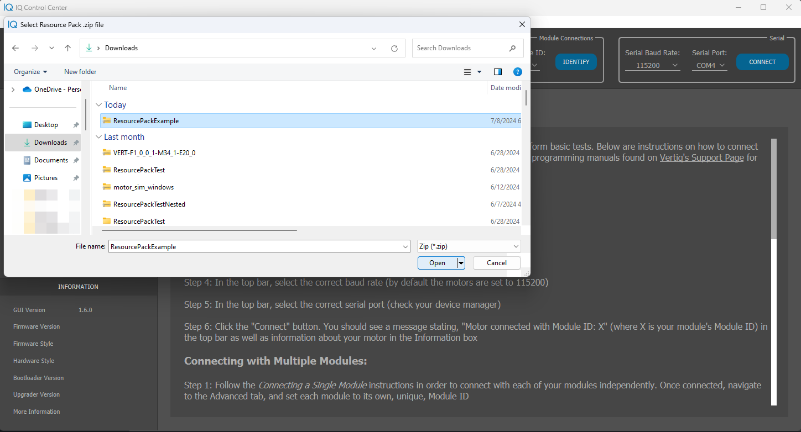

.. include:: ../text_colors.rst
.. toctree::

.. _control_center_start_guide:

#################################
IQ Control Center Manual
#################################

************************************
About IQ Control Center
************************************

IQ Control Center is the easiest and fastest way to configure your Vertiq modules. It provides simple mechanisms for 
changing module parameters, updating firmware, and testing basic module functionality. This page is meant to help guide you from first 
installation to a full understanding of using the Control Center software.

Please note that not all module features and parameters are accessible through the Control Center. If you are looking for a more specialized 
interaction with your module(s), you must use Vertiq's APIs (:ref:`Arduino<getting_started_arduino_api>`, :ref:`Python<getting_started_python_api>`, :ref:`C++<getting_started_cpp_api>`, :ref:`Matlab<getting_started_matlab_api>`)

.. note::
    All examples in this document use instructions and images for IQ Control Center v1.5.2. Beyond the Downloading and Installing section, 
    all examples will be shown using the Windows version of IQ Control Center.

************************************
Downloading and Installing
************************************
Downloads for all operating systems can be found on the Control Center's `GitHub <https://github.com/iq-motion-control/iq-control-center/releases>`_.

Windows
============
1. Navigate to the most recent release on Control Center's `GitHub <https://github.com/iq-motion-control/iq-control-center/releases>`_
2. Click on the Windows installer to download it

.. image:: ../_static/control_center_pics/windows/windows_install.png
    :scale: 50%

3. Unzip the installer, and inside of the unzipped folder, you will see

4. Run the application
5. You will see the IQ Control Center Setup window appear

6. Complete the installation as instructed by the installer wizard
7. If successful, you will see the following after selecting Show Details

.. image:: ../_static/control_center_pics/windows/windows_installer_done.png

8. Click Next, then Finish
9. Now, if you hit the Windows key, and search for IQ Control Center, you should see the Application listed. Click it to start the application

10. Alternatively, navigate to the location where you installed the application
11. Open the folder, then open IQ Control Center

12. Inside of that folder, you will find the IQ Control Center executable. Double click it to start the application

.. image:: ../_static/control_center_pics/windows/win_executable.png

13. After opening IQ Control Center, you should see the following

.. image:: ../_static/control_center_pics/windows/win_control_center_open.png
    :scale: 50%

Congratulations! You have successfully installed IQ Control Center, and are ready to start communicating with your modules.

Linux (Ubuntu)
=================
1. Navigate to the most recent release on Control Center's `GitHub <https://github.com/iq-motion-control/iq-control-center/releases>`_
2. Click on the Linux installer to download it
   
.. image:: ../_static/control_center_pics/linux/linux_installer_github.png
    :scale: 75%

3. Once downloaded, unzip the folder, and you will see the installer

4. Double click to start the installer 
   
.. note::
    If your installer does not open, please perform the following steps.

    a. Open a new terminal window
    b. Navigate to the location storing the Control Center Installer

    .. image:: ../_static/control_center_pics/linux/linux_terminal_location.png

    c. Use ./ to run the installer
    d. If you see the following error You MUST run `sudo apt-get install libxcb-xinerama0`

    .. image:: ../_static/control_center_pics/linux/xinerama_error.png

    e. Once libxcb-xinerama0 is installed, you should be able to open the installer

5. Once open, you will see the following window

.. image:: ../_static/control_center_pics/linux/linux_installer_open.png

6. Complete the wizard in order to install the IQ Control Center application
7. Once the installation is complete, and after clicking Show Details, you will see

8. Click Next, and Finish to complete installation
9. Navigate to your installation location, and find the IQ Control Center folder
10. Enter the IQ Control Center folder, and run IQ Control Center
11. Once open you will see the application

.. image:: ../_static/control_center_pics/linux/linux_control_center_open.png
    :scale: 45%

Congratulations! You have successfully installed IQ Control Center, and are ready to start communicating with your modules.

Mac
=======
1. Navigate to the most recent release on Control Center's `GitHub <https://github.com/iq-motion-control/iq-control-center/releases>`_
2. Click on the Mac installer to download it

.. image:: ../_static/control_center_pics/mac/mac_installer_link.png
    :scale: 75%

3. Navigate to the folder where the software was downloaded

.. image:: ../_static/control_center_pics/mac/mac_downloaded_installer.png

4. **While holding CTRL**, click the file, and select Open
5. In the pop-up that opens, select Open to start the installer

.. image:: ../_static/control_center_pics/mac/mac_warning.png

6. You will see the following window appear

.. image:: ../_static/control_center_pics/mac/mac_wizard_open.png

7. Follow the instructions in the wizard to complete installation
8. After clicking Show Details and a successful installation, you will see the following

.. image:: ../_static/control_center_pics/mac/mac_install_done.png

9. Click Next and Finish to complete installation
10. Navigate to the installation location and find the IQ Control Center folder. Inside you will find

11. Double click on the IQ Control Center icon to start the application
12. Once open you should see the following

.. image:: ../_static/control_center_pics/mac/mac_control_center_open.png
    :scale: 60%

Congratulations! You have successfully installed IQ Control Center, and are ready to start communicating with your modules.

**************************
Hardware Configuration
**************************

.. _connection_guide:

Connection with a Computer
===============================

In order to communicate from your computer with a Vertiq module through the Control Center, you will need some form of USB-to-UART converter.

We recommend using an CP2102 FTDI such as the one found `here <https://www.amazon.com/Ximimark-Module-Serial-Converter-CP2102/dp/B07T1XR9FT?>`_.

.. note::
    If you are using the UART-to-Serial adapter we have recommended and are not seeing it as an available port, you may need to install the appropriate drivers from `here <https://www.silabs.com/developer-tools/usb-to-uart-bridge-vcp-drivers?tab=overview>`_.

Once obtained, plug your USB-to-UART converter into your computer and install any necessary drivers (refer to the manufacturer's documentation for 
your USB-to-UART converter). If installed correctly, a new serial port should be available on your PC. 
Take note of the name of this new serial port. In Windows you can see this under Device Manager->Ports (COM & LPT). The image 
below shows an example where the connected USB-to-UART converter shows up as COM3. This port will be used later when connecting with the Control Center.

.. image:: ../_static/control_center_pics/windows/device_manager.png

Wiring
=============
In order to communicate with your module(s) through IQ Control Center, you must connect serial communication wires. 
For instructions on how to do so for your specific module, visit your module's family page:

* :ref:`Vertiq 23-XX Family Serial Configuration <23xx_comms>`
* :ref:`Vertiq 40-XX Family Serial Configuration <40xx_comms>`
* :ref:`Vertiq 81-XX Family Serial Configuration <81xx_comms>`

On modules with exposed serial pads, we recommend using cabling with one end set into a Servo JR female connector, and the other 
end soldered directly to the module's pads. On the 81-08 G1, we recommend using a cable with a Servo JR female connector on both sides.

Using Servo JR connectors makes it easy to connect with, and disconnect from the USB-to-UART device that you are using to connect with the Control Center. 

Single Module Wiring
---------------------------
To communicate with a single module, simply connect the Servo JR female connector to the FTDI.

.. note::
    Please ensure that your USB-to-UART device's TX port is connected to your module's RX port, and your module's TX port to the USB-to-UART device's RX port.

A module wired for both power and serial communication attached to the aforementioned FTDI looks as follows:

.. image:: ../_static/control_center_pics/module_with_ftdi.png
    :scale: 12%

.. _multiple_module_wiring:
Multiple Module Wiring
---------------------------
If you plan on connecting several modules to the Control Center at once, you must connect all of the modules' serial ports together. 
How you do this is up to you, but you must ensure that the resulting wiring with your USB-to-UART device looks as follows:

.. image:: ../_static/control_center_pics/multi_module_serial.png

**For initial configuration only** we highly recommend connecting your modules together with a non-permanent, easily detachable method. Some configurations through the Control Center 
must be performed on independently connected modules before multiple can be connected at once. So, having a quick way to attach/detach modules will 
make the process much easier.

In order to connect with several modules at once, you will also have to configure each module's Module ID. 
More information about this can be found :ref:`below <multi_module_config>`.

.. _gui_overview:

***********************************
IQ Control Center GUI Overview
***********************************

There are 5 major sections of the Control Center interface, which have been highlighted
with colored boxes in the figure above and are described below:

#. The :red:`Tabs` section lists the different tabs of the Control Center that are available when connected to a module. Each tab offers access to different configuration parameters and functionality. The settings in these tabs will be covered in greater detail later.

#. The :green:`Information` section lists information about the Control Center and connected module, if there is one. When there is no module connected, this only lists the Control Center version. When a module is connected, this will also list its Firmware Version, Firmware Style, Hardware Style, Bootloader Version, and Upgrader Version. Check this information to make sure you are using the proper hardware with the latest firmware. You can check for new firmware under the Modules section of the Vertiq website.

#. The :blue:`Module Connections` section is used to connect to modules. You can select the baud rate and the serial port to use for the module you want to connect to. The serial port is determined by the name of the serial port used by your USB-to-UART converter. See the :ref:`serial_port` section for more details on how to determine that port name.

#. The :gold:`Display` section displays information, configuration parameters, and controls relevant to your current tab. When you change tabs, the controls and information shown here will change. This is where the majority of your interactions with a connected module will take place.

#. The :purple:`Messages` section displays information about the Control Center that can be useful for understanding what state the Control Center is in and debugging connection problems. Check here if you are having connection issues for feedback.

**********************************
Connecting With your Module(s)
**********************************

.. _multi_module_config:

Required Configuration Before Connecting with Multiple Modules
=================================================================

The processes described below for connecting with your Vertiq modules are the same whether you are connecting with one or several modules. 
An important note, however, is that when connecting multiple modules, each must have a unique Module ID. If two (or more) 
modules share the same Module ID, they will be unable to communicate via IQUART. In order to change each module's Module ID, 
you must individually connect with it through the Control Center using the steps below

#. Navigate to the Advanced tab
#. Find Module ID, and change it to a unique value from all other modules you would like to connect with

.. note::
    In order to communicate with multiple modules at once, they all must have the same configured serial baud rate. If they do not, you will 
    only be able to communicate with those modules with a baud rate equal to Serial Baud Rate.

.. note::
    Please ensure that your module is up to date with its latest available firmware. Older versions of firmware do not support multiple module
    connections.

Module Connection Demonstration
====================================
An example of connecting with 4 Vertiq modules is presented in the screen capture below. In this example, 4 Vertiq 23-06 2200Kv 
modules are connected, each with a different Module ID (0, 1, 2, and 3), configured to use a 921600 baud rate.

.. raw:: html

    
    <video class='center_vid' controls><source src="../_static/control_center_pics/connection_screen_cap.mp4" type="video/mp4"></video>

Connection Configuration in the GUI
========================================
The serial configuration used to attempt connection with your modules is presented in the top right corner of the Control Center:

Serial Baud Rate
--------------------
This is the baud rate with which we will open the serial port being used to communicate with the connected modules. In order for 
communication to succeed, this value must be the same as the baud rate set on your module. By default, all Vertiq modules use a serial baud rate of 115200.

.. _serial_port:

Serial Port
--------------------
This is the serial port where you have connected your USB-to-UART device. After connecting your device, you will see an option in the dropdown appear. 
Click it to select it.

The names that appear in this box are OS dependent. For example, on Linux, you will see devices with the name “/dev/ttySX” where X is the value of the port.

Connect Button
--------------------

Once you have selected your target baud rate and your USB-to-UART device's serial port, you are ready to connect with your module. 

Connect your module to the USB-to-UART device as described :ref:`above <connection_guide>`, and power on your module. 

Click the CONNECT button in order to open serial communication between the Control Center and your module. 

If you successfully found and communicated with a module, you will see its information appear in the :ref:`Information section <information_box>` in the bottom left. 
You will also see the :ref:`Module Connections <module_connections>` box list the number of detected modules as non-zero. 

The CONNECT button now changes into the DISCONNECT button.

Disconnect Button
--------------------

Clicking the DISCONNECT button closes the serial connection between the Control Center and your connected USB-to-UART device. 
Once closed, you will see a “Serial Port Disconnected” message in the top left corner, and the CONNECT button will reappear.

Connection Information Example
===============================
The following sections demonstrate how the :ref:`Control Center's GUI <gui_overview>` is filled in after connecting a module.

.. _information_box:

Information
--------------
In the bottom left corner of the Control Center is information about the currently connected module. It provides information about the module's 
firmware, hardware, bootloader and upgrade versions, and a link to your module's `id.vertiq.co <http://id.vertiq.co>`_ site.

For example, when connecting a Vertiq 40-06 370Kv G2, we see the following

.. _module_connections:

Module Connections
-----------------------
The top right Module Connections box provides more information about the currently connected modules, a method to identify modules between 
one another, and if applicable, a method to switch between target modules.

When we connect 4 Vertiq 23-06 2200Kv modules, we see the following

Detected Modules
^^^^^^^^^^^^^^^^^^^^^^^
Reports the number of unique module IDs connected to the Control Center.

Detect
^^^^^^^^^^^^^^^^^^^^^^^
Clicking DETECT reruns the module detection process. This allows you to connect modules to the Control Center after already having run the initial connection.

For example, say you've connected one module with Module ID 1

Now, you would like to connect a second module to the bus, and configure it via the Control Center. All you have to do is 
power it on, plug it in to the serial bus, and hit DETECT.

You will now see 2 detected modules

Target Module ID
^^^^^^^^^^^^^^^^^^^^^^^^
This dropdown provides a list of the module IDs currently found on the serial bus. 

By selecting a new Target Module ID, you change the module whose parameters and information you are changing and reading.

Identify
^^^^^^^^^^^^^^^^^^^^^^^^
Clicking the IDENTIFY button plays a song on the module currently selected by Target Module ID to help differentiate between modules.
An example of the identification song is shown below.

.. raw:: html

    
    <video class='center_vid' controls><source src="../_static/control_center_pics/indication_song.mp4" type="video/mp4"></video>

.. _module_config_with_control_center:

***********************************************
Module Configuration with IQ Control Center
***********************************************

Configuration through the Control Center is performed through various tabs and parameters. As mentioned :ref:`above <gui_overview>`, 
tabs are available through the left side. Parameter types found in each tab are discussed more :ref:`below <config_values>`.

This example screen capture demonstrates configuring the Motor Direction (a dropdown available in the General tab) and the Max Velocity parameter (a spin box available through the Tuning tab).

This example starts with 4 modules already detected by IQ Control Center.

You will see the parameters be set for the module with Module ID 0, then the Target Module ID changed to 3, and the parameters set again for the newly targeted module.

.. raw:: html

    
    <video class='center_vid' controls><source src="../_static/control_center_pics/configuration_screen_cap.mp4" type="video/mp4"></video>

.. _config_values:

Configuration Values
========================
Values currently set on the target module are displayed in the box on the right hand side of each parameter.

To learn more about a parameter, click on the “i” icon on the right hand side

Saving and Refreshing
--------------------------
With a spin box, you can either type in a new value or use the up and down arrows to change the value. With a dropdown menu, 
simply click the box to list the options available, and click on the value you would like to set.

Values that have been changed but not saved are indicated by an asterisk (*) icon. For example, if you change *Mode* from 
Voltage to Velocity without saving or refreshing the value, we see

From this point, there are two choices: Save or Refresh. 

.. _save_button:

* **Saving** sets and saves the new value on the targeted module. Saving is indicated by the down arrow on the right hand side

* **Refreshing** rereads the target module's value, and sets it back into either the spin box or dropdown. Refresh is indicated by the circular arrow

In this example, when we click the refresh button, we see Velocity return to Voltage, and the star disappears.

If we save Velocity, however, you will see the star disappear, and a message stating “Value Saved Successfully” appears in the Messages section.

Configuration Tabs
===================
The Control Center provides 3 tabs of configuration options: General, Tuning, and Advanced. These are found on the left side of the GUI, 
and the selected tab is indicated in blue.

.. note::
    The configuration parameters presented for each module family and firmware style vary. Not all parameters shown in this example will be available for all modules and firmware styles.

General
-----------
The general tab provides access to some more basic module configuration parameters. Parameters here help configure attributes necessary for properly controlling 
your module with your desired behaviors.

For example, with a module with speed firmware connected, the general tab is where you will find the :ref:`Motor Direction parameter <throttle_direction>`.

Tuning
-----------
The tuning tab holds parameters geared towards affecting your module's performance. For example, this is where you find parameters that affect your module's PID gains.

Advanced
----------
.. warning::
    Changing parameters in the Advanced tab can compromise the safety features present on your module. Please use caution when changing parameters available in the Advanced tab.

The advanced tab holds parameters that are meant for more experienced users. The advanced tab is where you find parameters such as your Module ID and UART Baud Rate.

Configuration with Defaults
============================
IQ Control Center provides an easy method for setting several parameters at once with a system called Defaults. Defaults can be found in the general tab under MODULE PRE-SETTINGS

There are two forms of defaults, one provided by default with the IQ Control Center software and one that is user generated.

Using Vertiq Provided Default Settings
-----------------------------------------
The default settings provided with the Control Center are meant to help set parameters specific to certain battery and propeller settings configurations. 
For example, you will find a default file called Vertiq2306_2200Kv_speed_APC6x4.json. This file provides tuning parameters for use of a 
Vertiq 23-06 2200Kv module with speed firmware with an APC 6x4 propeller. In order to set these parameters, simply select the file that you would 
like to use, then click Set.

Using User Generated Default Settings
-----------------------------------------
User generated default settings allow you to easily share identical module configurations between multiple modules. For example, if you have parameters 
that work for your module configuration (gains, modes, baud rate, etc.) that should be set on all of your modules, you would want to use a custom defaults file.

.. note::
    User generated defaults files include the Module ID parameter. This means that setting up modules with custom Default files will result in collisions on 
    a serial bus, and it is recommended that you set defaults with only one module connected at a time, and if desired, assign unique Module IDs 
    after setting all other parameters to connect via a bus.

Creating a User Defaults File
^^^^^^^^^^^^^^^^^^^^^^^^^^^^^^^^^^^
The first step in creating a defaults file is finding the parameters that work best for your modules. Once you have a set of parameters 
(across the general, tuning, and advanced tabs) that work well, you can continue. 

1. With your module connected, navigate to the general tab and find the MODULE PRE-SETTINGS
2. Find the Export button on the right side
3. Click Export, and you will see a File Explorer window open
4. Here, choose a name and location for your generated defaults file. In this example I will save the file as “example_defaults.json”
5. You will then be given the option to import the file directly into the Control Center. In order to use this file to configure other modules, you must import it into the Control Center

6. After clicking Yes, you will see your imported defaults as an option in the dropdown. This file will now always be available in the Control Center
7. Once in the Control Center, you can use the Set button exactly as you would with a Vertiq supplied Defaults file

Importing a User Defaults File
^^^^^^^^^^^^^^^^^^^^^^^^^^^^^^^^^^^
It is also possible to import externally generated Defaults files into the Control Center. To do so:

#. Select the Import option
#. Use the File Explorer to find the Defaults file you would like to import
#. You will see the file appear in the dropdown of other Defaults files, and it is ready for use

******************************************
Testing Modules with the Control Center
******************************************
The Control Center provides a basic suite of testing options to ensure that your module is functioning properly. These options are available in the testing tab, 
available on the left side.

.. note::
    Before using the Control Center's testing functionality, we recommend that you increase your module's timeout parameter to 1.5s as the Control Center
    sends heartbeat checks only once per second. This parameter is available through the tuning tab. If you do not increase the timeout value, your module may fail to spin as expected. When 
    you are finished testing your module, please remember to reset your module's timeout value to your desired value. 

.. warning::
    Please remove all propellers before interacting with any testing parameters. Failure to do so is dangerous.

.. warning::
    If you are using a power supply to power your module, it is possible to damage or destroy your module with aggressive commands, e.g. quickly switching from spinning at full speed to stopping. 
    This is because Vertiq modules can also act as generators. In general, power supplies, unlike batteries, cannot absorb the energy generated by the module. As such, aggressive commands can lead to dangerous 
    voltage spikes when connected to a power supply. To prevent damage to the module when commanding it aggressively on a power supply, it is recommended to turn on the regeneration voltage protection feature.

In order to set a testing parameter, simply enter a value into the spin box, and hit the down arrow set button. Parameters such as Coast do not have a spin box, 
and only require that you press the set button to trigger the behavior.

The testing tab for a Vertiq 23-06 2200Kv with speed firmware looks as follows:

The following testing parameters are available to all Vertiq modules and firmware styles. To learn more about additional testing options available on 
your module, click the *info* icon in the Control Center. 

Brake
=========
This commands the module to brake, which shorts the motor phases, which slows the motor down by dissipating energy in the motor.

Coast
=============
Commanding a coast means that the module disconnects all phases, and allows the rotor to spin freely, slowly coming to a stop. It is a safe way to 
stop the module when testing since it does not cause the module to rapidly decelerate.

PWM
========
This tells the module to spin with a percentage of its input voltage. For example, if your input voltage is 20V, and you set this parameter to 0.5, the module will spin with a 10V drive voltage, since 50% of 20V is 10V. A positive PWM percentage always goes in the counterclockwise direction, and a negative PWM percentage always goes clockwise.

Velocity
=============
This commands the module to try and maintain a specific velocity in rad/s, using closed loop PID control. A positive velocity always goes in the counterclockwise 
direction, and a negative velocity always goes clockwise. To learn more about velocity and voltage control 
see :ref:`manual_velocity_control_mechanisms`

Voltage
=============
This commands the module to a specific drive voltage. A positive voltage always goes in the counterclockwise direction, and a negative voltage always goes clockwise.

.. _updating_firmware_control_center:

*******************************************
Updating Firmware with the Control Center
*******************************************
Flashing new firmware onto your module is done through the FIRMWARE tab in the Control Center, available on the left side.

All module firmware can be found on your product's page on `Vertiq's website <https://www.vertiq.co/>`_.

Screen Capture Example
=================================
The following screen capture demonstrates how to update your module's firmware through the Control Center. In this example, we will be updating a Vertiq 23-06 2200Kv configured to a baud rate of 921600.

.. raw:: html

    
    <video class='center_vid' controls><source src="../_static/control_center_pics/firmware_flash_screen_cap.mp4" type="video/mp4"></video>

Firmware Update Instructions
=================================
1. Download the file meant for your module from `vertiq.co <https://www.vertiq.co/>`_

.. note::
    If you downloaded a compressed zip archive from the website, you do not need to extract the contents. Simply use the .zip as your file selection 
    when selecting your firmware file. It is highly recommended that you use zip archives as they contain important metadata that helps protect you 
    from flashing incorrect firmware.

2. Navigate to the FIRMWARE tab of the Control Center
3. Click the Select Firmware button found at the bottom of the page

.. image:: ../_static/control_center_pics/select_firmware.png

4. Use the File Explorer to select the file downloaded from vertiq.co
5. If you've selected the correct zip archive for your folder, or if you selected a binary file, you will see a Flash button appear. 
   Click it to begin your firmware update

   .. note::
        If you are using a zip archive, you will be presented with up to 4 options (see below) depending on the state of your module and the release archive. 
        Note that you may see as few as 1 option when using a zip archive. The number depends on the type of updates that are deemed to be appropriate for each release:
           
           * Flash App: Updates only the application code, which is the section of code that runs during normal operation.

           * Flash Boot: Updates the proprietary bootloader.

           * Flash Upgrade: Updates the proprietary upgrade firmware.

           * Flash Combined: Updates all three sections.

        **If you are unsure of which type of update to perform, it is recommended to select Flash App if available, and Flash Combined otherwise.**

    Flash Button when .bin Chosen

    All Flash Options when .zip Chosen

.. note::
    If you've selected a zip archive not meant for your module, you will be shown a warning, and will not be allowed to flash that particular file as it can cause serious damage to your module.

.. _recovery_mode:

Recovering a Module from a Failed Flash
===========================================
.. note::
    Recovery mode is not available on the 23-XX or the Fortiq families.

If your module fails during a firmware update for any reason, it enters into Recovery Mode. When the module boots into recovery mode, it will not play its 
5 tone startup sequence. If you believe your module is in recovery mode, attempt to connect it to the Control Center, and you will be guided 
through the recovery process.

The following example shows the recovery of a Vertiq 40-06 G2 370Kv. The module being recovered is already in recovery mode when the example begins, 
and the correct firmware has already been downloaded from our website.

.. raw:: html

    
    <video class='center_vid' controls><source src="../_static/control_center_pics/recovery_screen_cap.mp4" type="video/mp4"></video>

.. _reset_to_defaults_manual:

****************************************************
Resetting Your Module to Factory Default Settings
****************************************************

In order to revert all module parameters to their default factory settings, please use the following steps.

1. Navigate to the Advanced tab
2. Locate Revert to Factory Default Key 1. Note that in order to fully reset your module to factory settings, you must first correctly enter the two key values

.. image:: ../_static/control_center_pics/unset_revert_keys.png

3. In Revert to Factory Default Key 1, enter 12345678, and hit the save button
4. In Revert to Factory Default Key 2, enter 11223344, and hit the save button

5. Now, select the save button on Revert to Factory Defaults, and your module should restart automatically. You will hear it play its five-beep startup song, and it will disconnect from the Control Center

At this point, all parameters that were altered and saved to persistent memory will be reset to their values programmed during manufacturing.

****************************
Control Center Support
****************************
The Control Center provides a support tab to provide you with information about Control Center operations as well as a method to produce support files.

In the middle of the support page, you will see the Output Log. Here, the Control Center places any important actions it has completed as well as information it has obtained. 
If you want to clear the log window, simply click Clear Log. 

If you are having any trouble with your module or with the Control Center, please use the steps below to generate a log file as well as a support file, 
and reach out to us at support@vertiq.co with these files as well as a description of your issue.

Exporting a Log
=============================
If you wish to export a log of all past IQ Control Center interactions, simply click the Export Log button. 

Once clicked, a File Explorer will open, and you can select a name and location for your exported log.

Generating a Support File
=============================
Support files provide a listing of all current parameters loaded on the target module. To generate a support file simply click the Generate Support File button.

Once clicked, a File Explorer will open, and you can select a name and location for your exported log.

Adding Resource Files
=============================
Occasionally, it is necessary to manually add module resource files to the Control Center. These will be provided by a member of the Vertiq team as a .zip file. 
Store this .zip file in a location that is easily accessible. The process for integrating the files into the Control Center is described below.

1. Run the Control Center application with administrator privileges.

.. note::
    In order to add resource files, the Control Center application must be ran with administrator privileges.
    On Mac and Linux, you must use the 'sudo' command in the terminal to run the application.

    .. image:: ../_static/control_center_pics/linux/linux_sudo_command.png

    On Windows, locate the Control Center's installation using the file explorer. By default, the application is located in Program Files (x86)/IQ Control Center/IQ Control Center/IQ Control Center.exe
    Right click the executable and select 'Run as administrator'.

    .. image:: ../_static/control_center_pics/windows/windows_run_as_administrator.png

2. Once the application runs, navigate to the Menu in the top left and select 'Import Resource Pack'.

3. A popup will appear requesting that you run the Control Center as an administrator. Since you already did this in step 1, click 'OK' and proceed to the next step.

4. The File Explorer will appear. Navigate to the .zip file that was provided. In this example, the .zip file is named ResourcePackExample and it is located in Downloads. Select the .zip file and click 'Open'.

5. After the .zip file is imported, a popup will appear requesting that you restart the Control Center. Click 'OK' and restart the Control Center, but this time you do not have to run as an administrator.

6. If the provided resource .zip file includes `default files <#configuration-with-defaults>`_, you will find them in the dropdown menu in the General tab next to MODULE PRE-SETTINGS. The other resource files will include additional configuration options based on your connected module.

