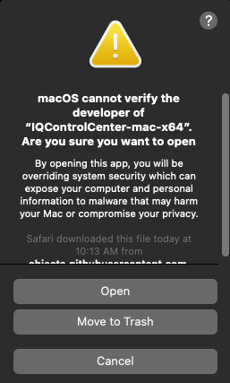

.. _control_center_start_guide:

#################################
IQ Control Center Manual
#################################

************************************
About IQ Control Center
************************************

IQ Control Center is the easiest and fastest way to configure your Vertiq modules. It provides simple mechanisms for 
changing module parameters, updating firmware, and testing basic module functionality. This page is meant to help guide you from first 
installation to a full understanding of using the Control Center software.

Please note that not all module features and parameters are accessible through the Control Center. If you are looking for a more specialized 
interaction with your module(s), you must use Vertiq's APIs (:ref:`Arduino<getting_started_arduino_api>`, :ref:`Python<getting_started_python_api>`, :ref:`C++<getting_started_cpp_api>`, :ref:`Matlab<getting_started_matlab_api>`)

.. note::
    All examples in this document use instructions and images for IQ Control Center v1.5.2. Beyond the Downloading and Installing section, 
    all examples will be shown using the Windows version of IQ Control Center.

************************************
Downloading and Installing
************************************
Downloads for all operating systems can be found on the Control Center's `GitHub <https://github.com/iq-motion-control/iq-control-center/releases>`_.

Windows
============
1. Navigate to the most recent release on Control Center's `GitHub <https://github.com/iq-motion-control/iq-control-center/releases>`_
2. Click on the Windows installer to download it

3. Unzip the installer, and inside of the unzipped folder, you will see

.. image:: ../_static/control_center_pics/windows/win_unzipped.png

4. Run the application
5. You will see the IQ Control Center Setup window appear

.. image:: ../_static/control_center_pics/windows/win_installer_pg1.png

6. Complete the installation as instructed by the installer wizard
7. If successful, you will see the following after selecting Show Details

8. Click Next, then Finish
9. Now, if you hit the Windows key, and search for IQ Control Center, you should see the Application listed. Click it to start the application

.. image:: ../_static/control_center_pics/windows/windows_key_search.png

10. Alternatively, navigate to the location where you installed the application
11. Open the folder, then open IQ Control Center

.. image:: ../_static/control_center_pics/windows/windows_installed_folder.png

12. Inside of that folder, you will find the IQ Control Center executable. Double click it to start the application

.. image:: ../_static/control_center_pics/windows/win_executable.png

13. After opening IQ Control Center, you should see the following

Congratulations! You have successfully installed IQ Control Center, and are ready to start communicating with your modules.

Linux (Ubuntu)
=================
1. Navigate to the most recent release on Control Center's `GitHub <https://github.com/iq-motion-control/iq-control-center/releases>`_
2. Click on the Linux installer to download it
   

3. Once downloaded, unzip the folder, and you will see the installer

.. image:: ../_static/control_center_pics/linux/linux_installer_icon.png

4. Double click to start the installer 
   
.. note::
    If your installer does not open, please perform the following steps.

    a. Open a new terminal window
    b. Navigate to the location storing the Control Center Installer

    .. image:: ../_static/control_center_pics/linux/linux_terminal_location.png

    c. Use ./ to run the installer
    d. If you see the following error You MUST run `sudo apt-get install libxcb-xinerama0`

    .. image:: ../_static/control_center_pics/linux/xinerama_error.png

    e. Once libxcb-xinerama0 is installed, you should be able to open the installer

5. Once open, you will see the following window

.. image:: ../_static/control_center_pics/linux/linux_installer_open.png

6. Complete the wizard in order to install the IQ Control Center application
7. Once the installation is complete, and after clicking Show Details, you will see

.. image:: ../_static/control_center_pics/linux/linux_finished_install.png

8. Click Next, and Finish to complete installation
9. Navigate to your installation location, and find the IQ Control Center folder
10. Enter the IQ Control Center folder, and run IQ Control Center
11. Once open you will see the application

Congratulations! You have successfully installed IQ Control Center, and are ready to start communicating with your modules.

Mac
=======
1. Navigate to the most recent release on Control Center's `GitHub <https://github.com/iq-motion-control/iq-control-center/releases>`_
2. Click on the Mac installer to download it

.. image:: ../_static/control_center_pics/mac/mac_installer_link.png
    :scale: 75%

3. Navigate to the folder where the software was downloaded

4. **While holding CTRL**, click the file, and select Open
5. In the pop-up that opens, select Open to start the installer

6. You will see the following window appear

.. image:: ../_static/control_center_pics/mac/mac_wizard_open.png

7. Follow the instructions in the wizard to complete installation
8. After clicking Show Details and a successful installation, you will see the following

9. Click Next and Finish to complete installation
10. Navigate to the installation location and find the IQ Control Center folder. Inside you will find

.. image:: ../_static/control_center_pics/mac/mac_inside_the_folder.png

11. Double click on the IQ Control Center icon to start the application
12. Once open you should see the following

.. image:: ../_static/control_center_pics/mac/mac_control_center_open.png

Congratulations! You have successfully installed IQ Control Center, and are ready to start communicating with your modules.