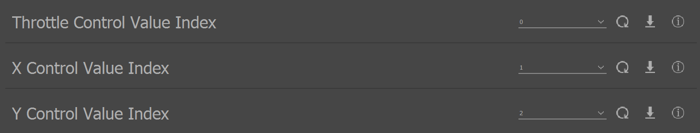

.. include:: ../text_colors.rst
.. toctree::

.. _pulsing_module_start_guide:

########################################################################
Getting Started with Vertiq's Pulsing Firmware with IQ Control Center
########################################################################

Before completing the following getting started guide, please ensure that you have read and completed our :ref:`IQ Control Center 
guide <control_center_start_guide>`. It walks you through Control Center installation, module configuration, and basic testing options available 
to all Vertiq modules and firmware types. The following document is meant to provide additional configurations and testing options available only on Vertiq's pulsing firmware.

.. note::
    The following images are captured using IQ Control Center version 1.5.3 as connected to a Vertiq 23-06

******************************************************
Hardware Configuration for Pulsing Propellers
******************************************************
Vertiq's pulsing firmware is meant to operate specifically with our UPXX propellers. Please ensure that you have completed the following guides 
in order to learn how to attach the propeller to your module, and to configure your module for proper flight with the propeller.

* :ref:`up12_installation_tutorial`
* :ref:`up12_initial_configuration`

*********************************************************
Important Parameters for Flight Controller Integration
*********************************************************

The first set of configurations covered here are those that **must** be configured properly in order to control your module with a flight controller. 
These parameters affect how your module communicates with, and is controlled by a flight controller. 

* **Mode**: this parameter is available through the General tab, and defines whether your module accepts throttle commands as a voltage, a velocity, or a PWM. 
  To learn more about the Mode parameter see :ref:`throttle_mode`
* **Motor Direction**: this parameter is available through the General tab, and defines the direction that your module takes to be positive, either clockwise or 
  counter-clockwise. You can also configure either 2D or 3D configuration to allow for mapping negative throttle commands.
  For more on the *Direction* parameter and throttle mapping, see :ref:`throttle_direction`
* **Max Velocity and Max Volts**: These parameters are available through the Tuning tab, and pair directly with the Mode parameter. This means that when your 
  mode is set to velocity, your module will only ever map a throttle command as bounded by ± *Max Velocity*. When your mode is set to voltage, your module 
  will only ever map a throttle as bounded by ± *Max Volts*. To learn more see :ref:`throttle_maximums`

*******************************
IFCI Configuration Parameters
*******************************
If you are controlling your pulsing module with :ref:`IFCI <controlling_ifci>`, you must configure your module's IFCI control value indices for 
throttle, X, and Y commands. These parameters are available through the General tab as *Throttle Control Value Index*, *X Control Value Index*, and *Y Control Value Index*. 
More information about these control values can be found at the link above.

************************************
Timeout Configuration
************************************
Vertiq's speed modules provide several configuration parameters regarding the module's timeout behavior. Timeouts are triggered after a 
configured length of time of not receiving new commands. Timeouts and their configurations are covered in detail :ref:`here <manual_timeout>`.

************************************
Pulsing Frequency
************************************
This parameter is available through the General tab, and defines the number of pulses that happen per module rotation. This can be useful if the motor 
is not directly driving the propeller.

************************************
Pulsing Voltage Mode
************************************
This parameter is available through the General tab, and determines how the module decides on its maximum pulsing voltage for scaling incoming pulsing commands. 
In *Supply Voltage* mode, the supply voltage is used as the maximum pulsing voltage. In *Voltage Limit* mode, the maximum pulsing voltage is specified by :ref:`pulsing_voltage_limit`.

.. _pulsing_voltage_limit:

************************************
Pulsing Voltage Limit
************************************
This parameter is available through the Tuning tab, and determines the maximum voltage to be applied to pulsing when *Pulsing Voltage Mod* is set to *Voltage Limit Mode*.

*****************************************************************************************
Example Module Flight Controller and Pulsing Configuration with the Control Center
*****************************************************************************************

Suppose that your module has the following requirements to function properly on your vehicle:

#. The module must spin clockwise at all times
#. The module must spin proportionally to a target velocity, with a maximum of 500 rad/s
#. The module must use IFCI index 0 for throttle, index 1 for X, and index 2 for Y commands
#. The module must apply at most 5V towards pulsing

To configure your module to meet these requirements:

1. Connect with your module through IQ Control Center
2. In the General tab, find the *Mode* parameter. Please note, the module used for this demonstration has been reset to factory defaults. If you have 
   previously configured your module, your values may not match identically to these images

3. Now, we will configure the parameters required to meet our first requirement as well as the first half of our second
   
   a. Set *Mode* to *Velocity*
   b. Set *Motor Direction* to *2D clockwise*

4. To meet the remainder of the second requirement, navigate to the Tuning tab, and find the *Max Velocity* parameter. Set it to 500 rad/s

5. To meet the third requirement, navigate to the General tab, and find *Throttle Control Value Index*

6. Set *Throttle Control Value Index* to 0, *X Control Value Index* to 1, and *Y Control Value Index* to 2

7. Still in the General tab, find the *Pulsing Voltage Mode* parameter. Set it to *Voltage Limit*

8. To meet the final requirement, navigate back to Tuning, and set *Pulsing Voltage Limit* to 5.00V

******************************************************
Testing Pulsing Functionality with IQ Control Center
******************************************************

The Control Center provides a simple method for verifying that your module can apply pulsing properly. In the Testing tab, you will find the *Pulsing Phase* 
and *Pulsing Voltage* parameters.

**Pulsing Phase** defines the phase added to the zero angle to set where the pulse occurs :math:`[-2\pi, 2\pi]` in terms of the rotor.

**Pulsing Voltage** represents the strength of the pulse in volts. Setting the amplitude too high at lower speeds can cause the pulsing to overcome the inertia of the motor spinning, causing it to stop.

.. note::
    Before using the Control Center's testing functionality, we recommend that you increase your module's timeout parameter to 1.5s as the Control Center
    sends heartbeat checks only once per second. This parameter is available through the tuning tab. If you do not increase the timeout value, your module may fail to spin as expected. When 
    you are finished testing your module, please remember to reset your module's timeout value to your desired value. 

.. warning::
    Please remove all propellers before interacting with any testing parameters. Failure to do so is dangerous.

.. warning::
    If you are using a power supply to power your module, it is possible to damage or destroy your module with aggressive commands, e.g. quickly switching from spinning at full speed to stopping. 
    This is because Vertiq modules can also act as generators. In general, power supplies, unlike batteries, cannot absorb the energy generated by the module. As such, aggressive commands can lead to dangerous 
    voltage spikes when connected to a power supply. To prevent damage to the module when commanding it aggressively on a power supply, it is recommended to turn on the regeneration voltage protection feature.

#. Set *Pulsing Phase* to 0 rad
#. Set *Pulsing Voltage* to 1V
#. Set *Velocity* to 200 rad/s. This will start your module spinning with pulsing active
#. Now, set *Pulsing Voltage* to 0V, and you should hear that pulsing is no longer active