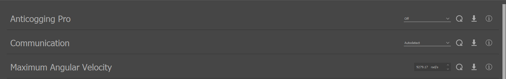
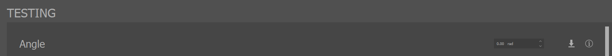
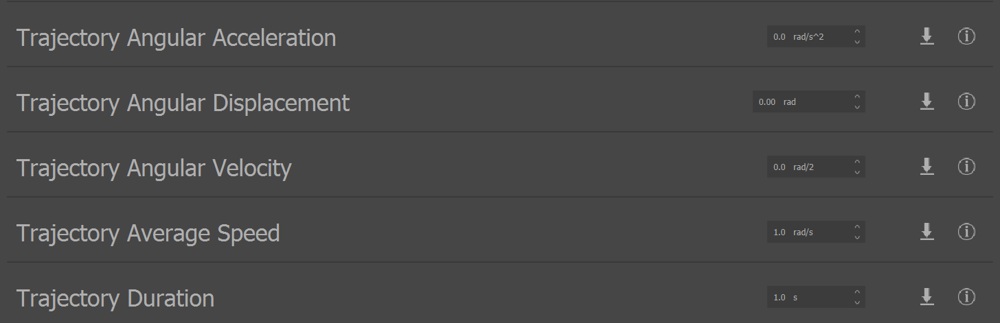
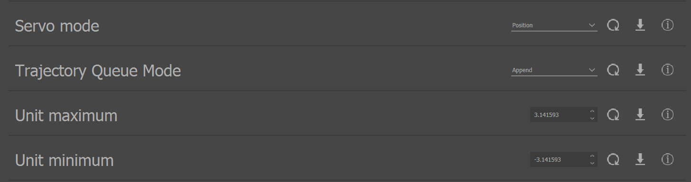

.. include:: ../text_colors.rst
.. toctree::

.. meta::
   :description: Learn how to configure and test Vertiq Servo Firmware using IQ Control Center, covering angle controls, maximum angular velocity, trajectory queuing, and communication protocols.
   :keywords: Servo Firmware, IQ Control Center, angle control, maximum angular velocity, trajectory control, trajectory queue, communication protocol, servo configuration, minimum jerk position planning

.. _servo_module_start_guide:

####################################################################
Getting Started with Vertiq's Servo Firmware with IQ Control Center
####################################################################

.. note::
    This guide focuses on setting parameters on your Vertiq modules. Please refer to your hardware's documentation (flight controller, radio, etc.) for more details on its specific configuration. 
    For example, refer to the `PX4 documentation <https://docs.px4.io/main/en/flight_controller/>`__ for integrating with a PX4 flight controller. 

Before completing the following getting started guide, please ensure that you have read and completed our :ref:`IQ Control Center 
guide <control_center_start_guide>`. It walks you through Control Center installation, module configuration, and basic testing options available 
to all Vertiq modules and firmware types. The following document is meant to provide additional configurations and testing options available only on Vertiq's 
servo firmware.

.. note::
    The following images are captured using IQ Control Center version 1.5.2 as connected to a Vertiq 40-06 Gen 2

.. warning::
    Before setting any parameters, ensure that the module is held in place securely. If the module is unsecured it could move unexpectedly when 
    it starts to spin. This could damage the module, its connectors, or any nearby observers.

****************************************************
Angle Controls and Maximum Angular Velocity
****************************************************

Vertiq's servo firmware provides several methods for commanding your module to specific positions. The most basic method is a 
direct angle command. Angle commands tell the module to spin to a specific position at the velocity specified by the *Maximum Angular Velocity*. 
To learn more about angle controls, see :ref:`control_displacements`.

The Control Center's angle control testing parameter is available through the Testing tab, and the *Maximum Angular Velocity* parameter in the General tab.

To test angle control with the Control Center:

1.  Connect your module to the Control Center
2.  Navigate to the General tab, and find the *Maximum Angular Velocity* parameter

3. Set *Maximum Angular Velocity* to 3.14 rad/s. For more information about the *Maximum Angular Velocity* parameter, see :ref:`Maximum Angular Speed`.

4. Navigate to the Testing tab, and find the Angle parameter

5. Set *Angle* to 0, and hit the down (set) arrow. This ensures that the module is starting at the position taken as zero displacement. 
   You'll notice that if you attempt to spin your module by hand, it will resist spinning. This is because the module is 
   holding its position at 0 displacement

6. Now, set *Angle* to 3.14. You'll notice that the module will spin counterclockwise for about one second (with our Maximum Angular Velocity at 3.14 rad/s), 
   then stop and hold the position
7. Now, set *Maximum Angular Velocity* to 6.28 rad/s, and set *Angle* back to 0. You'll notice the module returns to its original position, this time getting there in about half a second
8. Set *Coast* to release the module's hold

********************
Trajectory Control
********************

Vertiq's servo firmware provides a method of minimum jerk position planning through trajectory control. The module can hold a 
queue of up to 32 commanded trajectories to complete depending on the *Trajectory Queue Mode* parameter available in the General tab.

If *Trajectory Queue Mode* is set to *Append*, a trajectory sent while a trajectory is in progress will append to the end of the queue, 
and will be completed immediately after the previous trajectory completes. If *Queue Mode* is set to *Overwrite*, a trajectory sent while a 
trajectory is in progress will immediately take over, and the trajectory in progress is stopped. More information about both trajectories 
in general as well as trajectory queue modes can be found :ref:`here <control_trajectory>`.

.. note::
    You must set a trajectory displacement before setting either an average speed or duration. Failure to do so will result in an invalid trajectory command, and no 
    motion will occur.

To test trajectory controls with the Control Center:

1. Connect your module with the Control Center
2. In the General tab, set *Maximum Angular Velocity* to 50 rad/s
3. In the Testing tab, set *Angle* to 0 to make sure we are starting from 0 radians of displacement
4. In the General tab, set *Trajectory Queue Mode* to *Append*
5. Navigate to the Testing tab, and find the Trajectory testing parameters

6. For this example, we will set only a duration and displacement. Set *Trajectory Angular Displacement* to 12.56 rad
7. Set *Trajectory Duration* to 15s, and you will see the module start to spin
8. While the module is still spinning, set *Trajectory Angular Displacement* to 0 rad, and *Trajectory Duration* to 1s. This will queue a second trajectory 
   bringing the module back to its initial position

*******************************
Communication Configuration
*******************************
Vertiq's servo firmware supports all supported :ref:`timer_based_protocol`. Your module's target communication protocol can be configured in the 
General tab under the *Communication* parameter.

The module's behavior when controlled with timer based protocols is defined by the *Servo Mode*, *Unit maximum*, and *Unit minimum* parameters, 
all available in the General tab.

Servo communication configuration and behavior are covered in more detail at :ref:`servo_hobby_control`.

*******************
Next Steps
*******************
Now, you are ready to learn about all of what your module can do. Please return to your module's family page for a full list of supported features and tutorials.

* :ref:`vertiq_23xx_family`
* :ref:`vertiq_40xx_family`
* :ref:`vertiq_81xx_family`