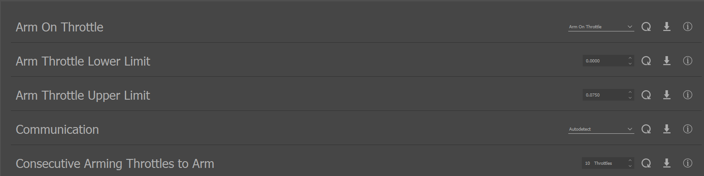
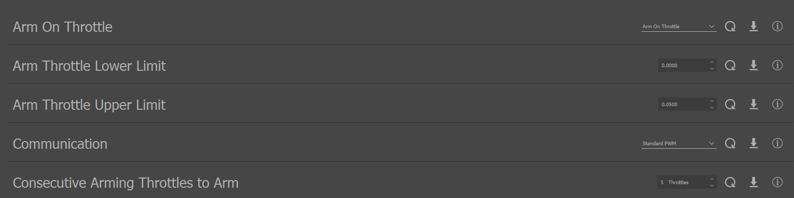
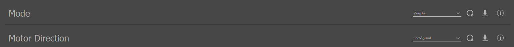
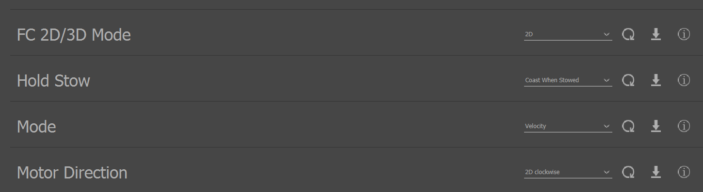
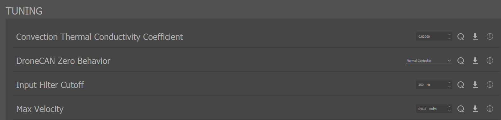

.. include:: ../text_colors.rst
.. toctree::

.. _speed_module_start_guide:

####################################################################
Getting Started with Vertiq's Speed Firmware with IQ Control Center
####################################################################

.. note::
    This guide focuses on setting parameters on your Vertiq modules. Please refer to your hardware's documentation (flight controller, radio, etc.) for more details on its specific configuration. 
    For example, refer to the `PX4 documentation <https://docs.px4.io/main/en/flight_controller/>`__ for integrating with a PX4 flight controller. 

Before completing the following getting started guide, please ensure that you have read and completed our :ref:`IQ Control Center 
guide <control_center_start_guide>`. It walks you through Control Center installation, module configuration, and basic testing options available 
to all Vertiq modules and firmware types. The following document is meant to provide additional configurations and testing options available only on Vertiq's speed firmware.

.. note::
    The following images are captured using IQ Control Center version 1.5.2 as connected to a Vertiq 40-06 Gen 2

.. _params_for_fc_integration:

*********************************************************
Important Parameters for Flight Controller Integration
*********************************************************

The first set of configurations covered here are those that **must** be configured properly in order to control your module with a flight controller. 
These parameters affect how your module communicates with, and is controlled by a flight controller. 

* **Mode**: this parameter is available through the General tab, and defines whether your module accepts throttle commands as a voltage, a velocity, or a PWM. 
  To learn more about the Mode parameter see :ref:`throttle_mode`
* **Direction**: this parameter is available through the General tab, and defines the direction that your module takes to be positive, either clockwise or 
  counter-clockwise. You can also configure either 2D or 3D configuration to allow for mapping negative throttle commands.
  For more on the *Direction* parameter and throttle mapping, see :ref:`throttle_direction`
* **FC 2D/3D Mode**: This parameter is available through the General tab, and defines how ESC commands will be mapped to a throttle. To learn more see :ref:`throttle_mapping`
* **Communication**: This parameter is available through the General tab, and defines the communication protocol expected by your module as sent by the 
  flight controller when using :ref:`timer based protocols <timer_based_protocol>`. This parameter can be Standard PWM, OneShot protocols, MultiShot, or DShot protocols. Please note that if you are 
  controlling your module with :ref:`DroneCAN <dronecan_protocol>` or :ref:`IQUART <uart_messaging>`, this parameter **does not** apply. To learn more see :ref:`throttle_sources`
* **Max Velocity and Max Volts**: These parameters are available through the Tuning tab, and pair directly with the Mode parameter. This means that when your 
  mode is set to velocity, your module will only ever map a throttle command as bounded by ± *Max Velocity*. When your mode is set to voltage, your module 
  will only ever map a throttle as bounded by ± *Max Volts*. To learn more see :ref:`throttle_maximums`

************************************
Arming and Disarming Configuration
************************************
Vertiq's speed modules provide several configuration parameters regarding the module's arming/disarming behaviors. These parameters, and their 
configuration through the Control Center are covered in detail :ref:`here <manual_advanced_arming>`.

Important arming parameters to understand for the example below are found in the :ref:`throttle_regions` section.

************************************
Timeout Configuration
************************************
Vertiq's speed modules provide several configuration parameters regarding the module's timeout behavior. Timeouts are triggered after a 
configured length of time of not receiving new commands. Timeouts and their configurations are covered in detail :ref:`here <manual_timeout>`.

************************************
Stow Configuration
************************************
Some Vertiq speed modules provide a method for stopping your module into a designated position that we call stow. Refer to your module's family page to see if this feature is supported.
Parameters and testing functionality for the stow feature are available through the Control Center, and are covered in detail :ref:`here <manual_stow_position>`.

************************************
DroneCAN Configuration 
************************************
Some Vertiq speed modules provide support for the :ref:`DroneCAN protocol <dronecan_protocol>`.  Refer to your module's family page to see if this feature is supported. 
Your module's DroneCAN node configuration is available through the Control Center, and is covered in detail :ref:`here <dronecan_fc_tutorial>`.

.. _flight_controller_config_with_control_center:

*******************************************************************************************
Example Module Flight Controller Configuration and ESC Testing with the Control Center
*******************************************************************************************

Configuration
===================
Suppose that your module has the following requirements to function properly on your vehicle:

#. The module must spin clockwise at all times
#. The module must spin proportionally to a target velocity, with a maximum of 500 rad/s
#. The module must arm after 5 consecutively received throttle commands below 5% sent through a Standard [1-2]ms PWM signal

To configure your module to meet these requirements:

1. Connect with your module through IQ Control Center
2. In the General tab, find the *Arm On Throttle* parameter. Please note, the module used for this demonstration has been reset to factory defaults. 
   If you have previously configured your module, your values may not match identically to these images

        
3. Now, we will configure the parameters required to meet our third requirement
   
   a. Make sure *Arm On Throttle* is set to *Arm On Throttle*
   b. Set *Arm Throttle Lower Limit* to 0
   c. Set *Arm Throttle Upper Limit* to 0.05 (5%)
   d. Set *Communication* to Standard PWM
   e. Set *Consecutive Arming Throttles to Arm* to 5
   

4. Still on the General tab, scroll down to find Mode

5. Now, we will set the configurations to meet requirements 1 and the first part of 2

   a. Set *Mode* to *Velocity*
   b. Set *Motor Direction* to *2D clockwise*
   c. Set *FC 2D/3D Mode* to *2D*

6. Navigate to the Tuning tab, and find the *Max Velocity* parameter

7. To meet the rest of requirement 2, set *Max Velocity* to 500

Testing Flight Controller Configuration with IQ Control Center
===============================================================
To verify your module's configuration for flight controller control, the Control Center provides a simulated ESC Input testing option in the Testing tab. This commands the module to spin in 
the same way that a typical timer based protocol used by a flight controller would, i.e. it sends an IQUART throttle command. So, setting this to 0.5, for example, sends the module a 50% throttle command 
with the configuration specified above.

.. note::
    Before using the Control Center's testing functionality, we recommend that you increase your module's timeout parameter to 1.5s as the Control Center
    sends heartbeat checks only once per second. This parameter is available through the tuning tab. If you do not increase the timeout value, your module may fail to spin as expected. When 
    you are finished testing your module, please remember to reset your module's timeout value to your desired value. 

.. warning::
    Please remove all propellers before interacting with any testing parameters. Failure to do so is dangerous.

.. warning::
    If you are using a power supply to power your module, it is possible to damage or destroy your module with aggressive commands, e.g. quickly switching from spinning at full speed to stopping. 
    This is because Vertiq modules can also act as generators. In general, power supplies, unlike batteries, cannot absorb the energy generated by the module. As such, aggressive commands can lead to dangerous 
    voltage spikes when connected to a power supply. To prevent damage to the module when commanding it aggressively on a power supply, it is recommended to turn on the regeneration voltage protection feature.

The following steps demonstrate how to spin a module configured as :ref:`above <flight_controller_config_with_control_center>` using the ESC Input testing parameter.

#. First, we demonstrate what happens when an unarmed module receives throttle commands outside of its defined arming region. Enter 0.25 into *ESC Input* to simulate a 25% throttle command. This falls well beyond the defined arming region [0, 5]%
#. Click the set down arrow 5 times to send 5 consecutive arming throttles outside of the arming region. Note that nothing happens, and the module remains unarmed.
#. Now, enter 0.02 into *ESC Input* to simulate a 2% throttle command. Note that this falls within the arming region [0, 5]%
#. Click the set down arrow 5 times to send 5 consecutive arming throttles within the arming region, and you should hear the module play its two-tone arming song
#. Your module should now be spinning at roughly 10 rad/s (0.02 * 500rad/s) in the clockwise direction
#. To spin your module faster or slower, simply increase or decrease the *ESC Input*
#. To stop your module from spinning, set *Coast*
#. You have now confirmed your module's configuration for flight controller integration, and it is ready for vehicle testing

.. note::
    Please double check to make sure that each module is spinning in the correct direction before moving on to flight controller integration.
    You can confirm the module's direction by testing with **ESC Input** as explained in the example above. Voltage and Velocity inputs **do not** use the module's motor direction configuration, and will always result in a counter-clockwise rotation given a positive input.
    To learn more, please refer to the :ref:`Velocity and Voltage Based Control Mechanisms <spin_with_speed_demo>` documentation.

For more on Vertiq module flight controller integration, see the following pages:

* :ref:`hobby_fc_tutorial`
* :ref:`dronecan_fc_tutorial`

*******************
Next Steps
*******************
Now, you are ready to learn about all of what your module can do. Please return to your module's family page for a full list of supported features and tutorials.

* :ref:`vertiq_23xx_family`
* :ref:`vertiq_40xx_family`
* :ref:`vertiq_81xx_family`