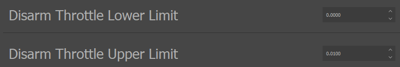

.. include:: ../text_colors.rst
.. toctree::

.. _manual_advanced_arming:

***********************************************
Advanced Arming
***********************************************
Vertiq modules can support an advanced arming feature. The advanced arming feature allows users to control the module's :ref:`armed state <advanced_arming_armed_states>` either manually 
or with throttle commands, and to configure specific behaviors to occur on armed state transitions. Modules will not react to throttle messages until they have armed, providing improved safety. 
The configurable behaviors on armed state transitions allow users to easily integrate advanced behaviors into their setup just by controlling the throttle messages they send, 
simplifying flight controller integration. 

The :ref:`arming_module_support` section below details which Vertiq modules currently support advanced arming.

.. _arming_module_support:

Module Support
===============

Speed Modules
**************

.. table:: Module Support for Advanced Arming

	+--------------+------------------------------------+
	| Module       | Advanced Arming Support            |
	+--------------+------------------------------------+
	| Vertiq 81-08 | .. centered:: |:white_check_mark:| |
	+--------------+------------------------------------+
	| Vertiq 40-06 | .. centered:: |:white_check_mark:| |
	+--------------+------------------------------------+
	| Vertiq 23-06 | .. centered:: |:white_check_mark:| |
	+--------------+------------------------------------+

Servo Modules
**************

.. table:: Servo Module Support for Advanced Arming

	+--------------+------------------------------------+
	| Module       | Advanced Arming Support            |
	+--------------+------------------------------------+
	| Vertiq 81-08 | .. centered:: |:x:|                |
	+--------------+------------------------------------+
	| Vertiq 40-06 | .. centered:: |:x:|                |
	+--------------+------------------------------------+
	| Vertiq 23-06 | .. centered:: |:x:|                |
	+--------------+------------------------------------+

.. _advanced_arming_armed_states:

Armed States
===============
Modules can be in one of two armed states at any time:

* **Armed**: In this state, the module will spin when it receives a :ref:`throttle command <manual_throttle>`. It is unsafe to be near an armed module with an attached propeller.
* **Disarmed**: In this state, the module will NOT spin when it receives a :ref:`throttle command <manual_throttle>`. If using IQUART to control the module it is still possible that the module can be commanded to spin by other commands, such as by setting the “ctrl_volts” of the Propeller Motor Controller client. As such, if you are using IQUART messages alongside the typical throttle commands to control the motor you should approach it with caution even when it is disarmed. 

The process of transitioning between armed states is covered in the :ref:`arming_state_transitions` section.

Reboot Armed State
*******************
**After a reboot, regardless of what armed state the motor was in previously, it will start up in the disarmed state.** Users must transition the 
motor from disarmed to armed to begin spinning again following a reboot.

.. _armed_throttle_source_lockout:

Armed Throttle Source Lockout
==============================
**When armed, the module will always choose one throttle source as its armed throttle source, and reject incoming throttle commands from all other throttle sources.** 
For an explanation on what is a throttle source, see the :ref:`throttle_sources` section. These rejected throttle commands will not affect how the module is spinning 
and will not trigger disarming transitions. For example, if DroneCAN was the armed throttle source, throttle commands received over DroneCAN would be treated 
normally, and throttle commands received over Hobby PWM would be rejected.

How the module determines the armed throttle source depends on how the arming transition is triggered. See the individual sections on types of arming transitions 
in :ref:`arming_state_transitions` for more details.

.. _arming_state_transitions:

Armed State Transitions
==========================
There are two types of armed state transitions:

* **Arming**: A transition from disarmed to armed. See :ref:`advanced_arming_behavior` for more details on what occurs during and after an arming transition.
* **Disarming**: A transition from armed to disarmed. See :ref:`advanced_disarming_behavior` for more details on what occurs during and after a disarming transition.

There are multiple ways to trigger armed state transitions covered in the sections below.

.. _throttle_regions:

Throttle Regions
****************
It is possible to transition between armed states using only the throttle commands sent to the module. This can be accomplished by specifying arming throttle regions and 
disarming throttle regions. 

A **throttle region is a range of throttle commands specified by an upper bound and a lower bound.** Any throttle command that falls within that range or on one of the 
boundaries is considered to be in that throttle region. Throttle commands that are in the arming throttle region will contribute towards transitioning the module 
to the armed state, and throttle commands that are in the disarming throttle region contribute towards transitioning the module to the disarmed state.

Arming With the Arming Throttle Regions
########################################

Arming Throttle Region Definition
----------------------------------
The arming throttle region is specified by two parameters: *Arm Throttle Upper Limit* and *Arm Throttle Lower Limit*. These two parameters can be found in the IQ Control Center 
under the General tab, as shown below. Users can configure these to specify any range of throttle commands as the arming throttle region. When a sufficient number of 
throttle commands in the arming throttle region are received, an arming transition will occur. For more details on the number of arming throttle commands required to 
trigger an arming transition, see :ref:`arming_consecutive_throttles`. When the arming transition occurs, the module will perform its arming behavior as detailed in :ref:`advanced_arming_behavior`.

.. figure:: ../_static/manual_images/arming/arming_throttle_limits.png
    :align: center
    :width: 60%
    :alt: Arming Throttle Region Limits

    Arming Throttle Region Limits in IQ Control Center

The *Arm Throttle Upper Limit* defines the upper, more positive bound of the arming throttle region. It should always be more positive than or equal to the 
*Arm Throttle Lower Limit*. The *Arm Throttle Lower Limit* defines the lower bound of the arming throttle region. Every throttle command the module receives in 
this region is considered an arming throttle and will contribute towards an arming transition. The number of arming throttles required to cause an arming 
transition is determined by the *Consecutive Arming Throttles to Arm* parameter as discussed in the :ref:`arming_consecutive_throttles` section below.

The image below illustrates where the arming throttle region would be for an example setup where the Arm Throttle Upper Limit is set to 0.3 and the Arm Throttle Lower Limit 
is set to 0.1. Any throttle command between 10% and 30% is an arming throttle.

.. figure:: ../_static/manual_images/arming/arming_example_arming_throttle_region_1.png
    :align: center
    :width: 60%
    :alt: Example Arming Throttle Region

    Example Arming Throttle Region

**There is a separate parameter that determines whether the arming throttle region exists at all. The** *Arm On Throttle* **parameter, shown below in 
IQ Control Center, allows users to toggle the arming throttle region on or off completely.** If this parameter is set to *Do Not Arm on Throttle*, 
then there is no arming throttle region and throttles cannot cause an arming transition. Otherwise, arming throttles can be used as previously described.

    Arm on Throttle Parameter in IQ Control Center

.. _arming_consecutive_throttles:

Consecutive Arming Throttles
------------------------------
**Users can specify the number of consecutively received arming throttles required to cause an arming transition.** This can be useful 
if the module is in a high-noise situation where there is a danger of noise being interpreted as a throttle command, or as a general safety 
feature to help prevent unintentional arming. 

The number of consecutive arming throttles the module must receive in the arming throttle region to trigger an arming transition can be configured in the General tab of the
Control Center with the *Consecutive Arming Throttles to Arm* parameter, as shown below.

    Consecutive Arming Throttles to Arm Parameter in IQ Control Center

**Note that the number of consecutive arming throttles received by the module resets whenever a throttle command outside of the arming throttle 
region is received. The module must receive the specified number of consecutive arming throttles all in a row, with no throttle commands outside of 
the arming throttle region coming in between them.** For example, if the module's *Consecutive Arming Throttles to Arm* parameter was set to 10, and 
it received 9 throttle commands in the arming throttle region, 1 outside of the region, and finally 1 throttle command in the region, 
the module would not arm. At the end of that sequence, the module has only received 1 consecutive arming throttle, because the throttle command 
from outside of the arming region reset the count.

**It is also important to note that the consecutive arming throttles must be from the same** :ref:`throttle source <throttle_sources>`. A change in the source of 
arming throttles will cause the count to reset. For example, if 5 arming throttles are sent over DroneCAN, and then 1 arming throttle 
is received over hobby PWM, the count of consecutive arming throttles will be 1. The change of source for the arming throttles caused a reset of the count. 

**To summarize, the module must receive a user-configurable number of consecutive throttle commands all in the arming throttle region and 
all from the same source to trigger an arming transition.**

Arming with Throttle Example
-----------------------------
An example of a possible arming setup and procedure is outlined below.

For this example, assume that the *Arm On Throttle* parameter is set to *Arm On Throttle*, the *Arm Throttle Upper Limit* is set 
to 0.15, the *Arm Throttle Lower Limit* is set to 0.0, and *Consecutive Arming Throttles to Arm* is set to 10. The figures below show what 
these settings look like in the IQ Control Center when applied to a module.

.. figure:: ../_static/manual_images/arming/arming_example_throttle_region_parameters.png
    :align: center
    :width: 60%
    :alt: Arm on Throttle and Arming Throttle Region Limits for Example

    Arm on Throttle and Arming Throttle Region Limits for Example

    Consecutive Arming Throttles to Arm for Arming Example

An illustration of the arming throttle region defined by these parameters is shown below to demonstrate what throttle commands will be considered arming throttles.

.. figure:: ../_static/manual_images/arming/arming_example_throttle_region_2.png
    :align: center
    :width: 60%
    :alt: Arming Example Throttle Regions

    Throttle Region Illustration for Arming Example

Now that the module is properly configured we can begin sending throttle commands to it. The module is in the disarmed state initially. Also, 
for this example, we will assume there is only one source sending throttle commands. For more information on how multiple sources sending throttle 
commands affect the arming process, see :ref:`arming_consecutive_throttles`.

Imagine that we begin sending 30% throttle commands to the module. Nothing will happen in this case; the module will not spin and it will not arm. 
The module is disarmed, so throttle commands will not cause it to spin. These 30% throttle commands are outside the arming throttle region, 
so they will not cause the module to arm.

If we switch to sending -10% throttle commands, we can expect the same result. The module is still disarmed, and -10% is not in the arming throttle region.

Now, if we begin sending 5% throttle commands, the commands fall within the arming throttle region, and will be counted as arming 
throttles. The module will not begin an arming transition when it receives the first 5% throttle command however, as our *Consecutive Arming Throttles to Arm* 
parameter means that it must receive 10 consecutive arming throttles before it will arm. After 10 consecutively received 5% throttle commands, the module will begin an 
arming transition. When the module arms, it will perform its arming behavior, as detailed in :ref:`advanced_arming_behavior`.

Disarming With the Disarming Throttle Region
##############################################

Disarming Throttle Region Definition
--------------------------------------
The disarming throttle region is specified by two parameters: *Disarm Throttle Upper Limit* and *Disarm Throttle Lower Limit*. These two parameters can be found in the IQ Control Center 
under the General tab, as shown below. Users can configure these to specify any range of throttle commands as the disarming throttle region. When a throttle command in the disarming 
throttle region is received, a disarming transition will occur.  For more information on what exactly the module does when a disarming transition occurs, see the :ref:`advanced_disarming_behavior` section.

    Disarming Throttle Region Limits in IQ Control Center

The *Disarm Throttle Upper Limit* defines the upper, more positive bound of the disarming throttle region. It should always be more positive than or equal to the 
*Disarm Throttle Lower Limit*. The *Disarm Throttle Lower Limit* defines the lower bound of the disarming throttle region. **Any throttle command from the same** :ref:`source <throttle_sources>`
**as the module armed with that the module receives in this region is considered a disarming throttle and will cause a disarming transition.** For more information on 
the throttle source requirements for disarming, see :ref:`disarming_throttle_source_requirement` below. Note that unlike with arming throttles, it always only takes one 
disarming throttle to trigger a disarm. This is to allow disarms to happen as quickly as possible in critical safety situations.

The image below illustrates where the disarming throttle region would be for an example setup where the *Disarm Throttle Upper Limit* is set to 0.15 and the 
*Disarm Throttle Lower Limit* is set to 0.0. Any throttle command between 0% and 15% is a disarming throttle in this setup.

    Example Disarming Throttle Region

**There is a separate parameter that determines whether the disarming throttle region exists at all. The *Disarm On Throttle* parameter, shown below in IQ Control Center, 
allows users to toggle the disarming throttle region on or off completely.** If this parameter is set to *Do Not Disarm on Throttle*, then there is no disarming throttle region 
and throttles cannot cause an disarming transition. Otherwise, disarming throttles can be used as previously described.

    Disarm on Throttle Parameter in IQ Control Center

.. _disarming_throttle_source_requirement:

Disarming Throttle Source Requirement
--------------------------------------
**To disarm with a throttle command that throttle command must be from the same** :ref:`source <throttle_sources>` **as the throttle commands that armed the module.** This is to reduce the 
chance of noise on communication interfaces that are not being actively used from unintentionally triggering a disarm.

For example, if a module armed using throttle commands sent over DroneCAN, then any throttle commands sent using a different communication protocol, such as :ref:`hobby_standard_pwm`, 
could not trigger a disarm. Throttle commands from a different source will have no effect on the armed state of the module and will not change how the module is spinning.

Disarming with Throttle Example
---------------------------------
An example of a possible disarming setup and procedure is outlined below.

For this example, assume that the *Disarm On Throttle* parameter is set to *Disarm On Throttle*, the *Disarm Throttle Upper Limit* is set to 0.10, and the *Disarm Throttle Lower Limit* 
is set to 0.0. The figures below show what these settings look like in the IQ Control Center when applied to a module.

    Disarm on Throttle Parameter Example Setup in IQ Control Center

    Disarm Throttle Regions Example Setup in IQ Control Center

An illustration of the disarming throttle region defined by these parameters is shown below to demonstrate what throttles will be considered disarming throttles.

    Disarming Example Throttle Region

Now that the module is properly configured we can begin sending throttle commands to it. Assume that the module is already in the armed state, and the throttle source 
the module armed with is the same throttle source we are using to send these disarming throttles. For more information on how throttle sources affect disarming, 
see the :ref:`disarming_throttle_source_requirement` section.

Imagine that we begin sending 15% throttle commands to the module. Because the module is armed, it will spin at 15%, but the module’s arming state will be unaffected. 
These 15% throttle commands are outside the disarming throttle region, so they will not cause the module to disarm.

If we switch to sending -5% throttle commands, we can expect a similar result. The module will spin in the opposite direction and more slowly than when sending 
the 15% throttle commands, but its armed state will not change.

If we instead begin sending 5% throttle commands, those commands will fall within the disarming throttle region, so they are counted as disarming throttles. 
When the first of these 5% throttle commands are received the module will immediately begin a disarming transition. For more details on what the behavior of 
the module will be during the disarming transition, refer to the :ref:`advanced_disarming_behavior` section.

Throttle Region Overlap
########################
Depending on the module's configuration, it is possible for the arming and disarming throttle regions to overlap. In this case, the disarming 
throttle region will take precedence, and throttles in the overlapping region will be considered as disarming throttles. 

User Commands
**************
It is possible for users to manually trigger arming and disarming transitions over DroneCAN and IQUART. This approach is generally more difficult to integrate with 
flight controllers as it requires modifying them to send the arm and disarm commands at the appropriate times, but it is possible for advanced users.

Before attempting to arm manually, be sure to refer to :ref:`manual_arming_throttle_source` for information on how to set the *Manual Arming Throttle Source* appropriately.

.. _arming_user_command_dronecan:

DroneCAN
#########
The “motor_armed” configuration parameter can be used to query and control the module’s armed state over DroneCAN. Setting this parameter to 0 will trigger a 
disarming transition, and setting it to 1 will trigger an arming transition. Note that disarming has no effect if you are already disarmed, and arming has 
no effect if you are already armed. Getting from this parameter will report the current armed state, 0 for disarmed and 1 for armed.

The appearance of this parameter in the `DroneCAN GUI Tool <https://dronecan.github.io/GUI_Tool/Overview/>`_ is shown below.

    motor_armed Parameter in DroneCAN GUI Tool

IQUART
#######
The “motor_armed” entry of the “arming_handler” client in the API can be used to manually trigger arming and disarming transitions over IQUART. Setting this entry to 
0 will trigger a disarming transition, and setting it to 1 will trigger an arming transition. Note that disarming has no effect if you are already disarmed, 
and arming has no effect if you are already armed. Getting from this entry will report the current armed state, 0 for disarmed and 1 for armed.

This functionality is also exposed in the Advanced tab of the IQ Control Center through the *Arming State* parameter as shown below. This entry can be used to check 
on the current armed state or manually transition the state as needed.

    Arming State Parameter in IQ Control Center

DSHOT Disarm
##############
The :ref:`DSHOT <hobby_dshot>` hobby protocol reserves one of its special values for commanding a disarm. Vertiq modules support this command, and will disarm if a DSHOT disarm 
command is received.

.. _manual_arming_throttle_source:

Manual Arming Throttle Source
##############################
When the module is armed, it must have a specific throttle source set as its armed throttle source, so it knows to reject throttles from other sources for 
spinning and disarming. See the :ref:`armed_throttle_source_lockout` section for more information on this. 

When the module arms using throttle regions as described in :ref:`throttle_regions`, then the armed throttle source is determined by the throttle source that sent the needed consecutive throttle commands. 
When a user manually arms the module using commands, it is not clear what source they intend the module to take throttle commands from.

**The** *Manual Arming Throttle Source* **is a parameter that allows users to configure what throttle source they want the module to use as its armed throttle source 
when arming manually.** This parameter can be set in IQ Control Center under the Advanced tab, as shown below.

    Manual Arming Throttle Source Parameter in IQ Control Center

When the module is armed manually, it will use the *Manual Arming Throttle Source* as its armed throttle source. **That means that it will only listen to throttle 
commands from the specified source for spinning and disarming when it is armed manually.** For example, if you had the *Manual Arming Throttle Source* set to *DroneCAN* and manually armed the module,
then any throttle commands from DroneCAN would be accepted, but any sent over :ref:`hobby_standard_pwm` would be rejected. **It is essential to set the** *Manual Arming Throttle Source*
**before attempting to arm manually.**

Timeout
********
Timeouts will always trigger a disarming transition. If the module is armed just before a timeout occurs, it will be disarmed just after the timeout. Note that 
whether the module performs its disarming behavior or not on a timeout depends on the timeout feature configurations. See the :ref:`manual_timeout` section, specifically the 
:ref:`timeout_meaning` subsection, for more information.

Always Armed
*************
For users who want to avoid any arming procedure altogether, there is the *Always Armed* parameter. **This parameter allows users to specify that they want the motor to 
immediately arm on the first throttle message it receives, regardless of its value.** This parameter can be found in the Advanced tab of IQ Control Center as shown below.

    Always Armed Parameter in IQ Control Center

**When this parameter is set to the** *Always Armed* **value, the first throttle command received will cause the module to immediately arm.** The module will then set 
its armed throttle source to whatever is specified in the *Manual Arming Throttle Source* parameter. For more information on the *Manual Arming Throttle Source* parameter, 
see :ref:`manual_arming_throttle_source`. **If using** *Always Armed*, **it is essential to also set the** *Manual Arming Throttle Source* **appropriately so the proper source 
will be used by the module after arming.**

**It is recommended to avoid using this feature and to leave this parameter set to** *Normal Arming* **whenever possible.** Arming on any throttle message may lead 
to the module arming on high percentage throttles and suddenly spinning rapidly, posing a risk to anyone nearby. Using arming throttle regions as described 
in :ref:`throttle_regions` is generally safer, as the module can be set to only arm on low percentage throttles, mitigating the risk that an unexpected arm might pose.

.. _advanced_arming_behavior:

Arming Behavior
================
When an arming transition (from disarmed to armed) occurs, the module executes its arming behavior. The arming behavior is not configurable, it will always be the same. 

The module will play the arming song, which consists of 2 short, high-pitched notes. The end of this song indicates the module is armed. The module will then begin spinning 
at the throttle percentage commanded by its last throttle command, and will begin accepting new throttle commands from its armed throttle source.

A video demonstrating what the arming and disarming songs sound like can be found in the DSHOT portion of the :ref:`hobby_fc_tutorial` tutorial.

.. _advanced_disarming_behavior:

Disarming Behavior
===================
Vertiq modules' disarming process attempts to safely stop the module, and clearly indicate that the disarm procedure is complete. **The disarming 
process consists of 3 basic steps: The module switches how it is driving itself in order to try and come to a stop, plays its disarm song as specified by its 
playback option, and switches to its final drive state.** How the module tries to come to a stop, how many times it plays the disarm song, and what final state it 
ends up in after playing the song are all configurable by the user. 

The image below summarizes this process and the options available at each stage. In the stopping state, the module will set itself to either coast, 
actively try to stop the module by driving it with 0V, or start a stow. When the module is stopped, the disarm song will play according to its playback option. 
After the song finishes, the motor will either coast, brake, or execute whatever final behavior is specified by the stow feature. Each of these stages and the
options at each stage are shown in the image below.

.. figure:: ../_static/manual_images/arming/disarming_block_diagram.png
    :align: center
    :width: 60%
    :alt: Disarming Process

    Summary of Disarming Process and Options

Note that not every combination of the options is possible, e.g. stopping with coast and then ending up in a final state of brake is not an option. 
The :ref:`disarming_behavior_options` section below provides more details on what combinations are possible and how to configure the behavior.

.. _disarming_behavior_options:

Disarming Behavior Options
***************************
The disarming behavior determines how the module will try to come to a stop and what that final drive mode will be. There are 4 options:

* **Coast**: The module will coast itself when it begins disarming. This means it will spin freely and let drag and friction slow it down. After the song, its final state will be to  remain coasting.
* **0V to Coast**: The module will drive itself to 0V when it begins disarming, actively trying to come to rapid stop. After the song, its final state will be to coast.
* **0V to Brake**: The module will drive itself to 0V when it begins disarming, actively trying to come to rapid stop. After the song, its final state will be to brake.
* **Stow**: The module will trigger a move to the :ref:`stow position <manual_stow_position>` when it begins disarming. After the song, its final state will be determined by whatever the stow position feature is configured to do after completing a stow. 

These options can all be configured through IQ Control Center through the *Disarm Behavior* parameter, as shown below.

    Disarm Behavior Parameter in IQ Control Center

Disarming Song Playback Options
*********************************
The disarming song playback option determines if and how many times the module will play its disarm song after coming to a stop. There are 3 options:

* **Never Play**: This option will skip the disarm song entirely. The disarm song will never play, and after stopping the module will transition directly to its final state.
* **Play Once**: The disarm song will play once, and then the module will transition to its final state.
* **Play Continuously**: The disarm song will play continuously until the module is armed again or commanded to spin without arming through IQUART. The module will never transition to its final state, as the song will never finish. For example, if the disarm behavior were set to 0V to Brake, the module would apply 0V until stopped, and then play the song forever, it will never brake as part of the disarming process.

These options can all be configured through IQ Control Center through the *Disarm Song Playback Option* parameter, as shown below.

    Disarm Song Playback Option Parameter in Control Center

Flight Controller Integration Examples
========================================
The examples below cover the arming specific setup steps on a Vertiq module and a PX4 based flight controller to control arming and disarming with only throttle commands. 
Using throttle regions for arming and disarming is recommended when integrating with flight controllers, as it allows for the simplest integration. 

These examples cover only the additional setup needed to support arming and assume the mode, direction and unit maximums are already set appropriately on the module. 
For examples of the initial setup of a Vertiq module see the :ref:`control_center_tutorial` tutorial and the :ref:`hobby_fc_tutorial` tutorial. 
For information on setting up the mode and throttle configurations for a Vertiq module, see the :ref:`manual_throttle` section.

Arming and Disarming with Hobby PWM and PX4
********************************************
This example covers one way to set up a Vertiq module and a PX4 flight controller sending Standard PWM commands to properly arm and disarm in sync with each other 
using arming and disarming throttle regions. This assumes that the flight controller and the Vertiq module are set up to use standard, non-reversible :ref:`hobby_standard_pwm` commands, 
where 1000 microseconds commands 0% throttle in the module’s specified direction and 2000 microseconds commands 100% throttle in that same direction.

Module Setup
#############
First, configure the arming throttle region on the Vertiq module. To do this, ensure that *Arm on Throttle* is set to *Arm on Throttle* in the Control Center, to turn on the 
arming throttle region. Then, set the *Arm Throttle Upper Limit* to 0.03 and the *Arm Throttle Lower Limit* to 0.01. This means that any throttle command between 1% and 3% will 
be treated as an arming throttle. Finally, set the *Consecutive Arming Throttles to Arm* to 10, so the module is less likely to arm unintentionally if there is noise on the 
PWM lines. These configurations are all shown below in the IQ Control Center.

.. figure:: ../_static/manual_images/arming/arming_fc_px4_pwm_region_setup.png
    :align: center
    :width: 60%
    :alt: Arming Throttle Region

    Arming Throttle Region in IQ Control Center

    Consecutive Arming Throttles in IQ Control Center

Next, set up the disarming throttle region. This setup is very similar to the setup for the arming throttle region. *Disarm on Throttle* should be set to 
*Disarm on Throttle*, *Disarm Throttle Lower Limit* should be set to 0.00, and *Disarm Throttle Upper Limit* should be set to 0.01. Any throttle command 
from 0% to 1% will be considered a disarming throttle. These configurations are shown below in the IQ Control Center. 

    Disarm on Throttle in IQ Control Center

    Disarming Throttle Region Boundaries in IQ Control Center

Finally, the disarm behavior should be configured appropriately as well. For this example, set the *Disarm Behavior* to *Coast* and the *Disarm Song Playback Option* 
to *Play Once*. Other choices would also work, these are just simple settings to begin with. These configurations are shown below in the IQ Control Center.

    Disarm Behavior in IQ Control Center

    Disarm Song Playback Option in IQ Control Center

Power off the Vertiq module and move onto configuring the flight controller.

Flight Controller Setup
########################
This example assumes the flight controller is already configured to use :ref:`hobby_standard_pwm` commands, and only covers how specifically to adjust the ranges of those commands 
to match the module’s throttle regions. For more details on how to set up a flight controller, see the :ref:`hobby_fc_tutorial` tutorial.

On a PX4 flight controller, it is possible to set the PWM value that will be sent when the flight controller is disarmed and the minimum that will be sent when the 
flight controller is armed. Adjusting these limits to match what we set on the module will keep the arming status of the flight controller and module in sync.

The important parameters in PX4 to change are *PWM_MAIN_DISARM* and *PWM_MAIN_MIN*. Set *PWM_MAIN_DISARM* to 1005 us, so that when disarmed the throttle command will be in 
the middle of the 0% to 1% disarming throttle region. Set *PWM_MAIN_MIN* to 1020 us, so the minimum throttle command when armed will be in the middle of the 1% to 3% 
arming throttle region. These settings can be seen in the image below taken from `QGroundControl <http://qgroundcontrol.com/>`_.

    Disarm and Minimum Armed Throttle Command Settings in QGroundControl

Now when the flight controller arms, the module should also arm, and when the flight controller disarms, the module should disarm.

Arming and Disarming with DroneCAN and PX4
********************************************
This example covers one way to set up a Vertiq module and a PX4 flight controller sending DroneCAN commands to properly arm and disarm in sync with each other 
using arming and disarming throttle regions. 

Module Setup
#############
First, configure the arming throttle region on the Vertiq module. To do this, ensure that *Arm on Throttle* is set to *Arm on Throttle* in the Control Center, 
to turn on the arming throttle region. Then, set the *Arm Throttle Upper Limit* to 0.01 and the *Arm Throttle Lower Limit* to 0.0001. This means that any throttle 
command between .01% and 1% will be treated as an arming throttle. This may seem like a strange throttle region to select, but by default PX4 sends a 
RawCommand with a value of 0 when disarmed, and a minimum RawCommand of 1 when armed, which translates into a 0.012% minimum throttle command when armed. 
So this throttle region allows the module to use the default range of the flight controller for arming and disarming.

Set the *Consecutive Arming Throttles to Arm* to 10, so the module is less likely to arm unintentionally if there is any electrical noise. These configurations 
are all shown below in the IQ Control Center.

    Arming Throttle Region Setup in IQ Control Center

    Consecutive Arming Throttles Setup in IQ Control Center

Next, set up the disarming throttle region. This setup is very similar to the setup for the arming throttle region. *Disarm on Throttle* should be set 
to *Disarm on Throttle*, *Disarm Throttle Lower Limit* should be set to 0.00, and *Disarm Throttle Upper Limit* should be set to 0.0001. Any throttle command 
from 0% to .01% will be considered a disarming throttle. Since PX4 sends a 0% throttle command over DroneCAN when disarmed by default, this should work 
without any additional configuration on the flight controller. These configurations are shown below in the IQ Control Center.

    Disarm on Throttle in IQ Control Center

    Disarming Throttle Region Boundaries in IQ Control Center

Finally, the disarm behavior should be configured appropriately as well. For this example, set the *Disarm Behavior* to *Coast* and the *Disarm Song Playback Option* 
to *Play Once.* Other choices would also work, these are just simple settings to begin with. These configurations are shown below in the IQ Control Center.

    Disarm Behavior in IQ Control Center

    Disarm Song Playback Option in IQ Control Center

**It is also important to ensure that the module is not set to use arming bypass on DroneCAN.** This is a DroneCAN specific feature included for backwards 
compatibility that allows DroneCAN to ignore the armed state and arming transitions. For more details on arming bypass and how to disable it, see 
the :ref:`dronecan_arming_and_bypass` section.

Power off the Vertiq module and move onto configuring the flight controller.

Flight Controller Setup
########################
The throttle regions chosen during the module setup match with the default throttles sent by PX4 when the flight controller is armed and disarmed, 
so there is no need to configure the throttle ranges on the flight controller side. Ensure that the flight controller is set up to send DroneCAN 
messages at the correct bitrate, as shown below, and the module should be able to arm and disarm in sync with the flight controller. For more information 
on integrating Vertiq modules with flight controllers when using DroneCAN, see the `application note on DroneCAN setup with a PX4 flight controller <https://static1.squarespace.com/static/62981f8ddf7dc07b7eed3f3f/t/63d9472c06ba915db2c121b8/1675183920024/Preliminary+Vertiq+DroneCAN+%28aka+UAVCANv0%29+Setup+Guide+with+PX4.pdf>`_ on the Vertiq website.

    Flight Controller Configurations for DroneCAN in QGroundControl

Arming and Disarming with ArduCopter for Hobby PWM and DroneCAN
*****************************************************************
This example covers one way to set up a Vertiq module and a flight controller programmed with ArduCopter to properly arm and disarm in sync with each other using 
arming and disarming throttle regions. The same setup works for both PWM and DroneCAN control.

This example assumes that the flight controller is already properly configured to send out :ref:`hobby_standard_pwm` or DroneCAN commands, only the arming specific setup steps are covered here.

Module Setup
#############
First, configure the arming throttle region on the Vertiq module. To do this, ensure that *Arm on Throttle* is set to *Arm on Throttle* in the Control Center, 
to turn on the arming throttle region. Then, set the *Arm Throttle Upper Limit* to 0.07 and the *Arm Throttle Lower Limit* to 0.03. This means that any throttle 
command between 3% and 7% will be treated as an arming throttle. The flight controllers arming throttle will be configured to be at 5%, right in the middle 
of this range. So this region choice provides some tolerance for the arming throttles.

Set the *Consecutive Arming Throttles to Arm* to 10, so the module is less likely to arm unintentionally if there is any electrical noise. These configurations 
are all shown below in the IQ Control Center.

    Arming Throttle Region Setup in IQ Control Center

    Consecutive Arming Throttles Setup in IQ Control Center

Next, set up the disarming throttle region. *Disarm on Throttle* should be set to *Disarm on Throttle*, *Disarm Throttle Lower Limit* should be set to 0.00, 
and *Disarm Throttle Upper Limit* should be set to 0.03. Any throttle command from 0% to 3% will be considered a disarming throttle. The flight controller 
will be configured to not send a throttle command under 5% when armed, so these settings should make the module only disarm when the flight controller does. 
These configurations are shown below in the IQ Control Center.

    Disarm on Throttle in IQ Control Center

    Disarming Throttle Region Boundaries in IQ Control Center

Finally, the disarm behavior should be configured appropriately as well. For this example, set the *Disarm Behavior* to *Coast* and the *Disarm Song Playback Option* 
to *Play Once*. Other choices would also work, these are just simple settings to begin with. These configurations are shown below in the IQ Control Center.

    Disarm Behavior in IQ Control Center

    Disarm Song Playback Option in IQ Control Center

Power off the Vertiq module and move onto configuring the flight controller.

Flight Controller Setup
########################
This example assumes that the flight controller is already set up to properly send PWM or DroneCAN commands, and only covers arming specific setup. For a 
more complete walkthrough on how to set up an ArduCopter flight controller, see the :ref:`tutorial on flight controller setup <hobby_fc_tutorial>`.

The only additional parameter that must be set on the flight controller for proper arming integration is *MOT_SPIN_ARM*. This parameter determines the minimum 
throttle sent by the flight controller when it is armed. Set *MOT_SPIN_ARM* to 0.05, so that the flight controller sends a 5% throttle command when armed, 
which is in the middle of the arming throttle region that was set up on the module. When disarmed, the module will send a 0% throttle command, which falls 
in the disarming throttle region of the module. This setting applies to both :ref:`hobby_standard_pwm` and DroneCAN. The image below shows the *MOT_SPIN_ARM* 
parameter in QGroundControl.

    MOT_SPIN_ARM Parameter in QGroundControl