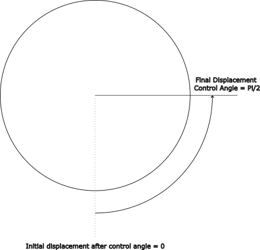
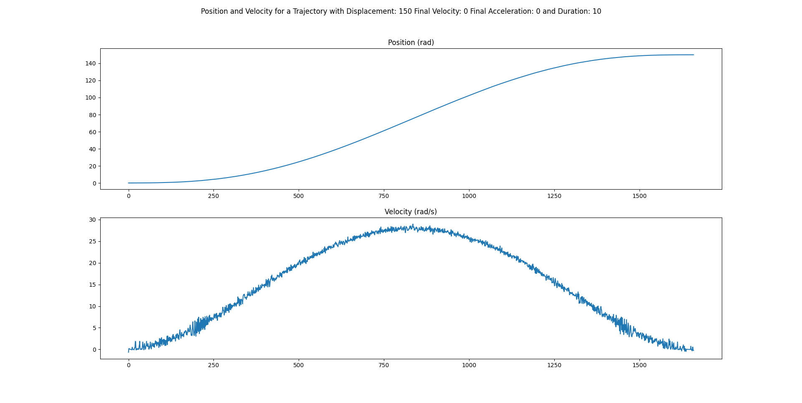
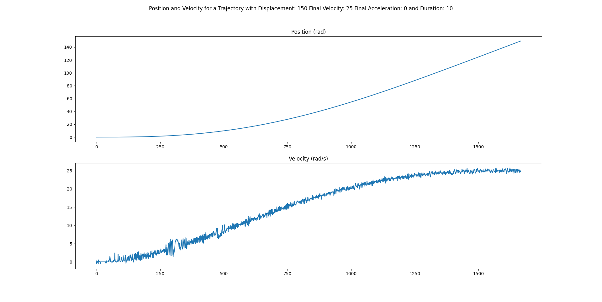
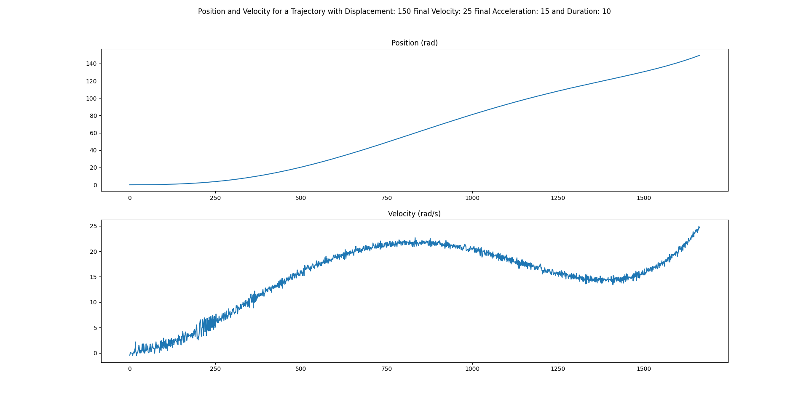
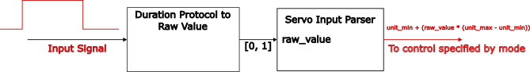
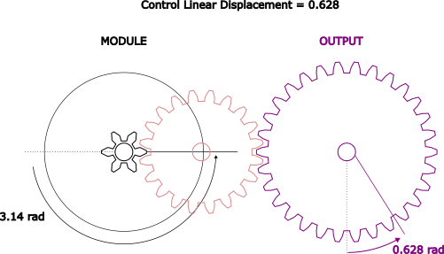
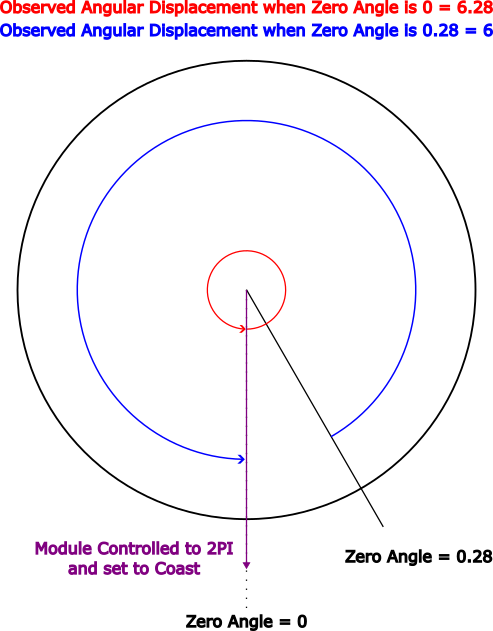
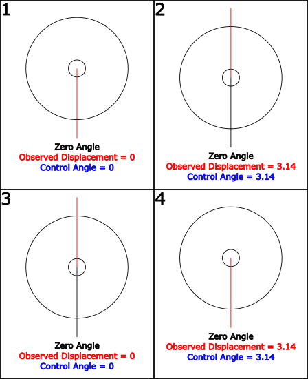

.. include:: ../text_colors.rst
.. toctree::

.. _manual_angle_control_mechanisms:

********************************
Angle Based Control Mechanisms
********************************

================================
About Position Control
================================
Vertiq's position control uses a closed loop PID controller in order to achieve a target position. There are two unique methods that we recommend for setting target displacements, Control Angle and Control Trajectory.
Also available is a Control Velocity which is driven by our angle controller. More information about angle based velocity control can 
be found <link to the velocity control page>. TODO: ADD ACTUAL LINK TO VELOCITY CONTROL WHEN IT EXISTS
Position modules can also be controlled via duration based protocols such as 1-2ms PWM. These control mechanisms are explained below.

================================
Angle Control Mechanisms
================================

Control Displacements
++++++++++++++++++++++++
The module's *Control Displacement* is a direct input target **displacement** into the position PID controller.
*Control Displacements* can be set through the :ref:`Multi Turn Angle Control Client <multi_turn_control_label>`, and can be set in either module
radians ctrl_angle or output meters ctrl_linear_displacement (assuming meters_per_radian is non-zero. See :ref:`Angular v. Linear Control`). 

A reminder that Control Angle defines a *displacement*, not a position, and is, in general, measured relative to the 
module's *Zero Angle*. See :ref:`Setting Observed Displacement and its Relationship With Zero Angle` for more information.

The module will rotate to the controlled displacement at the speed defined by *Maximum Angular Speed*.

A basic example of how your module will move during a displacement command is provided below. Note that
positive displacement is measured in the counter-clockwise direction.

    Angular Displacement with Commanded Angle :math:`\frac{\pi}{2}`

Control Displacement Demonstration
~~~~~~~~~~~~~~~~~~~~~~~~~~~~~~~~~~~~~
First, if you have not already, please set up your computer to use Vertiq's Python API with the instructions found :ref:`here <getting_started_python_api>`. 

This example illustrates the output of basic displacement commands. First, it sets the module to 0 radians of displacement, waits, 
and then sets the displacement to :math:`\frac{\pi}{2}`, exactly as described in the drawing above.

.. note:: 
    You must set the ``serial_port`` parameter to the serial port connected to your module.

.. code-block:: python
    :linenos:

    import iqmotion as iq
    import time
    import numpy as np

    #Create a SerialCommunicator object for our servo module
    serial_port = "COM3"
    com = iq.SerialCommunicator(serial_port)
    module = iq.ServoModule(com)

    #Set the maximum angular velocity to 20 rad/s for safety
    module.set("multi_turn_angle_control", "angular_speed_max", 20)

    #Make sure we're starting from 0 displacement
    module.set("multi_turn_angle_control", "ctrl_angle", 0)

    #Give it time to travel
    time.sleep(2)

    #Set a target displacement of PI/2 radians
    module.set("multi_turn_angle_control", "ctrl_angle", np.pi / 2)

    #Give it time to travel
    time.sleep(2)

    #Put the module into coast
    module.set("multi_turn_angle_control", "ctrl_coast")

Control Trajectory
++++++++++++++++++++++++

All Vertiq servo modules' trajectory control is a method of position planning to provide a predetermined path from 
position A to B over a period of time. All paths are generated in order to create minimum jerk trajectories. Trajectories are calculated based on the quintic function 
:math:`x(t) =  a_0 + a_1t + a_2t^2+a_3t^3+a_4t^4+a_5t^5` in which the *a* constants are calculated based on the module's starting and ending time, 
displacement, velocity, and acceleration.

In order to command a trajectory, you must command, in order, a minimum set of final displacement and an average velocity or 
trajectory duration. This is what will be referred to as a minimum trajectory.

Optional trajectory parameters include final velocity and acceleration. These must be commanded before the average velocity or duration.

Valid trajectories are described in the following examples:
    * Example 1
        #. Command the final velocity to :math:`8 \frac{rad}{s}`
        #. Command the final acceleration to :math:`4 \frac{rad}{s^2}`
        #. Command the final displacement to :math:`20 \text{rad}`
        #. Command the duration to 10 s

        Commanding this trajectory would cause the module to rotate to a displacement of 20 rad over a period of 10 seconds.
        At the end of the trajectory, the module will have a velocity of :math:`8 \frac{rad}{s}` accelerating at :math:`4 \frac{rad}{s^2}`.

    * Example 2
        #. Command the final displacement to 26 rad
        #. Command the duration to 4 s

        Commanding this trajectory would cause the module to rotate to a displacement of 26 rad over a period of 4 seconds. 
        At the end of the trajectory, the module will have a velocity of 0 :math:`\frac{rad}{s}` with no acceleration.

    * Example 3
        #. Command the final displacement to 26 rad
        #. Command the average velocity to 13 rad/s

        Commanding this trajectory would cause the module to rotate to a displacement of 26 rad with an average velocity of 13 :math:`\frac{rad}{s}`. 
        The trajectory would take around 2 seconds.

An invalid set of trajectory commands would be:
    #.  Command the final velocity to 8 :math:`\frac{rad}{s}`
    #.  Command the final acceleration to 4 :math:`\frac{rad}{s^2}`
    #.  Command the duration to 10 s
    #.  Command the final displacement to 20

Since the duration is given before the displacement, sending this trajectory will have no effect, and your module will not rotate.

Trajectory command parameters are available through the :ref:`Multi Turn Angle Control Client <multi_turn_table>`, 
and have the names all beginning with *trajectory_*, for example *trajectory_linear_displacement*.

Visualizing Control Trajectories
~~~~~~~~~~~~~~~~~~~~~~~~~~~~~~~~~~~~~
To help visualize what these parameters do, please refer to the following plots. 
All figures show module angular displacement on the top, and angular velocity on the bottom. 

    Trajectory Command with Final Velocity = 0 :math:`\frac{rad}{s}` and Final Acceleration = 0 :math:`\frac{rad}{s^2}`

This trajectory sets a final displacement of 150 rad with final velocity of 0 :math:`\frac{rad}{s}`, and final acceleration of 0 :math:`\frac{rad}{s^2}`. 
The module takes a smooth path to arrive at 150 radians, and once there, has a velocity of 0 :math:`\frac{rad}{s}`, and no acceleration. 

    Trajectory Command with Final Velocity = 25 :math:`\frac{rad}{s}` and Final Acceleration = 0 :math:`\frac{rad}{s^2}`

This next trajectory sets the final displacement to 150 rad with final velocity of 25 :math:`\frac{rad}{s}`, and final acceleration of 0 :math:`\frac{rad}{s^2}`. 
Again, there is a smooth curve in position, but this time a non-zero final velocity. As seen in the plot, 
we finish the trajectory with a final velocity of 25 :math:`\frac{rad}{s}`, with no acceleration (notice the slope of 0 at the end of the velocity plot).

    Trajectory Command with Final Velocity = 25 :math:`\frac{rad}{s}` and Final Acceleration = 15 :math:`\frac{rad}{s^2}`

Lastly, a trajectory with a displacement of 150 rad with a final velocity of 25 :math:`\frac{rad}{s}` and a final acceleration of 15 :math:`\frac{rad}{s^2}`. 
As with all trajectories, the position takes a smooth route to its final displacement, and we once again at a final 
velocity of 25 :math:`\frac{rad}{s}`. This time, we see a non-zero slope at the end of the velocity plot, and when measured, 
find an acceleration of 15 :math:`\frac{rad}{s^2}`.

Trajectory Queue Mode
~~~~~~~~~~~~~~~~~~~~~~~~~~~~~~
Unlike other control mechanisms, trajectory commands can be queued. This means that you can send multiple trajectories to the module, 
and while trajectory_queue_mode is set to append (0), the module will complete all trajectories in the order received without delay. 
If trajectory_queue_mode is set to overwrite (1), then a second received trajectory will happen immediately, halting the progress of the first. 
Vertiq servo modules can store up to 32 trajectories in the queue. 

Trajectory Control Demonstrations
~~~~~~~~~~~~~~~~~~~~~~~~~~~~~~~~~~~~~
First, if you have not already, please set up your computer to use Vertiq's Python API with the instructions found :ref:`here <getting_started_python_api>`.

#. Trajectory Queueing with Append Mode
    This demo illustrates appending queue mode with trajectory commands. This demo sets the module to 0 radians of displacement, 
    then waits for the initial movement to finish. Then, and without waiting for completion, we send 4 minimum trajectory commands, 
    each to a different displacement with a different duration. You will see that the module completes all 4 trajectories, 
    each taking longer than the last to complete, with the module finishing at 0 displacement.

    .. note:: 
        You must set the ``serial_port`` parameter to the serial port connected to your module.

    .. code-block:: python
        :linenos:

        import iqmotion as iq
        import time

        #Create a SerialCommunicator object for our servo module
        com = iq.SerialCommunicator("COM3")
        module = iq.ServoModule(com)

        #Make sure we're reset to 0 displacement
        module.set("multi_turn_angle_control", "ctrl_angle", 0)
        time.sleep(2)

        #Send 4 minimal trajectory commands all at once
        module.set("multi_turn_angle_control", "trajectory_angular_displacement", 50)
        module.set("multi_turn_angle_control", "trajectory_duration", 5)

        module.set("multi_turn_angle_control", "trajectory_angular_displacement", 0)
        module.set("multi_turn_angle_control", "trajectory_duration", 10)

        module.set("multi_turn_angle_control", "trajectory_angular_displacement", 50)
        module.set("multi_turn_angle_control", "trajectory_duration", 15)

        module.set("multi_turn_angle_control", "trajectory_angular_displacement", 0)
        module.set("multi_turn_angle_control", "trajectory_duration", 20)

#. Trajectory Queueing with Overwrite Mode
    For this next example,  we change the queue mode to overwrite (1). You'll see that only one trajectory is 
    completed after the initial reset to 0 rad of displacement. 

    .. code-block:: python
        :linenos:

        import iqmotion as iq
        import time

        #Create a SerialCommunicator object for our servo module
        com = iq.SerialCommunicator("COM3")
        module = iq.ServoModule(com)

        #Make sure we're reset to 0 displacement
        module.set("multi_turn_angle_control", "ctrl_angle", 0)
        time.sleep(2)

        #Send 4 minimal trajectory commands all at once
        module.set("multi_turn_angle_control", "trajectory_queue_mode", 1)

        module.set("multi_turn_angle_control", "trajectory_angular_displacement", 50)
        module.set("multi_turn_angle_control", "trajectory_duration", 5)

        module.set("multi_turn_angle_control", "trajectory_angular_displacement", 0)
        module.set("multi_turn_angle_control", "trajectory_duration", 10)

        module.set("multi_turn_angle_control", "trajectory_angular_displacement", 50)
        module.set("multi_turn_angle_control", "trajectory_duration", 15)

        module.set("multi_turn_angle_control", "trajectory_angular_displacement", 0)
        module.set("multi_turn_angle_control", "trajectory_duration", 20)

Control With Duration Based Signals (PWM, DShot, OneShot, Etc.)
++++++++++++++++++++++++++++++++++++++++++++++++++++++++++++++++++++++++

Vertiq's servo modules can handle duration based signals such as 1-2 ms PWM signals. All signals like standard PWM are converted to 
a *raw value* from [0, 1] that is scaled linearly based on the protocol itself. For example, standard PWM signals are scaled 
based on the function :math:`\text{Raw Value} = \frac{\text{Signal Duration} - 1000}{1000}` with *Signal Duration* being in microseconds. The *raw value* is passed 
through *Servo Input Parser*, and based on the *mode* value inside of Servo Input Parser, the module may react with a 
controlled PWM, Voltage, Velocity, or Position. This parameter can be chosen through the :ref:`Servo Input Parser's mode <servo_input_parser_table>`. 
Depending on the mode, input signals are mapped directly as a control voltage, PWM, velocity, or position. 
This guide will focus on only the Position mode. Other modes are covered more in <info about input parser stuff>.

The minimum and maximum bounds of these controls are set by the *unit_min* and *unit_max* parameters. 

    Servo Input Parser Data Path and Calculation

As an example, suppose mode is set to Position, standard 1-2 ms PWM is used as the Input Signal, unit_min is -3.14, and unit_max is 3.14.

If the PWM line sends a 1.8ms pulse, our raw value will be 0.8, and our Controlled Position will be 2.512 radians.

In this case, we have a symmetric range, where [1000, 1500) ms represents the angles [-3.14, 0), and [1500, 2000] represents the angles 
[0, 3.14]. This does not need to be the case, as your unit_min and unit_max determine how raw values are to be mapped.

Real-Life Example
~~~~~~~~~~~~~~~~~~~~
The following example was performed on a Vertiq 40-06 with position firmware. 
Its unit_min is set to -3.14, its unit_max to 3.14, and its mode to Position. Using a PWM generator, we input a 1.250 ms pulse at 50 Hz
imitating the Standard PWM input protocol. A single pulse, as well as the full signal, can be found on the scope capture below:

.. list-table:: PWM Input Signal Scope Capture
   :class: borderless

   * - .. image:: ../_static/manual_images/angle_control/pwm_input_pulse_width.png
     - .. image:: ../_static/manual_images/angle_control/pwm_input_frequency.png

With Standard PWM, a 1.25ms pulse equates to a raw value of 0.25, and an expected angle of :math:`-\pi + (0.25 * 2\pi) = -1.569 rad`

Using the Python API, and requesting the observed angle from the Brushless Drive client with the command ``get("brushless_drive", "obs_angle")``, 
we receive back -1.563, the expected value. 

================================
Position Control Configurations
================================

.. _Angular v. Linear Control:

Angular v. Linear Control
++++++++++++++++++++++++++++
With options to control modules through both angular and linear displacement commands, Vertiq's position modules provide flexibility 
to drive any physical system. Linear control allows you to map the module's angular rotation to an output distance. For example, in 
driving a belt or a lead screw where control of a physical distance is desired, you will want to know the distance traveled for every unit of 
rotation spun by your module. *Meters Per Radian* represents the output linear distance traveled caused by each radian of rotation from the module. 
Once this value is set, *Control Linear Displacement* will represent the linear distance caused by the *belt or screw* and not the rotational distance 
of the module. 

.. list-table:: Linear Displacement Examples
   :class: borderless

   * - .. image:: ../_static/manual_images/angle_control/belt_drive.png
     - .. image:: ../_static/manual_images/angle_control/lead_screw_example.png

This movement could be accomplished by setting *Control Angular Displacement* to 1 rad, or by setting Meters Per 
Radian to 0.5 rad and setting *Control Linear Displacement* to 0.5m.

Additionally, you can configure *Meters Per Radian* to properly drive a gear box. With a 5:1 gear ratio, for example, you may change the 
*Meters Per Radian* parameter found in :ref:`the Multi Turn Angle Control Client <multi_turn_table>` to 1/5. When you command Control Linear Displacement to 
:math:`\frac{\pi}{5}` rad, you will see that the module completes :math:`\pi` revolutions where the output gear moves by :math:`\frac{\pi}{5}` rad. 
The image below illustrates how this may work. The module is represented in black, the output shaft in purple, and an idler gear in red.

    Linear Displacement with a Gear Box

Meters Per Radian Demonstration
~~~~~~~~~~~~~~~~~~~~~~~~~~~~~~~~~~~~~
First, if you have not already, please set up your computer to use Vertiq's Python API with the instructions found :ref:`here <getting_started_python_api>`.

#. Gearbox Configuration with Meters Per Radian
    In this example, we will demonstrate the effect of setting meter_per_rad and using linear displacements to control a gearbox output.
    We will set meter_per_rad to 1/5 meaning that for every module radian traveled, we expect 1/5 radians of output (a 5:1 gear ratio). 
    Running the sample below, we expect that the printed Angular Displacement is 5 times the Linear Displacement. 
    By commanding linear displacement to :math:`\frac{\pi}{5}` we expect an observed angular displacement of :math:`\pi`.

    .. note:: 
        You must set the ``serial_port`` parameter to the serial port connected to your module.

    .. code-block:: python
        :linenos:

        import iqmotion as iq
        import numpy as np
        import time

        #Create a SerialCommunicator object for our servo module
        com = iq.SerialCommunicator("COM3")
        module = iq.ServoModule(com)

        #Set "meter_per_rad" to our gear ratio
        module.set("multi_turn_angle_control", "meter_per_rad", 1 / 5)

        #For safety, set our maximum angular speed to 50 rad/s
        module.set("multi_turn_angle_control", "angular_speed_max", 50)

        #Make sure we're starting from 0 and give it time to finish
        module.set("multi_turn_angle_control", "ctrl_angle", 0)
        time.sleep(1)

        #Tell the linear output to go to pi / 5 radians
        module.set("multi_turn_angle_control", "ctrl_linear_displacement", np.pi / 5)
        time.sleep(1)

        #Print out the Angular Displacement and Linear Displacement
        print("Angular Displacement: " , module.get("multi_turn_angle_control", "obs_angular_displacement"))
        print("Linear Displacement: " , module.get("multi_turn_angle_control", "obs_linear_displacement"))

    | The actual printed values are exactly what we expect:
    | Angular Displacement:  3.14
    | Linear Displacement:  0.63

Maximum Angular Speed
++++++++++++++++++++++++++++
Vertiq servo modules define a value called *Angular Max Speed* :ref:`in the Multi Turn Angle Control Client <multi_turn_table>` which is the maximum travel speed permitted during all commanded module motion. 
All angle commands are bound by this value, and **will not** exceed it. *Angular Max Speed* is the angular speed at which the module will 
attempt to complete Control Angle as well as Control Linear Displacement commands. For example, if *Angular Max Speed* is set to 50 rad/s, 
then a Control Angle of 25 rad will take about 0.5 seconds. 

In regards to Trajectory commands, the module remains bound by Angular Max Speed. Suppose you set a trajectory to move by 100 radians (from any starting point) 
over 5 seconds. You'd expect an average velocity of around 20 rad/s. If, however, your Angular Max Speed is set to 10, your 
module will only ever reach a maximum of 10 rad/s.

As this value is increased, so too is the torque generated by the module while accelerating. Please take care to ensure that your module is 
well secured at all times to avoid damage to yourself and your module. 

.. warning:: **If you are using a power supply to power your module, it is possible  to damage or destroy your module with aggressive commands, e.g. quickly switching from spinning at full speed to stopping.** 
  This is because Vertiq modules can also act as generators. In general, power supplies, unlike batteries, cannot absorb the energy generated by the module. As such, aggressive commands can 
  lead to dangerous voltage spikes when connected to a power supply. To prevent damage to the module when commanding it aggressively on a power supply, it is recommended to turn on the 
  regeneration voltage protection feature.

Demos
~~~~~~~~~

First, if you have not already, please set up your computer to use Vertiq's Python API with the instructions found :ref:`here <getting_started_python_api>`.

.. note:: 
    You must set the ``serial_port`` parameter to the serial port connected to your module.

Maximum Angular Speed and Control Angle
-------------------------------------------------------

Here, we will explore the effect that *Maximum Angular Speed* has on the execution of angle controls. In the first example, 
we will command an angular displacement, and in the next an angular trajectory. 

In this first example, we start by resetting our module to 0 radians of displacement. 
We also set the *Maximum Angular Speed* to 50 rad/s through the *angular_speed_max* entry. Then, we command the module to rotate to 50 rad of 
displacement. This will take about 1 second. We then set *angular_speed_max* to 25 rad/s, and command the module to 0 rad. Since we start at 50 rad, 
and revolve at a speed of 25 rad/s, this takes about 2 seconds.

.. code-block:: python
    :linenos:

    import iqmotion as iq
    import time

    #Create a SerialCommunicator object for our servo module
    com = iq.SerialCommunicator("COM3")
    module = iq.ServoModule(com)

    #Set the maximum angular speed to 50 rad/s
    module.set("multi_turn_angle_control", "angular_speed_max", 50)

    #Make sure we start from 0 displacement
    module.set("multi_turn_angle_control", "ctrl_angle", 0)

    #Give it time to settle
    time.sleep(2)

    #Set the control displacement to 50 rad
    module.set("multi_turn_angle_control", "ctrl_angle", 50)

    #Give it time to settle
    time.sleep(2)

    #Set the maximum angular speed to 25 rad/s
    module.set("multi_turn_angle_control", "angular_speed_max", 25)

    #Set the control displacement to 0 rad
    module.set("multi_turn_angle_control", "ctrl_angle", 0)

    #Give it time to settle
    time.sleep(3)

    #Set the control displacement to 0 rad
    module.set("multi_turn_angle_control", "ctrl_coast")

Trajectory and Maximum Angular Speed
-------------------------------------------------------

In this next example, we explore how *Maximum Angular Speed* affects trajectories. First, we reset the module to 0 rad of displacement. 
Then, we set the *angular_speed_max* to 10 rad/s. A reminder that this is the absolute fastest that the module will ever spin when commanded. 
The trajectory that we command is a displacement of 100 rad over 5 seconds. Normally, this results in an average speed of about 20 rad/s 
with a slower start and stop, and faster maximum speed. With the *Maximum Angular Speed* set to 10 rad/s, however, the trajectory will take 
about 10 seconds to complete at a speed capped at 10 rad/s. 

.. code-block:: python
    :linenos:

    import iqmotion as iq
    import time

    #Create a SerialCommunicator object for our servo module
    com = iq.SerialCommunicator("COM3")
    module = iq.ServoModule(com)

    #Make sure we're reset to 0 displacement
    module.set("multi_turn_angle_control", "angular_speed_max", 50)
    module.set("multi_turn_angle_control", "ctrl_angle", 0)
    time.sleep(2)

    #Set the maximum angular speed to 10 rad/s
    module.set("multi_turn_angle_control", "angular_speed_max", 10)

    #Send a trajectory that should take about 5 seconds at around 20 rad/s
    module.set("multi_turn_angle_control", "trajectory_angular_displacement", 100)
    module.set("multi_turn_angle_control", "trajectory_duration", 5)

Notice that this trajectory completes in about 10 seconds rather than the expected 5. This is because the angular velocity is limited to 10 rad/s 
rather than the calculated 20 rad/s.

Notice that the module does not reach its destination until 10 seconds. The trajectory itself, however, completes in the commanded 5 seconds. 
If you queue another trajectory, the original commanded trajectory will carry into the next trajectory. Trajectories still execute in the background as 
originally commanded, and are not modified by these limits.

Zero Angle
++++++++++++++++++++++++++++
The module's *Zero Angle* is the physical position to be treated as 0 radians of displacement 
(assuming no explicit sets of *Observed Angular Displacement*. See :ref:`Setting Observed Displacement and its Relationship With Zero Angle`). 
*Zero Angle* is a value bounded by [-:math:`\pi`, :math:`\pi`], giving a range of the entire circle around the module. Displacement is the 
total distance (radial or linear) traveled away from *Zero Angle*. Displacement is not bounded by [-:math:`\pi`, :math:`\pi`], and can be any 32-bit float 
value [±1.18e-38, ±3.4e38].

For example, imagine your current *Zero Angle* is 0 rad. You then command your module to a *Control Angle* of 6.28 radians, 
and set it to Coast after it is done, freeing it from the controller. Your *Observed Angular Displacement* is now 6.28 rad. Now, 
if you set *Zero Angle* to 0.28 rad, your *Observed Angular Displacement* will become 6 rad since, relative to the new *Zero Angle*, the displacement is less.

    Zero Angle and Angular Displacement

.. _Setting Observed Displacement and its Relationship With Zero Angle:

Setting Observed Displacement and its Relationship With Zero Angle
+++++++++++++++++++++++++++++++++++++++++++++++++++++++++++++++++++++

In general, *Observed Angular Displacement* and *Observed Linear Displacement* are defined as the total displacement measured 
relative to the encoder position specified by Zero Angle. This behavior can change, however, if observed displacements are set directly. 
Once the observed displacement is set explicitly, all future displacement measurements and controls (*Control Angle* and *Control Linear Displacement*) 
will be in relation to the set observed angle. 

The following images illustrate what could happen as observed displacements are explicitly set. In the images, 
the black line indicates the *Zero Angle* position, and the red line is the physical location of the rotor.

    Setting Observed Displacement and its Relationship With Zero Angle

In step 1, the module has just been turned on, and commanded to 0 displacement by setting *Control Angle* to 0. As expected, the observed 
displacement is 0. Step 2 commands the module to 3.14 radians of displacement by setting *Control Angle* to 3.14, and the observed displacement 
is returned as 3.14 rad. This is expected as the displacement is in the positive direction away from *Zero Angle*. Step 3 explicitly sets the 
observed displacement to 0 rad as well as *Control Angle* to 0, and step 4 once again commands the module to 3.14 radians of displacement. 
Now, the module returns to its starting position, but rather than being 6.28 radians of displacement from *Zero Angle* 
(as it would be without having set observed displacement), the displacement is 3.14 rad from the new angle considered to be 0 observed displacement. 
Important to note is that once the observed displacement is set, the *Zero Angle* parameter no longer has any effect on displacement measurement. 
This is the case until the module is rebooted.

Zero Angle v. Observed Linear Displacement Demonstration
~~~~~~~~~~~~~~~~~~~~~~~~~~~~~~~~~~~~~~~~~~~~~~~~~~~~~~~~~~~~~~~

First, if you have not already, please set up your computer to use Vertiq's Python API with the instructions found :ref:`here <getting_started_python_api>`.

.. note:: 
    You must set the ``serial_port`` parameter to the serial port connected to your module.

The following demo produces the same steps as the example presented above in order to illustrate the relationship between Zero Angle and Observed Displacement.

.. code-block:: python
    :linenos:

    import iqmotion as iq
    import time

    #Create a SerialCommunicator object for our servo module
    com = iq.SerialCommunicator("COM3")
    module = iq.ServoModule(com)

    #Set a safe max velocity
    module.set("multi_turn_angle_control", "angular_speed_max", 10)

    #Sample the Zero Angle
    module.set("multi_turn_angle_control", "sample_zero_angle")

    #Set our Observed Displacement to 0
    module.set("multi_turn_angle_control", "obs_angular_displacement", 0)

    #Command the module to 0 displacement, and give it time to settle
    module.set("multi_turn_angle_control", "ctrl_angle", 0)
    time.sleep(1)

    #Command the module to 3.14 rad of displacement, and give it time to settle
    module.set("multi_turn_angle_control", "ctrl_angle", 3.14)
    time.sleep(2)

    #Read the displacement
    #Expect to see a value around PI
    print(module.get("multi_turn_angle_control", "obs_angular_displacement"))

    #Coast the module, and set Observed Angular Displacement to 0
    module.set("multi_turn_angle_control", "ctrl_coast")
    module.set("multi_turn_angle_control", "obs_angular_displacement", 0)

    #Command the module to 3.14 rad of displacement, and give it time to settle
    module.set("multi_turn_angle_control", "ctrl_angle", 3.14)
    time.sleep(2)

    #Coast the module, and get Observed Angular Displacement
    module.set("multi_turn_angle_control", "ctrl_coast")
    #Expect to see a value around PI\
    print(module.get("multi_turn_angle_control", "obs_angular_displacement"))

You'll notice that each time we print the *Observed Angular Displacement*, the value is around 3.14. As described, the second setting of “obs_angular_displacement” to 0 supersedes the displacement 
reference set by zero angle. If the zero angle was the reference point for displacement, then the second “ctrl_angle” set would not result in any movement, 
as the module would already be displaced by 3.14.

================================
Position Control Tuning
================================

Vertiq's position modules use a standard, closed loop, PID controller in order to properly set the module's position. 
The controller's input (target) angle is calculated dependent on the module's enabled control mechanism. For 
direct target position commands, the commanded position is set directly as the input target to the controller. 
The controller's PID values are all standard control metrics, and are described below. 

Position Kp
+++++++++++++++

The angle control's proportional gain. Kp helps to reduce steady state error, helping to ensure that your module hits its target angles. 
Setting a higher proportional gain results in smaller steady state errors and faster rise time, but can lead to oscillations and overheating.

Position Ki
+++++++++++++++

The angle control's integral gain. Ki helps to correct steady state angle errors. Setting a higher Ki means quicker suppression of steady 
state errors, but also increased oscillations, overheating, and faster windup.

Position Kd
+++++++++++++++

The angle control's derivative gain. Kd helps to reduce overshoot oscillations. A higher Kd results in less overshoot from Kp and Ki, but 
can also introduce higher frequency oscillations and overheating.

