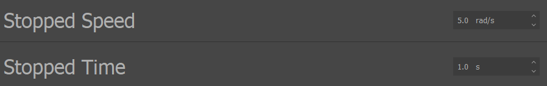
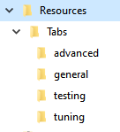
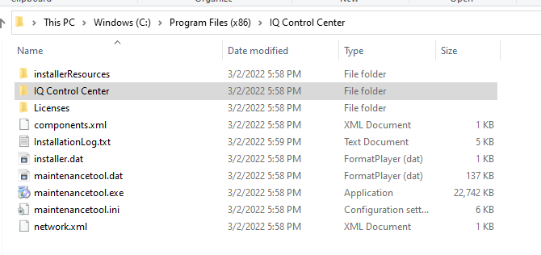
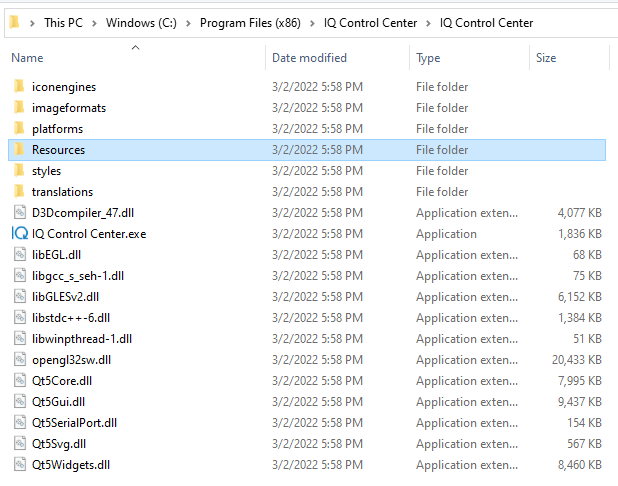

.. include:: ../text_colors.rst
.. toctree::

.. _manual_appendix:

***********************************************
Appendix
***********************************************

.. _appendix_stop_detection:

Stop Detection
================
Some features, such as :ref:`Disarming Behavior <advanced_disarming_behavior>` and :ref:`Timeout Behavior <timeout_behavior>` rely on detecting when a module is stopped. This section defines how a stop is detected, and how that 
detection can be configured by advanced users.

A Vertiq module is considered stopped when it has been below its stopping speed continuously for some stopping time. Anytime the module’s velocity goes above the 
stopping speed, it will reset the countdown on the stopping time. 

For example, if the stopping time were 1 second and the stopping speed were 5 rad/s, if the module were spinning at 2 rad/s for 0.5 seconds, then 10 rad/s for 1 second, 
and then 2 rad/s again for another 0.5 seconds, it would not be considered stopped. The countdown was reset when the module went to 10 rad/s. If the module 
stayed at 2 rad/s for 1 second, it would then be considered stopped.

The stopping speed and stopping time can be configured by users using the *Stopped Speed* and *Stopped Time* parameters in the Advanced tab of the IQ Control Center, as shown below.

    Stop Detection Parameters in IQ Control Center

Updating Control Center With Additional Resource Files
========================================================
The IQ Control Center is the simplest way to configure the functionality of Vertiq modules. If you are using a pre-release firmware or the Control Center 
releases are out-of-sync with the firmware releases, certain features may not be supported in the public release of the IQ Control Center. In that case 
it may be necessary to manually add updated files to the IQ Control Center until a new Control Center release is available. Vertiq will provide these updated files as needed.

Before proceeding, confirm that the latest version of IQ Control Center is installed. The releases of the Control Center can be found 
on `Github <https://github.com/iq-motion-control/iq-control-center/releases>`_.

A zip file containing updated resource files should have been sent along with the pre-release firmware. Inside this zip file should be a “Resources” 
folder containing a “Tabs” folder. In the “Tabs” folder are folders for each of the tabs in Control Center, each of which contains updated resource files 
for those tabs to expose all of the features of the pre-release firmware. The intended directory structure is shown below for reference.

    Resource File Directory Structure

This directory layout is the same as the layout used in the program files of the IQ Control Center. These new resource files need to be moved into the corresponding 
directories in the IQ Control Center program files so they can be used.

To do this, follow these steps:

* Find where the program files for IQ Control Center are located on your computer. On Windows, the default location is “C:\\Program Files (x86)\\IQ Control Center”. 

    IQ Control Center Directory Location

* Inside that directory, there is another directory also named IQ Control Center. Navigate into that directory, it should have the Resources directory in it.

    Resources Directory Location

* Copy the contents of the Resources directory from your zip file into the Resources directory in Program Files. This should overwrite the relevant files with the updated ones.

The process should be the same on Linux, the only difference will be the exact location of the program files for the IQ Control Center. After updating these files, 
you should be able to connect to a Vertiq module and access the new configuration parameters.

Useful Resources
=================
`Detailed Tutorials from Vertiq <https://iqmotion.readthedocs.io/en/latest/tutorials/testing_with_control_center.html#>`_

`DroneCAN Documentation <https://dronecan.github.io/>`_

`Article From Chris Landa Explaining DSHOT <https://brushlesswhoop.com/dshot-and-bidirectional-dshot/>`_