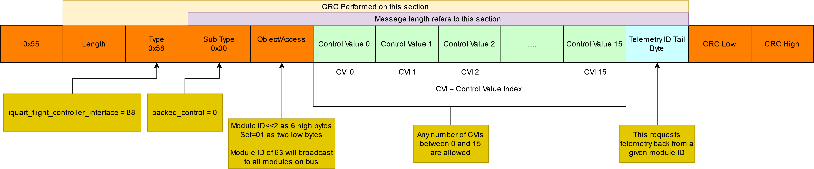
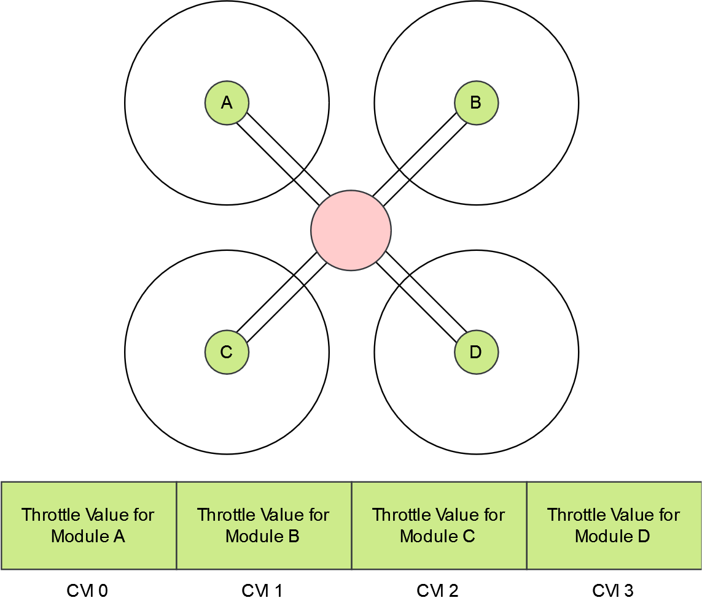
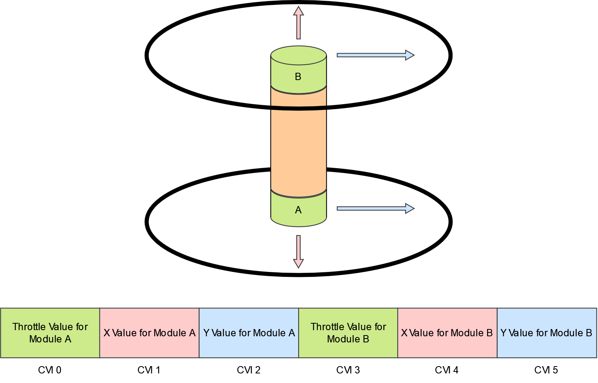

.. include:: ../text_colors.rst
.. toctree::

.. _controlling_ifci:

**********************************
IQUART Flight Controller Interface
**********************************

Vertiq 23-06 modules can be controlled with the IQUART Flight Controller Interface (IFCI) while running pulsing firmware. A specifc IQUART packet has been created to allow for highspeed control of Vertiq modules. A single packet can include all of the control signals for multiple modules connected to the same UART port on a flight controller. Additionally a telemetry packet can be requested from a specific module every time the packet is sent. An example of a full IFCI packet is shown in the diagram below.

    Packed Control Message Description

A general description of IQUART packets can be found in :ref:`uart_messaging`.

Each control value is two bytes and can encode either a throttle value, an X value, or a Y value. These are considered 'raw values' and represent a range of 0.0 to 1.0. The following sections contain more information about how the modules can use these values. A module can read any individual control value in the Packed Control Message through a corresponding Control Value Index (CVI) value. These CVIs are set in the :ref:`IQUART Flight Controller Interface Client<ifci_message_table>`. For example, if throttle_cvi is set to 2 and a packed control message has a control value in index 2 then the module will set its throttle based on the value at that control index. The same is true for x_cvi and y_cvi. The module's responses to control values are defined by settings in the :ref:`ESC Propeller Input Parser<epip_message_table>` and :ref:`Pulsing Rectangular Input Parser<prip_message_table>`.

More information on how throttle control values will be interpreted can be found in :ref:`manual_throttle`.

The X and Y CVIs convert the raw 0.0 to 1.0 values to -1.0 to 1.0. In the :ref:`Pulsing Rectangular Input Parser<prip_message_table>`, the setting 'pulsing_voltage_mode' controls whether this value is considered a percentage of supply voltage or a percentage of the value defined by 'pulsing_voltage_limit'. When set to supply voltage mode -1.0 maps to a pulsing voltage on that axis of negative battery voltage and 1.0 maps to positive battery voltage. When set to voltage limit mode you must also set the 'pulsing_voltage_limit' parameter. This will set the maximum and minimum pulsing voltage. In this mode -1.0 will map to -'pulsing_voltage_limit' and 1.0 will map to 'pulsing_voltage_limit'. Between these values, the raw value is linearly mapped to the voltages in between. For example if the battery voltage is 12V and 'pulsing_voltage_mode' is set to 0 then -1.0 would map to -12V of pulsing, 0.0 would map to 0V, and 1.0 would map to 12V. With the same battery voltage, but 'pulsing_voltage_mode' set to 1, and 'pulsing_voltage_limit' set to 4.0, -1.0 would map to -4V of pulsing, 0.0 would map to 0V and 1.0 would map to 4V of pulsing.

While this can work to control a single module connected to a single UART port on your flight controller, you can also connect multiple modules to a single UART port for control as a bus. An example of the connection is shown below.

.. figure:: ../_static/manual_images/pulsing_propeller/motor_serial_connection.png
    :align: center
    :alt: Bussed Serial Connection

    Bussed Serial Connection

This will allow you to control the modules individually using control values and CVIs without changing the module IDs, but if telemetry is required you will need to set each module's module ID to a different value. This is done in the :ref:`system control client<sc_message_table>` with the 'module_id' parameter. **Each module on the bus should have a unique module ID**.

To request telemetry via the packed control message, the Telemetry ID Tail Byte (TITB) must be set to the module ID of the module whose telemetry is desired. When this is set, the corresponding module will immediately reply with a telemetry packet. To get every modules's telemetry, the flight controller must ask each module for telemetry individually. If you are sending control messages on an aircraft with 4 motors at 400Hz, then you can receive telemetry from an individual module at a maximum of 100Hz. The telemetry data is packed in a standard IQUART message and the data structure is described in :ref:`IFCITelemetryData struct<ifcitelemetrydata_note>`.

Some examples of different aircraft configuration's data packets are shown below:

    Example quadcopter data packet

    Example coaxcopter data packet

.. figure:: ../_static/manual_images/pulsing_propeller/motor_layouts_slide_quad.png
    :align: center
    :scale: 50%
    :alt: Example 6-DOF quadcopter data packet

    Example 6-DOF quadcopter data packet

The control values' order does not matter so long as they match between the flight controller and the module's settings. Additionally, two modules may read the same CVI if they are to respond identically to, or in reverse from one another.