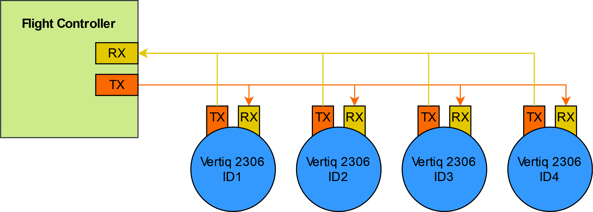

.. include:: ../text_colors.rst
.. toctree::

.. _controlling_ifci:

*********************************************************************
Control of Vertiq Modules with the IQUART Flight Controller Interface
*********************************************************************

Vertiq 2306 modules can be controlled with the IQUART Flight Controller Interface (IFCI) when flashed with the pulsing firmware. A specifc IQUART packet has been created to allow for highspeed control of Vertiq modules. A single packet can include all of the control signals for multiple motors connected to the same UART port on a flight controller. Additionally a telemetry packet can be requested from a specific module every time the packet is sent. A description of the packet is shown in the diagram below.

.. figure:: ../_static/manual_images/pulsing_propeller/Long_Packed_Control_Message.png
    :align: center
    :alt: Packed Control Message Description

    Packed Control Message Description

A general description of IQUART packets can be found in :ref:`manual_iquart`.

Each control value is two bytes and can encode either a throttle value, an X value, or a Y value. These values are considered 'Raw' and represent a range of 0.0 to 1.0. The modules can be set to respond to any of the control values by setting the Control Value Index (CVI) in the :ref:`IQUART Flight Controller Interface Client<ifci_message_table>`. Setting 'throttle_cvi' to a number will make it respond to the corresponding control value. For example if throttle_cvi is set to 2 and a packed control message has a control value in index 2 then the module will set its throttle based on the value at that control index. The same is true for x_cvi and y_cvi. The way that the module will respond to the control value for throttle and x/y controls are defined by settings in the :ref:`ESC Propeller Input Parser<epip_message_table>` and :ref:`Pulsing Rectangular Input Parser<prip_message_table>` respectively.

More information on setting up throttle response can be found in :ref:`manual_throttle`.

The X and Y CVI convert the raw 0.0 to 1.0 values to -1.0 to 1.0. The setting 'pulsing_voltage_mode' controls whether this value is considered a percentage of supply voltage or a percentage of some maximum voltage. When set to supply voltage mode -1.0 maps to a pulsing voltage on that axis of negative battery voltage and 1.0 maps to positive battery voltage. When set to voltage limit mode you must also set the 'pulsing_voltage_limit' parameter. This will set the maximum and minimum pulsing voltage. In this mode -1.0 will map to -'pulsing_voltage_limit' and 1.0 will map to 'pulsing_voltage_limit'. Between these values the raw value is linearly mapped to the voltages inbetween.

While this can work with to control a single motor module connected to a single UART port on your flight controller, you can also connect multiple motors to a single UART port for control as a bus. An example of the connection is shown below.

    Bussed Serial Connection

This will work without changing the module IDs, but if telemetry is required you will need to set each module's module ID to a different value. This is done in the :ref:`system control client<sc_message_table>` with the 'module_id' parameter. Each motor in your bus should have different module IDs.

To request telemetry with the packed control message the Telemetry ID Tail Byte (TITB) must be set to the module ID that you'd like to request telemetry from. When this is set, the corresponding motor will immediately reply with a telemetry packet. To get every motor's telemetry, the flight controller must ask each motor for telemetry individually. If you are sending control messages on an aircraft with 4 motors at 400hz then you will only receive telemetry at 100hz per motor. The telemetry data is packed in a standard IQUART message and the data structure is described in :ref:`IFCITelemetryData struct<ifcitelemetrydata_note>`.

Some examples of different aircraft configuration's data packets are shown below:

.. figure:: ../_static/manual_images/pulsing_propeller/motor_layouts_quad.png
    :align: center
    :scale: 50%
    :alt: Example quadcopter data packet

    Example quadcopter data packet

.. figure:: ../_static/manual_images/pulsing_propeller/motor_layouts_coaxcopter.png
    :align: center
    :scale: 50%
    :alt: Example coaxcopter data packet

    Example coaxcopter data packet

.. figure:: ../_static/manual_images/pulsing_propeller/motor_layouts_slide_quad.png
    :align: center
    :scale: 50%
    :alt: Example 6-DOF quadcopter data packet

    Example 6-DOF quadcopter data packet

The order of the control values doesn't matter all that much as long as they match between the flight controller and the settings on the motor. Additionally you could have two motors read the same CVI if they should respond the same as or in reverse of each other.