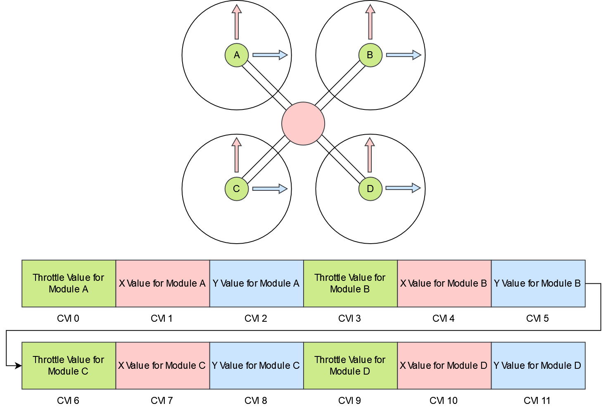

.. include:: ../text_colors.rst
.. toctree::

.. _controlling_ifci:

**********************************
IQUART Flight Controller Interface
**********************************

About IFCI and Control Values
=================================

Vertiq modules may be controlled through the IQUART Flight Controller Interface (IFCI) when running applicable firmware. Please refer to your module's family page to see if 
IFCI is supported. The IQUART Flight Controller Interface leverages Vertiq's :ref:`IQUART serial protocol <uart_messaging>` in order to send high speed controls to your modules. 
These controls are packed into a single message allowing one IFCI packet to send controls to multiple modules connected to the same serial line. 
The basic structure of an IFCI packet is illustrated below:

    Packed Control Message Description

Please note that an IFCI packet does not necessarily need to populate all 16 control values.

Highlighted in orange are the bytes that are necessary in order to send valid IQUART messages, and are not specific to IFCI control.

Highlighted in green are Control Values. A control value is an unsigned 16 bit value that defines a throttle, an X, or a Y command. X and Y commands are only applicable when 
using Vertiq's :ref:`pulsing firmware <pulsing_module_start_guide>`. Any type of command can occupy any control value, and the location it occupies in an IFCI packet is called its Control 
Value Index (CVI). For example, suppose you want to control a generic quadcopter. You may place the throttle commands for motor 1 in CVI 0, commands for motor 
2 in CVI 1, and so on. Since the control values' order is fully configurable, however, it would be equally valid to place motor 4's throttle command in CVI 0.

Having the ability to place any control value in any index also means that you must configure your Vertiq module to know which control value indices to read for its 
specific commands. For example, suppose your flight controller is configured to transmit 10 control values. The throttle command for the module being 
configured is the 5th command (CVI 4) in the IFCI packet. In order to have the module listen to that command, you simply set its `Throttle CVI` to 4. 
The same principle applies to X and Y commands as well.

.. note::
    If the CVI for any of the control values needed by a module is set to 255, then the module will not attempt to extract the control value from any index in the IFCI packet.

All module Control Value Index values can be found in the :ref:`iquart_flight_controller_interface`. You can also find the CVIs in the :ref:`Control Center's <control_center_start_guide>` general tab:

Mapping Received Control Values to Motor Control Outputs
=============================================================
As mentioned above, all IFCI control values are represented by unsigned 16 bit numbers representing an integer range from [0, 65535]. How these values are mapped 
into commands applied by your module is dependent on the control value type (throttle, X, or Y) as well as other module configurations.

Mapping Throttle Control Values to Applied Spin Throttle
-----------------------------------------------------------
Before continuing, please familiarize yourself with the basics of your module's Modes, Maximums, and Direction found :ref:`here <throttle_mode_maximums_directions>`. 

Throttle control values are subject to the same behaviors governing both Hobby and general IQUART throttle inputs. In fact, throttle control values are processed by the same 
pipeline as the :ref:`IQUART raw value <throttle_iquart_ref>`.

In order to calculate the raw value that your module will apply, simply divide the received throttle control value by 65535. That value is then mapped to applied throttle based on your modes and directions.

Suppose your module is configured to spin :ref:`2D counterclockwise with 2D FC Mode <throttle_2d_2d_mapping>`, and is set to velocity mode with a maximum of 1000 rad/s. 
Now, your module receives an IFCI packet that has data in your module's Throttle Control Value Index with the value 26000. The equivalent IQUART raw command is 
:math:`\frac{26000}{65535} = 0.397`. In this case, the applied throttle percentage is calculated simply by :math:`0.397 * 100 = 39.7\%`. Since we are in velocity mode with a maximum velocity 
of 1000 rad/s, your module is set to spin at :math:`0.397 * 1000 = 397 rad/s` in the counterclockwise direction.

Now, you change your module's sign to 3D clockwise with the same flight controller direction. We once again receive a throttle control value of 26000. Our raw command 
remains :math:`\frac{26000}{65535} = 0.397`. Since our module's sign has changed, and it can now spin both clockwise and counterclockwise, the applied velocity command is calculated differently. 
Using :ref:`throttle_2d_3d_mapping`, you can find that the applied throttle percentage is now :math:`((0.397 * 2) - 1) * 100\% = -20.6\%` . In this case, the negative sign 
indicates that the module will spin :math:`(0.206 * 1000) = 206 rad/s` in the *counterclockwise direction*.

Mapping X and Y Control Values to Applied Pulsing Values
--------------------------------------------------------------
Like throttle, in order to calculate the raw value that your module will apply to either the X or Y pulsing command, simply divide the received control value by 65535. 
The raw value is then mapped to the range [-1, 1].

Suppose your module receives an X control value of 42000. The equivalent raw value is :math:`\frac{42000}{65535} = 0.641`. In order to map that value onto [-1, 1], simply multiply it by 
two and subtract one. In this case :math:`(0.641 * 2) - 1 = +0.284`.

Your module also receives a Y control value of 1000. The raw value is :math:`\frac{1000}{65535} = 0.015`, and the Y control percentage is :math:`(0.015*2) - 1 = -0.97`.

In the :ref:`Pulsing Rectangular Input Parser <pulsing_rectangular_input_parser>`, the setting ``pulsing_voltage_mode`` controls whether this value is considered a percentage of supply voltage or a percentage of the 
value defined by ``pulsing_voltage_limit``. When set to supply voltage mode -1.0 maps to a pulsing voltage on that axis of negative battery voltage and 1.0 maps to positive 
battery voltage. When set to voltage limit mode you must also set the ``pulsing_voltage_limit`` parameter. This will set the maximum and minimum pulsing voltage. 
In this mode -1.0 will map to ``-pulsing_voltage_limit`` and 1.0 will map to ``pulsing_voltage_limit``. Between these values, the raw value is linearly mapped to the voltages in 
between. For example if the battery voltage is 12V and ``pulsing_voltage_mode`` is set to 0 then -1.0 would map to -12V of pulsing, 0.0 would map to 0V, and 1.0 would map to 12V. 
With the same battery voltage, but ``pulsing_voltage_mode`` set to 1, and ``pulsing_voltage_limit`` set to 4.0, -1.0 would map to -4V of pulsing, 0.0 would map to 0V and 1.0 would map 
to 4V of pulsing.

Connecting Modules for IFCI
=================================
While IFCI can work to control a single module connected to a single UART port on your flight controller, you can also connect multiple modules to a single UART port for control as a bus. An example of the connection is shown below.

.. figure:: ../_static/manual_images/pulsing_propeller/motor_serial_connection.png
    :align: center
    :alt: Bussed Serial Connection

    Bussed Serial Connection

This will allow you to control the modules individually using control values and CVIs without changing the module IDs, but if telemetry is required you will need to set each module's module ID to a different value. This is done in the :ref:`system control client<sc_message_table>` with the 'module_id' parameter. **Each module on the bus should have a unique module ID**.

To request telemetry via the packed control message, the Telemetry ID Tail Byte (TITB) must be set to the module ID of the module whose telemetry is desired. When this is set, the corresponding module will immediately reply with a telemetry packet. To get every modules's telemetry, the flight controller must ask each module for telemetry individually. If you are sending control messages on an aircraft with 4 motors at 400Hz, then you can receive telemetry from an individual module at a maximum of 100Hz. The telemetry data is packed in a standard IQUART message and the data structure is described in :ref:`IFCITelemetryData struct<ifcitelemetrydata_note>`.

Some examples of different aircraft configuration's data packets are shown below:

    Example quadcopter data packet

    Example coaxcopter data packet

    Example 6-DOF quadcopter data packet

The control values' order does not matter so long as they match between the flight controller and the module's settings. Additionally, two modules may read the same CVI if they are to respond identically to, or in reverse from one another.