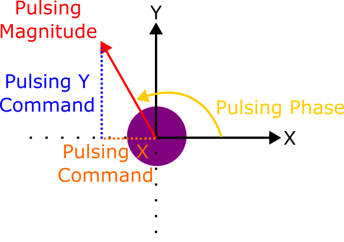
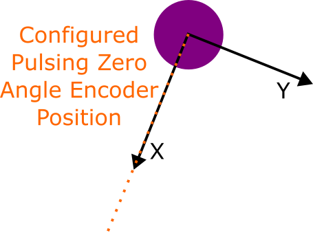
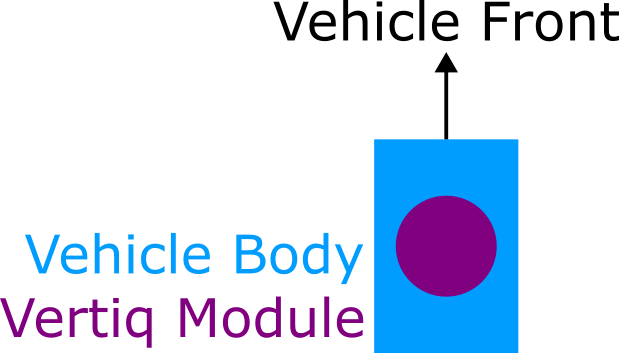
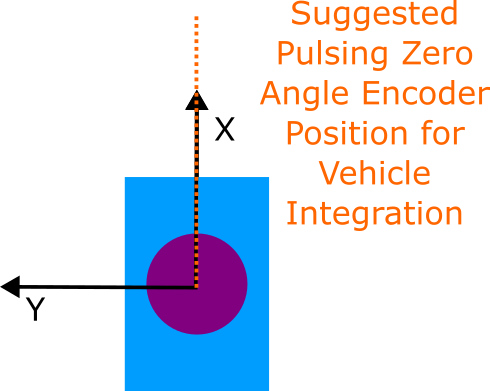
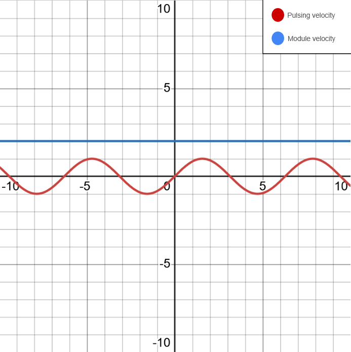
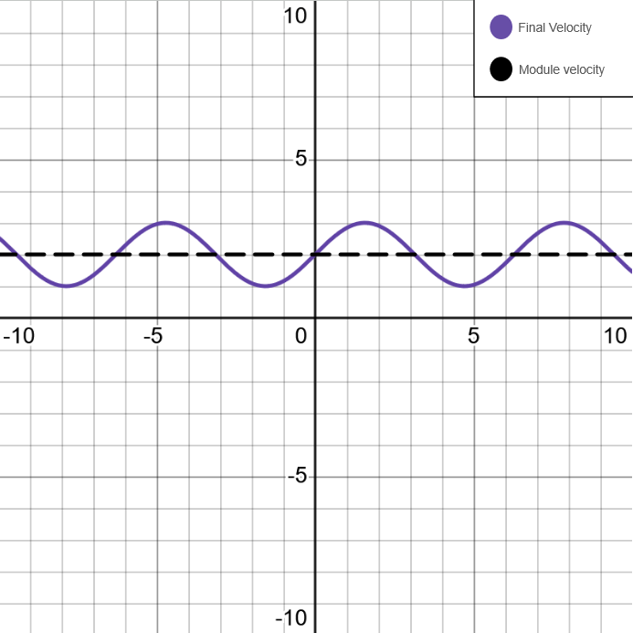
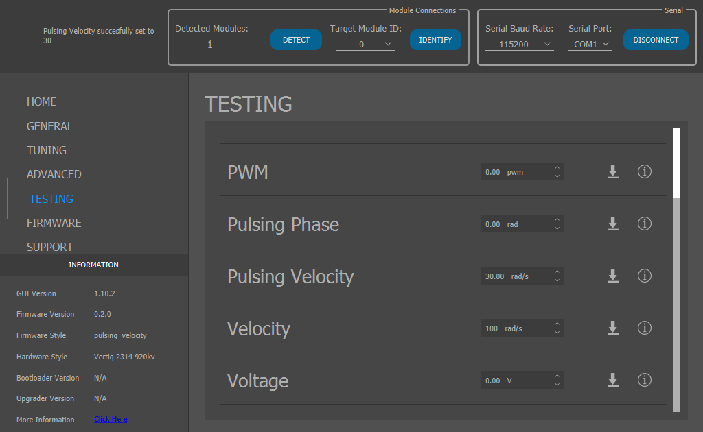

.. include:: ../text_colors.rst
.. toctree::

.. _manual_pulsing:

***********************************************
Pulsing Based Control Mechanisms
***********************************************

Vertiq offers pulsing firmware available for the :ref:`23-XX family <vertiq_23xx_family>` which can be used with the following propellers: UPT-23-10, `UPF-23-12 <https://www.vertiq.co/upf-23-12>`_

There are two styles of Vertiq’s pulsing control firmware:

#. Velocity based (all pulsing firmware versions 0.1.0 and later)
#. Voltage based (all pulsing firmware 0.0.27 and earlier)

We highly recommend using velocity based pulsing firmware. You can find all pulsing firmware on the Vertiq website on your module's `product page <https://www.vertiq.co>`_ under firmware.

What is Pulsing?
================

A regular module can be controlled by commanding a velocity or voltage for the module to spin it. With Vertiq's pulsing firmware, a module can spin at a baseline velocity or voltage
with increases and decreases in the velocity or voltage. The pulsing is applied as a sinusoidal wave with an amplitude and frequency that affects the velocity and voltage applied to
the motor. As the pulsing velocity or voltage increases above the baseline, the module will spin faster and as the pulsing velocity or voltage decreases below the baseline, the module
will spin slower. A change in amplitude will change the strength of the pulse while a change in frequency will change how often the module pulses. Both of these factors can be adjusted
to work best for a specific use case with the Vertiq teetering and flapping propellers.

The pulsing magnitude and pulsing phase angle also exist in an X and Y coordinate system. By adjusting the value of X and Y in the coordinate system, the propeller will change its angle appropriately.
It is also possible to change the pulsing magnitude and pulsing phase to alter the position and strength of the pulse. This is illustrated below to explain the vectors that define pulsing.

    Vectors that define pulsing

When using a propeller the zero angle is the positive direction of the X coordinate system. 

    Altered pulsing zero angle

The zero angle works to ensure that the X axis is along the front of your vehicle as seen in the figure below. 

    Pulsing with vehicle shape

To accomplish this, we can change the zero angle such that X is calibrated to face the front of your vehicle allowing for a postive X value to tilt a propeller toward the front of your 
vehicle. 

    Pulsing with vehicle zero angle

|

.. note::

    To take advantage of the pulsing firmware, you must use a tilting or teering Vertiq propeller.

Velocity Based Pulsing
======================

For more of a background on velocity control, please refer to :ref:`Velocity and Voltage Based Control Mechanisms <manual_velocity_control_mechanisms>`.

Velocity based pulsing works by commanding the module to a baseline velocity and then adding a sine wave of a specified pulsing velocity that increases and decreases the velocity at a moment in time which tilts the propeller.

    The module and pulsing velocities

    The resulting actuation caused by the sum of the target velocity and pulsing sine wave

.. note:: 
    
    When using velocity based pulsing, only velocities can be used to command a pulse. If the mode is set to voltage by throttle commands or ctrl_voltage, the module will not pulse no matter what commands are sent.

Voltage Based Pulsing
=====================

For more of a background on voltage control, please refer to :ref:`Velocity and Voltage Based Control Mechanisms <manual_velocity_control_mechanisms>`.

Voltage based pulsing works by commanding the module to a baseline voltage and then adding a sine wave of a specified pulsing voltage that increases and decreases the voltage at a moment in time which tilts the propeller.

.. note:: When using voltage based pulsing, only voltage can be used to command a pulse.

Velocity Pulsing Demo
=====================

.. warning::
        Please remove all propellers from any module you plan on testing. Failure to do so can result in harm to you or others around you. Further, please ensure that your module is secured to a stationary platform or surface before attempting to spin it. 

For this example, we are using 23-06 pulsing firmware v0.2.0 which can be found on the `23-06 product page <https://www.vertiq.co/23-06-g1>`_. To observe the difference with the module spinning with velocity based pulsing, connect your module without a propeller to Control Center. Go to the Testing tab and set Velocity to 100 rad/s. Then in the same tab, set Pulsing Velocity to 30 rad/s. This can be seen in the screenshot below. When the pulsing velocity is 0, you will hear the module spinning normally. When the pulsing velocity increases or decreses from 0, you will hear a stuttering or pulsing of the module.

    Control Center pulsing example

You should now hear a difference in the module as it adjusts its velocity to pulse. To compare, you can set Pulsing Velocity to 0 to spin the module normally. This can also be seen in the video below.

.. raw:: html

    
    <video class='center_vid' controls><source src="../_static/manual_images/pulsing/control_center_pulse_example.mp4" type="video/mp4"></video>

Next steps
==========

To continue setting up a pulsing module follow the next steps:

* :ref:`Setting Up PX4 and ArduPilot Firmware with IFCI Intregration <ifci_px4_flight_controller>`
* :ref:`IFCI Integration with PX4 and ArduPilot <ifci_integration>`
