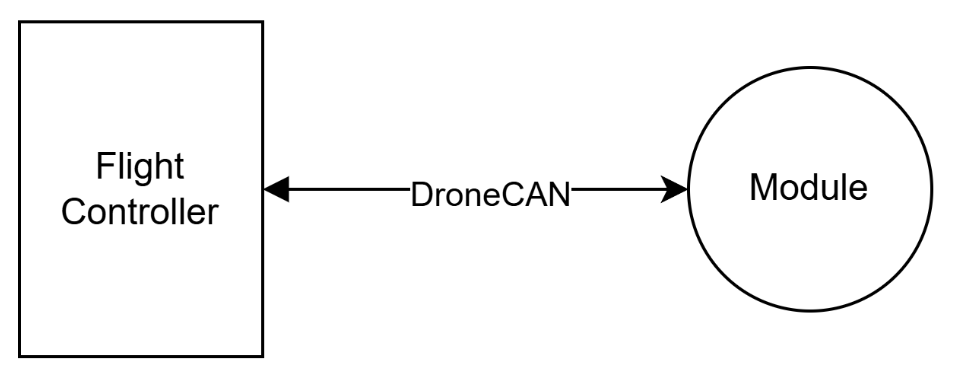
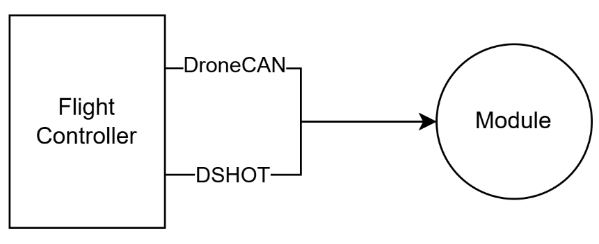
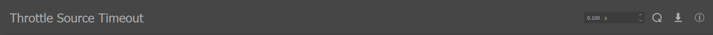
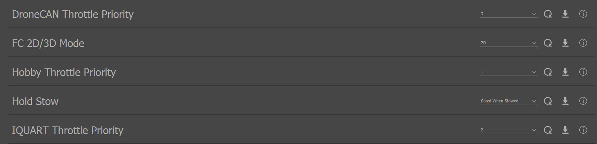
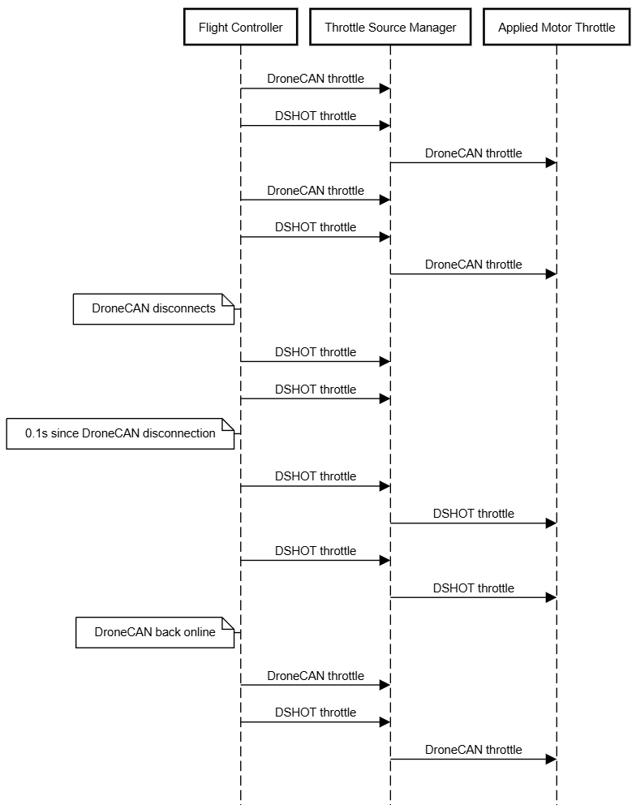
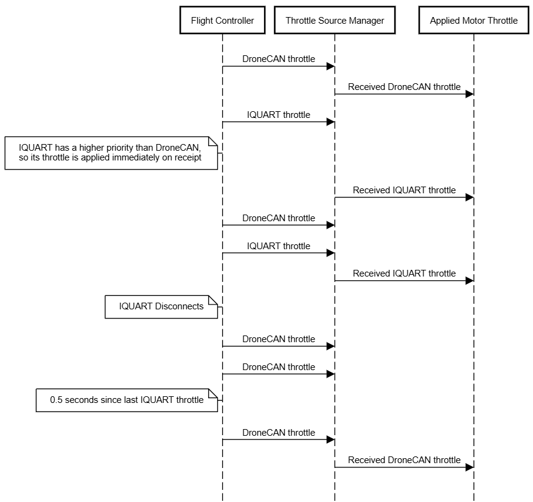
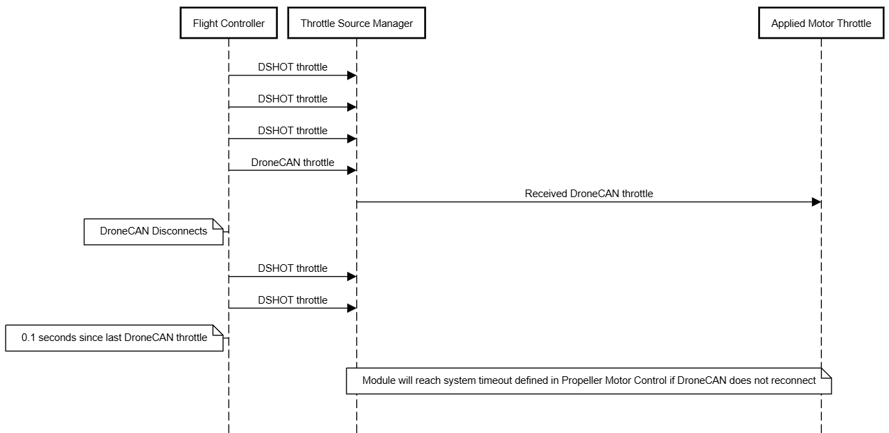

.. _redundant_throttle_manual:

##############################
Redundant Throttle Support
##############################

***************************
About Redundant Throttle
***************************

Vertiq's redundant throttle support is a safety feature that allows your module to accept multiple :ref:`throttle sources' <throttle_sources>` commands simultaneously, and to switch between them should 
the primary source fail. For example, suppose you would like to control your module using the :ref:`DroneCAN protocol <dronecan_protocol>`. To do so, you connect your module's 
CAN connections with your flight controller's, and connect no other throttle sources. 

Now, in flight, your CAN connection comes loose, and the module and flight controller lose DroneCAN communication. In this case, your vehicle will lose control as your module no longer 
reacts to new throttle commands, and the module will eventually :ref:`manual_timeout`.

Now, suppose that you connect DroneCAN as before, but now, also connect your module to a DSHOT output on your flight controller.

Under normal operating conditions, the module will apply only throttle commands received via DroneCAN (as determined by your redundant throttle configuration discussed :ref:`below <redundant_throttle_config>`). 
If we once again sever the DroneCAN connection, however, the module will seamlessly transition to accepting DSHOT commands. By connecting multiple throttle sources, and 
leveraging Vertiq's redundant throttle feature, you make your vehicle more robust against communication failures in flight.

.. _redundant_throttle_config:

***************************************
Redundant Throttle Configurations
***************************************

There are two types of configurations available to redundant throttle. The first defines the amount of time that the module waits before switching to another throttle 
source if the active source (the source whose throttles are being applied to module control) goes offline. The second set of parameters defines the priorities of each supported throttle source. You can find the specific parameters 
at :ref:`throttle_source_manager`. You can access these parameters either using a :ref:`Vertiq API <getting_started_with_apis>` or through the :ref:`IQ Control Center <control_center_start_guide>`. 

The time that a module waits (throttle source timeout) can be configured through the Control Center's tuning tab:

Each protocol priority can be adjusted through the Control Center's general tab:

Vertiq's supported throttle sources are :ref:`DroneCAN <dronecan_protocol>`, :ref:`IQUART <uart_messaging>`, and :ref:`hobby protocols <hobby_protocol>`. Please note that only priority values corresponding to protocols supported by 
your module have any effect. See your module's family page to see what throttle sources are supported.

Priorities can be valued from 0 to 3. Setting a priority of 0 indicates that the module will ignore all throttle messages received from the configured source. 
Priority values [1, 3] define the priority of each protocol against the others where 3 defines the highest priority.

.. note:: 
    Due to Vertiq modules' hardware, it is not currently possible to use both IQUART and hobby protocols simultaneously. As such, it is only possible to use DroneCAN with one of IQUART 
    or hobby as redundant throttle sources.

Configuration Example 1
##########################

Suppose your module supports DroneCAN, IQUART, and hobby inputs. 

You configure the following:

- DroneCAN's priority to 3 and hobby's to 2 (the module will automatically set IQUART's to 1 ensuring that there are no two matching priorities)
- Flight controller outputting both :ref:`DSHOT <hobby_dshot>` as well as DroneCAN commands
- Throttle source timeout configured to 0.1 seconds
- Propeller motor controller's :ref:`timeout <manual_timeout>` to 1 second

The sequence diagram below illustrates how your module reacts to received throttle commands as well as how it deals with switching between sources should the primary source go offline.

Note that when two throttles are received at the same time, one through DroneCAN and one through DSHOT, the DroneCAN throttle is always applied to spin the module. This is because DroneCAN's 
priority (3) is higher than hobby's (2). Only when DroneCAN has gone offline for the throttle source timeout (0.1s) are DSHOT throttles applied. Now, the flight controller is 
once again able to successfully transmit DroneCAN throttles, and the received DroneCAN throttles are immediately applied to module spinning.

Configuration Example 2
##########################

Suppose your module supports DroneCAN, IQUART, and hobby inputs. 

You configure the following:

- IQUART's priority to 3 and DroneCAN's to 1 (the module will automatically set hobby's to 2 ensuring that there are no two matching priorities)
- Flight controller outputting both :ref:`IQUART Flight Controller Interface commands <controlling_ifci>` as well as DroneCAN commands
- Throttle source timeout configured to 0.5 seconds
- Propeller motor controller's :ref:`timeout <manual_timeout>` to 1 second

The sequence diagram below illustrates how your module reacts to received throttle commands as well as how it deals with switching between sources.

Note that the first DroneCAN throttle is applied to the motor since no IQUART messages had been received before. Then, when both an IQUART and DroneCAN message are received, 
the IQUART throttle is applied. Last, DroneCAN throttles are only applied again once the throttle timeout is reached after IQUART disconnects. If for any reason, the module begins receiving 
IQUART throttles again at this point, the module will immediately start accepting those as IQUART has a higher priority.

Configuration Example 3
##########################

Suppose your module supports DroneCAN, IQUART, and hobby inputs. 

You configure the following:

- DroneCAN's priority to 3, IQUART to 0, hobby to 0
- Flight controller outputting both :ref:`hobby_dshot` as well as DroneCAN commands
- Throttle source timeout configured to 0.1 seconds
- Propeller motor controller's :ref:`timeout <manual_timeout>` to 1 second

In this example, the module is configured to ignore all hobby and IQUART throttle messages. So, all received DSHOT throttles are dropped, and throttles are only applied once DroneCAN 
throttles are received. An important note from this example is that the module will reach its :ref:`propeller motor control timeout <manual_timeout>` even if the 
flight controller continues to send DSHOT throttles. As they are not processed by the throttle source manager, DSHOT throttles cannot be used to reset the timeout timer.

.. _redundant_arming_interactions:

********************************
Redundant Throttle and Arming
********************************

All throttle commands received by the throttle source manager are sent to your module's :ref:`arming handler <manual_advanced_arming>`, and are subject to all constraints defined by the arming handler. 
For example, suppose you have configured IQUART to be the highest priority source, and are sending IQUART throttle commands via the :ref:`Vertiq Testing Tool (VTT) <vertiq_testing__guide>`. At the same 
time, you are transmitting DroneCAN throttles with the `DroneCAN GUI tool <https://dronecan.github.io/GUI_Tool/Overview/>`_. In this example, your arming handler is set to arm on throttles in the range 0-7.5% on 10 
consecutive throttles.

VTT outputs IQUART throttles at 10%, and the DroneCAN GUI transmits 3% throttles. In this case, your module will not arm. Since IQUART has a higher priority, its throttles take 
precedence over DroneCAN, so the arming handler will only receive the 10% throttles. If you pause the VTT output, however, your module will arm as the throttle source manager will 
have transitioned to accepting the DroneCAN commands within the arming region. Now that the module is armed, it will remain armed even if the throttle source switches. If you unpause 
the VTT output, your module will start spinning at 10% throttle because it is armed and receiving 10% throttle commands over IQUART (which have a higher priority than the 
DroneCAN throttle commands).

The example is demonstrated below:

.. raw:: html

    
    <video class='center_vid' controls><source src="../_static/manual_images/redundant_throttle/redundant_arming_example.mp4" type="video/mp4"></video>

DroneCAN and PWM Arming interaction
#######################################

If you are using DroneCAN and standard PWM together as redundant throttle sources, make sure that PWM is being transmitted to your module from first startup. Parsing of the very first 
received PWM signal can affect the arming process on current firmware. If you are not using PWM at all, we highly recommend that you set your ``Communication`` parameter to 
either ``Hobby Disabled`` or your specific throttle protocol (DSHOT, OneShot, etc.). This can be done through  :ref:`IQ Control Center's <control_center_start_guide>` general tab.

  .. image:: ../_static/control_center_pics/servo_getting_started/servo_comms_param.png

DroneCAN and DSHOT Arming interaction
#######################################

When disarmed, flight controllers transmit explicit disarm commands via DSHOT. Vertiq modules accept these commands, and transition to disarmed. As such, if using DSHOT and DroneCAN as 
redundant throttle sources, your module can end up in an arming-disarming loop if arming on throttle. Suppose your arming region is 0-12.5% (your module's default), then when the flight controller 
is disarmed, DSHOT will transmit the disarm command and DroneCAN a 0% throttle command. When arming on throttle, DroneCAN will arm the module after receiving the correct number of 
throttles. Arming is immediately overwritten by the explicit DSHOT disarm which is again overwritten by receiving the correct number of DroneCAN throttles. To avoid this behavior, 
we highly recommend disabling Arm on Throttle as described in :ref:`arm_with_armingstatus`.

DroneCAN and IFCI Arming interaction
#######################################

When disarmed, PX4 flight controllers :ref:`may transmit explicit disarm commands via IQUART depending on your configuration <ifci_px4_flight_controller>`. Vertiq modules accept these commands, and transition to disarmed. As such, if using IFCI and DroneCAN as 
redundant throttle sources, your module can end up in an arming-disarming loop if arming on throttle. Suppose your arming region is 0-12.5% (your module's default), then when the flight controller 
is disarmed, IQUART will transmit the disarm command and DroneCAN a 0% throttle command. When arming on throttle, DroneCAN will arm the module after receiving the correct number of 
throttles. Arming is immediately overwritten by the explicit IQUART disarm which is again overwritten by receiving the correct number of DroneCAN throttles. To avoid this behavior, 
we highly recommend disabling Arm on Throttle as described in :ref:`arm_with_armingstatus`.
