.. include:: ../text_colors.rst
.. toctree::

.. _manual_safety:

*****************
Safety Systems
*****************
The following manual is meant to outline the safety systems present on Vertiq modules. Safety systems are built into your module's firmware, 
and seek to protect your module from things like velocity runaway, power issues, and overheating.

Protecting Against Voltage Regeneration Spikes
====================================================
Voltage regeneration is one of the most often cited reasons for module failure, and as such we have advanced systems to protect against extreme voltage spikes. 
You can read more about voltage regeneration protection against it in :ref:`protect_against_regen`.

Protection with Derates
===========================
Basically, a derate is a scaling factor that adjusts a control parameter into a safer area of operation. All derate values on Vertiq's modules are represented as float 
values from [0,1].

Suppose that your commanded drive voltage <link to the velo/volt based control guy> is 2V, and the current derate is 0.4. 
The actual drive voltage applied will be (2V * 0.4) = 0.8V. A basic illustration of derate application is shown below

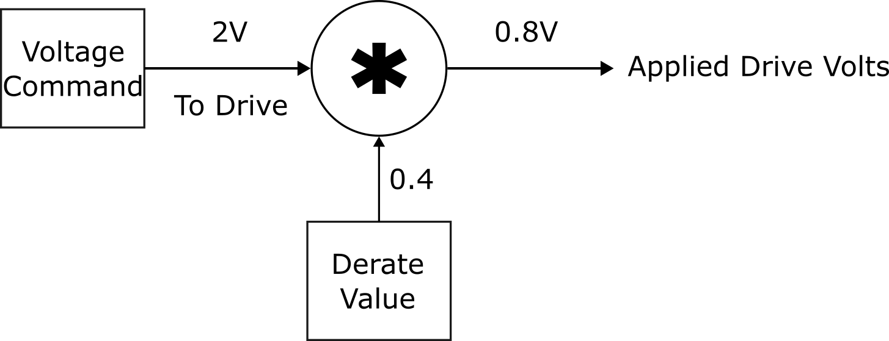

There are three separate derate values that are internally updated, each linked with a different module function. There is a speed derate used to avoid runaway, 
a microcontroller temperature based derate to avoid microcontroller overheating, and a coil temperature derate to avoid coil overheating. 
These three derate values are combined and applied to the target command voltage in order to protect your module. Details of each of these derate values as well as 
how they are combined are discussed later.

Speed Based Derate
---------------------
As mentioned above, your module's speed derate is meant to protect your module against speed runaway. Speed derate is calculated using the module's current speed, 
brushless drive's ``motor_redline_start`` parameter, and brushless drive's ``motor_redline_end`` parameter. You can find the redline parameters listed in the 
:ref:`Brushless Drive Message Table <brushless_drive>`.

The total speed derate is calculated by :math:`\text{Speed Derate} = \frac{\text{motor_redline_end - speed}}{\text{motor_redline_end - motor_redline_start}}` where the solution is saturated to [0,1].

This means that for any speed below the range [redline_start, redline_end], there is no derate applied. For any speed above the range [redline_start, redline_end], 
the speed derate is 0. Any speed in that range is subject to a variable derate [0, 1].

Suppose you set your redline start to 1750 rad/s and your redline end to 2000 rad/s. This means that there will be no derate limiting applied under 1750 rad/s, 
your module will stop spinning at and above 2000 rad/s, and will be derate limited in between.

A graph illustrating the speed derate calculation is provided below:

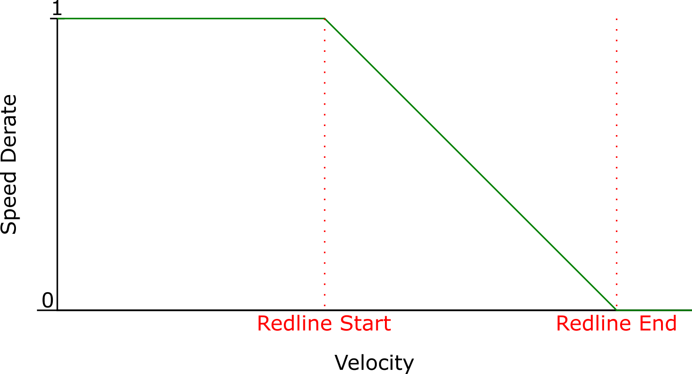

Microcontroller Temperature Based Derate
--------------------------------------------
As mentioned above, your module's microcontroller temperature derate is meant to protect your module's microcontroller from overheating. 
Microcontroller temperature derate is calculated using the module's current microcontroller temperature, Temperature Monitor Microcontroller's ``otw`` parameter 
(over temperature warning), and Temperature Monitor Microcontroller's ``otlo`` parameter (over temperature lock out). You can find the over temperature parameters 
listed in the :ref:`Temperature Monitor Microcontroller Message Table <temperature_monitor_microcontroller>`.

The total microcontroller temperature derate is calculated by :math:`\text{Microcontroller Temperature Derate} = \frac{\text{otlo - micro_temp}}{\text{otlo - otw}}` where the solution is saturated to [0,1].

This means that for any temperature below the range [otw, otlo], there is no derate applied. For any temperature above the range [otw, otlo], 
the microcontroller temperature derate is 0. Any microcontroller temperature in that range is subject to a variable derate [0, 1].

Suppose you set your otw to 100°C and your otlo to 110°C. This means that there will be no derate limiting applied under 100°C, your module will stop spinning at and above 110°C, and will be derate limited in between.

A graph illustrating the microcontroller temperature derate calculation is provided below:

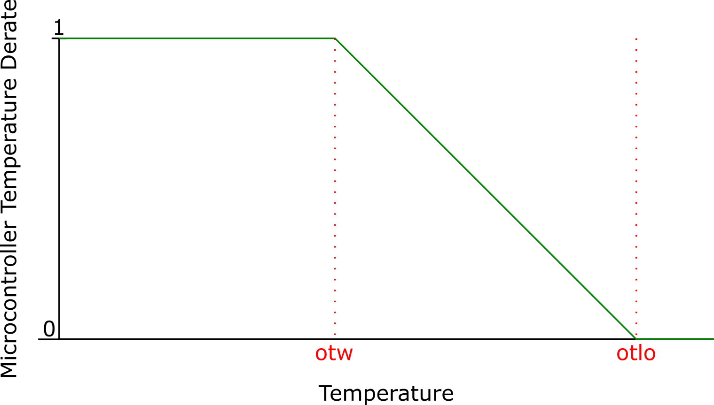

Coil Temperature Based Derate
---------------------------------
As mentioned above, your module's coil temperature derate is meant to protect your module's coils from overheating. Coil temperature derate is calculated using the 
module's current estimated coil temperature, Coil Temperature Estimator's ``otw`` parameter (over temperature warning), and Coil Temperature Estimator's ``otlo`` 
parameter (over temperature lock out). You can find the over temperature parameters listed in the :ref:`Coil Temperature Estimator Message Table <coil_temperature_estimator>`.

The total coil temperature derate is calculated by :math:`\text{Coil Temperature Derate} = \frac{\text{otlo - coil_temp}}{\text{otlo - otw}}` where the solution is saturated to [0,1].

This means that for any temperature below the range [otw, otlo], there is no derate applied. For any temperature above the range [otw, otlo], the microcontroller 
temperature derate is 0. Any microcontroller temperature in that range is subject to a variable derate [0, 1].

Suppose you set your otw to 140°C and your otlo to 150°C. This means that there will be no derate limiting applied under 140°C, your module will stop spinning at and above 150°C, and will be derate limited in between.

A graph illustrating the microcontroller temperature derate calculation is provided below:

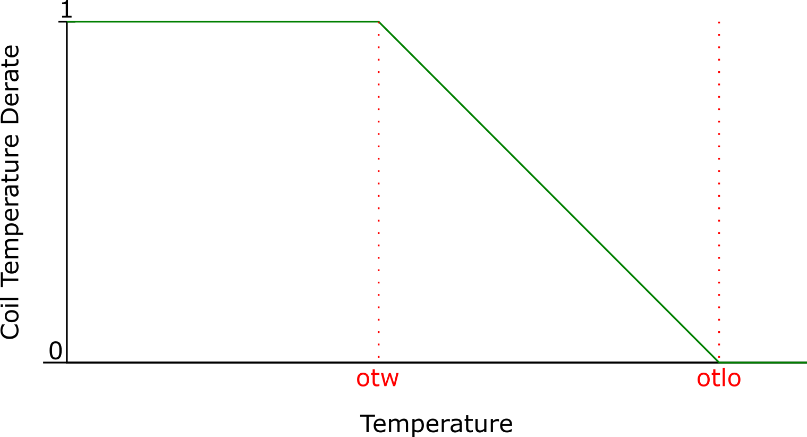

Calculation of the Total Derate
-----------------------------------
The total applied derate applied is the direct multiplication of the speed, microcontroller, and coil derate values. So, the our drive voltage system becomes:

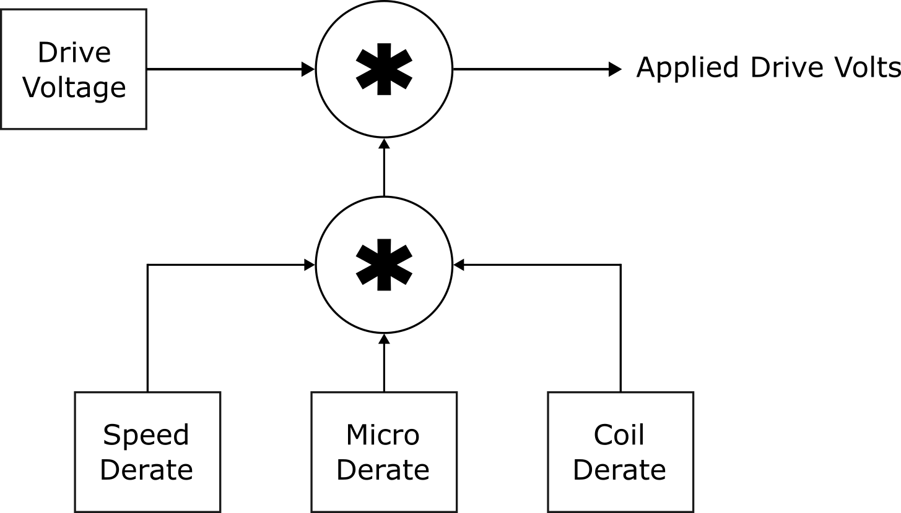

Power Safety
=================

Safety Parameters Handled by the Power Safety Client
-------------------------------------------------------------
The power safety client manages measurements regarding input power (voltage and current), internal reference power, motor current, microcontroller temperature, and coil temperature.

The full listing of power safety parameters can be found in the :ref:`Power Safety Client table <power_safety>`. Each safety has a low end limit as well as a high end limit. 
If the measured parameter drops below the low end or goes above the high end, a fault flag is raised, and can be viewed in the ``fault_now`` parameter. 
The ``fault_now`` parameter is only set by hardware. All faults that have occurred since the module's start up can be viewed in the ``fault_ever`` parameter. 
The value of ``fault_ever`` is generally set by the hardware and cleared by the user.

The module's behavior when faults are detected is determined by the ``fault_latching`` parameter. If ``fault_latching`` is set to 1, then any high flags 
in ``fault_ever`` place the module into safe mode. The module remains in safe mode until the user clears ``fault_ever``. When ``fault_latching`` is set to 0, 
the module remains in safe mode until all power safety parameters are back in their safe operating range, and ``fault_now`` returns to 0.

Internal Programmable Voltage Detector (PVD)
------------------------------------------------
Each module's microcontroller has an internal PVD that monitors the microcontroller's Vdd voltage level. In the event that Vdd drops below the pre-programmed threshold 
value (~2.8V), the module is forced to stop spinning. The module will only be allowed to resume normal operation when Vdd has risen back above the voltage threshold (~2.9V).

.. _slew_rate:

Slew Rate
===========
Your module's slew rate defines the maximum change in control voltage per second. Slew rate works as a form of software filter that ensures that your module does not 
attempt to change speeds faster than is safe.

There are two parameters in the :ref:`Brushless Drive client <brushless_drive>` that affect your module's slew rate limiting:

* ``slew_volts_per_second`` defines the actual slew rate in volts per second applied to voltage commands. This defines the strength of the filter's impact.
* ``slew_enable`` determines whether or not ``slew_volts_per_second`` is actually applied to voltage commands. If ``slew_enable`` is false, then there will not be slew limiting applied.

The following examples are meant to illustrate the effect that slew limiting has on module control. All examples start with the module in coast followed by a voltage step command to 2V.

1. Slew limiting disabled

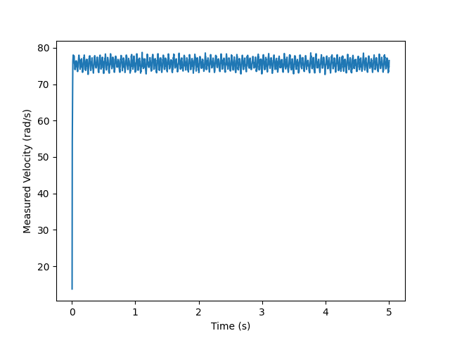

2. Slew limit enabled at 10V/s

.. image:: ../_static/manual_images/safety/slew_rate_10vps.png
    :scale: 80%

3. Slew limit enabled at 5V/s

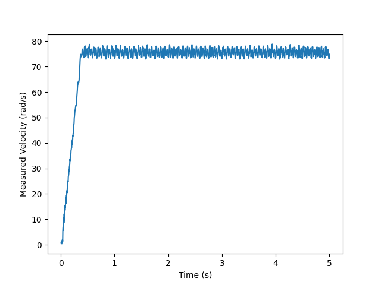

4. Slew limit enabled at 2.5V/s

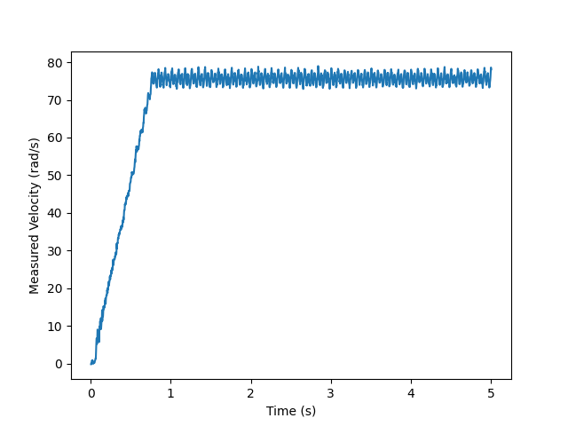

5. Slew limit enabled at 1V/s

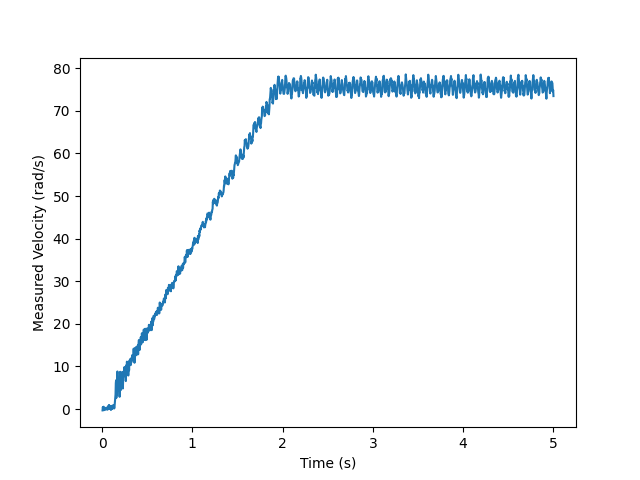

As you can see, the slew limit parameter helps protect against sudden changes in commanded voltage. This can be especially useful in :ref:`noisy/vibration heavy 
environments <vibration_and_jittering>`. The amount of slew filtering that is necessary (if any) is completely application specific, and will require manual tuning.

Brushless Drive Current Limiter
====================================
:ref:`Brushless Drive's <brushless_drive>` ``motor_I_max`` defines that maximum allowable drive current. In general, this current limit protects your module against extreme step commands, and ensures that the current moving through the motor is always in a safe region.
This behavior is illustrated in the examples below. The first is the module with a ``motor_I_max`` of 50A. It is given a step to 5V, then after 5 seconds is stepped back to a 0V control.

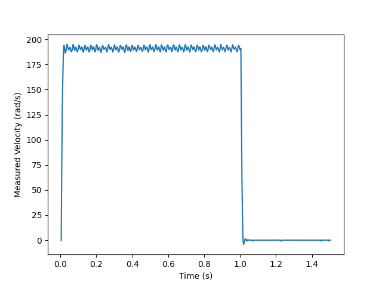

Now, we set the current limit to 0.5A. You will see that the motor's rate of change is much slower. As mentioned above, this is meant to decrease the likelihood of dangerous currents as the module steps between velocities.

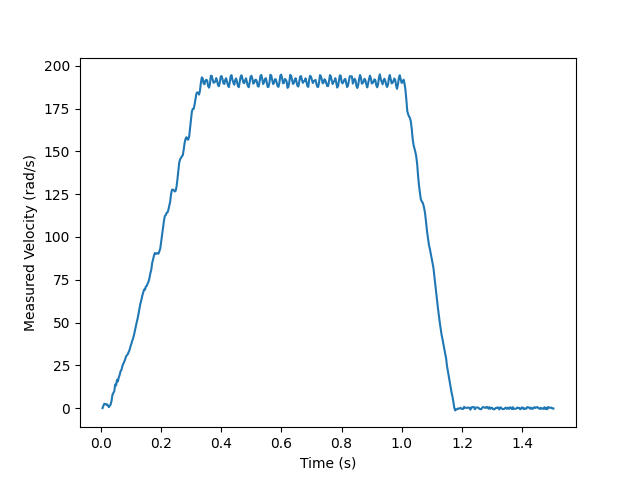

The biggest difference between this current limit and :ref:`slew_rate` is that the slew rate parameter defines an absoulte linear relation between the control voltage applied and 
the time it takes to get there. This current limit is not meant to limit the rate of change of commanded voltages, it is meant to protect against sudden voltage 
spikes due to large voltage steps.