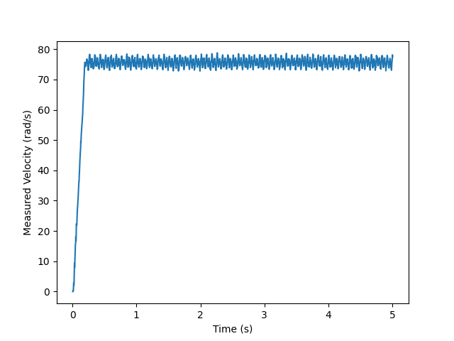

.. include:: ../text_colors.rst
.. toctree::

.. _manual_safety:

*****************
Safety Systems
*****************
The following manual is meant to outline the safety systems present on Vertiq modules. Safety systems are built into your module's firmware, 
and seek to protect your module from things like over-velocity mechanical issues, power issues, and overheating.

.. _protect_against_regen:

Protecting Against Voltage Regeneration Spikes
====================================================
What are Regenerative Voltage Spikes
------------------------------------------------------------
Regeneration voltage occurs when the commanded module voltage is less than the module's back-EMF voltage. When this occurs, the motor's kinetic 
energy is converted directly to electrical energy, and produces a current flowing out of the motor and into the power source.

The commanded module voltage may be less than the back-EMF voltage in cases where the module is slowing down or braking. A larger spread between back-EMF and commanded module voltage leads to a greater magnitude of regeneration current.

How Can Regeneration Affect Your Module
------------------------------------------------------------
If the module's power source can absorb the regenerated current without allowing the voltage to spike, regeneration protection isn't needed. This is often true with a battery as the power source.
When connected to a power source that cannot absorb this regenerated current, which is generally the case with benchtop power supplies, the output voltage of the source will often increase during regeneration. 
These spikes can result in voltages above the module's and your supply's maximum rated operating voltage. When this happens, you can permanently damage the module, the power supply, or both.

Protecting Against Dangerous Regeneration Voltage Spikes
------------------------------------------------------------
Regenerative voltage spikes can pose a threat to your modules and power supply if not properly controlled. As such, all Vertiq modules can limit their regeneration current to limit the magnitude of voltage spikes on power supplies. 
Vertiq modules have two main parameters to protect against dangerous regeneration voltage spikes. They are available through IQ Control Center's advanced tab as *Volts Limit* and *Volts Limit Starting Voltage*.

For example, by default on modules rated to 14S, you will see:

.. image:: ../_static/control_center_pics/regen_params.png
        :align: center
        :alt: Regeneration Parameters in IQ Control Center

In short, these two values work together in order to limit the rate at which your module will slow down or apply a braking force. In doing so, the module limits the amount of 
negative supply current produced, reducing the voltage spike produced by the power supply.

.. note::
    These configuration parameters define **system voltages**. For example, if your module has a maximum voltage rating of 14S (or 58.8V), but your power supply has a 
    maximum rating of 30V, the values of Volts Limit Starting Voltage and Volts Limit must be set according to the power supply's absolute 30V maximum.

    As another example, suppose you want to power your module rated up to 12S with a 6S equivalent power supply. In this case, you would set your voltage limits based on the
    6S equivalent power supply.

    By default, Vertiq modules have these values set to protect the module's circuits while operating with the supplied voltage at its maximum rating. In order to protect your power supply and module, 
    please ensure that your configured voltage limits are set according to the **system's lowest maximum voltage rating**.

* **Volts Limit Starting Voltage** defines the value (in volts) at which the module will begin checking if any limits on regeneration need to be applied. A 0V starting voltage means 
  that regeneration voltage protection is always enabled. A starting voltage configured just below the Volts Limit enables maximum braking under normal conditions, and enables protection 
  only during voltage spikes.
  
* **Volts Limit** defines the absolute maximum supply voltage the module will apply. In some extreme instances, your module may apply a voltage higher than the configured Volts Limit. In order to handle this properly, ensure that there is a buffer between the absolute maximum allowable system voltage and the value of Volts Limit. 
  For example, if your system can handle a maximum of 30V, your Volts Limit may be 27V. Never set Volts Limit below the maximum supply voltage. For example, if you're using a 6S 
  battery with a maximum voltage of 25.2V, never set Volts Limit at or below 25.2V. Violating this rule may cause the motor to run away to its maximum speed.

.. _derates:

Protection with Derates
===========================
A derate is a scaling factor that adjusts a module's drive voltage to keep it in a safe operating region based on some operating 
characteristic of the module, such as speed or temperature. All derate values on Vertiq's modules are represented as float values from [0,1].

Suppose that your :ref:`commanded drive voltage <manual_velocity_control_mechanisms>` is 2V, and the current derate is 0.4. 
The actual drive voltage applied will be (2V * 0.4) = 0.8V. A basic illustration of derate application is shown below

There are three separate derate values that are internally updated, each linked with a different measured module parameter (e.g. speed and temperature). There is a speed derate used to avoid mechanical failure, 
a microcontroller temperature based derate to avoid microcontroller overheating, and a coil temperature derate to avoid coil overheating. 
These three derate values are combined and applied to the target command voltage in order to protect your module. Details of each of these derate values as well as 
how they are combined are discussed below.

.. _speed_derate:

Speed Based Derate
---------------------
As mentioned above, your module's speed derate is meant to protect your module from mechanical failure. Speed derate is calculated using the module's current speed, 
brushless drive's ``motor_redline_start`` parameter, and brushless drive's ``motor_redline_end`` parameter. You can find the redline parameters listed in the 
:ref:`Brushless Drive Message Table <brushless_drive>`.

You can also find these parameters in the Advanced tab as ``Speed Redline Start`` and ``Speed Redline End``.

.. warning::
    The redline values preloaded on your module have been tuned specifically to keep your module safe. Before adjusting these parameters, we highly recommend 
    that you reach out to us at support@vertiq.co.

.. image:: ../_static/manual_images/safety/speed_redline_control_center.png
    :align: center
    :scale: 50%

The total speed derate is calculated by :math:`\text{Speed Derate} = \frac{\text{motor_redline_end - speed}}{\text{motor_redline_end - motor_redline_start}}` where the solution is saturated to [0,1].

This means that for any speed below the redline start, there is no derate applied. For any speed at or above the redline end, 
the speed derate is 0. Any speed in that range is subject to a variable derate [0, 1].

Suppose your module's redline start is 1750 rad/s and its redline end is 2000 rad/s. This means that there will be no derate limiting applied under 1750 rad/s, 
your module will stop spinning at and above 2000 rad/s, and will be derate limited in between.

A graph illustrating the speed derate calculation is provided below:

.. image:: ../_static/manual_images/safety/speed_derate_graph.png
    :align: center
    :scale: 50%

.. _microcontroller_derate:

Microcontroller Temperature Based Derate
--------------------------------------------
As mentioned above, your module's microcontroller temperature derate is meant to protect your module's microcontroller from overheating. 
Microcontroller temperature derate is calculated using the module's current microcontroller temperature, Temperature Monitor Microcontroller's ``otw`` parameter 
(over temperature warning), and Temperature Monitor Microcontroller's ``otlo`` parameter (over temperature lock out). You can find the over temperature parameters 
listed in the :ref:`Temperature Monitor Microcontroller Message Table <temperature_monitor_microcontroller>`.

.. note::
    Microcontroller temperature based derate only functions while the module is motoring. Successful thermal derating is not guaranteed when generating.

The total microcontroller temperature derate is calculated by :math:`\text{Microcontroller Temperature Derate} = \frac{\text{otlo - temp}}{\text{otlo - otw}}` where the solution is saturated to [0,1].

This means that for any temperature below otw, there is no derate applied. For any temperature at or above otlo, 
the microcontroller temperature derate is 0. Any microcontroller temperature in that range is subject to a variable derate [0, 1].

Suppose your module's otw is 100°C and its otlo is 110°C. This means that there will be no derate limiting applied under 100°C, your module will stop spinning at and above 110°C, and will be derate limited in between.

A graph illustrating the microcontroller temperature derate calculation is provided below:

.. _coil_temp_derate:

Coil Temperature Based Derate
---------------------------------
As mentioned above, your module's coil temperature derate is meant to protect your module's coils from overheating. Coil temperature derate is calculated using the 
module's current estimated coil temperature, Coil Temperature Estimator's ``otw`` parameter (over temperature warning), and Coil Temperature Estimator's ``otlo`` 
parameter (over temperature lock out). You can find the over temperature parameters listed in the :ref:`Coil Temperature Estimator Message Table <coil_temperature_estimator>`.

.. note::
    Coil temperature based derate only functions while the module is motoring. Successful thermal derating is not guaranteed when generating.

The total coil temperature derate is calculated by :math:`\text{Coil Temperature Derate} = \frac{\text{otlo - temp}}{\text{otlo - otw}}` where the solution is saturated to [0,1].

This means that for any temperature below otw, there is no derate applied. For any temperature above otlo, the microcontroller 
temperature derate is 0. Any microcontroller temperature in that range is subject to a variable derate [0, 1].

Suppose your module's otw is 140°C and its otlo is 150°C. This means that there will be no derate limiting applied under 140°C, your module will stop spinning at and above 150°C, and will be derate limited in between.

A graph illustrating the microcontroller temperature derate calculation is provided below:

Calculation of the Total Derate
-----------------------------------
The total applied derate is the direct multiplication of the speed, microcontroller, and coil derate values. So, then our drive voltage system becomes:

.. image:: ../_static/manual_images/safety/full_derate_system.png
    :align: center
    :scale: 50%

.. _power_safety:

Power Safety
=================
Power safety is a general monitoring interface that immediately coasts your module if any measured parameters reach dangerous levels. In the event that 
:ref:`standard derates <derates>` are insufficient, the power safety interface ensures safe module operation.

.. _power_safety_client_params:

Safety Parameters Handled by the Power Safety Client
-------------------------------------------------------------
The power safety client manages measurements regarding input power (voltage and current), internal reference power, motor current, microcontroller temperature, and coil temperature.

The full listing of power safety parameters can be found in the :ref:`Power Safety Client table <power_safety_table>`. Each safety has a low end limit as well as a high end limit. 
If the measured parameter drops below the low end or goes above the high end, a fault flag is raised, and can be viewed in the ``fault_now`` parameter. ``fault_now`` is 
a bitmask used to show which flags are active, and is broken down as follows:

* Bit 0: The microcontroller's Programmable Voltage Detector detected a voltage below acceptable limits
* Bit 1: Power safety's input voltage reading has exceeded ``volt_input_high`` or has fallen below ``volt_input_low``
* Bit 2: Power safety's reference voltage reading has exceeded ``vref_int_high`` or has fallen below ``vref_int_low``
* Bit 3: Power safety's supply current reading has exceeded ``current_input_high`` or has fallen below ``current_input_low``
* Bit 4: Power safety's motor current reading has exceeded ``motor_current_high`` or has fallen below ``motor_current_low``
* Bit 5: Power safety's microcontroller temperature reading has exceeded ``temperature_uc_high`` or has fallen below ``temperature_uc_low``
* Bit 6: Power safety's coil temperature reading has exceeded ``temperature_coil_high`` or has fallen below ``temperature_coil_low``

The ``fault_now`` parameter is only set by hardware. All faults that have occurred since the module's start up can be viewed in the ``fault_ever`` parameter. 
The value of ``fault_ever`` is generally set by the hardware and cleared by the user.

The module's behavior when faults are detected is determined by the ``fault_latching`` parameter. If ``fault_latching`` is set to 1, then any high flags 
in ``fault_ever`` place the module into safe mode. In safe mode, the module is set to coast, and it will not spin or apply any control voltage. The module remains in safe mode until the user clears ``fault_ever``. 
When ``fault_latching`` is set to 0, the module remains in safe mode until all power safety parameters are back in their safe operating range, and ``fault_now`` returns to 0. 
When ``fault_latching`` is set to 0, the module can enter and exit safe mode at high frequency which may be damaging to the the motor or supply since it can cause large ripple currents. 
We recommend using ``fault_latching = 1`` whenever possible.

Suppose the high limit of power safety's microcontroller temperature parameter is 115°C. If your module's microcontroller ever reaches 115°C, the module enters 
safe mode, and will not spin until it exits safe mode. If ``fault_latching`` is set to 0, then once the module's microcontroller temperature drops below 115°C, 
it will exit safe mode, and be able to spin once again. If ``fault_latching`` is 1, then your module will not exit safe mode until its microcontroller temperature 
drops below 115°C and ``falt_ever`` is reset to 0.

Internal Programmable Voltage Detector (PVD)
------------------------------------------------
Each module's microcontroller has an internal PVD that monitors the microcontroller's Vdd voltage level. Vdd is the voltage used to power the microcontroller, and if 
it drops too low, your module's microcontroller cannot function properly. In the event that Vdd drops below the pre-programmed threshold value (~2.8V), the module is forced to stop spinning. 
The module will only be allowed to resume normal operation when Vdd has risen back above the voltage threshold (~2.9V).

.. _slew_rate:

Slew Rate Limiter
==================
Your module's slew rate limit defines the maximum change in control voltage per second. The slew rate limiter can be used to limit how quickly your module attempts to
change voltage, which can be useful to protect external electronics or improve integration with flight controllers in certain cases.

There are two parameters in the :ref:`Brushless Drive client <brushless_drive>` that affect your module's slew rate limiting:

* ``slew_volts_per_second`` defines the actual slew rate in volts per second applied to voltage commands. This defines the strength of the filter's impact.
* ``slew_enable`` determines whether or not ``slew_volts_per_second`` is actually applied to voltage commands. If ``slew_enable`` is false, then there will not be slew limiting applied.

You can also find these parameters in the Control Center's Tuning tab as ``Voltage Slew Limit`` and ``Voltage Slew Limit Enable``

.. note:: 
    
    When adjusting your module's slew rate limit, it is possible that it may affect the module's :ref:`buzzer function <manual_buzzer_control>`. The module creates its buzzer tones by 
    rapidly changing the motor's voltage, and not through any separate hardware (the modules do not have a separate buzzer). So, by lowering the slew limit specifically, you may 
    cause your buzzer to sound quieter than expected as the module cannot generate the changes in voltages required to play a strong tone.

The following examples are meant to illustrate the effect that slew limiting has on module control. All examples start with the module in coast followed by a voltage step command to 2V.

1. Slew limiting disabled

2. Slew limit enabled at 10V/s

3. Slew limit enabled at 5V/s

4. Slew limit enabled at 2.5V/s

.. image:: ../_static/manual_images/safety/slew_rate_2_5vps.png
    :align: center
    :scale: 80%

5. Slew limit enabled at 1V/s

As you can see, the slew limit parameter helps protect against sudden changes in commanded voltage. This can be especially useful in :ref:`noisy/vibration heavy 
environments <vibration_and_jittering>`. The amount of slew filtering that is necessary (if any) is completely application specific, and will require manual tuning.

Brushless Drive Current Limiter
====================================
:ref:`Brushless Drive's <brushless_drive>` ``motor_I_max`` defines the maximum allowable drive current. In general, this current limit protects your module against extreme current surges (e.g. step commands and stalls), and ensures that the current moving through the motor is always in a safe region.
This behavior is illustrated in the examples below. The first is a module with a ``motor_I_max`` of 50A. It is given a step to 5V, then after 5 seconds is stepped back down to a 0V control.

.. note::
    ``motor_I_max`` defines the maximum allowable motor current, and not supply current. These values are not necessarily the same.

.. image:: ../_static/manual_images/safety/current_limit_50.png
    :align: center
    :scale: 80%

Now, we set the current limit to 0.5A. You will see that the motor's rate of change is much slower. As mentioned above, this is meant to decrease the likelihood of dangerous currents as the module steps between velocities.

.. image:: ../_static/manual_images/safety/current_limit_0_5.png
    :align: center
    :scale: 80%

The biggest difference between this current limit and :ref:`slew_rate` is that the slew rate parameter defines an absolute linear relation between the control voltage applied and 
the time it takes to get there. This current limit is not meant to limit the rate of change of commanded voltages, it is meant to protect against all high current events. Suppose 
your module is spinning, but is caught in a tree and can no longer spin. Assuming that your flight controller continues to send commands, your module will continue to 
attempt spinning, but if it cannot, then it will end up with a surge of current going through its coils. In this case, ``motor_I_max`` would protect the module by 
limiting the drive voltage, and subsequently limiting the current.