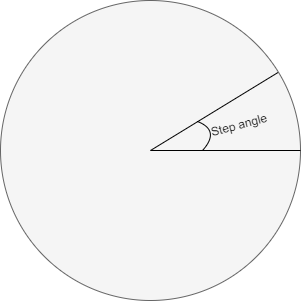

.. include:: ../text_colors.rst
.. toctree::

.. _manual_step_direction:

**************************************
Step/Direction
**************************************

Module Support
===================

Step/Direction Modules
************************

.. table:: Step/Direction Modules

	+------------------+--------------------------------------------------------+
	| Module           |     Notes                                              |
	+------------------+--------------------------------------------------------+
	| Vertiq 23-XX     | Available by request only                              |
	+------------------+--------------------------------------------------------+
	| Vertiq Fortiq-42 | Available only while using the Step/Direction firmware |
	+------------------+--------------------------------------------------------+

Description
============
Step/Direction control is a two wire interface with two inputs: step and direction. On each low to high transition on the step line up to logic high, the module will move a set radial distance in the direction specified by the direction line. Setting the direction line high causes counter-clockwise movement, and setting the direction line low causes clockwise movement. More information on Step/Direction control can be found `here <https://www.probotix.com/downloads/step_and_direction_drives.pdf>`_. 

The distance traveled on each received step pulse is defined by the *Step Angle Size* parameter. This value is user configurable. 

.. note::
	
	Unlike :ref:`timer_based_protocol`, while using Step/Direction control with a Fortiq-42 module, serial communication through IQUART remains available. 

.. note::
	By using Step/Direction firmware, the motor can only be controlled via Step/Direction signals. Attempts to spin, stop, or otherwise control the motor via other protocols will fail. You can still communicate with the module via IQUART or CANOpen (if available), but cannot control the module. Hobby protocols are disabled when using Step/Direction firmware.

Usage
==========
IQ Control Center
********************
The IQ Control Center provides the easiest way to configure Step/Direction control on your module. To do so:

#. Open IQ Control Center. If you have not installed the program, please follow the instructions in `Getting Started with Speed Motors Using IQ Control Center <https://iqmotion.readthedocs.io/en/latest/tutorials/testing_with_control_center.html>`_. 

#. Connect your module to IQ Control Center

#. Click the General tab on the left side

#. To configure the step size, adjust the *Step angle* parameter, which determines how far the motor should spin on each received step pulse

Vertiq Python API - Step/Direction Interface
************************************************
.. note::
	Please note that the following *Step/Direction* testing was performed with a Fortiq-42 module. Your exact commands may change depending on the module in use.

The Step/Direction interface can also be accessed through Vertiq’s Python API's *step_direction_input* client, summarized in Vertiq's API documentation.

#. If you have never used Vertiq's Python API, you must first set up your local computer to use the Python API using the instructions found at `Getting Started with Python <https://iqmotion.readthedocs.io/en/latest/api_docs/python.html>`_

#. After completing the walkthrough, you can interact with the *step_direction_input* client

#. To read a value

	.. code-block::

		print(fortiq.get("step_direction_input", "<entry_name>"))

	For example, to read the value stored in *angle*:

	.. code-block::  
	
		print(fortiq.get("step_direction_input", "angle"))

#. To write a value

	.. code-block::
	
		fortiq.set("step_direction_input", "<entry_name>", value)
	
	For example, to set the *angle_step*

	.. code-block:: 

		fortiq.set("step_direction_input", "angle_step", 0.001)

#. To save a value to persistent memory

	.. code-block::

		fortiq.save("step_direction_input", "<entry_name>")

	For example, to save the value in *angle_step*

	.. code-block::
		
		fortiq.save("step_direction_input", "angle_step")

