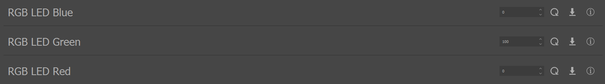

.. include:: ../text_colors.rst
.. toctree::

.. _manual_led_support:

***********************************************
Stock LED Support (White and RGB LED Control)
***********************************************
All Vertiq Gen 2 modules support use of our LED add-on board available with Vertiq's Pro Kit or by special request. For information about purchasing a Pro Kit, or for information about 
purchasing more LED add-on boards, please contact us at info@vertiq.co. Please refer to your module's family page to see if it belongs to Gen 1 or Gen 2.

Module Support
===============

To see if your module and firmware style supports this feature, please see our :ref:`supported features table <supported_features_table>`.

Hardware Configuration
=========================
If you are using Vertiq's Pro Kit, simply plug the LED connector into the LED board, and you can move on to *Controlling Your LEDs*. Otherwise continue reading.

Vertiq's Gen 2 modules all feature solderable connections that allow you to easily connect with external power sources and other peripherals. The LED peripheral board connects 
with your module's GPIO2 and GPIO3 connections where GPIO2 controls the RGB LED and GPIO3 controls the white LEDs. The connections' labels vary for each connector board model. If you 
are using a tongue (external from the main motor body) connector board with solder pads, you will see the GPIO values printed as either IOX or GPIOX where X is the GPIO value. If you are using a 
tongue connector board with through hole connections, GPIO2 is pin 8 and GPIO3 is pin 7. Lastly, if you are using an internally connected downward eject connector board, 
GPIO2 is pin 8 and GPIO3 is pin 7.

.. list-table:: LED Connection Examples
   :class: borderless
   :align: center

   * - .. figure:: ../_static/manual_images/leds/40_led_connections.png
            :alt: 40-06 LED Connections
            :align: center
            :height: 350

            Vertiq 40-06 LED Connections
     - .. figure:: ../_static/manual_images/leds/81_led_connections.png
            :alt: Vertiq 81-08 Gen 2 LED Connections
            :align: center
            :height: 350

            Vertiq 81-08 Gen 2 LED Connections

The LED board's power connections should be tied to your module's V+ and V- ports ensuring that GND attaches to V-, and V+ connects to V+. The LED board has an operating range of 7.5V-58.8V (3-14S). 
Operating the LED board above this range can result in serious damage to the board. Operating the board below this range will simply prevent it from 
operating as expected.

All LED board versions use a 4-pin JST-ZE connector in order to interface with your module.

.. warning::
    The pinout of the Vertiq LD3.0.0 differs from the LD3.1.0.

    The LD3.0.0 can be identified by its label on the same side as the LEDs:

    .. image:: ../_static/manual_images/leds/ld_3_0_highlight.png
        :align: center
        :width: 500

    The LD3.1.0 can be identified by its label on the same side as the JST-ZE connector:

    .. image:: ../_static/manual_images/leds/ld_3_1_highlight.png
        :align: center
        :width: 500

    Please take care to ensure that you use the pinout for the correct LED board.

.. list-table:: LD3.X.0 Pinouts
   :class: borderless
   :align: center

   * - .. figure:: ../_static/manual_images/leds/led_board_connections.png
        :align: center
        :width: 400
        :height: 300

        LD3.0.0 Pinout

     - .. figure:: ../_static/manual_images/leds/ld_3_1_pinout.png
        :align: center
        :width: 400
        :height: 300
        
        LD3.1.0 Pinout

Please note that the connector's clip is at the top of both images. Take care to ensure that the module's RGB LED pad connects with the LED board's RGB LED pin, 
and the module's white LED pad attaches to the LED board's white LED pin. Failure to do so can result in damage to your LED board as well as your module.

Controlling Your LEDs
========================
.. warning::
    Do not plug in your module's LED board while the module is already powered up. “Hot plugging” your module this way can cause damage to the LED board as well 
    as the module itself. Always ensure that the LED board is fully connected with the module before powering it on.

.. _default_pattern:

Default Pattern
******************

By default, Vertiq modules control the RGB LED to display a static blue color, and the white LEDs to be shut off. On startup, the RGB LED should be illuminated.

The default :ref:`strobing pattern <strobing_configuration>` for both the white LED and RGB led is to blink on and off 3 times, remain off, then restart the pattern with a 
period of 2.5 seconds.

.. raw:: html

    
    <video class='center_vid' controls muted><source src="../_static/manual_images/leds/default_blinking.mp4" type="video/mp4"></video>

RGB LED Configuration
***********************
Your module has control over the RGB LED's red, green, and blue intensities as well as its strobing output. Strobing configuration is identical for both the RGB and 
white LEDs, and is covered in :ref:`strobing_configuration`. By default, strobing is disabled for your RGB LED. RGB LED control parameters are found in 
the :ref:`RGB LED client reference table <rgb_led_message_table>`.

The pertinent control parameters for RGB LED control are ``red``, ``green``, ``blue``, and ``update_color``. ``red``, ``green``, and ``blue`` can be set, gotten, and 
saved, and can be an integer [0, 255] where 255 indicates the maximum intensity. ``update_color`` is set only, and acts as a trigger mechanism that causes your module to command the LED 
with the intensities specified by the values in ``red``, ``green``, and ``blue``.

Suppose you wanted your RGB LED to be bright yellow for 3 seconds, bright red for 3 seconds, and then turn off completely.
We can do so using our :ref:`Python API <getting_started_python_api>`, as well as some additive color theory.

As in the image above, to make yellow light, simply combine red and green.

.. code-block:: python

    import iqmotion as iq
    import time

    # Module Communication - This must be updated with the correct parameters for your module's serial communication
    com = iq.SerialCommunicator("COM3", baudrate=115200)

    # Using a Vertiq 40-06 Gen 2 module with speed firmware
    module = iq.Vertiq4006(com, firmware="speed")

    #Set the RGB LED to bright yellow
    module.set("rgb_led", "red", 255)
    module.set("rgb_led", "green", 255)
    module.set("rgb_led", "blue", 0)

    #Make sure to update the output!
    module.set("rgb_led", "update_color")

    #Wait 3 seconds
    time.sleep(3)

    #Turn off green so we are only left with red
    module.set("rgb_led", "green", 0)
    module.set("rgb_led", "update_color")

    #Wait another 3 seconds
    time.sleep(3)

    #Turn off red
    module.set("rgb_led", "red", 0)
    module.set("rgb_led", "update_color")

This example should result in the following:

.. raw:: html

    
    <video class='center_vid' controls muted><source src="../_static/manual_images/leds/rgb_example.mp4" type="video/mp4"></video>

If you reboot your module after running the following example, you will notice that the LED returns to its original light blue color. This is because we did not 
save any of the RGB intensities. Suppose you would like your module's LED to be green only on boot. It is easiest to do this using :ref:`IQ Control Center <control_center_start_guide>`. 
You can find RGB LED controls on the General tab. Note that the values seen in the image below are those required to create the light blue, default, color

To configure your LED to be green, simply set ``RGB LED Blue`` and ``RGB LED Red`` to 0, and set ``RGB LED Update Color``. You can adjust the intensity of the green LED 
as desired, making sure to set ``RGB LED Update Color`` in order to test the configured intensity. In this example, we set a green intensity of 100. 
Note the color and intensity of the LED.

Since every set through the Control Center also saves the value into the module's persistent memory, this RGB configuration will be active on every module startup 
until the value is changed and saved again. So, if you restart your module, you will find that it now starts with the same color and intensity as configured 
through the Control Center.

An important note is that it is not required to set ``RGB LED Update Color`` in order to have your module boot with the previously saved color. The module will 
always boot with the value loaded from persistent memory. Suppose you want your module to default to magenta. We can follow the same steps as above with 
IQ Control Center to achieve this, but this example will use the Python API. Note that we do not call ``module.set("rgb_led", "update_color")``, but the 
module reboots with the value set and saved by the program.

.. code-block:: python

    import iqmotion as iq

    # Module Communication - This must be updated with the correct parameters for your module's serial communication
    com = iq.SerialCommunicator("COM3", baudrate=115200)

    # Using a Vertiq 40-06 Gen 2 module with speed firmware
    module = iq.Vertiq4006(com, firmware="speed")

    #Set and save the RGB LED to magenta (red and blue only)
    module.set("rgb_led", "red", 100)
    module.save("rgb_led", "red")
    module.set("rgb_led", "green", 0)
    module.save("rgb_led", "green")
    module.set("rgb_led", "blue", 255)
    module.save("rgb_led", "blue")

    #Reboot the module to show that it will boot to the color we just set
    module.set("system_control", "reboot_program")

White LED Configuration
==========================
Your module has control over the two series white LEDs' intensity as well as their strobing output. Strobing configuration is identical for both the RGB and white LEDs, 
and is covered in :ref:`strobing_configuration`. By default, the white LED intensity is 0% and strobing is enabled. White LED control parameters are 
found in the :ref:`white LED message table <white_led_message_table>`.  The LED intensity can be an integer percentage [0, 100]% where 100% indicates the maximum intensity. Please note that the 
two white LEDs are controlled in series, and cannot be controlled individually.

.. warning::
    The white LEDs are extremely bright. Please do not look directly into the white LEDs while they are in use. Additionally, prolonged operation of the white LED at high intensities 
    causes the LED board to heat up, and may require heat sinks. Please take care when handling your LED board to avoid injury.

Since its default intensity is 0%, the white LEDs are off by default. Suppose you would like to turn on the LEDs with minimum intensity (all examples will use low 
intensities in order to avoid intense light while benchtop testing). To do so, we can use the :ref:`Python API <getting_started_python_api>`.

Once the intensity is configured above 0%, you will see the white LED flash with its default :ref:`strobing pattern <strobing_configuration>` in which it blinks on 
and off 3 times, remains off, then restarts the pattern. You can find a video of the default pattern in :ref:`default_pattern`.

.. code-block:: python

    import iqmotion as iq

    # Module Communication - This must be updated with the correct parameters for your module's serial communication
    com = iq.SerialCommunicator("COM3", baudrate=115200)

    # Using a Vertiq 40-06 Gen 2 module with speed firmware
    module = iq.Vertiq4006(com, firmware="speed")

    #Turn on the white LED to minimum brightness
    module.set("white_led", "intensity", 1)

If you restart your module now, you will notice that the white LED does not come on. This is because the white LED ``intensity`` parameter was not saved. On boot, 
the LED's intensity is configured to the value read from the module's persistent memory. To save a desired intensity, you can either use a ``save`` 
:ref:`command <api_interactions>`, or you can use IQ Control Center. After connecting your module to the Control Center, you will find the following White 
LED parameters on the General tab

Suppose you would like to drive the LED with 2% intensity on boot, simply set ``White LED Intensity`` to 2%. Now, after rebooting your module, you will see that the 
white LEDs now turn on with the same intensity as set and saved previously.

.. _strobing_configuration:

Strobing Configuration
========================
Strobing Enable
******************
The ``strobe_enable`` parameter determines whether or not strobing is applied. If ``strobe_enable`` is false (0), the corresponding LED remains static according 
to its intensity values. For example, suppose we want the white LED to be on at all times at a low intensity. To do so, we use IQ Control Center to 
set ``White LED Strobing Active`` to ``Inactive``, and ``White LED Intensity`` to 1.

For the sake of visibility in this example, set ``White LED Intensity`` to 0 to turn off the white LED. Now, suppose we want the RGB LED to strobe red only. 
Still in the Control Center, find the RGB LED parameters, and set ``RGB LED Blue`` and ``RGB LED Green`` to 0, ``RGB LED Red`` to 150, and 
set ``RGB LED Update Color``. Assuming that RGB strobing is disabled (which is the default configuration), your LED should now be statically red.

The RGB LED is configured with the same default pattern as the white LED, 3 blinks on and off followed by a longer period off, and the pattern repeats. 
So, when we set ``RGB LED Strobing Active`` to ``Active``, we will see the red LED start to blink.

Strobing activation can be changed on the fly, and is configured on boot-up according to the value stored in the module's persistent memory.

.. raw:: html

    
    <video class='center_vid' controls muted><source src="../_static/manual_images/leds/toggle_strobe_enable.mp4" type="video/mp4"></video>

.. _strobing_period:

Strobing Period
******************
The strobing period defines the time it takes the module to complete one full cycle through the strobing pattern. This parameter only has an effect when strobing is 
active. Strobe period is defined in seconds. Let's take the :ref:`default strobing pattern <default_pattern>` used for both the RGB and white LEDs. 

Using the Control Center, configure the white LED to an intensity of 1%, and enable strobing

Notice that the first on-off blink occurs every 2.5 seconds. Now, set ``White LED Strobing Period`` to 1 second. You'll now see that the pattern restarts every second. 
Finally, set the period to 5 seconds, and the pattern will now restart every 5 seconds.

**Strobing period operates identically for both the white and RGB LEDs.**

.. raw:: html

    
    <video class='center_vid' controls muted><source src="../_static/manual_images/leds/blinking_period_adjust.mp4" type="video/mp4"></video>

.. _strobing_pattern:

Strobing Pattern
********************
The strobing pattern parameter defines a 32-bit bitmask that defines 32 segments of where an LED is on or off. The time it takes to move through all 32 segments is 
defined by the :ref:`strobing period <strobing_period>`, and each individual segment takes :math:`\frac{\text{Strobe Period}}{32}` seconds. A 1 in the bitmask dictates the LED be on during that 
segment, a 0 indicates the LED is off during the segment.

Suppose you would like your pattern to alternate being on and off after every two segments

In this case, your pattern is defined by the bitmask (in hex) 0xCCCCCCCC, a value of 3435973836. In binary this is 11001100110011001100110011001100. Suppose the strobe period is configured to 16 seconds, making each 
segment 0.5 seconds. Therefore, with this pattern, the light will turn on and off every second. In this example, we will use the white LED, **but the same applies 
identically to the RGB LED**

.. raw:: html

    
    <video class='center_vid' controls muted><source src="../_static/manual_images/leds/one_sec_strobe.mp4" type="video/mp4"></video>

Now, suppose you would like your pattern to be clear where it begins, is in progress, and is ending. To do so, you may have a quick blinking pattern to begin, a medium speed blinking 
pattern in the middle, and a slow blinking pattern to end. In hex, this could be 0xAA330808 (decimal 2855471112 | binary 10101010001100110000100000001000).

.. raw:: html

    
    <video class='center_vid' controls muted><source src="../_static/manual_images/leds/weird_strobing_pattern.mp4" type="video/mp4"></video>

The pattern bitmask can be defined by any 32-bit value allowing for :math:`{2}^{32}` unique patterns.