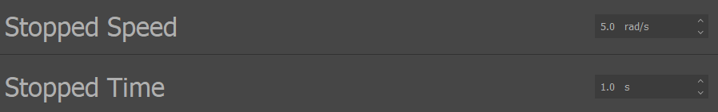

.. include:: ../text_colors.rst
.. toctree::

.. meta:: 
    :description: Learn how Vertiq modules determine a stopped state using configurable speed and duration thresholds. Understand how to adjust Stopping Speed and Stopping Time parameters in the IQ Control Center to optimize Disarming and Timeout behaviors. 
    :keywords: Stop Detection, Stopping Speed, Stopping Time, Disarming Behavior, Timeout Behavior, IQ Control Center, Motor Status, Zero Velocity, Advanced Configuration, firmware settings, motion thresholds

.. _manual_stop_detection:

**********************
Stop Detection
**********************

Module Support
===============

To see if your module and firmware style supports this feature, please see our :ref:`supported features table <supported_features>`.

.. _stop_detection:

About Stop Detection
=========================

Some features, such as :ref:`Disarming Behavior <advanced_disarming_behavior>` and :ref:`Timeout Behavior <timeout_behavior>` rely on detecting when a module is stopped. This section defines how a stop is detected, and how that 
detection can be configured by advanced users.

A Vertiq module is considered stopped when it has been below its stopping speed continuously for some stopping time. Anytime the module’s velocity goes above the 
stopping speed, it will reset the countdown on the stopping time. 

The stopping speed and stopping time can be configured by users using the *Stopped Speed* and *Stopped Time* parameters in the Advanced tab of the IQ Control Center, as shown below.

    Stop Detection Parameters in IQ Control Center

For example, if the stopping time were 1 second and the stopping speed were 5 rad/s, if the module were spinning at 2 rad/s for 0.5 seconds, then 10 rad/s for 1 second, 
and then 2 rad/s again for another 0.5 seconds, it would not be considered stopped. The countdown was reset when the module went to 10 rad/s. If the module 
stayed at 2 rad/s for 1 second, it would then be considered stopped.