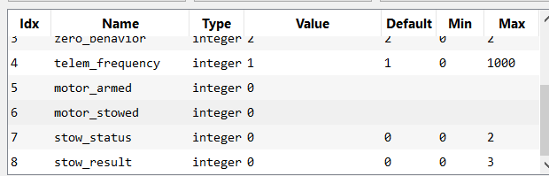

.. include:: ../text_colors.rst
.. toctree::

.. _manual_stow_position:

***********************************************
Stow Position
***********************************************
The stow position feature allows a Vertiq module to return to a configurable position on a transition from armed to disarmed, on timeouts, or when given an 
explicit command to stow. This can be useful for holding propellers in an aerodynamic position, or preparing vehicles for storage. Users can control what 
this position is, when the module should attempt to move into the stow position, how aggressively it moves to the stow position, and the module’s behavior 
once it reaches the stow position. Note that incoming commands can cause interruptions to the stow process, as detailed in :ref:`interrupting_stow`.

Module Support
===============

To see if your module and firmware style supports this feature, please see our :ref:`supported features table <supported_features_table>`.

.. _stow_process_overview:

Stow Process Overview
======================
When a module moves to its stow position, regardles of the reason for the stow, it follows a series of steps to stow properly. First, it begins either accelerating or decelerating
in order to reach its stow position with its user-configrued :ref:`stow acceleration <stow_movement_parameters>`. So if the module was still before, it will begin moving, but if it was 
spinning rapdily, it will keep spinning and gradually slow down. Once the module has come to a stop at the stow position, it will then choose whether it should try to 
actively :ref:`hold that position <stow_holding_position>` or coast itself, meaning that the module will not be driving itself and can spin freely. If the module is :ref:`interrupted <interrupting_stow>` at any time during 
the stow process, it will stop trying to stow.

The diagram below summarizes the stow position feature's state transitions. Note that the stow process may be interrupted at any time, and that certain state transitions are 
configuration dependent.

.. figure:: ../_static/manual_images/stow/stow_process_diagram.png
    :align: center
    :width: 60%
    :alt: Process for Moving to Stow Position

    Summary of Process for Moving to Stow Position

.. _stow_parameter_summary:

Summary of Configuration Parameters
======================================
A summary of the different parameters dictating how the stow position feature operates are given below. Note that for all angles, counter-clockwise is considered 
positive, and clockwise is considered negative. Other sections of this documentation provide greater detail on the usage of some of these parameters.

.. _stow_angle_parameters:

Stow Angle Parameters
*************************
The following parameters pertain to configuring the zero angle for stow and the angle that the module will move to as its stow position:

* **Stow Zero Angle**: This determines what angular position the module will consider as its “zero” position. The target angle is in reference to this angle. Refer to the :ref:`stow_configuring_zero_angle` section for more details on how to configure the zero angle.
* **Stow Target Angle**: This determines the angular position of the stow position, with reference to the zero angle. When the module stows, it attempts to move to this target angle. For example, if the target angle is 1 radian, the stow position will be 1 radian counter-clockwise from the zero angle. Refer to the :ref:`stow_position_calculation` section for more details on how this is used.
* **Sample Zero Angle**: Allows the user to easily set the module’s current position as the zero angle of the module. Refer to the :ref:`stow_configuring_zero_angle` section for more details on how to configure the zero angle.

These parameters can be configured under the General tab in the IQ Control Center, as shown below.

    Stow Angle Parameters in IQ Control Center

The *Stow Zero Angle* can be sampled and the *Stow Target Angle* configured using DroneCAN as well, see the :ref:`DroneCAN configuration parameters documentation for details <dronecan_configuration_parameters>`.

.. _hold_stow_parameter:

Hold Stow
***********
The *Hold Stow* parameter determines if the module will continue trying to actively hold its stow position or coast when it reaches the stow position. 
Refer to the :ref:`stow_holding_position` section for more information.

This parameter can be configured under the General tab of the IQ Control Center, as shown below.

    Hold Stow Parameter in IQ Control Center

*Hold Stow* can be configured using DroneCAN as well, see the :ref:`DroneCAN configuration parameters documentation for details <dronecan_configuration_parameters>`.

.. _stow_movement_parameters:

Stow Movement Parameters
**************************
The following parameters pertain to how the module will move as it transitions to its stow position:

* **Stow Target Acceleration**: Sets the maximum acceleration allowed when moving to the stow position. Can be used to make the transition from spinning to the stow position more gradual.
* **Stow Kp**: The proportional gain to use in the closed loop position controller moving the module to the stow position. A higher gain can lead to a more accurate position, but can also cause oscillation.
* **Stow Ki**: The integral gain to use in the closed loop position controller moving the module to the stow position.
* **Stow Kd**: The differential gain to use in the closed loop position controller moving the module to the stow position.

*Stow Target Acceleration* can be found under the Advanced tab of the IQ Control Center, as shown below.

    Stow Target Acceleration Parameter in the IQ Control Center

*Stow Target Acceleration* can be configured using DroneCAN as well, see the :ref:`DroneCAN configuration parameters documentation for details <dronecan_configuration_parameters>`.

*Stow Kp*, *Stow Ki*, and *Stow Kd* can all be found under the Tuning tab of the IQ Control Center, as shown below.

    Stow PID Parameters in the IQ Control Center

.. _stow_position_calculation:

Stow Position Calculation
===========================
The final stow position is calculated based on the zero angle and the target angle. The zero angle determines what angular position is considered to be zero radians. 
The choice of this position is arbitrary, any angle can be the zero position, it is only important to be consistent so that every module is using the same reference point. 

The target angle determines what angular position is considered the stow position. The target angle is always in reference to the zero angle, e.g. a target angle 
of 1.57 radians means the stow position will be 1.57 radians counterclockwise from the zero angle. By keeping the zero angle consistent and modifying the target 
angle between -π and π, you can set any possible stow position. The equation below summarizes this relationship between target angle, zero angle, and the final stow position.

    Stow Position Angle Calculation

.. _stow_configuring_zero_angle:

Configuring the Zero Angle
===========================
It is possible for users to configure the zero angle of a Vertiq module to any position. There are two approaches to changing the zero angle:

#. Modify the zero angle directly, setting it to any desired number of radians.
#. Move the module to the desired position and use the zero angle sampling function to automatically set this new position as the zero angle.

Both of these methods are supported by the IQ Control Center. For the first method, simply change the :ref:`Stow Zero Angle <stow_angle_parameters>` parameter. It can be 
increased or decreased by the necessary amount to achieve the desired zero angle.

The second method makes it possible to simply move the module to the position you want, and then sample that as your new zero angle. The steps for this are described below:

#. Move your module into the desired zero angle. Having a propeller attached to the module may make it easier to determine if you are in the desired orientation.
#. Connect to the module with the IQ Control Center, and open the General tab.
#. Click the :ref:`set arrow <save_button>` on the :ref:`Sample Zero Angle <stow_angle_parameters>` entry in the IQ Control Center. This will automatically set the current angle as the zero angle. 

To test if the zero angle is set correctly, use the :ref:`Trigger Stow <trigger_manual_stow_iquart>` entry in the Control Center. This commands the module to the stow position. 
Try moving the module to a different position, and then triggering the stow to confirm the module is moving to the expected position.

Triggering Stow
=================
There are multiple possible ways to trigger the module to move into the stow position. Each of these methods is covered in the section below.

All of these methods will cause the module to attempt to move into the stow position, following the procedure outlined in the :ref:`stow_process_overview` section.

Manual Stow
************

Users can manually trigger the module to move to the stow position by sending commands over IQUART or DroneCAN. The sections below cover these commands in greater detail.

.. _trigger_manual_stow_iquart:

IQUART
#######
The *Trigger Stow* parameter can be used to manually request that the module move to the stow position in the Testing tab of the IQ Control Center, as shown below. 
When this parameter is set, the module will immediately begin the process of moving to its stow position.

.. figure:: ../_static/manual_images/stow/trigger_stow_parameter.png
    :align: center
    :width: 60%
    :alt: Trigger Stow Parameter

    Trigger Stow Parameter in the IQ Control Center

.. _trigger_manual_stow_dronecan:

DroneCAN
#########
The “motor_stowed” configuration parameter can be used to command the module to stow and release the module if it is holding a stow. This parameter both 
reports on whether the module is holding a stow and can be used to command stows.

If this parameter is 0 when queried with a Get, that indicates that the module is not holding its stow position. If it is set to 1, that indicates that the 
module is holding in the stow position. 

Setting this parameter to 1 will command the module to move to the stow position. If this parameter is already set to 1, meaning that the module is holding 
its position, setting it to 0 will command the module to release the hold and coast itself.

The “motor_stowed” parameter can be seen in the DroneCAN GUI Tool below at index 6.

    motor_stowed Parameter in DroneCAN GUI Tool

Stow on Disarm
***************
If a Vertiq module supports :ref:`Advanced Arming <manual_advanced_arming>`, then it is possible to configure its :ref:`disarming behavior <advanced_disarming_behavior>` 
to trigger a stow. This means that when the module transitions from armed to disarmed, it will attempt to move to the stow position. This can be useful for users that 
want their modules to always be in the stow position when disarmed.

Refer to the :ref:`advanced_disarming_behavior` section for more information on how to configure this behavior and the specifics of how the stow 
feature interacts with disarming.

Stow on Timeout
****************
Modules that support :ref:`configurable timeout behavior <timeout_module_support>` can set their :ref:`timeout behavior <timeout_behavior>` to trigger a stow. This means that when a timeout occurs, the module will move to its 
stow position. 

Refer to the :ref:`timeout_behavior` section for more information on how to configure this behavior and the specifics of how the stow feature interacts with timeouts.

.. _stow_holding_position:

Holding Position
==================
Once the module reaches the stow position, it can either continue actively trying to hold that position or it can coast the motor and let it spin freely. This 
behavior is controlled by the *Hold Stow* parameter, as mentioned in the :ref:`stow_parameter_summary` section above.

When holding the stow angle is enabled, the closed loop position controller of the module will continue to try and hold the motor in the stow position even after 
it has successfully stowed. The module will not rotate freely, maintaining its position. This can be useful if you need the module to maintain its stowed position 
when external forces are acting on it, such as the wind. 

Stow Status Reporting
=======================
The current stow status and the result of a previous stow attempt are reported by the module. This can be useful for checking if a stow is currently on-going 
or if the previous stow completed successfully.

.. _stow_status:

Stow Status
************
The stow status reports on the current state of the stowing feature on the module. When the status is queried, an integer will be returned that indicates the state. 
Possible states are:

* **Idle (Stow Status = 0)**: There is no stowing happening, the stow feature is idle and ready for new commands.
* **In Progress (Stow Status = 1)**: A move to the stow position is in progress but the module has not yet reached its stow position.
* **Holding (Stow Status = 2)**: The module is actively holding its stow position. See the :ref:`stow_holding_position` section for more information.

The stow status can be queried over IQUART using the “stow_status” entry of the “stow_user_interface” client in the API. It can also be queried over DroneCAN using 
the “stow_status” configuration parameter, as shown below in the DroneCAN GUI Tool at index 7.

    stow_status Parameter in DroneCAN GUI Tool

.. _stow_result:

Stow Result
************
The stow result reports on how the previous stow attempt ended. When the result is queried, an integer will be returned that indicates the result. Possible results are:

* **No Result (Stow Result = 0)**: This indicates that there have been no previous stow attempts to report on. The stow result starts at this result after reboot.
* **Completed (Stow Result = 1)**: The previous stow attempt successfully made it to its stow position without issue.
* **Interrupted (Stow Result = 2)**: The previous stow attempt was interrupted before completing. See :ref:`interrupting_stow` for details on stow interruptions.
* **Error (Stow Result = 3)**: An unexpected error occurred during the previous stow attempt.

The stow result can be queried over IQUART using the “stow_result” entry of the “stow_user_interface” client in the API. It can also be queried over DroneCAN using 
the “stow_result” configuration parameter, as shown below in the DroneCAN GUI Tool at index 8.

.. figure:: ../_static/manual_images/stow/stow_result_dronecan_parameter.png
    :align: center
    :width: 60%
    :alt: stow_result Parameter

    stow_result Parameter in DroneCAN GUI Tool

.. _interrupting_stow:

Interrupting Stow
===================
While a stow is in progress, any received commands that control the spinning state of the module will interrupt the stow. When interrupted, 
the ongoing stow is canceled and the stow feature is reset so that it will be ready when stow is triggered again. If an interruption occurs, the stow result 
will reflect that as detailed in the :ref:`stow_result` section.

Some examples of possible sources of interruption are:

* A throttle command when the module is armed
* Arming or disarming, see the :ref:`arming_state_transitions` section for possible causes
* An IQUART command to spin the motor regardless of armed state, such as setting the “ctrl_volts” of “propeller_motor_control”

The above list of examples is not exhaustive, there are other possible sources of interruption, any command that would affect how the module is moving will 
interrupt the stow. 