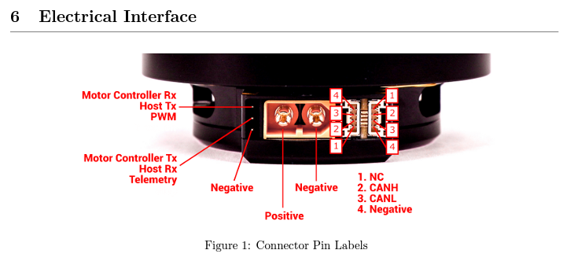

.. include:: ../text_colors.rst
.. toctree::

.. _manual_telemetry:

***********************************************
ESC Telemetry
***********************************************
Flight controllers, including flight controllers running `PX4 <https://px4.io/>`_ or `Ardupilot <https://ardupilot.org/>`_ firmware, often support receiving ESC telemetry messages from connected ESCs. These messages provide the flight controller with details
about the state of the ESC and the motor(s) it is controlling. Vertiq modules support a range of these telemetry messages across different protocols. This section provides
details on the structure of the telemetry messages supported by Vertiq modules and how to use them.

.. note:: 

    When using :ref:`redundant throttle sources <redundant_throttle_manual>`, it is still possible to receive module telemetry. Testing has shown that when reporting telemetry through 
    both DroneCAN and a serial line (:ref:`IQUART Flight Controller Interface <controlling_ifci>`, DSHOT, or PWM), only the telemetry received serially is processed and logged by the 
    flight controller.

.. _telemetry_module_support:

Module Support
===============

Speed Modules
**************

.. table:: Module Support
	:widths: 8 8 20
	:class: tight-table

	+--------------+------------------------------------+----------------------------------------------------------------------------------------------------------------+
	| Module       | Feature Supported                  |Notes                                                                                                           |
	+--------------+------------------------------------+----------------------------------------------------------------------------------------------------------------+
	| Vertiq 81-XX | .. centered:: |:white_check_mark:| |                                                                                                                |
	+--------------+------------------------------------+----------------------------------------------------------------------------------------------------------------+
	| Vertiq 60-XX | .. centered:: |:white_check_mark:| |                                                                                                                |
	+--------------+------------------------------------+----------------------------------------------------------------------------------------------------------------+
	| Vertiq 40-XX | .. centered:: |:white_check_mark:| |                                                                                                                |
	+--------------+------------------------------------+----------------------------------------------------------------------------------------------------------------+
	| Vertiq 23-XX | .. centered:: |:warning:|          | Vertiq 23-06 modules do not support DroneCAN, so the DroneCAN telemetry described below does not apply to them.|
	+--------------+------------------------------------+----------------------------------------------------------------------------------------------------------------+

Servo Modules
**************

.. table:: Module Support
	:widths: 8 8 20
	:class: tight-table

	+--------------+------------------------------------+------------------------------------------------------------------------------------------------------------------------------------------------------------------------------------+
	| Module       | Feature Supported                  | Notes                                                                                                                                                                              |
	+--------------+------------------------------------+------------------------------------------------------------------------------------------------------------------------------------------------------------------------------------+
	| Vertiq 81-XX | .. centered:: |:x:|                | Servo modules do not support specialized telemetry messages such as those detailed here, but it is possible to access the same information using IQUART messages on servo modules. |
	+--------------+------------------------------------+------------------------------------------------------------------------------------------------------------------------------------------------------------------------------------+
	| Vertiq 60-XX | .. centered:: |:x:|                | Servo modules do not support specialized telemetry messages such as those detailed here, but it is possible to access the same information using IQUART messages on servo modules. |
	+--------------+------------------------------------+------------------------------------------------------------------------------------------------------------------------------------------------------------------------------------+
	| Vertiq 40-XX | .. centered:: |:x:|                | Servo modules do not support specialized telemetry messages such as those detailed here, but it is possible to access the same information using IQUART messages on servo modules. |
	+--------------+------------------------------------+------------------------------------------------------------------------------------------------------------------------------------------------------------------------------------+
	| Vertiq 23-XX | .. centered:: |:x:|                | Servo modules do not support specialized telemetry messages such as those detailed here, but it is possible to access the same information using IQUART messages on servo modules. |
	+--------------+------------------------------------+------------------------------------------------------------------------------------------------------------------------------------------------------------------------------------+

Supported Telemetry
=====================
The structure and triggering of supported telemetry messages varies between different protocols. The sections below cover these details for different protocols.

Hobby Protocols
****************
ESC telemetry is available when using :ref:`Hobby Protocols <hobby_protocol>` with Vertiq modules. Telemetry messages are sent from the module as a serial
message at the baud rate configured on the module.

The exact method for requesting telemetry varies depending on what type of hobby protocol is being used, but the structure and content of 
the telemetry sent is the same across all hobby protocols.

Structure and Content
######################
The structure and content of the ESC telemetry message available when using :ref:`Hobby Protocols <hobby_protocol>` is based on the `telemetry
of KISS and BLHeli ESCs <https://www.rcgroups.com/forums/showatt.php?attachmentid=8524039&d=1450424877>`_. 

**There is one key difference between the telemetry sent by Vertiq modules and the KISS standard. The KISS standard specifies sending ERPM data in the telemetry message. ERPM data
must be converted into RPM using the number of poles of the motor to be useful. Vertiq modules directly send RPM data, which eliminates the
need to perform any conversion.** See the note below for details on how this conversion affects flight controller integration.

.. note:: If your flight controller expects to receive ERPM data from these telemetry messages, it may not interpret the RPM data sent by Vertiq modules correctly by default.
    Additional configuration may be necessary on the flight controller to properly intepret the received RPM data as RPM and not as ERPM. For detailed information on how PX4 
    flight controllers handle ERPM to RPM conversion, see :ref:`this section <fc_telemetry_erpm_to_rpm>` of the tutorial on integrating telemetry with flight controllers. 
    For detailed information on how ArduCopter flight controllers handle the conversion, see :ref:`this section <arducopter_erpm_vs_rpm>` of the tutorial on integrating 
    telemetry with flight controllers. For other types of flight controllers, refer to your flight controller's documentation.

The telemetry sent by Vertiq modules when using :ref:`Hobby Protocols <hobby_protocol>` is specified in the table below. The message
consists of 10 bytes:

	+----------+-------------------------+-----------------------+
	| **Byte** | **Content**             | **Units**             |
	+----------+-------------------------+-----------------------+
	| 0        | Temperature             | :math:`^{\circ}C`     |
	+----------+-------------------------+-----------------------+
	| 1        | Voltage (High Byte)     | :math:`\text{cV}`     |
	+----------+-------------------------+-----------------------+
	| 2        | Voltage (Low Byte)      |                       |
	+----------+-------------------------+-----------------------+
	| 3        | Current (High Byte)     | :math:`\text{cA}`     |
	+----------+-------------------------+-----------------------+
	| 4        | Current (Low Byte)      |                       |
	+----------+-------------------------+-----------------------+
	| 5        | Consumption (High Byte) | :math:`\text{mAh}`    |
	+----------+-------------------------+-----------------------+
	| 6        | Consumption (Low Byte)  |                       |
	+----------+-------------------------+-----------------------+
	| 7        | RPM (High Byte)         | :math:`\text{RPM}`    |
	+----------+-------------------------+-----------------------+
	| 8        | RPM (Low Byte)          |                       |
	+----------+-------------------------+-----------------------+
	| 9        | 8-bit CRC               |                       |
	+----------+-------------------------+-----------------------+

CRC Calculation
----------------
The CRC used with the telemetry message makes it possible to confirm that the received data is valid. The CRC is calculated on the payload of the
telemetry message, which takes up the first 9 bytes of the message.

The code blocks below show example code in C for calculating the CRC used in the telemetry message. This example 
code is taken from the `KISS ESC telemetry standard <https://www.rcgroups.com/forums/showatt.php?attachmentid=8524039&d=1450424877>`_.

.. code-block:: c

    uint8_t update_crc8(uint8_t crc, uint8_t crc_seed){
        uint8_t crc_u, i;
        crc_u = crc;
        crc_u ^= crc_seed;
        for ( i=0; i<8; i++) crc_u = ( crc_u & 0x80 ) ? 0x7 ^ ( crc_u << 1 ) : ( crc_u << 1 );
        return (crc_u);
    }

    uint8_t get_crc8(uint8_t *Buf, uint8_t BufLen){
        uint8_t crc = 0, i;
        for( i=0; i<BufLen; i++) crc = update_crc8(Buf[i], crc);
        return (crc);
    }

Example Code for Extracting Telemetry Data
-------------------------------------------
The code block below shows some example C code for extracting each datapoint from the telemetry message and converting the
received units into more commonly used units.

.. code-block:: c

    //A helper function for extracting data points that are spread across two bytes, like voltage and current
    //and dividing them down to the desired units.
    float extract_kiss_halfword(uint8_t * halfword, float divisor=1.0){
        uint8_t high_byte = halfword[0];
        uint8_t low_byte = halfword[1];
        
        //There are many ways to combine two bytes together, some of which are more optimal than this.
        //This is just a simple readable way to combine the bytes for the purposes of this example.
        uint16_t halfword_raw = 0;
        halfword_raw  = ((uint16_t)high_byte) << 8;
        halfword_raw  = halfword_raw | low_byte;

        float divided_halfword  = ((float)halfword_raw)/divisor; 
        return divided_halfword;
    }

    //Assuming that we have the bytes from the telemetry message in the kiss_telem_buf,
    //this function shows how you could extract each piece of telemetry.
    void read_kiss_telemetry(uint8_t kiss_telem_buf[]){
        //Extract the received CRC, we could check it with the example code for CRC calculation above
        //if we wanted to check if the message is valid.
        uint8_t kiss_received_crc = kiss_telem_buf[9];

        //Extract temperature in degrees C
        uint8_t temperature = kiss_telem_buf[0];
        
        //Extract voltage in Volts (divide centivolts by 100 to get volts)
        float voltage = extract_kiss_halfword(&kiss_telem_buf[1], 100.0);

        //Extract current in Amps (divide centiamps by 100 to get amps)
        float current = extract_kiss_halfword(&kiss_telem_buf[3], 100.0);

        //Extract consumption in mAh
        float consumption = extract_kiss_halfword(&kiss_telem_buf[5]);

        //Extract RPM (Vertiq modules just send RPM, not ERPM/100 like the standard says, so we do not need any conversion)
        float rpm = extract_kiss_halfword(&kiss_telem_buf[7]);
    }

Hardware Setup
###############
When using :ref:`Hobby Protocols <hobby_protocol>` with a Vertiq module, one line is used to connect ground to the module, one line is used to send throttle commands,
and one line can optionally be used to receive telemetry from the module. An example of this can be seen for the 81-08 module in the image below. The pin marked as "PWM" 
is used to send throttle commands and telemetry requests to the module, and the pin marked as "Telemetry" is used by the module to send telemetry back to a flight controller.
Refer to your module's datasheet for more details on how to set up the hardware on your module.

    Hobby Protocol Pins on the Vertiq 81-08 (PWM pin receives throttle commands, Telemetry pin sends telemetry messages)

Telemetry messages are sent from the module as a serial message at the baud rate configured on the module, so the telemetry line from your module
should be connected to a serial port set to the correct baud rate on your flight controller.

Requesting Telemetry with Hobby Protocols
##########################################
The procedure for requesting a telemetry message when using :ref:`Hobby Protocols <hobby_protocol>` varies depending on if you are using analog
hobby protocols or DSHOT. The sections below detail these procedures.

.. _telemetry_analog_request:

Analog Hobby Protocols
-----------------------
Analog hobby protocols, most notably :ref:`Standard PWM <hobby_standard_pwm>`, but also several :ref:`other protocols <hobby_other_protocols>`, send throttle commands by sending pulses
of varying widths. **Vertiq modules allow users to request telemetry when using analog hobby protocols by sending a 30 microsecond pulse to the module instead of a throttle command.** This
30 microsecond pulse should be sent in the same way as a typical throttle command pulse. A telemetry response will then be sent as a serial message from the module's telemetry pin.
This is the same as the procedure outlined on the `KISS ESC telemetry standard <https://www.rcgroups.com/forums/showatt.php?attachmentid=8524039&d=1450424877>`_.

Refer to your flight controller's documentation for more details on if it supports requesting telemetry using this procedure.

DSHOT
-----
Vertiq modules support :ref:`DSHOT <hobby_dshot>`, including support for telemetry requests over DSHOT. The details of the DSHOT protocol and the structure
of DSHOT frames are covered in this `article from Chris Landa <https://brushlesswhoop.com/dshot-and-bidirectional-dshot/>`_. **Most importantly for telemetry,
each DSHOT frame has 1 bit reserved for requesting telemetry. When a frame with this bit set is received the module will send a telemetry message back over the telemetry line.**

Refer to your flight controller's documentation for more details on if it supports requesting telemetry using this procedure.

.. _telemetry_dronecan:

DroneCAN
*********
Vertiq modules broadcast the DroneCAN standard :ref:`uavcan.equipment.esc.Status <dronecan_support_esc_status>` 
and :ref:`uavcan.equipment.device.Temperature <dronecan_support_device_temperature>` messages to send ESC telemetry. 
Refer to the :ref:`DroneCAN <dronecan_protocol>` section for more details on the DroneCAN bus and those messages. 

.. note:: 

    Your module can be configured to report speed rather than velocity in its DroneCAN ESC Status message. To do so, simply set ``Report Telemetry as Speed`` in :ref:`IQ Control Center's <control_center_start_guide>` 
    advanced tab to ``Enabled``.

    .. image:: ../_static/manual_images/telemetry/report_telem_as_speed.png

All modules connected to a DroneCAN bus broadcast these telemetry messages, no additional configuration is required. It is possible to adjust
the frequency that DroneCAN telemetry is sent with as detailed below.

.. _telemetry_dronecan_telemetry_frequency:

DroneCAN Telemetry Frequency
#############################
The DroneCAN telemetry messages are broadcast constantly by each module on the bus at the user-configurable :ref:`DroneCAN telemetry frequency <dronecan_support_telemetry_frequency>`.
This frequency can be changed over DroneCAN using the :ref:`telem_frequency <dronecan_support_telemetry_frequency>` parameter or through the Control Center
using the *DroneCAN Telemetry Frequency* as shown below.

    DroneCAN Telemetry Frequency Parameter in Control Center