.. include:: ../text_colors.rst
.. toctree::

.. _manual_throttle:

***********************************************
Throttle Commands and Modes
***********************************************
Vertiq modules can receive throttle commands from a variety of sources, and interpret them differently based on the module's configurations. The following section
provides greater detail on what exactly a throttle command is and how Vertiq modules interpret them.

Note that generally a module needs to be :ref:`armed <manual_advanced_arming>` in order to spin when it receives a throttle command. Refer to the :ref:`manual_advanced_arming` section 
for more information on arming.

Module Support
===============
The throttle parsing and modes described here apply to speed modules. While servo modules can also receive commands to spin, they are not considered 
throttle commands for the purposes of this documentation. Controlling servos will be covered in a separate section.

Speed Modules
**************

.. table:: Speed Module Support for Throttle Commands and Modes

	+--------------+------------------------------------+
	| Module       | Throttle Support                   |
	+--------------+------------------------------------+
	| Vertiq 81-08 | .. centered:: |:white_check_mark:| |
	+--------------+------------------------------------+
	| Vertiq 40-06 | .. centered:: |:white_check_mark:| |
	+--------------+------------------------------------+
	| Vertiq 23-06 | .. centered:: |:white_check_mark:| |
	+--------------+------------------------------------+

Servo Modules
**************

.. table:: Servo Module Support for Throttle Commands and Modes

	+--------------+------------------------------------+
	| Module       | Throttle Support                   |
	+--------------+------------------------------------+
	| Vertiq 81-08 | .. centered:: |:x:|                |
	+--------------+------------------------------------+
	| Vertiq 40-06 | .. centered:: |:x:|                |
	+--------------+------------------------------------+
	| Vertiq 23-06 | .. centered:: |:x:|                |
	+--------------+------------------------------------+

.. _throttle_def:

Throttle Definition
==========================
This section defines what is meant by a “throttle command” in the rest of this document. **A throttle command is a command that can come from a variety of different sources 
that encodes a value from -100% to 100%. The magnitude of this percentage controls how quickly the module should spin, and the sign indicates the direction of the spin.**

The exact drive voltage/speed and direction that a throttle command specifies depends on user configuration. A throttle command of 100% commands the module to spin at 100% of its mode's maximum 
in the direction of its direction configuration. A throttle command of -100% commands the module to spin at 100% of its mode's maximum in the opposite direction of its direction configuration.
The details of these configurations are covered in the :ref:`throttle_mode_maximums_directions` section. 

.. _throttle_sources:

Throttle Sources
==========================
Vertiq modules suport three different throttle sources: :ref:`IQUART <throttle_iquart_ref>`, :ref:`DroneCAN <throttle_sources_dronecan>`, and :ref:`hobby protocols <throttle_sources_hobby>`. 
These sources correspond to different communication protocols that can send throttle commands to a Vertiq module. Each source uses different messages and mappings to send its 
throttle commands, as covered in the sections below. 

Vertiq modules identify and track the source of incoming throttle command for use with the :ref:`armed_throttle_source_lockout` feature.

.. _throttle_iquart_ref:

IQUART
*******
The ESC Propeller Input Parser client's `raw_value <https://iqmotion.readthedocs.io/en/latest/modules/vertiq_8108_150.html#id15>`_ entry can send throttle commands over IQUART. 

Note that the range for inputs to this entry is only 0.0 to 1.0, but the definition of a throttle command previously described includes commands from -100% to 100%. 
The full range of -100% to 100% throttle commands can be sent to this entry, but not directly as a -100% to 100% value. Instead, depending on the configuration 
of your module the 0.0 to 1.0 value that this entry accepts will be re-mapped to the full -100% to 100% range. This entry uses the same mapping as the hobby protocols. 
For more details on how this mapping works and how to configure it, see the :ref:`throttle_mapping` section.

.. _throttle_sources_dronecan:

DroneCAN
*********
The `uavcan.equipment.esc.RawCommand <https://dronecan.github.io/Specification/7._List_of_standard_data_types/#rawcommand>`_ message is used to send throttle commands to Vertiq modules over DroneCAN. This message sends an array of raw commands out 
on the DroneCAN bus, with each one intended for one module. These raw commands are sent as an integer value from -8192 to 8191. 

To convert these raw commands to a throttle command, simply divide the value by 8192. For example, a raw command of -8192 corresponds to a 
throttle command of -100%, and a raw command of 4096 corresponds to a throttle command of 50%.

.. _throttle_sources_hobby:

Hobby Protocols
****************
The :ref:`manual_hobby` section covers in more detail how each hobby protocol communicates with Vertiq modules. Generally, each type of hobby protocol 
sends a command that encodes a number from 0.0 to 1.0. For example, :ref:`Standard PWM <hobby_standard_pwm>` sends a pulse from 1000 microseconds to 2000 microseconds, where 1000 microseconds 
corresponds to a 0.0 and 2000 microseconds corresponds to a 1.0.

Similarly to the :ref:`throttle_iquart_ref` throttle command, these commands only encode a range from 0.0 to 1.0, while the definition of a throttle command specifies a range of -100% 
to 100%. The full range of -100% to 100% throttle commands can be sent by hobby protocols, but not directly as a -1 to 1 value. Instead, depending on the 
module's configuration, the 0.0 to 1.0 value sent through a hobby protocol will be re-mapped to the full -100% to 100% range. For more details on how this mapping 
works and how to configure it, see the :ref:`throttle_mapping` section.

.. _throttle_mode_maximums_directions:

Mode, Maximums, and Direction
==============================
To fully understand how a Vertiq module will interpret a throttle command, several key configurations must be covered. 
The definition of a throttle command is covered in the :ref:`throttle_def` section.

For detailed instructions on setting these parameters, see the :ref:`control_center_tutorial` and :ref:`hobby_fc_tutorial` tutorials.

.. note:: This section's descriptions of how a module will spin in response to a throttle command assume that the zero spin throttle is left at its default setting, where a 0% throttle 
    command is the zero spin throttle. The exact rate at which a module spins in response to a throttle command may differ from the descriptions in the following sections if the 
    zero spin throttle has been configured differently. For more information on how the module's response to throttle commands will change, see the :ref:`manual_zero_spin` section.
    These descriptions also assume that the module has already :ref:`armed <manual_advanced_arming>` before spinning.

.. _throttle_mode:

Mode
*****
Every Vertiq module should be configured to operate in a certain “mode." Mode determines how the module will interpret throttle commands it receives, and 
how it will attempt to control itself. There are three possible modes covered in the sections below.

The mode of the module can be controlled using the *Mode* parameter in the General tab of the IQ Control Center, as shown below.

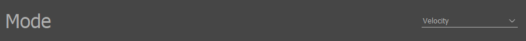

    Mode Parameter in IQ Control Center

PWM
####
Throttle commands will be interpreted as commanding a percentage of the module’s supply voltage in this mode. E.g. a 50% throttle command will command the module to 
apply 50% of its supply voltage as its drive voltage. If the module were powered with a 24V supply, that 50% command would result in a drive voltage of 12V. 

.. note:: If using a battery, as the battery drains, the meaning of commands in this mode will change with it. For example, if the supply voltage in the previous example 
    dipped to 23V, a 50% command would now result in a drive voltage of 11.5V.

.. _throttle_voltage_mode:

Voltage
########
Throttle commands will be interpreted as commanding a percentage of a user configurable voltage range in this mode. This range is set by the *Max Volts* parameter, 
as covered in the :ref:`throttle_maximums` section below. For example, if the maximum voltage is set to 20V and a 50% throttle command is received, a drive voltage of 10V will 
be applied, because that is 50% of the 0V to 20V range.

Note that in this mode the drive voltage a module attempts to apply is independent of the supply voltage of the module, unlike in the PWM mode. Changing battery 
voltage will have no effect on the drive voltages applied in Voltage mode.

.. _throttle_velocity_mode:

Velocity
#########
Throttle commands will be interpreted as commanding a percentage of a user configurable velocity range in this mode. This range is set by the Max Velocity parameter, 
as covered in the :ref:`throttle_maximums` section below. In this mode the module will operate as a closed loop controller, applying the drive voltage needed to maintain the 
commanded velocity. For example, if the maximum velocity is set to 200 rad/s and a 50% throttle command is received, the module will set the drive voltage to attempt 
to maintain a velocity of 100 rad/s, since that is 50% of the 0 rad/s to 200 rad/s range.

.. _throttle_maximums:

Maximums
*********
When operating in the Voltage or Velocity mode as detailed in the :ref:`throttle_mode` section above, the user must configure the maximum voltage or maximum velocity to
use when interpreting throttle commands. 

A 100% throttle command will cause the module to try to spin at the maximum value for that mode. For example, if the module is in Voltage mode, and its
maximum voltage is set to 24V, a 100% throttle command will cause the module to apply a drive voltage of 24V. 

Any throttle command less than 100% will be scaled between 0 and the maximum. If the module is in Voltage mode, and its maximum voltage is set to 24V 
then a 50% throttle command will cause the module to apply a drive voltage of 12V.

Maximum Voltage
################
The maximum voltage is used when the module is configured to use :ref:`throttle_voltage_mode` mode. The maximum voltage can be configured using the *Max Volts* parameter under 
the Tuning tab in IQ Control Center, as shown below.

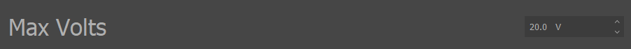

    Max Volts Parameter in IQ Control Center

Maximum Velocity
#################
The maximum velocity is used when the module is configured to use :ref:`throttle_velocity_mode` mode. The maximum velocity can be configured using the *Max Velocity* parameter under the Tuning 
tab in IQ Control Center, as shown below.

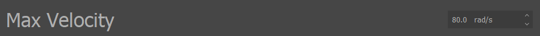

    Max Velocity Parameter in IQ Control Center

.. _throttle_direction:

Direction
**********
Another important configuration to consider before controlling a Vertiq module is the module’s spin direction. Throttle commands can be from -100% to 100%, 
and the sign indicates the intended spin direction. Users can configure what direction a positive throttle command should be interpreted as by configuring 
the direction of the module.

The direction can be clockwise or counterclockwise. When the direction is clockwise, the module will spin clockwise when it receives a positive throttle 
command and counterclockwise when it receives a negative throttle command. When the direction is counterclockwise, the module will spin counterclockwise 
when it receives a positive throttle command and clockwise when it receives a negative throttle command.

For example, if the module’s direction is set to clockwise and a 50% throttle command is received, the module will spin at 50% of its maximum value in 
the clockwise direction. If a -50% throttle command is received, the module will spin at 50% of its maximum value in the counterclockwise direction.

The direction can be set using the *Motor Direction* parameter in the General tab of the IQ Control Center as shown below. Note that this parameter specifies 
whether the module is 2D or 3D as well as if the direction is clockwise or counterclockwise. The 2D and 3D specification does not determine what direction the
motor will spin when receiving a positive throttle command. This is controlled exclusively by the clockwise or counterclockwise designation. The importance 
of the 2D/3D distinction is covered in the :ref:`throttle_mapping` section.

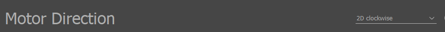

    Motor Direction Parameter in IQ Control Center

.. _throttle_mapping:

Mapping to Throttle
==============================
As mentioned in the :ref:`throttle_sources` section above, IQUART and hobby protocols send throttle commands as a number from 0.0 to 1.0.
These must be mapped onto the full -100% to 100% range that a throttle command can take. This 0.0 to 1.0 number is referred to in the rest of this section as the “raw value.” 
Note that DroneCAN does not require these mappings as DroneCAN throttle commands are sent with explicit signs.

The exact nature of this mapping depends on the Vertiq module's configuration. Specifically it depends on the configuration of *FC 2D/3D Mode* and *Direction* parameters 
in the IQ Control Center. The *FC 2D/3D Mode* parameter can be set to either *2D* or *3D*. The *Direction* parameter can be set to *3D Clockwise*, 
*3D Counterclockwise*, *2D Clockwise*, or *2D Counterclockwise*. The images below show these parameters in the IQ Control Center.

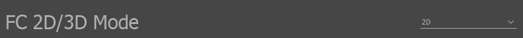

    FC 2D/3D Mode Parameter in IQ Control Center

    Motor Direction Parameter in IQ Control Center

For the mapping, the only portion of the *Direction* parameter that matters is whether it is 2D or 3D. The clockwise or counterclockwise selection only affects what direction a positive 
throttle command means as covered in the :ref:`throttle_direction` section. This means that there are four meaningful combinations of these parameters that will result in 
different mappings. Each of these combinations, and the resulting mapping, is covered below.

.. _throttle_2d_2d_mapping:

FC Mode = 2D, Motor Direction = 2D
************************************
This is the most commonly used configuration. With this setup, raw values map directly to throttle commands, meaning that raw values cannot map to negative throttle commands 
and therefore cannot reverse the module. Raw values will only make the module spin in the module’s configured direction.

The equation below details the conversion from a raw value to a throttle command percentage under this configuration.

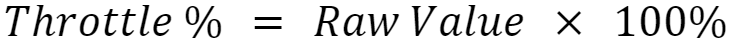

    Raw Value to Throttle Command Mapping Equation (FC Mode = 2D, Motor Direction = 2D)

For example, a raw value of 0.5 will map to a throttle command of 50%, a raw value of 0.0 will map to a throttle command of 0%, and a raw value of 1.0 will map to a throttle 
command of 100%. 

The graph below illustrates this mapping. The X-axis is a raw value, and the Y-axis is the corresponding throttle command percentage.

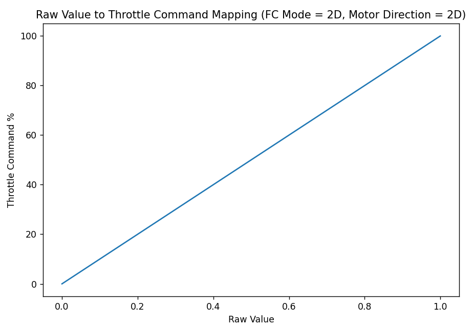

    Raw Value to Throttle Command Mapping Graph (FC Mode = 2D, Motor Direction = 2D)

FC Mode = 3D, Motor Direction = 2D
************************************
This configuration produces identical results to the :ref:`throttle_2d_2d_mapping` configuration, and should generally be avoided in favor of that configuration.

.. _throttle_2d_3d_mapping:

FC Mode = 2D, Motor Direction = 3D
************************************
This configuration allows raw values to map to both negative and positive throttle commands, by splitting the raw value range into negative and positive halves. 
A raw value from 0.0 to 0.5 maps to a throttle command of -100% to 0%, and a raw value from 0.5 to 1.0 maps to a throttle command of 0% to 100%. This configuration 
allows the module to spin in both directions.

The equation below defines the conversion from a raw value to a throttle command percentage under this configuration.

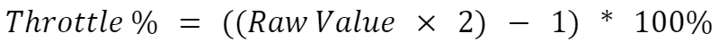

    Raw Value to Throttle Command Mapping Equation (FC Mode = 2D, Motor Direction = 3D)

For example, a raw value of 0.25 will map to a -50% throttle command, a raw value of 0.5 will map to a 0% throttle command, and a raw value of 0.75 will map to 
a 50% throttle command.

The graph below illustrates this mapping. The X-axis is a raw value, and the Y-axis is the corresponding throttle command percentage.

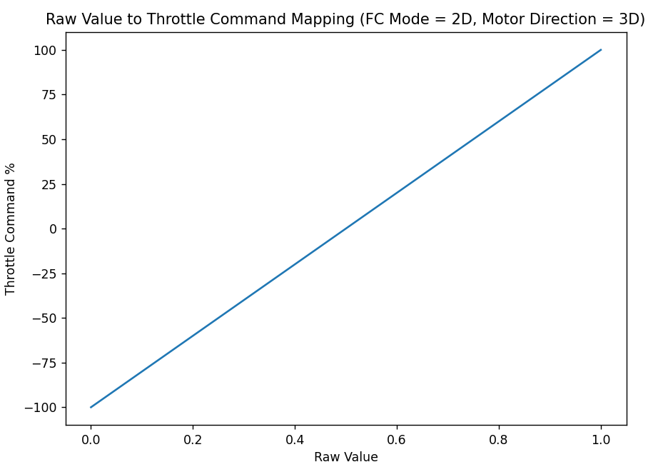

    Raw Value to Throttle Command Mapping Graph (FC Mode = 2D, Motor Direction = 3D)

FC Mode = 3D, Motor Direction = 3D
************************************
This configuration allows the raw value to map to both negative and positive throttle commands, by splitting the raw value range into negative and positive halves. 
Unlike the configuration covered in the :ref:`throttle_2d_3d_mapping` section above, the mapping from raw value to throttle command is not a continuous 
linear function, but a piecewise function. A raw value from 0.0 to 0.5 maps to a throttle command of 0% to -100%. A raw value from 0.5 to 1.0 maps to a throttle 
command of 0% to 100%. This means that a module can be made to spin in both directions with this configuration.

The equation below summarizes how to convert from a raw value to a throttle command percentage with this setup.

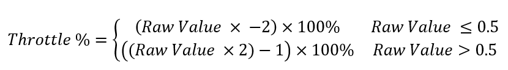

    Raw Value to Throttle Command Mapping Equation (FC Mode = 3D, Motor Direction = 3D)

For example, a raw value of 0.25 will map to -50%, a raw value of 0.5 will map to -100%, and a raw value of 0.75 will map to 50%.

The graph below illustrates this mapping. The X-axis is a raw value, and the Y-axis is the corresponding throttle command percentage. Note the discontinuity 
in the mapping at a raw value of 0.5.

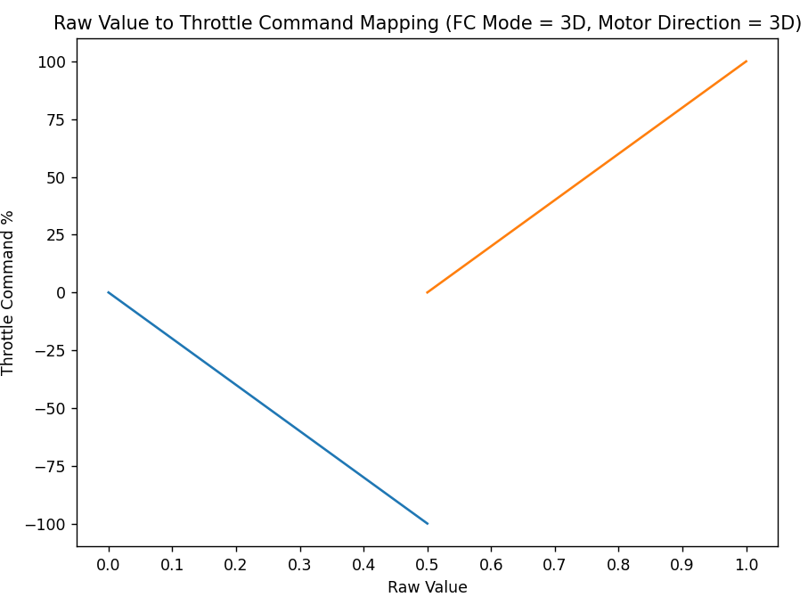

    Raw Value to Throttle Command Mapping Graph (FC Mode = 3D, Motor Direction = 3D)