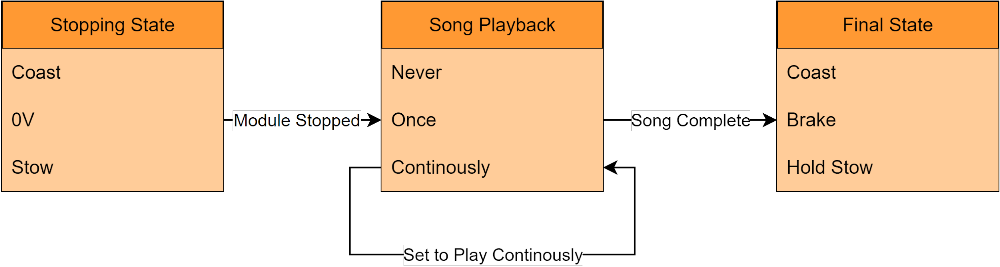

.. include:: ../text_colors.rst
.. toctree::

.. _manual_timeout:

***********************************************
Timeout
***********************************************
Vertiq modules support a timeout that will trigger if they do not receive a new command within a configurable period of time when they are spinning. 
This is intended primarily as a safety feature, to safely stop the module if communication is lost while the module is spinning. Modules will also always 
disarm when a timeout occurs, leaving them in a safe state following a timeout.

.. _timeout_module_support:

Module Support
===============

To see if your module and firmware style supports this feature, please see our :ref:`supported features table <supported_features_table>`.

.. _triggering_timeout:

Triggering Timeout
=====================
Timeouts occur when the module is spinning and has not received a new message or command within its :ref:`timeout period <timeout_period>`. If a module has just rebooted, is 
coasting, or is braking, the timeout will not expire. The countdown only begins when the module receives a command that makes it start spinning or otherwise apply some drive voltage. 

After the countdown begins, any kind of message that the module receives can reset the timeout. A non-exhaustive list of messages that can reset the timeout countdown includes:

* Any :ref:`IQUART <uart_messaging>` message
* Throttle commands over :ref:`hobby protocols <hobby_protocol>`
* Any :ref:`DroneCAN <dronecan_protocol>` message or request that the module will listen to. For a list of supported messages, please see :ref:`standard_dronecan_support`

Configuring Timeout
====================

.. _timeout_period:

Timeout Period
***************
The length of time between messages that will cause a timeout to occur can be configured by the user. This can be set using the *Timeout* parameter under the 
Tuning tab of the IQ Control Center as shown below. If the module is spinning and a new message is not received in the time set by this configuration parameter, 
a timeout will trigger. See the :ref:`triggering_timeout` section for more information.

    Timeout Parameter in IQ Control Center

*Timeout* can be configured using DroneCAN as well, see the :ref:`DroneCAN configuration parameters documentation for details <dronecan_configuration_parameters>`.

.. _timeout_behavior:

Timeout Behavior
*****************
On modules that support it (see :ref:`timeout_module_support` above), the module's timeout behavior is configurable. If a speed module does not support 
configurable timeout behavior, it will always coast and then play its timeout song continuously when a timeout occurs. **Also, the speed module will always disarm 
on a timeout if it was previously armed.** On a servo module, the module will coast on a timeout and not play any timeout song.

On modules with configurable timeout behavior, modules follow a multi-step timeout process when a timeout occurs, similar to the 
:ref:`process that occurs when disarming <advanced_disarming_behavior>`.

**This timeout process consists of 3 basic steps: The module switches how it is driving itself in order to try and come to a** :ref:`stop <stop_detection>` **, plays its timeout song as 
specified by its playback option, and switches to its final drive state.** How the module tries to come to a stop, how many times it plays the timeout song, 
and what final state it ends up in after playing the song are all configurable by the user.

A sample of the timeout song playing only once can be found in our :ref:`status song manual <timeout_song>`.

The image below summarizes this process and the options available at each stage. In the stopping state, the module will set itself to either coast, 
actively try to stop the module by driving it with 0V, or start a stow. When the module is :ref:`stopped <stop_detection>`, the timeout song will play according to 
its playback option. After the song finishes, the motor will either coast, brake, or execute whatever final behavior is specified by the :ref:`stow position <manual_stow_position>` 
feature. Each of these stages and the options at each stage are shown in the image below.

    Summary of Timeout Process and Options

Note that not every combination of the options is possible, e.g. stopping with coast and then ending up in a final state of brake is not an option. The timeout behavior determines how the module will try to come to a stop and what that final drive mode will be. There are 4 options:

* **Coast**: The module will coast itself when a timeout occurs. This means it will spin freely and let drag and friction slow it down. After the song, its final state will be to  remain coasting.
* **0V to Coast**: The module will drive itself to 0V when a timeout occurs, actively trying to come to rapid stop. After the song, its final state will be to coast.
* **0V to Brake**: The module will drive itself to 0V when a timeout occurs, actively trying to come to rapid stop. After the song, its final state will be to brake.
* **Stow**: The module will trigger a stow when a timeout occurs. After the song, its final state will be determined by whatever the stow feature is configured to do after completing a stow. 

These options can all be configured through IQ Control Center through the *Timeout Behavior* parameter, as shown below.

    Timeout Behavior Parameter in IQ Control Center

Timeout Song Playback 
***********************
The timeout song playback option determines if and how many times the module will play its timeout song after coming to a stop. There are 3 options:

* **Never Play**: This option will skip the timeout song entirely. The timeout song will never play, and after stopping the module will transition directly to its final state.
* **Play Once**: The timeout song will play once, and then the module will transition to its final state.
* **Play Continuously**: The timeout song will play continuously until the module is armed again or commanded to spin without arming through IQUART. The module will never transition to its final state, as the song will never finish. For example, if the timeout behavior were set to 0V to Brake, the module would apply 0V until stopped, and then play the song forever, it will never brake as part of the timeout process.

These options can all be configured through IQ Control Center through the *Timeout Song Playback Option* parameter, as shown below.

    Timeout Song Playback Option Parameter in Control Center

.. _timeout_meaning:

Timeout Meaning
*****************
Some users may wish to change the module state once the :ref:`timeout_behavior` is complete. This is configurable through the ``Timeout Meaning`` parameter available 
in the IQ Control Center's advanced tab as shown below.

    Timeout Meaning Parameter in Control Center

After performing its timeout behavior, the module can perform any of the following:

* ``Timeout Error Disarm``

    - The module will perform its :ref:`timeout_behavior`, and the error is treated as a communication error only. After the timeout behavior, the module **is explicitly disarmed**

* ``Trigger Disarm Behavior``

    - The module **will not** perform its :ref:`timeout_behavior`, but will instead perform only its :ref:`disarming behavior <advanced_disarming_behavior>`

* ``Timeout Error Remain Armed``

    - The module will perform its :ref:`timeout_behavior`, and the error is treated as a communication error only. After the timeout behavior, the module **remains armed**