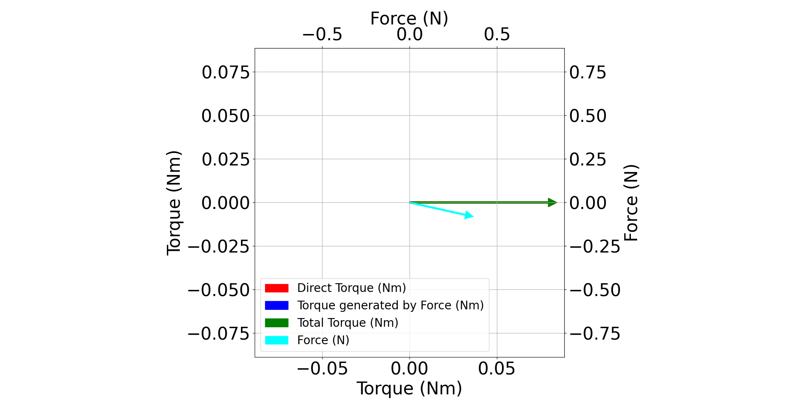
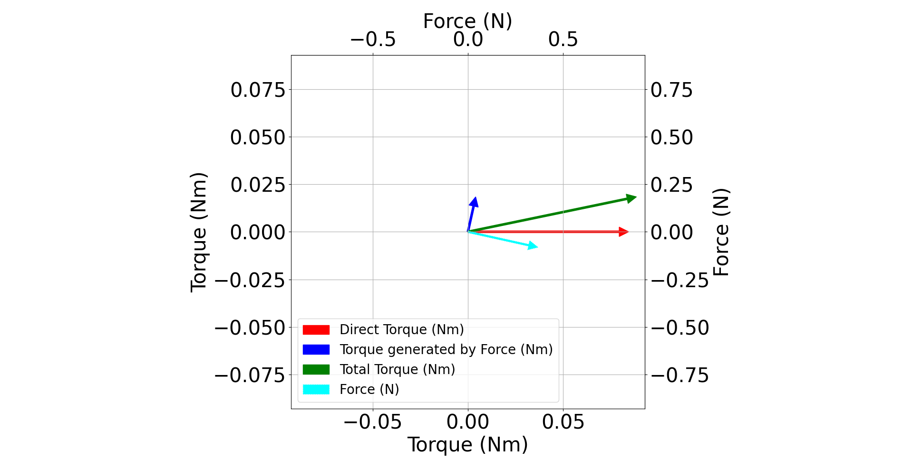
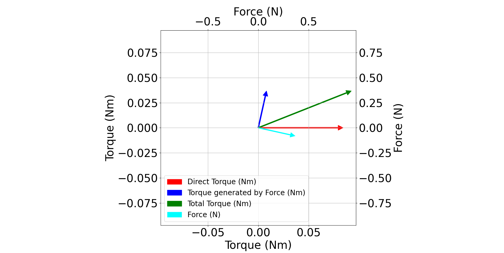
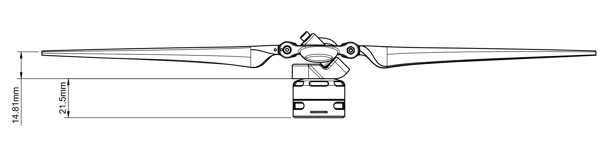

.. include:: ../text_colors.rst
.. toctree::

.. |propeller_name| replace:: UPF-23-12
.. |motor_name| replace:: Vertiq 23-06

.. _correcting_underactuated_torque:

***********************************************
Underactuated Propeller Torque Angle Correction
***********************************************

Module Support
===============

To see if your module and firmware style supports this feature, please see our :ref:`supported features table <supported_features_table>`.

Underactuated propellers can vector force, torque, or a combination of the two. The flapping blades on the |propeller_name| vectors both a force and torque vector. These two vectors are coupled, and always point the same direction relative to each other. In the case of the |propeller_name|, they are approximately 82° apart. This means that the torque vector and torque induced by the force vector happen at slightly different angles. Depending on the height of the propeller above the Center of Mass (CoM), the resulting torque will point in different directions. Some plots showing different heights above the center of mass show how the final torque direction and magnitude can change.

    CCW |propeller_name| 0mm above CoM. In this case Direct Torque is equal to Total Torque so only one is visible. Additionally Torque Generated by Force is 0 due to the moment arm being 0.

    CCW |propeller_name| 50mm above CoM

    CCW |propeller_name| 100mm above CoM

The graphs show that as the propeller is moved higher above the CoM, the more the force contributes to the final torque. Therefore, a correction factor must be introduced.

The defaults files for each underactuated propeller include a calibrated parameter called 'propeller_torque_offset_angle'. This parameter is found in the :ref:`Voltage Superposition Client<vsp_message_table>`, and assumes that the propeller is at the aircraft's CoM. This is most likely incorrect for most aircraft as there is no standardized rotor height. To correct for this, the default calibrated parameter must be offset using the equation below:

.. math::

   -tan^{-1}\biggl(\genfrac{}{}{}{}{7.6h}{h+1.709}\biggr)

In this equation 'h' is the height of the propeller blades above the aircraft's CoM in meters. If the propeller is above the vehicle's center of mass the calculation should result in a negative number. This value must be calculated in radians and then added to the calibrated 'propeller_torque_offset_angle' value which is also in radians. The blades are 14.81mm above the base of the propeller. A more complete drawing is shown below to allow for proper calculation with CAD models of your aircraft.

    |propeller_name| height drawing

An example calculation where the blades are 50mm above the CoM is done below. The propeller is the UPF-23-12 which has a calibrated 'propeller_torque_offset_angle' of 1.75 radians.

.. admonition:: Calculating the Torque Angle Correction for a UPF-23-12 Propeller

    Calibrated 'propeller_torque_offset_angle' = 1.75 radians

    Height of blades above CoM = 50.0mm

    .. math::
        50.0mm = 0.05m
    
    .. math::
        h = 0.05

    .. math::
        -tan^{-1}\biggl(\genfrac{}{}{}{}{7.6*0.05}{0.05+1.709}\biggr)

    .. math::
        -tan^{-1}\biggl(\genfrac{}{}{}{}{0.38}{1.759}\biggr) = -0.2126

    .. math::
        1.75-0.2126 = 1.5374

    **Final 'propeller_torque_offset_angle' = 1.5374**

