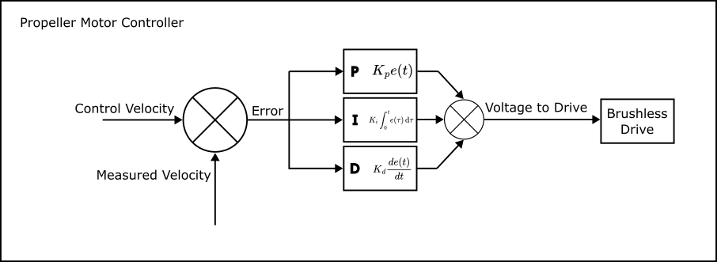
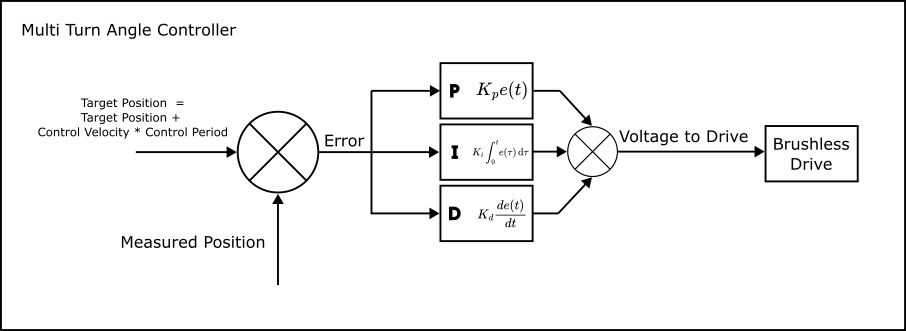
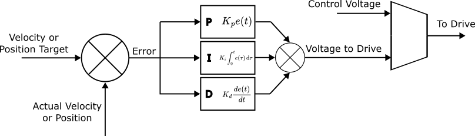
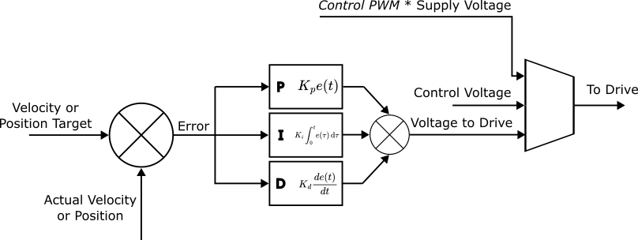
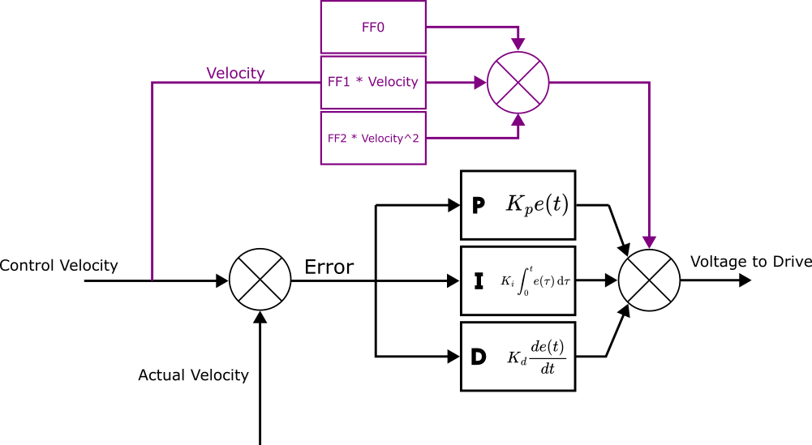
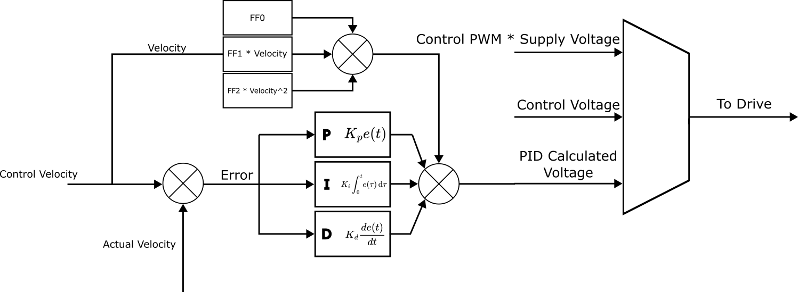

.. include:: ../text_colors.rst
.. toctree::

.. meta:: 
    :description: Comprehensive guide to velocity and voltage control mechanisms, covering Propeller Motor Controller and Multi Turn Angle Controller. Learn about closed-loop PID tuning, feed-forward parameters, and control via PWM, voltage, or velocity commands. 
    :keywords: Velocity Control, Voltage Control, Propeller Motor Controller, Multi Turn Angle Controller, PID Tuning, Feed Forward, PWM Command, Closed Loop Control, Open Loop Control, IQUART, DroneCAN, Linear Velocity, speed module, servo module, python api

.. _manual_velocity_control_mechanisms:

****************************************************
Velocity and Voltage Based Control Mechanisms
****************************************************

Module Support
===============

To see if your module and firmware style supports this feature, please see our :ref:`supported features table <supported_features>`.

===================================
About Velocity and Voltage Control
===================================
Velocity and voltage control provide methods of commanding your Vertiq module to a specified rotational velocity. All Vertiq modules, 
regardless of firmware style (speed or servo), can be controlled via velocity and voltage commands, though the 
underlying implementation of control varies depending on the controllers available on your firmware. Both our 
velocity and position controllers support three methods of setting velocity targets: Control Velocity, Control Voltage, 
and Control PWM. All modules also support control via standard :ref:`Analog Timer Based Protocols <timer_based_protocol>`, with options to map inputs to Control Velocity, Control Voltage, and Control PWM. The inputs are mapped by either the 
:ref:`ESC Propeller Input Parser <esc_propeller_input_parser_ref>` or :ref:`Servo Input Parser <servo_input_parser_ref>`. Vertiq's speed modules 
larger than our 23XX family can also be driven with :ref:`DroneCAN <dronecan_protocol>`.

Throughout this document, we will build up to, and explain our two full controllers in regards to velocity and voltage control.
These controllers are the :ref:`Propeller Motor Controller <propeller_motor_controller>` (left) and :ref:`Multi Turn Angle Controller <multi_turn_angle_control>` (right).

.. list-table:: Full Propeller Motor Controller Left and Full Multi Turn Angle Controller Right
    :class: borderless

    * - .. figure:: ../_static/manual_images/velo_voltage_control/full_propeller_control_system.png
      - .. figure:: ../_static/manual_images/velo_voltage_control/full_multi_turn_system.png

=========================================
Velocity and Voltage Control Mechanisms
=========================================
Control Velocity
+++++++++++++++++++++
Velocity Control Through :ref:`Propeller Motor Controller <propeller_motor_controller>` v. :ref:`Multi Turn Angle Controller <multi_turn_angle_control>`
~~~~~~~~~~~~~~~~~~~~~~~~~~~~~~~~~~~~~~~~~~~~~~~~~~~~~~~~~~~~~~~~~~~~~~~~~~~~~~~~~~~~~~~~~~~~~~~~~~~~~~~~~~~~~~~~~~~~~~~~~~~~~~~~~~~~~~~~~~~~~~~~~~~~~~~~~~~~~~~~~
All *Control Velocity* commands use closed loop PID control in order to control either a target velocity or position. 
The controllers available on each module are firmware dependent. In order to find what controllers are available with your 
module and firmware, please see your module's page available on the left-hand side of this page.

Our :ref:`Propeller Motor Controller <propeller_motor_controller>`, available only while using speed firmware, uses a velocity PID controller in which the input target is 
a velocity, and error is calculated on the difference between the module's actual velocity and the target. 
This is the default controller used when the module receives commands through :ref:`Analog Timer Based Protocols <timer_based_protocol>` or 
:ref:`DroneCAN <dronecan_protocol>`. An important note is that while timer based and DroneCAN commands are passed into the Propeller Motor Controller, whether 
the module uses velocity control depends on the configured :ref:`mode <throttle_mode_maximums_directions>` parameter. Please refer to these linked pages in order to learn more about  
timer based protocols and DroneCAN, and the *mode* parameter.

    Propeller Motor Controller PID Loop

Our :ref:`Multi Turn Angle Controller <multi_turn_angle_control>` (available on all servo firmware and on select speed firmware) is generally meant for angle based control, 
and is detailed more in our :ref:`Angle Control Mechanisms documentation <manual_angle_control_mechanisms>`. It can, however, also control the module's velocity, 
with an important note that it always controls based on a target position. This means that when sent a velocity command, the *Multi Turn Angle Controller* 
advances the displacement angle target at the commanded velocity.

    Multi Turn Motor Controller PID Loop

Due to each PID controller's nature, each reacts differently to changes in the proportional, 
integral, and derivative gains. An important distinction is that even when controlling the *Multi Turn Angle Controller* with a velocity, 
the proportional gain relates to a positional error, the integral gain to the positional error multiplied by time, and the derivative 
gain to velocity error. For the *Propeller Motor Controller*, proportional gain pertains to velocity error, integral to position, and derivative 
to acceleration.  

.. _control_with_prop_motor_control:

Control with Propeller Motor Control
~~~~~~~~~~~~~~~~~~~~~~~~~~~~~~~~~~~~~~
When passed into the *Propeller Motor Controller*, *Control Velocity* is a direct target input into the velocity PID control loop. 
The parameter *ctrl_velocity* is available through the :ref:`Propeller Motor Control Client <propeller_motor_controller>`, and is expressed as a value in 
radians per second. Once set, the module attempts to reach the target velocity. The exact time it takes to reach the setpoint depends on the 
:ref:`module's tuning <tuning_parameters>`.

.. _spin_with_speed_demo:

Demo - Basic Velocity Spinning with the Propeller Motor Controller
--------------------------------------------------------------------
First, if you have not already, please set up your computer to use Vertiq's Python API with the instructions found :ref:`here <getting_started_python_api>`.
   
    .. note:: 
        You must set the ``serial_port`` parameter to the serial port connected to your module.

    .. warning::
        Please remove all propellers from any module you plan on testing. Failure to do so can result in harm to you or others around you. Further, please ensure that your module is secured to a stationary platform or surface before attempting to spin it. 

This example illustrates a basic velocity command with the Propeller Motor Controller. We start by setting the module's 
:ref:`timeout period <manual_timeout>` to 5 seconds to ensure that we will continue to spin, even though we are not 
continuously sending new commands. The module will continue for up to 5 seconds before stopping itself
and performing its :ref:`timeout behavior <timeout_behavior>`. Note that the longest sleep period in the script is 4 seconds, so we will not hit a timeout during this test. 
Then, we set *ctrl_velocity* to :math:`25\frac{rad}{s}` which causes the module to start spinning at :math:`25\frac{rad}{s}`. After 4 seconds, we halt the module by putting it into 
Coast, wait another 2 seconds, and perform the same steps, only this time spinning the module at :math:`-12.5\frac{rad}{s}`. Notice that the module spins in the 
counterclockwise direction when commanded to a positive velocity, and the clockwise direction when commanded to a negative velocity. 
This will always be the case as our modules consider counterclockwise movement as positive.

    .. code-block:: python
        :linenos:

        import iqmotion as iq
        import time

        #Create a SerialCommunicator object for our servo module
        com = iq.SerialCommunicator("COM3")
        module = iq.SpeedModule(com)

        #Set the timeout to a period of 5 seconds
        module.set("propeller_motor_control", "timeout", 5)

        #Command a velocity of 25 rad/s, then wait for 4 seconds
        module.set("propeller_motor_control", "ctrl_velocity", 25)
        time.sleep(4)

        #Set the module to coast, then wait 2 seconds
        module.set("propeller_motor_control", "ctrl_coast")
        time.sleep(2)

        #Command a velocity of -12.5 rad/s, then wait for 4 seconds
        module.set("propeller_motor_control", "ctrl_velocity", -12.5)
        time.sleep(4)

        #Set the module to coast
        module.set("propeller_motor_control", "ctrl_coast")

Control with Multi Turn Angle Control
~~~~~~~~~~~~~~~~~~~~~~~~~~~~~~~~~~~~~~~~
Like the *Propeller Motor Controller*, the *Multi Turn Angle Control* client offers a *ctrl_velocity* entry. The *Multi Turn Angle Control* 
client also provides a unique velocity command, *Control Linear Velocity*. Control Linear Velocity provides a mechanism for controlling 
the velocity of a driven output, for example a belt or lead screw. Information about angular and linear commands can be 
found :ref:`here <Angular v. Linear Control>`.

Demo - Basic Velocity Spinning with the Multi Turn Angle Controller
----------------------------------------------------------------------
First, if you have not already, please set up your computer to use Vertiq's Python API with the instructions found :ref:`here <getting_started_python_api>`.
   
    .. note:: 
        You must set the ``serial_port`` parameter to the serial port connected to your module.

    .. warning::
        Please remove all propellers from any module you plan on testing. Failure to do so can result in harm to you or others around you. Further, please ensure that your module is secured to a stationary platform or surface before attempting to spin it. 

This example illustrates a basic velocity command with the Multi Turn Angle Controller. First, we set *ctrl_velocity* to :math:`25\frac{rad}{s}` which 
causes the module to start spinning. After 4 seconds, we halt the module by putting it into Coast, wait another 2 seconds, 
and perform the same steps, only this time spinning the module at :math:`-12.5\frac{rad}{s}`. Notice that the module spins in the counterclockwise 
direction when commanded to a positive velocity, and the clockwise direction when commanded to a negative velocity. This will always be the case. 
Also, notice that we did not set a new timeout value as we did with the :ref:`Propeller Motor Controller example <spin_with_speed_demo>`. By default, the Multi Turn Angle Controller, 
has a timeout period much higher than 4 seconds, so we do not worry about setting a new value here. 

    .. code-block:: python
        :linenos:

        import iqmotion as iq
        import time

        #Create a SerialCommunicator object for our servo module
        com = iq.SerialCommunicator("COM3")
        module = iq.ServoModule(com)

        #Command a velocity of 25 rad/s, then wait for 4 seconds
        module.set("multi_turn_angle_control", "ctrl_velocity", 25)
        time.sleep(4)

        #Set the module to coast, then wait 2 seconds
        module.set("multi_turn_angle_control", "ctrl_coast")
        time.sleep(2)

        #Command a velocity of -12.5 rad/s, then wait for 4 seconds
        module.set("multi_turn_angle_control", "ctrl_velocity", -12.5)
        time.sleep(4)

        #Set the module to coast
        module.set("multi_turn_angle_control", "ctrl_coast")

Demo - Basic Velocity Command with Linear Velocity
---------------------------------------------------
This example illustrates how linear velocity commands work with the :ref:`Meters per Radian <Angular v. Linear Control>` parameter. 
First, we set *meter_per_rad* to :math:`\frac{1}{5}` (every module rotation of one radian results in :math:`\frac{1}{5}` meters of output). Then, we 
send a command to set the output velocity to :math:`10\frac{m}{s}`. After a coast and wait, we then set the direct Control Velocity to :math:`-10\frac{rad}{s}`. 
You'll see that the two rotational speeds are very different with the first command resulting in motion about 5 times faster than the second.

    .. code-block:: python
        :linenos:

        import iqmotion as iq
        import time

        #Create a SerialCommunicator object for our servo module
        com = iq.SerialCommunicator("COM3")
        module = iq.ServoModule(com)

        #Set Meters Per Radian to 5
        module.set("multi_turn_angle_control", "meter_per_rad", 1 / 5)

        #Command a velocity of 25 rad/s, then wait for 4 seconds
        module.set("multi_turn_angle_control", "ctrl_linear_velocity", 10)
        time.sleep(4)

        #Set the module to coast, then wait 2 seconds
        module.set("multi_turn_angle_control", "ctrl_coast")
        time.sleep(2)

        #Command a velocity of -12.5 rad/s, then wait for 4 seconds
        module.set("multi_turn_angle_control", "ctrl_velocity", -10)
        time.sleep(4)

        #Set the module to coast
        module.set("multi_turn_angle_control", "ctrl_coast")

.. _control_voltage:

Control Voltage
+++++++++++++++++++++
Setting a *Control Voltage* results in the same behavior in both the *Propeller Motor Controller* and *Multi Turn Angle Controller*. 
Setting a Control Voltage is the same as directly setting the calculated output voltage from the PID controller. 
An important note here is that commanding a voltage is essentially performing open loop velocity control in which the commanded voltage 
is multiplied by your module's Kv producing a velocity target. For example, with a module with a Kv of 150, a voltage command of 
2V would result (in the ideal case) in a rotational speed of :math:`300 \text{rpm}`, or :math:`31.41\frac{rad}{s}`. In reality, the output velocity will be close to, 
but not exactly, :math:`31.41\frac{rad}{s}`. In general, the output velocity will be lower than expected due to drag.

You can find *ctrl_volts* in either the :ref:`Propeller Motor Controller <propeller_motor_controller>` or :ref:`Multi Turn Angle Controller <multi_turn_angle_control>` 
depending on the features supported by your module.

Choosing to control between either a *Control Velocity* or a *Control Voltage* is the same as choosing a multiplexed output of the following:

.. _control_voltage_system:

    Open v. Closed Loop Control with Control Voltage v. Control Velocity

Demo - Spinning with Control Voltage
~~~~~~~~~~~~~~~~~~~~~~~~~~~~~~~~~~~~~~
First, if you have not already, please set up your computer to use Vertiq's Python API with the instructions found :ref:`here <getting_started_python_api>`.
   
    .. note:: 
        If your module only suppports the Multi Turn Angle Controller, this example should work identically as with the Propeller Motor Controller. To 
        test this, simply change "propeller_motor_control" to "multi_turn_angle_control" in each command.

    .. note:: 
        You must set the ``serial_port`` parameter to the serial port connected to your module.

    .. warning::
        Please remove all propellers from any module you plan on testing. Failure to do so can result in harm to you or others around you. Further, please ensure that your module is secured to a stationary platform or surface before attempting to spin it. 

In this demo, you will first see the module rotate counterclockwise for 4 seconds, stop for 1 second, and then rotate clockwise for 
4 seconds before stopping again. Note that, like other target commands, counterclockwise is considered the positive direction of rotation. 
We also set the module's :ref:`timeout period <manual_timeout>` to 5 seconds to ensure that it can complete 4 seconds of rotation without interruption.

    .. code-block:: python
        :linenos:

        import iqmotion as iq
        import time

        #Create a SerialCommunicator object for our servo module
        com = iq.SerialCommunicator("COM3")

        # module = iq.SpeedModule(com, extra_clients=clients)
        module = iq.SpeedModule(com)

        #Set the timeout to a period of 5 seconds
        module.set("propeller_motor_control", "timeout", 5)

        #Set our Control Voltage to 1V and hold it for 4 seconds
        module.set("propeller_motor_control", "ctrl_volts", 1)
        time.sleep(4)

        #Set the module to coast, and wait 1 second
        module.set("propeller_motor_control", "ctrl_coast")
        time.sleep(1)

        #Set our Control Voltage to -1V and hold it for 4 seconds
        module.set("propeller_motor_control", "ctrl_volts", -1)
        time.sleep(4)

        #Coast the module
        module.set("propeller_motor_control", "ctrl_coast")

Control PWM
++++++++++++++++
Spinning your module with a Control PWM is very similar in behavior to a :ref:`Control Voltage <control_voltage>`. 
A Control PWM command must be a value [-1, 1], and can be found as *ctrl_pwm* in either the 
:ref:`Propeller Motor Controller <propeller_motor_controller>` or :ref:`Multi Turn Angle Controller <multi_turn_angle_control>` depending on your firmware's style. 
The commanded PWM value is multiplied by the supply voltage in order to create the voltage sent to the module's drive. 

For example, if your module is powered by a 15V supply, and you set a Control PWM of 0.1, your module will apply a Control Voltage of 1.5V. 

Our :ref:`system above <control_voltage_system>` expands to the following, and represents the entirety of the Multi Turn Angle Control loop:

    Open v. Closed Loop Control with Control Voltage v. Control Velocity v. Control PWM and Complete Multi Turn Angle Controller PID Loop

Demo - Spinning with Control PWM
~~~~~~~~~~~~~~~~~~~~~~~~~~~~~~~~~~~
First, if you have not already, please set up your computer to use Vertiq's Python API with the instructions found :ref:`here <getting_started_python_api>`.
    .. note:: 
        If your module only suppports the Multi Turn Angle Controller, this example should work identically as with the Propeller Motor Controller. To 
        test this, simply change "propeller_motor_control" to "multi_turn_angle_control" in each command.

    .. note:: 
        You must set the ``serial_port`` parameter to the serial port connected to your module.

    .. warning::
        Please remove all propellers from any module you plan on testing. Failure to do so can result in harm to you or others around you. Further, please ensure that your module is secured to a stationary platform or surface before attempting to spin it. 

This demonstration is meant to illustrate the similarities between PWM and Voltage control. We are powering our module with a 15V benchtop power 
supply. Therefore, a *PWM Command* of 0.1 should result in the same spin velocity as a *Voltage Command* of 1.5V. You will see this sample 
prints two statements. First, the observed drive velocity when driven by a *Voltage Command* of 1.5V, and the second, the observed drive 
velocity when driven by a *PWM Command* of 0.1. In the PWM case, you will also see the voltage observed at the module's input.  We also 
set the module's :ref:`timeout period <manual_timeout>` to 5 seconds to ensure that it can complete 4 seconds of rotation without interruption.

    .. code-block:: python
        :linenos:

        import iqmotion as iq
        import time

        #Create a SerialCommunicator object for our servo module
        com = iq.SerialCommunicator("COM3")

        # module = iq.SpeedModule(com, extra_clients=clients)
        module = iq.SpeedModule(com)

        #Set the timeout to a period of 5 seconds
        module.set("propeller_motor_control", "timeout", 5)

        #Set our Control Voltage to 1.5V and hold it for 4 seconds
        module.set("propeller_motor_control", "ctrl_volts", 1.5)
        time.sleep(4)

        #Print our observed velocity
        print("Observed velocity with ctrl_volts = 1.5V: ", round(module.get("brushless_drive", "obs_velocity"), 3), "rad/s")

        #Set the module to coast, and wait 1 second
        module.set("propeller_motor_control", "ctrl_coast")
        time.sleep(1)

        #Set our Control Voltage to -1V and hold it for 4 seconds
        module.set("propeller_motor_control", "ctrl_pwm", 0.1)
        time.sleep(4)

        #Print our observed velocity
        print("Observed velocity with observed supply voltage:", round(module.get("brushless_drive", "obs_supply_volts"), 3), "V",  round(module.get("brushless_drive", "obs_velocity"), 3), "rad/s")

        #Coast the module
        module.set("propeller_motor_control", "ctrl_coast")

| The printed output:
| *Observed velocity with ctrl_volts = 1.5V:  20.203 rad/s*
| *Observed velocity with observed supply voltage: 14.929 V 20.495 rad/s*

As expected, the observed velocities in both cases are practically identical.

.. _tuning_parameters:

Tuning Velocity Gains and Parameters
+++++++++++++++++++++++++++++++++++++++
Propeller Motor Control PID Tuning
~~~~~~~~~~~~~~~~~~~~~~~~~~~~~~~~~~~~~~~~~~~~~~~~
As mentioned :ref:`above <control_with_prop_motor_control>`, tuning the Propeller Motor Controller and Multi Turn Angle Controller differs due 
to each controller's nature. For more information about tuning the Multi Turn Angle Controller please see :ref:`Position Control Tuning <position_control_tuning>`.

Our velocity PID controller found in :ref:`Propeller Motor Controller <propeller_motor_controller>` can be tuned as any standard PID controller. 
With this controller, the proportional term acts on a velocity, our integral term on position, and our derivative term on acceleration. 

Velocity Kp
----------------
The velocity proportional gain. Helps to correct speed errors. Higher gain means smaller errors and faster response, but can lead to oscillations and overheating.

Velocity Ki
----------------
The velocity integral gain. Helps to correct steady state speed errors. Higher gain means quicker suppression of steady state errors, but also increased oscillations, overheating, and faster windup. This term is generally not needed.

Velocity Kd
----------------
The velocity derivative gain. Helps to reduce overshoot oscillations. Higher gain means less overshoot from Kp and Ki, but can also introduce higher frequency oscillations and overheating.

Velocity Feed Forward Tuning
~~~~~~~~~~~~~~~~~~~~~~~~~~~~~~
Feed forward terms are those added to the calculated PID control correction, and are based on the reference velocity. 
There are 3 available feed forward parameters settable through the Propeller Motor Controller, Feed Forward 0, 1, and 2. 
Feed Forward 0 is a constant value, Feed Forward 1 is multiplied by the current reference velocity, and Feed Forward 2 
is multiplied by the reference velocity squared.

    Feed Forward Terms in Velocity PID Control

Velocity Feed Forward 0
--------------------------
The 0th order feedforward for the velocity controller. The constant voltage offset. Generally not needed for propellers. Velocity FF0 has units of volts [:math:`V`].

Velocity Feed Forward 1
--------------------------
The 1st order feedforward for the velocity controller. A linear voltage term, which compensates for friction and motor back EMF. We recommend keeping the default value. Velocity FF1 has units of volts per radian per second [:math:`\frac{V}{(\frac{rad}{s})}`].

Velocity Feed Forward 2
--------------------------
The 2nd order feedforward of the velocity controller. Typically compensates for propeller drag. Velocity FF2 has units of volts per radian per second squared [:math:`\frac{V}{(\frac{rad}{s^2})}`].

Full Propeller Motor Controller
~~~~~~~~~~~~~~~~~~~~~~~~~~~~~~~~~~
Accounting for all feed forward and control options, our complete velocity controller is summarized by the following:

    Full Propeller Motor Controller