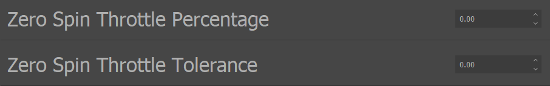
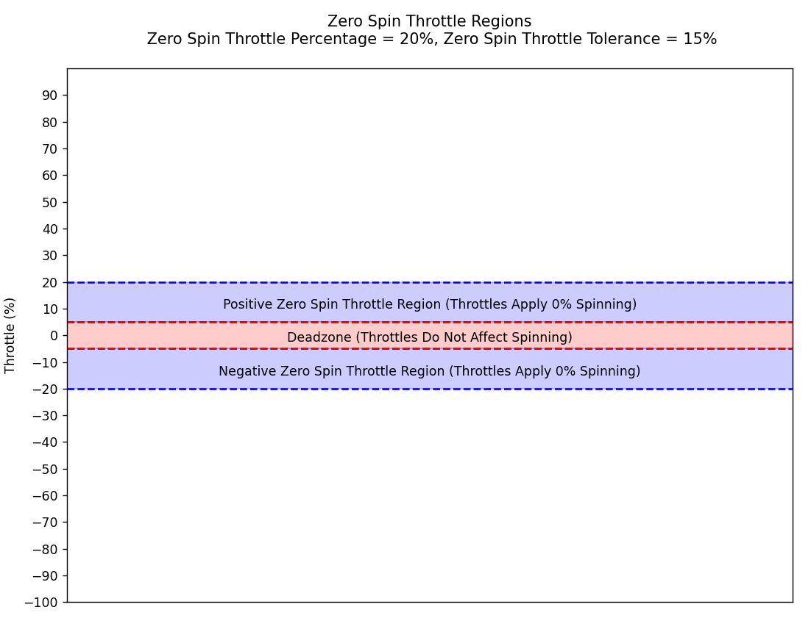
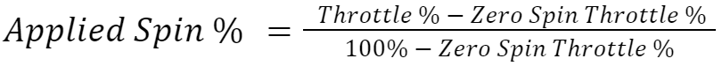
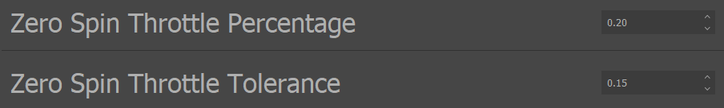

.. include:: ../text_colors.rst
.. toctree::

.. meta:: 
    :description: Configure the Zero Spin Throttle feature to set custom dead zones and scale drive output. Learn how Zero Spin Throttle Percentage and Tolerance affect applied spin without impacting arming logic. 
    :keywords: Zero Spin Throttle, Applied Spin Percentage, Throttle Scaling, Dead Zone, Throttle Tolerance, Throttle Region, IQ Control Center, Throttle Response, Neutral Range, Motor Control

.. _manual_zero_spin:

***********************************************
Configurable Zero Spin Throttle
***********************************************
The Zero Spin Throttle feature allows users to configure what throttle command corresponds to the module spinning at 0% of its maximum drive voltage/speed. 
This also causes all other throttle commands above or below this new zero throttle to scale the drive voltage/speed they apply to the module appropriately. 
See the :ref:`zero_spin_throttle_regions` section for more details.

Note that this does not change how a throttle command is actually parsed for the purposes of arming and disarming or any other features that depend on the 
incoming throttle command, it only affects how quickly a module will spin in response to a throttle command it receives. This is covered in greater detail 
in the :ref:`interaction_with_advanced_arming` section.

.. _zero_spin_module_support:

Module Support
===============

To see if your module and firmware style supports this feature, please see our :ref:`supported features table <supported_features>`.

.. _applied_spin_percentage:

Applied Spin Percentage Definition
===================================
A useful concept to define when discussing the configurable zero spin throttle feature is “applied spin percentage.” This is distinct from the throttle command 
discussed in other sections.

The applied spin percentage determines at what percentage of its maximum drive voltage/speed, which are determined by the modules configuration as detailed in 
the :ref:`throttle_mode_maximums_directions` settings, a module will spin. For example, if the module is in voltage mode and its maximum velocity is 100 rad/s and the applied spin 
percentage resulting from a throttle command is 50%, then the module will spin at 50 rad/s.

Typically, the throttle command and the applied spin percentage are the same. This is why this concept was not needed up to this point. However, when the zero spin 
throttle is not 0%, the applied spin percentage and the throttle command can be different. In that case, the throttle command must be scaled to an applied spin 
percentage that is different from the actual throttle command percentage. The sections below detail how this scaling takes place, and this concept of applied spin 
percentage will be useful during that discussion.

.. _zero_spin_throttle_regions:

Zero Spin Throttle Regions
===========================
The zero spin throttle regions define the throttle regions in which a throttle command translates to a 0% applied spin percentage. A throttle region is a range 
of throttle commands specified by an upper bound and a lower bound. Any throttle that falls within that range or on one of the boundaries is considered to be in 
that throttle region.

There are two symmetrical zero spin throttle regions at any time, one for positive throttle commands and one for negative throttle commands.

The zero spin throttle regions are defined by two parameters that can be set in the IQ Control Center: *Zero Spin Throttle Percentage* and *Zero Spin Throttle Tolerance*. 
These parameters can be seen in the IQ Control Center in the image below.

    Zero Spin Throttle Region Parameters in IQ Control Center

The *Zero Spin Throttle Percentage* defines at what throttle command percentage the zero spin throttle regions begin. **Note that this percentage is used symmetrically 
for the zero spin throttle regions for both positive and negative throttle commands.** For example, if the *Zero Spin Throttle Percentage* is set to 0.10, then the 
zero spin throttle region for positive throttle commands will start at 10%, and the zero spin throttle region for negative throttle commands will start at -10%.

The *Zero Spin Throttle Tolerance* defines how far below the *Zero Spin Throttle Percentage* the zero spin throttle region will extend for positive throttle commands, 
and how far above the *Zero Spin Throttle Percentage* the zero spin throttle region will extend for negative throttle commands. For example, if 
the *Zero Spin Throttle Percentage* is set to 0.10, and the *Zero Spin Throttle Tolerance* is 0.05, then the zero spin throttle regions will be between 5% and 10% and -5% and -10%. 
The figure below illustrates this setup

**Any throttle commands that fall within the zero spin throttle regions will set the** :ref:`applied spin percentage <applied_spin_percentage>` **of the module to 0%.** 

**Any throttle commands in between the two zero spin throttle regions will have no impact on how the module is spinning. The throttle command will be parsed, 
but it will not be applied to change the module’s applied spin percentage. This “dead zone” can be useful for reserving certain throttle regions just for 
special purposes, such as using them for disarming or arming regions.**

The figure below illustrates what the zero spin throttle regions and the dead zone will be if the *Zero Spin Throttle Percentage* is set to 20%, and 
the *Zero Spin Throttle Tolerance* is 15%.

    Illustration of Zero Spin Throttle Regions and Deadzone

Scaling Throttles to Applied Spin Percentages
===============================================
The last important topic to cover is how throttles above the positive zero spin throttle region and below the negative zero spin throttle region are scaled to 
become applied spin percentages. The *Zero Spin Throttle Percentage* defines the lower bound of where a throttle command is translated into a 0% applied spin percentage, 
and every throttle command above that is scaled linearly into an applied spin percentage from 0% to 100%. 

For example, if the *Zero Spin Throttle Percentage* is set to 0.20, then a 60% throttle command will be converted to a 50% applied spin percentage. Since the 0% applied 
spin percentage is at a 20% throttle command in that case, the full range of applied spin percentages is now scaled from 20% to 100% throttle commands. 60% is in 
the middle of this new range, and so it translates to a 50% applied spin percentage. 

The equation below summarizes this scaling.

    Applied Spin Percentage Scaling With Configurable Zero Spin Throttle

Example Zero Spin Throttle Region Setup and Usage
***************************************************
To aid understanding of the zero spin throttle features, this section walks through an example setup in detail. 

For this example, the *Zero Spin Throttle Percentage* will be set to 0.20 and the *Zero Spin Throttle Tolerance* will be set to 0.15. This is the same setup as 
shown in the figure above. The image below shows this setup in the IQ Control Center.

    Zero Spin Throttle Region Configurations for Example

Assume that the module is already armed and will not disarm on any throttle commands, so incoming throttle commands can make the module spin.
For simplicity, assume that the module is configured for velocity mode with a maximum velocity of 100 rad/s, and a clockwise direction. See 
the :ref:`throttle_mode_maximums_directions` section for more information on those configurations.

The list below details a series of sequential throttle commands, and how the module will respond to each one given the configuration detailed above:

#. A 10% throttle command is sent to the module. This will result in 0% applied spin percentage, since that throttle command falls within a zero spin throttle region. So the module will not move. 
#. A 0% throttle command is then sent to the module. That falls into the dead zone, so the module will still not move.
#. If a 40% throttle command is then sent to the module, that will be converted to a 25% applied spin percentage according to Equation 9.1, and the module will begin spinning at 25 rad/s clockwise. 
#. If a -40% throttle command is then sent, that will be converted to a -25% applied spin percentage according to Equation 9.1, which will cause the module to spin at 25 rad/s counterclockwise.
#. Next a 2% throttle command is sent to the module. This falls into the dead zone, so it will not affect the applied spin percentage of the module. It will continue spinning at 25 rad/s counterclockwise.
#. Finally, a 15% throttle command is sent. This falls within a zero spin throttle region, so it will be converted to a 0% applied spin percentage and the module will come to a stop.

.. _interaction_with_advanced_arming:

Interaction with Advanced Arming
=================================
**Changing the zero spin throttle regions affects how a throttle command is converted into an applied spin percentage, but it does not affect how that throttle 
command is parsed for the purposes of** :ref:`arming and disarming <manual_advanced_arming>`. If the arming and disarming throttle regions stay the same, then the same throttle commands 
will arm or disarm the module regardless of the zero spin throttle. The zero spin throttle configurations should have no effect on what throttle commands 
cause the module to arm or disarm. They only change how the throttle commands are converted to an applied spin percentage when the module is armed.