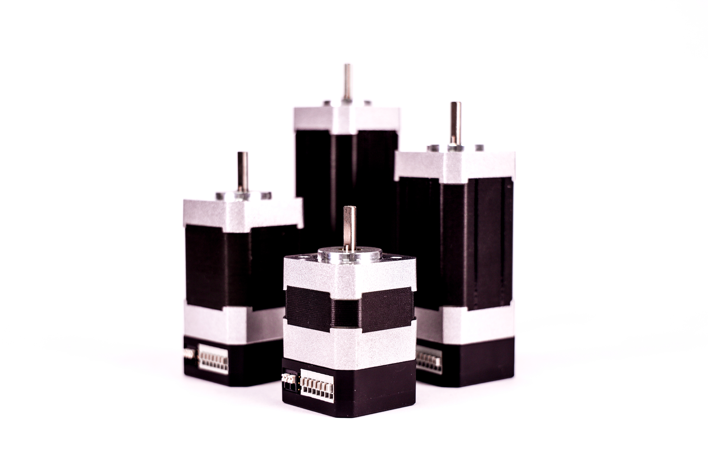

********************************
Fortiq 42-XX Family
********************************

.. csv-table:: Fortiq 42-XX Family of Modules
        :header: "Size", "Default Firmware", "Available Firmware"
        :align: center

        "42-15", "Servo", "Servo, Step/Direction"
        "42-35", "Servo", "Servo, Step/Direction"
        "42-55", "Servo", "Servo, Step/Direction"

The Fortiq 42-XX module is designed for industrial and robotic applications that 
require maximum torque, precision, and efficiency with minimal vibration. Our unique 
hardware design and advanced calibration techniques have allowed us to create the most 
compact and torque-dense industrial servomotor on the market. Vertiq offers 4 versions 
of the Fortiq: **42-15**, **42-35**, **42-55**, **42-75**.

.. note:: 
    The Fortiq has previously been named BLS42, but is now named Fortiq 42-XX.   

    While the default firmware for the Fortiq 42-XX is the Servo Firmware, it also fully supports the following:
    
    * Step Direction Firmware

:download:`Fortiq Module Datasheet <../_static/fortiq_datasheet.pdf>` 

Supported Features
^^^^^^^^^^^^^^^^^^^^^^^^^^^^
        * :ref:`manual_angle_control_mechanisms`
        * :ref:`manual_velocity_control_mechanisms`
        * :ref:`uart_messaging`
        * :ref:`canopen_protocol`
        * :ref:`hobby_protocol`
        * :ref:`manual_timeout`
        * :ref:`manual_adc_interface`
        * :ref:`manual_high_power_pwm_`
        * :ref:`manual_gpio_interface_`
        * :ref:`manual_step_direction`

Supported IQUART Clients
^^^^^^^^^^^^^^^^^^^^^^^^^^^^^^^^^^
        * :ref:`system_control`
        * :ref:`persistent_memory`
        * :ref:`serial_interface`
        * :ref:`brushless_drive`
        * :ref:`multi_turn_angle_control`
        * :ref:`buzzer_control`
        * :ref:`power_monitor`
        * :ref:`anticogging`
        * :ref:`temperature_monitor_microcontroller`
        * :ref:`hobby_input`
        * :ref:`temperature_estimator`
        * :ref:`servo_input_parser_ref`
        * :ref:`coil_temperature_estimator`
        * :ref:`power_safety`
        * :ref:`gpio_controller`
        * :ref:`adc_interface`
        * :ref:`pwm_interface`