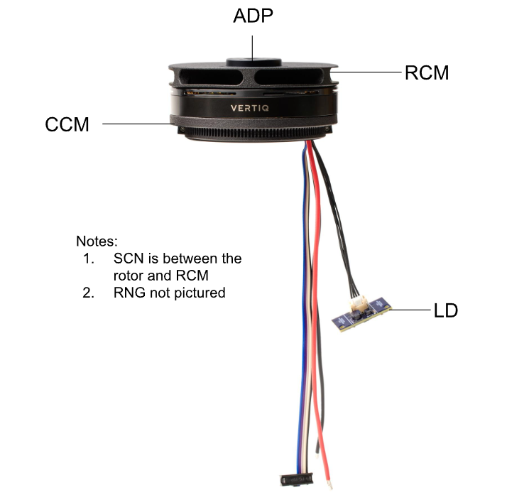

.. _g2_add_on_assembly_instructions:

===============================
G2 Add-On Assembly Instructions
===============================
Vertiq’s second generation (G2) motors and ESCs are designed to be modular, accepting a wide range of mechanical and electrical attachments, or “add-ons,” to improve motor performance or introduce new capabilities. 
“Kits” come with both a module and separate add-ons. The assembly instructions for these add-ons are below. Please see the bottom of the page for visual aids as well.

.. note::
    Please see the :ref:`visual aids <_visual_aids>` at the bottom of this page for more information about the add-ons.

Default Kit
===========
Vertiq’s Default Modules allow customers to test and integrate their modules quickly and easily.
These modules are characterized by a side-eject connector board with solder pads that can accept a wide range of power, communication, and LED wires.

Some (not all) Default Modules come as Kits when Vertiq provides a propeller adapter and accompanying screws.
For electrical interface instructions, please visit the Hardware Setup Walkthrough on your product’s page in ReadTheDocs.
For Default Kits, please follow standard propeller adapter instructions provided by your propeller supplier.

Performance Kit
===============
Vertiq’s Performance Kits showcase the module’s peak performance. These are Default Modules that come with a separate rotor cover. Below is a brief description of the rotor cover and assembly instructions. For electrical interface instructions, please visit the Hardware Setup Walkthrough on your product’s page in ReadTheDocs.

**Description**: The rotor cover is fastened to the top of the motor to increase airflow through the rotor and protect the motor from foreign object debris. The parts that make up the Performance Kit’s Rotor Cover include:

- RCM (Qty. 1) - plastic blower fan made of PA 12 glass-filled nylon
- ADP (Qty. 1) - machined aluminum spacer for propeller adapter 
- SCR (Qty. 3) - M2 screws to fasten the RCM to the motor’s rotor

Assembly Instructions:
~~~~~~~~~~~~~~~~~~~~~~
.. raw:: html 

    <table class="g2_add_on">
        <tr>
            <th>Step</th>
            <th>Description</th>
            <th>Visual</th>
        </tr>
        <tr>
            <td>1</td>
            <td>Place the RCM on the motor’s rotor, aligning the 3 screw holes in the RCM with the 3 screw holes in the spokes of the rotor.</td>
            <td></td>
        </tr>
        <tr>
            <td>2</td>
            <td>Screw the SCRs into the RCM to fasten it to the rotor. We suggest using an appropriate threadlocker, such as Loctite 243, to prevent screws from backing out during operation.</td>
            <td></td>
        </tr>
        <tr>
            <td>3</td>
            <td>Place the ADP in the center of the RCM, aligning its holes with those on the rotor.</td>
            <td></td>
        </tr>
            <td>4</td>
            <td>The customer will need to acquire screws of the appropriate length to go through their propeller, the ADP, and into the rotor. We suggest using an appropriate threadlocker, such as Loctite 243, to prevent screws from backing out during operation.</td>
            <td></td>
    </table>

.. raw:: html

       <!-- Adds spacing -->

Pro Kit
=======
Vertiq’s Pro Kits are designed to give customers the ability to optimize their propulsion system for their vehicle.
Different combinations of these add-ons will result in higher performance, increased IP rating, and/or new functionality. 
Vertiq’s Pro Module has an IP-sealable stator cover and downward-eject wires already attached to the module.
A number of add-ons, including rotor covers, coil covers, stator sealer, and LEDs, come separately and make up the Pro Kit.
Below is a brief description of the add-ons and assembly instructions.

Rotor Cover
~~~~~~~~~~~
**Description**: The rotor cover is fastened to the top of the motor to increase airflow through the rotor and protect the motor from foreign object debris. The parts that make up the Pro Kit’s Rotor Cover include:

- RCM (Qty. 1) - plastic blower fan made of PA 12 glass-filled nylon
- ADP (Qty. 1) - machined aluminum spacer for propeller adapter 
- SCR (Qty. 3) - M2 screws to fasten the RCM to the motor’s rotor
- SCN (Qty. 1) - mesh screen to protect from >1mm debris

Assembly Instructions:
~~~~~~~~~~~~~~~~~~~~~~
.. raw:: html 

    <table class="g2_add_on">
        <tr>
            <th>Step</th>
            <th>Description</th>
            <th>Visual</th>
        </tr>
        <tr>
            <td>1</td>
            <td>Place the SCN over the top of the motor’s rotor, aligning the 3 screw holes in the mesh with the 3 screw holes in the spokes of the rotor.</td>
            <td></td>
        </tr>
        <tr>
            <td>2</td>
            <td>Place the RCM directly on top of the mesh, aligning the 3 screw holes in the RCM with the 3 screw holes in the spokes of the motors. Make sure the mesh, which is sandwiched between the motor and RCM maintains its alignment.</td>
            <td></td>
        </tr>
        <tr>
            <td>3</td>
            <td>Screw the SCRs into the RCM and SCN to fasten them to the rotor. We suggest using an appropriate threadlocker, such as Loctite 243, to prevent screws from backing out during operation.</td>
            <td></td>
        </tr>
        <tr>
            <td>4</td>
            <td>Place the ADP in the center of the RCM, aligning its holes with those on the rotor.</td>
            <td></td>
        </tr>
        <tr>
            <td>5</td>
            <td>The customer will need screws of the appropriate length to go through their propeller, the ADP, and into the rotor. We suggest using an appropriate threadlocker, such as Loctite 243, to prevent screws from backing out during operation.</td>
            <td></td>
        </tr>
    </table>

.. raw:: html

       <!-- Adds spacing -->

Coil Cover
~~~~~~~~~~
**Description**: The coil cover is fastened around the motor and underneath the coils. It is designed to protect the underside of the coils from foreign object debris. The parts that make up the Pro Kit’s Coil Cover include:

- CCM (Qty. 2) - plastic part made of PA 12 glass-filled nylon designed to protect from >1mm debris. Two of these parts are needed for the coil cover.
- SCR (Qty. 2) - M2 screws to fasten the two CCMs together around the motor

Assembly Instructions:
~~~~~~~~~~~~~~~~~~~~~~
.. raw:: html 

    <table class="g2_add_on">
        <tr>
            <th>Step</th>
            <th>Description</th>
            <th>Visual</th>
        </tr>
        <tr>
            <td>1</td>
            <td>Place the two CCMs beneath the coils and around the motor, aligning them with each other to allow the screws to hold them together.  Align the dots of the CCMs with the circuit board on the Default Module or where the cables are on the Pro Kit.</td>
            <td></td>
        </tr>
        <tr>
            <td>2</td>
            <td>Screw the SCRs into the CCMs, ensuring they are securely fastened and the motor can freely rotate.</td>
            <td></td>
        </tr>
    </table>

.. raw:: html

       <!-- Adds spacing -->

Stator Cover Seal
~~~~~~~~~~~~~~~~~~

**Description**: The Pro Kit comes with an IP-sealable stator cover already assembled onto the module. To seal the module to the drone arm, Vertiq provides an O-ring:

- RNG (Qty. 1) - O-ring to prevent liquid ingress into the ESC compartment

Assembly Instructions:
~~~~~~~~~~~~~~~~~~~~~~
.. raw:: html 

    <table class="g2_add_on">
        <tr>
            <th>Step</th>
            <th>Description</th>
            <th>Visual</th>
        </tr>
        <tr>
            <td>1</td>
            <td>Ensure that the drone-arm-side interface between the module and drone arm is a flat surface.</td>
            <td></td>
        </tr>
        <tr>
            <td>2</td>
            <td>Place the RNG in the groove of the module’s stator cover and align the screw holes of the module with those of the drone arm.</td>
            <td></td>
        </tr>
        <tr>
            <td>3</td>
            <td>The customer will need to acquire screws of the appropriate length to fasten their module into the drone arm. We suggest using an appropriate threadlocker, such as Loctite 243, to prevent screws from backing out during operation.</td>
            <td></td>
        </tr>
    </table>

.. raw:: html

       <!-- Adds spacing -->

Power & Communication
~~~~~~~~~~~~~~~~~~~~~
**Description**: The Pro Kit comes with downward eject power and communication wires coming off the ESC. Downward eject wires are necessary to IP-seal the ESC compartment.

Assembly Instructions:
~~~~~~~~~~~~~~~~~~~~~~
.. raw:: html 

    <table class="g2_add_on">
        <tr>
            <th>Step</th>
            <th>Description</th>
        </tr>
        <tr>
            <td>1</td>
            <td>Please see your module's family page to find the wire assembly instructions</td>
        </tr>
        <tr>
            <td>2</td>
            <td>You can find ESC Programming instructions <a href="https://iqmotion.readthedocs.io/en/latest/control_center_docs/control_center_start_guide.html">here</a>.</td>
        </tr>
    </table>

.. raw:: html

       <!-- Adds spacing -->

LED
~~~
**Description**: The Pro Kit comes with an LED, as well as downward eject power and communication wires for the LED:

- LD - LED board capable of white & RGB flashing 

Assembly Instructions:
~~~~~~~~~~~~~~~~~~~~~~
.. raw:: html 

    <table class="g2_add_on">
        <tr>
            <th>Step</th>
            <th>Description</th>
        </tr>
        <tr>
            <td>1</td>
            <td>Connect the LED board to the dedicated wires coming from the ESC downward eject connector board. Further instructions and visuals can be found <a href="https://iqmotion.readthedocs.io/en/latest/manual/manual_stock_led.html">here</a>.</td>
        </tr>
        <tr>
            <td>2</td>
            <td>It is highly recommended to mount the LED heatsink areas to flat metal surfaces to help cool the boards. Please see the <a href="https://www.vertiq.co/s/VERT-LD310_datasheet_preliminary.pdf">LED datasheet for more information on this.</td>
        </tr>
        <tr>
            <td>3</td>
            <td>Find LED programming instructions here: <a href="https://iqmotion.readthedocs.io/en/latest/manual/manual_stock_led.html">Stock LED support</a>, <a href="https://iqmotion.readthedocs.io/en/latest/clients/rgb_led.html">RGB control</a>, and <a href="https://iqmotion.readthedocs.io/en/latest/clients/white_led.html">White control</a>.</td>
        </tr>
    </table>

.. raw:: html

       <!-- Adds spacing -->

.. _visual_aids:

Additional Visual Aids
======================

