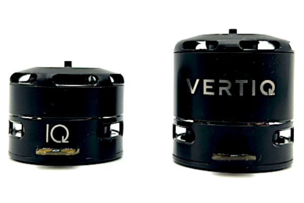
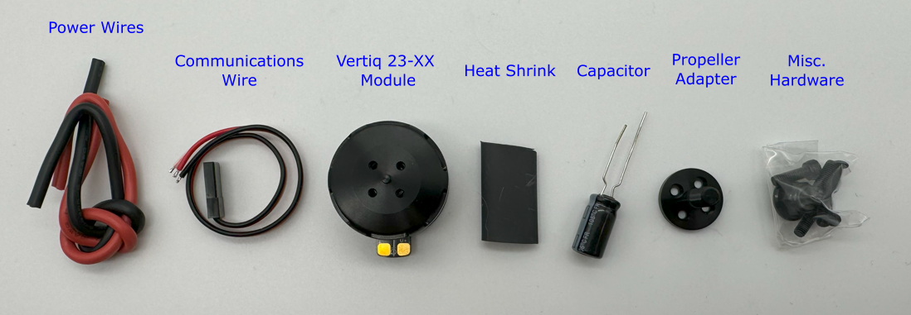
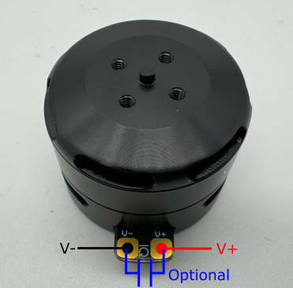
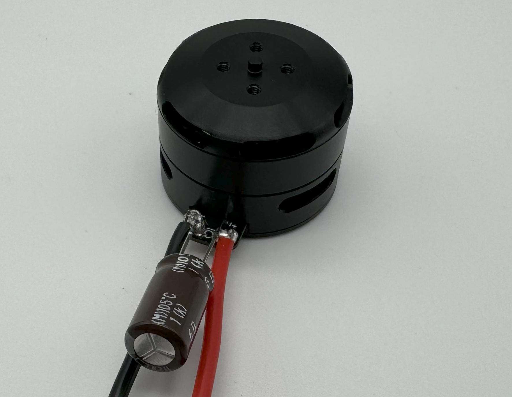
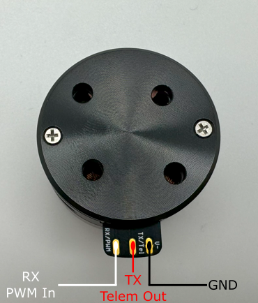
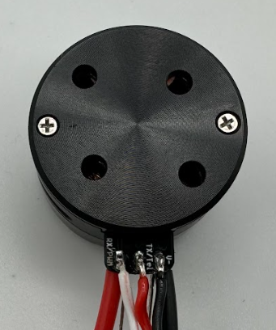
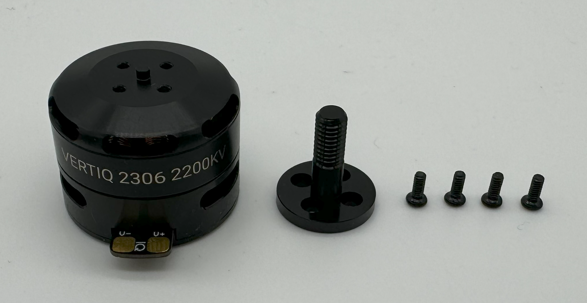
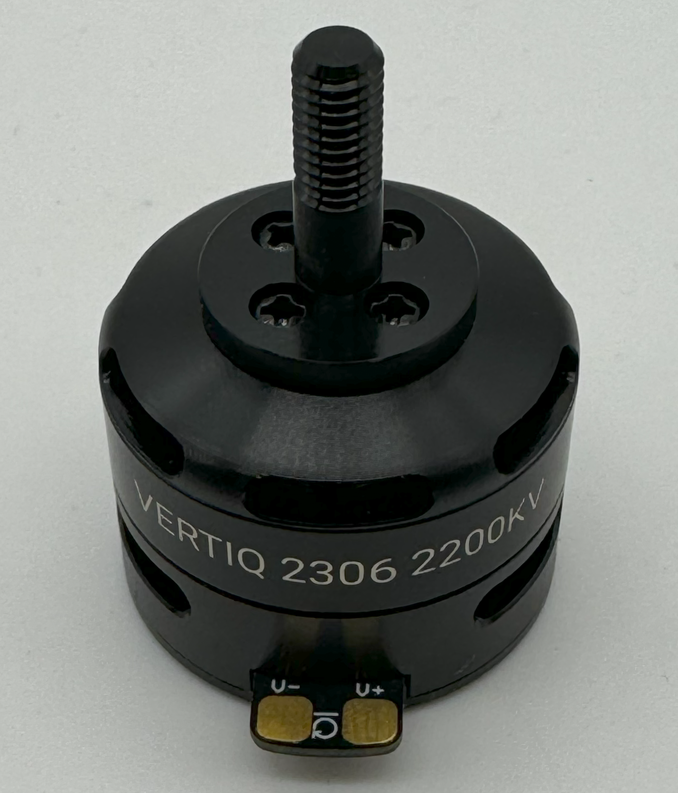
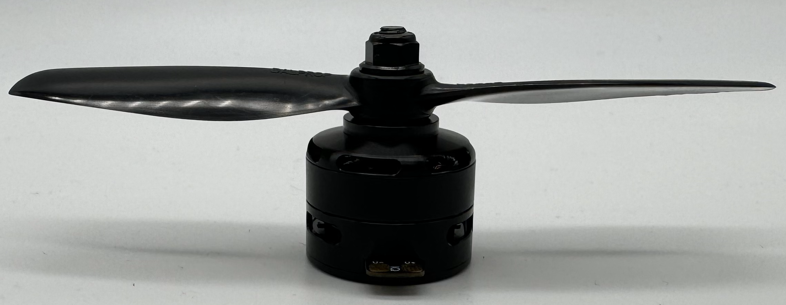

.. _vertiq_23xx_family:

*********************************
Vertiq 23-XX Family 
*********************************

.. csv-table:: Vertiq 23-XX Family of Modules
        :header: "Size", "Kv", "Default Firmware", "Available Firmware"
        :align: center

        "23-06", "220", "Servo", "Servo"
        "23-06", "2200", "Speed", "Speed, Pulsing"
        "23-14", "920", "Speed", "Speed"
        
Hardware Setup Walkthrough
####################################
.. Unique for each module

What's in the Box
********************************************
Every Vertiq 23-XX module is packaged with the following:

        Vertiq 23-XX Family in the Box

* 1 Vertiq 23-XX module
* 1 propeller adapter
* 1 bag of hardware containing
  
        * 4 M2x6 bolts
        * 4 M3x8 bolts
        * 1 M5x0.8 locknut

* 1 communications wire
* 1 set of power wires
* 1 270uF capacitor
* 1 length of heat shrink

If you are missing any components, please contact us at support@vertiq.co. 

.. note::
        The exact color(s) of the provided hardware may differ based on supplier availability.

Pinout and Connectors
********************************************

The Vertiq 23-XX family does not support any connectors, and only accepts direct soldering to the exposed pads.

More information about your module's electrical characteristics and connections can be found in the datasheet provided :ref:`below <23_datasheets>`.

.. note::
        It is highly recommended for your and your module's safety that you shroud all connections with the supplied heat shrink.

.. figure:: ../_static/module_pictures/23xx/23xx_final_with_heatshrink.png
    :width: 400
    :alt: Final 23-XX Connections with Heatshrink

    Final 23-XX Connections with Heatshrink

Power
================

    23-XX Power Connections

All Vertiq 23-XX modules support a minimum of 5.4V and a maximum of 6S power (25.2V) across the power terminals for operation.

.. note::
        If you are driving your Vertiq 23-XX module(s) at a low voltage or near the maximum operating voltage, it is recommended that you connect the provided 270uF 
        capacitor between the power terminals. If you are unsure whether you should or should not include the capacitor, it is safest to include it. 
        You may need to shorten the capacitor's leads in order to solder it properly.

A module with its power lines and capacitor attached should look as follows

    23-XX Power Connections with Capacitor

.. _23xx_comms:

Communication - IQUART or Timer Based Protocol Configuration
===============================================================

    23-XX Communication Connections

In order to use either :ref:`IQUART <uart_messaging>` or any :ref:`Timer Based Protocols <timer_based_protocol>` you will have to connect the supplied communication wire to your module. 
In any scenario, please ensure that the TX line of your module is connected to your controller's RX line, and the RX line 
of your module is connected to your controller's TX line.

Please note that in order to configure your module through the IQ Control Center, to communicate with your module with any of our APIs, or to complete 
any firmware updates you must connect communication wires as each of these uses IQUART communication.

Adding the communication wires to your module results in the following

    23-XX Communication Connections Soldered

Attaching a Propeller for Flight
******************************************
In order to attach a propeller, first find the propeller adapter and M2 bolts from the provided hardware.

.. note::
    For your safety, it is highly recommended that you apply a threadlocker, like Loctite 243, to each screw used to affix your propeller to your module.

    23-XX Propeller Adapter Hardware

Use the bolts to connect the adapter to the module

    23-XX with Propeller Adapter Hardware

Now, find the locknut from the provided hardware as well as the propeller you plan on using.

.. figure:: ../_static/module_pictures/23xx/23xx_prop_setup.png
    :width: 300
    :alt: 23-XX with Propeller Hardware

    23-XX with Propeller Hardware

Place the propeller on the module, tighten the locknut to secure it, and your module is ready to fly.

    23-XX with Propeller

.. warning::
        Please remove the propeller before performing any startup procedures and Getting Started manuals. Failure to do so can be dangerous. 
        Only attach propellers when your modules will be in flight, and all surroundings have been cleared.

Next Steps
********************************************
Now that you have successfully wired your module for use, feel free to complete the :ref:`Getting Started Guide <23_getting_started>` for your module and its firmware style.

.. _23_datasheets:

Additional Mechanical/Electrical Information
**********************************************
For more information about the Vertiq 23-XX family's mechanical and electrical characteristics please visit the correct datasheet for your module using the links below

* `23-06 2200Kv Datasheet <https://www.vertiq.co/s/Vertiq_23-06_2200Kv_module_datasheet_10-2-2023pdf.pdf>`_
* `23-06 220Kv Datasheet <https://www.vertiq.co/s/Vertiq_23-06_220kv_module_datasheet-29rk.pdf>`_
* `23-14 920Kv Datasheet <https://www.vertiq.co/s/Vertiq_23_14_920Kv_module_datasheet-mrh2.pdf>`_

.. _23_getting_started:
.. include:: get_started_text.rst

.. include:: basic_speed_servo_info.rst

.. include:: pulsing_module_info.rst
