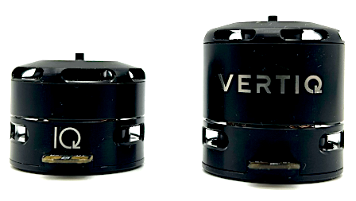

.. _vertiq_23xx_family:

*********************************
Vertiq 23-XX Family 
*********************************

.. csv-table:: Vertiq 23-XX Family of Modules
        :header: "Size", "Kv", "Default Firmware", "Available Firmware"
        :align: center

        "23-06", "220", "Servo", "Servo, Step/Direction"
        "23-06", "2200", "Speed", "Speed, Pulsing"
        "23-14", "920", "Speed", "Servo, Speed"
        
Hardware Setup Walkthrough
===============================

Changing or Updating Firmware
===============================

Please follow the instructions found in :ref:`updating_firmware`

Getting Started
===============================

Complete the correct "Getting Started Guide" for your module's style (if you are using a servo module, please complete "Getting Started with Vertiq Servo Modules")
.. I am putting these just to have some sort of placeholder link. Eventually we'll have actual getting started manuals

        * :ref:`Getting Started with Vertiq Speed Modules <control_center_tutorial>`
        * :ref:`Getting Started with Vertiq Servo Modules <manual_angle_control_mechanisms>`

More Features
===============================

Once you have completed the proper "Getting Started Guide," you can begin to dive deeper into your module's capabilities. Below, you will find
a summary of all features supported on your module, IQUART Clients it can reach, as well as applicable tutorials. Please ensure that you are reading the feature
summary for your module's style.

Speed Module - Supported Features
----------------------------------------------
        * :ref:`manual_advanced_arming`
        * :ref:`manual_zero_spin`
        * :ref:`manual_telemetry`
        * :ref:`manual_hobby`
        * :ref:`controlling_ifci`
        * :ref:`manual_iquart`
        * :ref:`manual_throttle`
        * :ref:`manual_timeout`
        * :ref:`manual_velocity_control_mechanisms`

Speed Module - Supported IQUART Clients
----------------------------------------------
        * :ref:`system_control`
        * :ref:`persistent_memory`
        * :ref:`serial_interface`
        * :ref:`brushless_drive`
        * :ref:`propeller_motor_controller`
        * :ref:`esc_propeller_input_parser_ref`
        * :ref:`buzzer_control`
        * :ref:`power_monitor`
        * :ref:`temperature_monitor_microcontroller`
        * :ref:`hobby_input`
        * :ref:`temperature_estimator`
        * :ref:`coil_temperature_estimator`
        * :ref:`power_safety`
        * :ref:`arming_handler`
        * :ref:`stopping_handler`
        
Speed Module - Supported Tutorials
----------------------------------------------
        * :ref:`control_center_tutorial`
        * :ref:`hobby_fc_tutorial`
        * :ref:`hobby_calibration_tutorial`
        * :ref:`fc_telemetry_tutorial`

Servo Module - Supported Features
----------------------------------------------
        * :ref:`manual_angle_control_mechanisms`
        * :ref:`manual_velocity_control_mechanisms`
        * :ref:`manual_iquart`
        * :ref:`manual_hobby`
        * :ref:`manual_timeout`

Servo Module - Supported IQUART Clients
----------------------------------------------
        * :ref:`system_control`
        * :ref:`persistent_memory`
        * :ref:`serial_interface`
        * :ref:`brushless_drive`
        * :ref:`multi_turn_angle_control`
        * :ref:`buzzer_control`
        * :ref:`power_monitor`
        * :ref:`anticogging`
        * :ref:`temperature_monitor_microcontroller`
        * :ref:`hobby_input`
        * :ref:`temperature_estimator`
        * :ref:`servo_input_parser_ref`
        * :ref:`coil_temperature_estimator`
        * :ref:`power_safety`

Servo Module - Supported Tutorials
----------------------------------------------