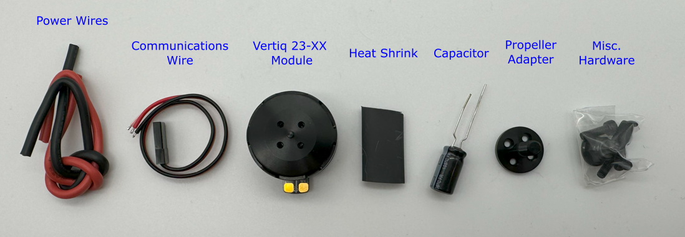
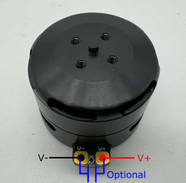
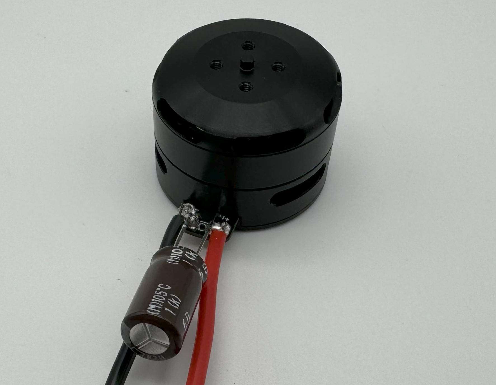
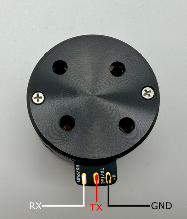

.. _vertiq_23xx_family:

*********************************
Vertiq 23-XX Family 
*********************************

.. image:: ../_static/module_pictures/23xx_family.png
        :alt: Vertiq 23-XX Family
        :width: 500
        :align: center

.. csv-table:: Vertiq 23-XX Family of Modules
        :header: "Size", "Kv", "Default Firmware", "Available Firmware"
        :align: center

        "23-06", "220", "Servo", "Servo"
        "23-06", "2200", "Speed", "Speed, Pulsing"
        "23-14", "920", "Speed", "Speed"
        
Hardware Setup Walkthrough
==============================
.. Unique for each module

What's in the Box
----------------------
Every Vertiq 23-XX module is packaged with the following:

|

* 1 Vertiq 23-XX module
* 1 propeller adapter
* 1 bag of hardware containing
* 4 M2X6 bolts
* 4 M3X8 bolts
* 1 M5x0.8 locknut
* 1 communications wire
* 1 set of power wires
* 1 270uF capacitor
* 1 length of heat shrink

If you are missing any components, please contact us at support@vertiq.co. 

.. note::
        The exact color(s) of the provided hardware may differ based on supplier availability.

Pinout and Connectors
------------------------------

The Vertiq 23-XX family does not support any connectors, and only accepts direct soldering to the exposed pads.

.. note::
        It is highly recommended for your and your module’s safety that you shroud all connections with the supplied heat shrink.

.. figure:: ../_static/module_pictures/23xx_final_with_heatshrink.png
    :width: 40%
    :alt: Final 23-XX Connections with Heatshrink

    Final 23-XX Connections with Heatshrink

Power
^^^^^^^^^^^

    23-XX Power Connections

All Vertiq 23-XX modules support a minimum of 5.4V and a maximum of 6S power (25.2V) across the power terminals for operation.

.. note::
        If you are driving your Vertiq 23-XX module(s) at a low voltage or near the maximum operating voltage, it is recommended that you connect the provided 270uF 
        capacitor between the power terminals. If you are unsure whether you should or should not include the capacitor, it is safest to include it. 
        You may need to shorten the capacitor’s leads in order to solder it properly.

A module with its power lines and capacitor attached should look as follows

    23-XX Power Connections with Capacitor

Communication
^^^^^^^^^^^^^^^^^

    23-XX Communication Connections

.. include:: get_started_text.rst

.. include:: basic_speed_servo_info.rst

.. include:: pulsing_module_info.rst
