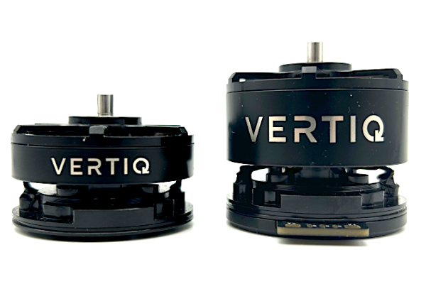

.. _vertiq_40xx_family:

********************************
Vertiq 40-XX Family
********************************

.. csv-table:: Generation 2 Vertiq 40-XX Family of Modules
        :header: "Size", "Kv", "Default Firmware", "Available Firmware"
        :align: center

        "40-06", "370", "Speed", "Speed, Servo"
        "40-06", "770", "Speed", "Speed"
        "40-14", "400", "Speed", "Speed, Servo"

Hardware Setup Walkthrough
####################################
.. Unique for each module

What's in the Box
********************************************
Every Vertiq 40-XX module is packaged with the following:

.. figure:: ../_static/module_pictures/40xx/40xx_in_the_box.png
        :alt: Vertiq 40-XX Family in the Box
        :height: 250

        Vertiq 40-XX Family in the Box

* 1 Vertiq 40-XX module
* 1 bag of hardware containing
  
        * 2 M3x10 bolts
        * 1 propeller adapter

If you are missing any components, please contact us at support@vertiq.co. 

.. note::
        The exact color(s) of the provided hardware may differ based on supplier availability.

Pinout and Connectors
********************************************
The stock Vertiq 40-XX family does not support any connectors, and only accepts direct soldering to the exposed pads.

More information about your module's electrical characteristics and connections can be found in the datasheet provided :ref:`below <40_datasheets>`.

.. note::
        It is highly recommended for your and your module's safety that you shroud all connections with heat shrink. We recommend using 15mm diameter heat shrink with a 2:1 shrink ratio. 

.. warning:: 
        **To ensure the safe and reliable operation of this product, all electrical connections must be properly strain-relieved during aircraft assembly. Failure to do so may result in wire fatigue, breakage, or intermittent electrical contact, which can lead to system malfunction or in-flight failure.**
          * **Strain Relief Required**: All wire harnesses connected to the motor, ESC, or any other component must be secured using appropriate strain relief methods to prevent mechanical stress on solder joints, connectors, and wire insulation.
          * **Bend Radius Consideration**: When routing wires, maintain a minimum bend radius appropriate for the wire gauge and insulation type to avoid excessive stress and long-term degradation.
          * **Dynamic Loading**: Consider vibration, movement, and thermal cycling in your design to ensure wires are not allowed to flex or tug under operational conditions.

.. figure:: ../_static/module_pictures/40xx/40xx_with_heatshirnk.png
        :width: 450
        :alt: Vertiq 40-XX Family with Heatshrink

        Final Vertiq 40-XX with Heatshrink

Power
================

        Vertiq 40-XX Power Connections

All Vertiq 40-XX modules are rated for a maximum 6S (25.2V) across the power terminals V+ and V-. It is recommended that the supplied voltage remain between 5.5 and 26.1V at all times.

Please ensure that you select power wiring suitable for your application. Failure to do so can result in dangers like short circuits and fire. In this example, 
we will be using a pre-tinned XT-30 male connector. Simply solder the connector's positive terminal to V+ and the negative terminal to V-.

        Vertiq 40-XX with Power Connectors

.. _40xx_comms:

Communication
================

Required IQUART or Timer Based Configuration
~~~~~~~~~~~~~~~~~~~~~~~~~~~~~~~~~~~~~~~~~~~~~~~

        Vertiq 40-XX Serial Connections

In order to use either :ref:`IQUART <uart_messaging>` or any :ref:`Timer Based Protocols <timer_based_protocol>` you will have to connect communication wiring to your module. 
In any scenario, please ensure that the TX line of your module is connected to your controller's RX line, and the RX line 
of your module is connected to your controller's TX line.

Please note that in order to configure your module through the IQ Control Center, to communicate with your module with any of our APIs, or to complete 
any firmware updates you must connect communication wires as each of these uses IQUART communication.

In this example, we are using a premade Servo Jr cable

.. figure:: ../_static/module_pictures/40xx/40xx_with_servo.png
        :width: 450
        :alt: Vertiq 40-XX with Serial Cable

        Vertiq 40-XX with Serial Cable

Adding the communication wires to your module results in the following

        Vertiq 40-XX with Serial Cable Connected

If you intend to control your module with the DroneCAN (previously UAVCAN) protocol, please continue on to DroneCAN Configuration.

Optional DroneCAN Configuration
~~~~~~~~~~~~~~~~~~~~~~~~~~~~~~~~~~~~~~~~~~~~

You will find the CANBUS (CAN) connections on the underside of the module

The board supports up to two CAN connections, both of which are connected to the same peripheral allowing for a true bus connection through the motor. 
This configuration does not allow dual CAN redundancy.

        Vertiq 40-XX Family CAN Connections

In this example, we will be using a DroneCAN Micro Connector based on a JST-GH 4-Pin connector soldered to one CANH CANL pair. We will not connect a 
5V bus connection, but will solder the ground connection to common ground on the module's top side. More information about DroneCAN connections 
can be found `here <https://dronecan.github.io/Specification/8._Hardware_design_recommendations/>`_.

.. figure:: ../_static/module_pictures/40xx/40xx_with_can_cable.png
        :width: 450
        :alt: Vertiq 40-XX with CAN Cable

        Vertiq 40-XX with CAN Cable

.. figure:: ../_static/module_pictures/40xx/40xx_can_connected1.png
        :width: 450
        :alt: Vertiq 40-XX with CAN Cable Connected

        Vertiq 40-XX with CAN Cable Connected

.. figure:: ../_static/module_pictures/40xx/40xx_can_connected2.png
        :width: 450
        :alt: Vertiq 40-XX with CAN Cable Connected

        Vertiq 40-XX with CAN Cable Connected

Attaching a Propeller for Flight
******************************************

.. note::
    It is highly recommended to apply a threadlocker, like Loctite 243, to each of the screws when attaching to the module.

In order to attach a propeller, first, find the propeller adapter and M3 bolts from the provided hardware.

.. figure:: ../_static/module_pictures/40xx/40xx_with_prop.png
        :width: 450
        :alt: Vertiq 40-XX with Propeller Hardware

        Vertiq 40-XX with Propeller Hardware

Fit your propeller onto the center of the module. Then while holding the propeller in place, place the propeller adapter on top, and secure down with the bolts. 

        Vertiq 40-XX with Propeller

.. note::
        Depending on the thickness of your propeller's hub, you may need to use longer or shorter M3 bolts. Please ensure that all 
        propellers are secured such that there is no wobble. Failure to do so can result in flight failure which can result in damage to you, your modules, 
        and your vehicle. 

.. warning::
        Please remove the propeller before performing any startup procedures and Getting Started manuals. Failure to do so can be dangerous. 
        Only attach propellers when your modules will be in flight, and all surroundings have been cleared.

Next Steps
********************************************
Now that you have successfully wired your module for use, feel free to complete the :ref:`Getting Started Guide <40_getting_started>` for your module and its firmware style.

.. _40_datasheets:

Additional Mechanical/Electrical Information
**********************************************
For more information about the Vertiq 40-XX family's mechanical and electrical characteristics please visit the correct datasheet for your module using the links below

* `40-06 370Kv G2 Datasheet <https://www.vertiq.co/s/VERT-M341-E200-Vertiq_40-06_370Kv_datasheet.pdf>`_
* `40-06 770Kv G2 Datasheet <https://www.vertiq.co/s/VERT-M411-E200-Vertiq_40-06_770Kv_datasheet.pdf>`_
* `40-14 400Kv G2 Datasheet <https://www.vertiq.co/s/VERT-M351-E200-Vertiq_40-14_400Kv_datasheet.pdf>`_

.. _40_getting_started:
.. include:: get_started_text.rst

.. include:: advanced_speed_servo_info.rst