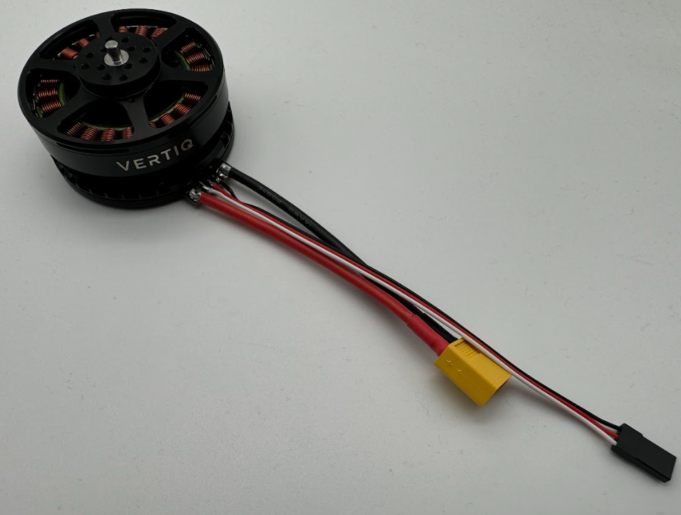
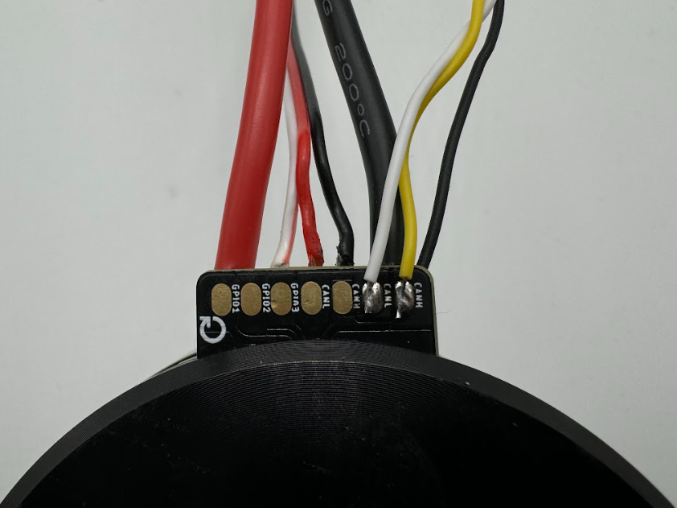

.. _vertiq_60xx_family:

********************************
Vertiq 60-XX Family
********************************

.. csv-table:: Generation 2 Vertiq 60-XX Family of Modules
        :header: "Size", "Kv", "Default Firmware", "Available Firmware"
        :align: center

        "60-08", "150", "Speed", "Speed, Servo"
        "60-08", "300", "Speed", "Speed"
        "60-08", "660", "Speed", "Speed"

Hardware Setup Walkthrough
####################################
.. Unique for each module

What's in the Box
********************************************
Every Vertiq 60-XX module is packaged with the following:

        Vertiq 60-XX Family in the Box

* 1 Vertiq 60-XX module

If you are missing any components, please contact us at support@vertiq.co. 

.. note::
        The exact color(s) of the provided hardware may differ based on supplier availability.

Pinout and Connectors
********************************************
The stock Vertiq 60-XX family does not support any connectors, and only accepts direct soldering to the exposed pads.

More information about your module's electrical characteristics and connections can be found in the datasheet provided :ref:`below <60_datasheets>`.

.. note::
        It is highly recommended for your and your module's safety that you shroud all connections with heat shrink. We recommend using 18mm diameter heat shrink with a 3:1 shrink ratio. 

        Final Vertiq 60-XX with Heatshrink

Power
================

        Vertiq 60-XX Power Connections

All Vertiq 60-XX modules are rated for a maximum 12S (50.4V) across the power terminals V+ and V-.

Please ensure that you select power wiring suitable for your application. Failure to do so can result in dangers like short circuits and fire. In this example, 
we will be using a pre-tinned XT-60 male connector. Simply solder the connector's positive terminal to V+ and the negative terminal to V-.

        Vertiq 60-XX with Power Connectors

.. _60xx_comms:

Communication
================

Required IQUART or Hobby Configuration
~~~~~~~~~~~~~~~~~~~~~~~~~~~~~~~~~~~~~~~~~~~~

        Vertiq 60-XX Serial Connections

In order to use either :ref:`IQUART <uart_messaging>` or any :ref:`Hobby Protocols <hobby_protocol>` you will have to connect communication wiring to your module. 
In any scenario, please ensure that the TX line of your module is connected to your controller's RX line, and the RX line 
of your module is connected to your controller's TX line.

Please note that in order to configure your module through the IQ Control Center, to communicate with your module with any of our APIs, or to complete 
any firmware updates you must connect communication wires as each of these uses IQUART communication.

In this example, we are using a premade Servo Jr cable

        Vertiq 60-XX with Serial Cable

Adding the communication wires to your module results in the following

        Vertiq 60-XX with Serial Cable Connected

If you intend to control your module with the DroneCAN (previously UAVCAN) protocol, please continue on to DroneCAN Configuration.

Optional DroneCAN Configuration
~~~~~~~~~~~~~~~~~~~~~~~~~~~~~~~~~~~~~~~~~~~~

You will find the CANBUS (CAN) connections on the underside of the module

The board supports up to two CAN connections, both of which are connected to the same peripheral allowing for a true bus connection through the motor. 
This configuration does not allow dual CAN redundancy.

        Vertiq 60-XX Family CAN Connections

In this example, we will be using a DroneCAN Micro Connector based on a JST-GH 4-Pin connector soldered to one CANH CANL pair. We will not connect a 
5V bus connection, but will solder the ground connection to common ground on the module's top side. More information about DroneCAN connections 
can be found `here <https://dronecan.github.io/Specification/8._Hardware_design_recommendations/>`_.

        Vertiq 60-XX with CAN Cable

.. figure:: ../_static/module_pictures/60xx/60xx_can_connected1.png
        :width: 450
        :alt: Vertiq 60-XX with CAN Cable Connected

        Vertiq 60-XX with CAN Cable Connected

        Vertiq 60-XX with CAN Cable Connected

Attaching a Propeller for Flight
******************************************

.. note::
    It is highly recommended to apply a threadlocker, like Loctite 243, to each of the M3 screws when attaching to the module.

The exact setup will differ for each propeller. Please follow the instructions supplied with your specific propeller.

.. warning::
        Please remove the propeller before performing any startup procedures and Getting Started manuals. Failure to do so can be dangerous. 
        Only attach propellers when your modules will be in flight, and all surroundings have been cleared.

Next Steps
********************************************
Now that you have successfully wired your module for use, feel free to complete the :ref:`Getting Started Guide <60_getting_started>` for your module and its firmware style.

.. _60_datasheets:

Additional Mechanical/Electrical Information
**********************************************
For more information about the Vertiq 60-XX family's mechanical and electrical characteristics please visit the correct datasheet for your module using the links below

* `60-08 Module Page <https://www.vertiq.co/60-08-g2>`_

.. _60_getting_started:
.. include:: get_started_text.rst

.. include:: advanced_speed_servo_info.rst