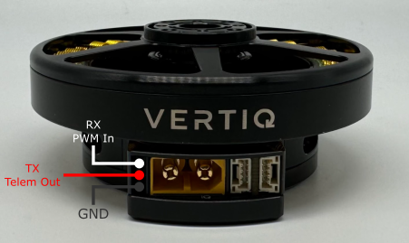

********************************
Vertiq 81-XX Family
********************************

.. image:: ../_static/module_pictures/81xx/81xx_family.png
        :alt: Vertiq 81-XX Family
        :width: 500
        :align: center

|

.. csv-table:: Vertiq 81-XX Gen 1 Family of Modules
        :header: "Size", "Kv", "Default Firmware", "Available Firmware"
        :align: center

        "81-08", "85", "Speed", "Speed, Servo"
        "81-08", "150", "Speed", "Speed, Servo"
        "81-08", "220", "Speed", "Speed, Servo"

.. csv-table:: Vertiq 81-XX Gen 2 Family of Modules
        :header: "Size", "Kv", "Default Firmware", "Available Firmware"
        :align: center

        "81-08", "85", "Speed", "Speed, Servo"
        "81-08", "140", "Speed", "Speed"
        "81-08", "240", "Speed", "Speed"

81-08 Generation 1 Hardware Setup Walkthrough
##################################################
.. Unique for each module

What's in the Box
********************************************
Every Vertiq 81-XX Generation 1 module is packaged with the following

        Vertiq 81-XX Generation 1 in the Box

|

* 1 Vertiq Generation 1 81-XX module

Pinout and Connectors
********************************************

Power
================

        Vertiq 81-XX Gen 1 Power Connections

All Vertiq 81-XX Gen 1 modules feature an embedded XT-60 male connector for power. To power your module, simply fit your power supply with 
an XT-60 female connector ensuring that your power source's V+ goes to the module's V+ and V- to V-.

All Vertiq 81-XX Gen 1 modules are rated for a maximum 12S (50.4V) across the power terminals V+ and V-. It is recommended that the supplied voltage remain between 
12 and 48V at all times.

Please ensure that you select power wiring suitable for your application. Failure to do so can result in dangers like short circuits and fire. 

Communication
================

Required IQUART or Hobby Configuration
~~~~~~~~~~~~~~~~~~~~~~~~~~~~~~~~~~~~~~~~~~~~

        Vertiq 81-XX Gen 1 Family Serial Connections

In order to use either :ref:`IQUART <uart_messaging>` or any :ref:`Hobby Protocols <manual_hobby>` you will have to connect the supplied communication wire to your module. 
In any scenario, please ensure that the TX line of your module is connected to your controller's RX line, and the RX line 
of your module is connected to your controller's TX line.

Please note that in order to configure your module through the IQ Control Center, to communicate with your module with any of our APIs, or to complete 
any firmware updates you must connect communication wires as each of these uses IQUART communication.

In this example, we are using a premade Servo Jr cable. No soldering is necessary, simply plug in the connector with the black cable facing down.

.. figure:: ../_static/module_pictures/81xx/gen1/81_with_serial_cable_out.png
        :width: 400
        :alt: Vertiq 81-08 Gen 1 with Serial Cable

        Vertiq 81-08 Gen 1 with Serial Cable

.. figure:: ../_static/module_pictures/81xx/gen1/81_with_serial_cable.png
        :width: 400
        :alt: Vertiq 81-08 Gen 1 with Serial Cable Connected

        Vertiq 81-08 Gen 1 with Serial Cable Connected

If you intend to control your module with the DroneCAN (previously UAVCAN) protocol, please continue on to DroneCAN Configuration.

Optional DroneCAN Configuration
~~~~~~~~~~~~~~~~~~~~~~~~~~~~~~~~~~~~~~~~~~~~

        Vertiq 81-XX Gen 1 CAN Connections

81-XX Gen 1 modules use the DroneCAN Micro Connector based on a JST-GH 4-Pin connector with the male end embedded into the module. The modules do not support the 5V bus connection, 
but do connect the ground connection to common ground. More information about DroneCAN connections can be found `here <https://dronecan.github.io/Specification/8._Hardware_design_recommendations/>`_.

To connect with the module's DroneCAN node, simply make a cable with a JST-GH 4-Pin connector with the correct wiring, and plug it in.

.. figure:: ../_static/module_pictures/81xx/gen1/81xx_with_can_cable.png
        :width: 400
        :alt: Vertiq 81-08 Gen 1 with CAN Cable

        Vertiq 81-08 Gen 1 with CAN Cable

.. figure:: ../_static/module_pictures/81xx/gen1/81xx_with_can_connected.png
        :width: 400
        :alt: Vertiq 81-08 Gen 1 with CAN Cable Connected

        Vertiq 81-08 Gen 1 with CAN Cable Connected

Next Steps
********************************************
Now that you have successfully wired your module for use, feel free to complete the :ref:`Getting Started Guide <81_getting_started>` for your module and its firmware style.

81-08 Generation 2 Hardware Setup Walkthrough
##################################################
.. Unique for each module

What's in the Box
********************************************
Every Vertiq 81-XX Generation 2 module is packaged with the following

        Vertiq 81-XX Generation 2 in the Box

|

* 1 Vertiq Generation 2 81-XX module

Pinout and Connectors
********************************************
The Vertiq 81-XX Generation 2 family does not support any connectors, and only accepts direct soldering to the exposed pads.

.. note::
        It is highly recommended for your and your module's safety that you shroud all connections with the supplied heat shrink. 
        We recommend using a ¾” diameter heat shrink with a 3:1 shrink ratio. 

Final module with all connections and heat shrink

.. figure:: ../_static/module_pictures/81xx/gen2/81_gen2_fully_connected.png
        :width: 500
        :alt: Vertiq 81-XX Gen 2 Family with Heatshrink

        Final Vertiq 81-XX Gen 2 Family with Heatshrink

Power
================

        Vertiq 81-XX Gen 2 Power Connections

All Vertiq 81-XX Gen 2 modules are rated for a maximum 12S (50.4V) across the power terminals V+ and V-. It is recommended that the supplied voltage 
remain between 12 and 48V at all times.

Please ensure that you select power wiring suitable for your application. Failure to do so can result in dangers like short circuits and fire. 
In this example, we will be using a pre-tinned XT-60 male connector. Simply solder the connector's positive terminal to V+ and the negative terminal to V-.

.. figure:: ../_static/module_pictures/81xx/gen2/81gen2_power_connected.png
        :height: 400
        :alt: Vertiq 81-XX Gen 2 Power Connected

        Vertiq 81-XX Gen 2 Power Connected

Communication
================

Required IQUART or Hobby Configuration
~~~~~~~~~~~~~~~~~~~~~~~~~~~~~~~~~~~~~~~~~~~~

.. figure:: ../_static/module_pictures/81xx/gen2/81gen2_serial.png
        :height: 400
        :alt: Vertiq 81-XX Gen 2 Serial Connections

        Vertiq 81-XX Gen 2 Serial Connections

In order to use either :ref:`IQUART <uart_messaging>` or any :ref:`Hobby Protocols <manual_hobby>` you will have to connect the supplied communication wire to your module. 
In any scenario, please ensure that the TX line of your module is connected to your controller's RX line, and the RX line 
of your module is connected to your controller's TX line.

Please note that in order to configure your module through the IQ Control Center, to communicate with your module with any of our APIs, or to complete 
any firmware updates you must connect communication wires as each of these uses IQUART communication.

In this example, we are using a premade Servo Jr cable

.. figure:: ../_static/module_pictures/81xx/gen2/81gen2_serial_cables.png
        :height: 400
        :alt: Vertiq 81-XX Gen 2 Serial Cables

        Vertiq 81-XX Gen 2 Serial Cables

.. figure:: ../_static/module_pictures/81xx/gen2/81gen2_serial_connections.png
        :height: 400
        :alt: Vertiq 81-XX Gen 2 Serial Connections

        Vertiq 81-XX Gen 2 Serial Connections

If you intend to control your module with the DroneCAN (previously UAVCAN) protocol, please continue on to DroneCAN Configuration.

Optional DroneCAN Configuration
~~~~~~~~~~~~~~~~~~~~~~~~~~~~~~~~~~~~~~~~~~~~

You will find the CAN connections on the underside of the module

        Vertiq 81-XX Gen 2 CAN Connections

In this example, we will be using a DroneCAN Micro Connector based on a JST-GH 4-Pin connector soldered to one CANH CANL pair. We will not connect a 
5V bus connection, but will solder the ground connection to common ground on the module's top side. More information about DroneCAN connections 
can be found `here <https://dronecan.github.io/Specification/8._Hardware_design_recommendations/>`_.

.. figure:: ../_static/module_pictures/81xx/gen2/81gen2_can_cables.png
        :height: 400
        :alt: Vertiq 81-XX Gen 2 CAN Cables

        Vertiq 81-XX Gen 2 CAN Cables

.. figure:: ../_static/module_pictures/81xx/gen2/81gen2_can_cables_connected1.png
        :height: 400
        :alt: Vertiq 81-XX Gen 2 CAN Cables Connected

        Vertiq 81-XX Gen 2 CAN Cables Connected

.. figure:: ../_static/module_pictures/81xx/gen2/81gen2_can_cables_connected2.png
        :height: 400
        :alt: Vertiq 81-XX Gen 2 CAN Cables Connected

        Vertiq 81-XX Gen 2 CAN Cables Connected

Next Steps
********************************************
Now that you have successfully wired your module for use, feel free to complete the :ref:`Getting Started Guide <81_getting_started>` for your module and its firmware style.

Common Hardware Setup
##############################

Attaching a Propeller for Flight
******************************************

The exact setup will differ for each propeller. Please follow the instructions supplied with your specific propeller.

The 81-XX family has options for mounting with both M4 and M3 bolts.

.. warning::
        Please remove the propeller before performing any startup procedures and Getting Started manuals. Failure to do so can lead to severe damage to yourself and those around you. 
        Only attach propellers when your modules will be in flight, and all surroundings have been cleared.

Additional Mechanical/Electrical Information
***************************************************
For more information about the Vertiq 81-XX Generation 1 family's mechanical and electrical characteristics please visit the correct datasheet for your module using the links below

* `81-08 85 Kv Datasheet <https://www.vertiq.co/s/Vertiq_81-08_85Kv_module_datasheet-mcn8.pdf>`_
* `81-08 150 Kv Datasheet <https://www.vertiq.co/s/Vertiq_81-08_150Kv_module_datasheet-k4f2.pdf>`_

.. _81_getting_started:
.. include:: get_started_text.rst

.. include:: advanced_speed_servo_info.rst