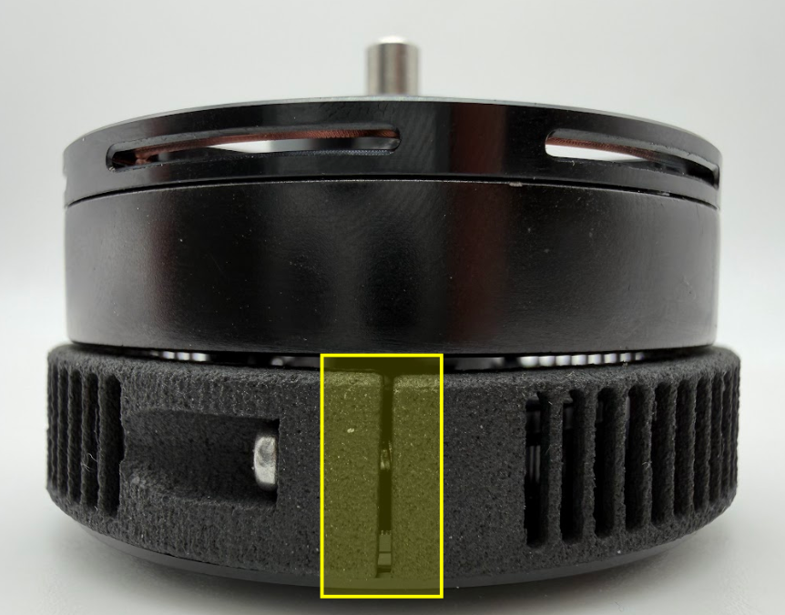
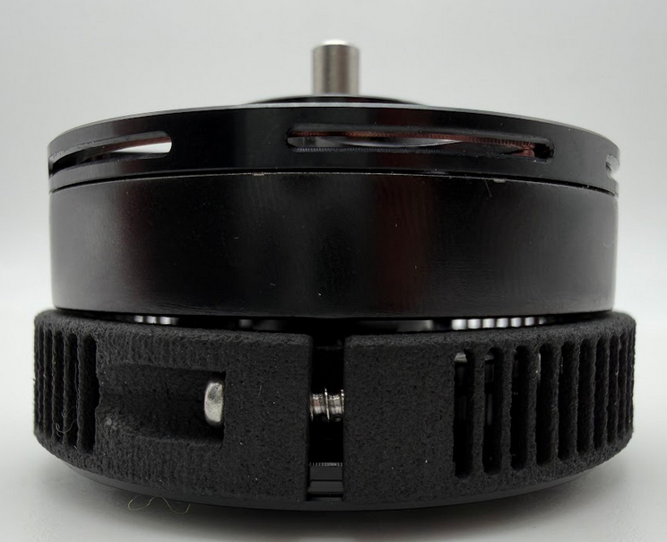

.. include:: ../text_colors.rst
.. toctree::

###############################################
Coil Cover Assembly Instructions
###############################################

All Vertiq Gen 2 modules support use of our coil cover add-on available with Vertiq's Pro Kit or by special request. For information about purchasing a Pro Kit, or for 
information about purchasing more coil cover add-ons, please contact us at info@vertiq.co. Please refer to your module's family page to see if it belongs to Gen 1 or Gen 2.

When mounting Vertiq's coil covers, it is important that the cover clamps securely onto the motor. The following instructions are meant to guide you through proper 
coil cover installation along with examples of improper installation.

These instructions are relevant for the following parts numbers:

* CCM1.1.4
* CCM3.0.3
* CCM5.1.3
* CCM7.0.1

.. note::

    Identification of your coil cover's part number can be found by the presence of a tab as highlighted in the image below. 

    .. image:: ../_static/tutorial_images/coil_cover_pictures/tab_visualization.png

    This guide applies to all coil covers **that include this tab (regardless of motor size)**. If your coil cover **does not have the tab**, simply install the coil covers until the parts touch, with a torque spec of 10Ncm.

All future references to the, “Gap” in the coil cover assembly refer to the area highlighted in the image below:

*******************************
Case 1 (Correct Installation)
*******************************

#. Place each coil cover half around the motor with the side with the large flange (highlighted below) facing the rotor

    .. image:: ../_static/tutorial_images/coil_cover_pictures/lip_picture.png
        :width: 50%

#. Screw in one half of the coil cover until the thread engages into the other coil cover half
#. Switch to the other side and do the same
#. :red:`While following this step, tighten the screws slowly and with care to avoid overtightening:` Keep alternating sides until the coil cover can no longer freely rotate on the motor
#. Both sides should be identical and should look similar to the image below

    .. note::
        The gap on your specific coil cover may be wider or narrower than those illustrated in the images below. **This is OK** as long as tightening stops just as the covers are fully 
        clamped to your module. Care should be taken to avoid over tightening as discussed in Case 2 as well as under tightening as discussed in Case 3.

    .. figure:: ../_static/tutorial_images/coil_cover_pictures/good_gap_size.png
        :width: 40%

        Correctly Installed Coil Cover (Representative of Both Sides)

*********************************************
Case 2 (Incorrect Installation - Too Tight)
*********************************************

In this example, the screws were tightened too much on both sides, causing the two sides of the coil covers to touch. Care should be taken to avoid overtightening your coil covers; 
the images below illustrate an example where they were overtightened.

.. note::
    The only exception to this is if the coil covers are still free to rotate. Then continue tightening the screws until the parts touch to achieve proper clamping.

It is possible that your coil covers **will touch before being fully clamped**. This is OK. You should continue tightening each side evenly until the cover is unable to rotate freely, and is securely fastened to your module.

    .. figure:: ../_static/tutorial_images/coil_cover_pictures/gap_too_tight.png
        :width: 40%

        Coil Cover Connected Too Tightly (Representative of Both Sides)

*********************************************************************
Case 3 (Incorrect Installation - Uneven Tightening: Not IP Rated)
*********************************************************************

In this example, one side was tightened until the gap disappeared and the other side's gap was left too wide. Avoid this as this will lead to a non-IP rated motor. 
Note that to achieve IP4X, you must properly attach the coil covers, blower fan, and mesh screen to your module.

.. list-table::
   :class: borderless
   :align: left

   * - .. image:: ../_static/tutorial_images/coil_cover_pictures/gap_too_tight.png
            :align: center

     - .. image:: ../_static/tutorial_images/coil_cover_pictures/gap_too_loose.png
            :align: center

*********************************************
Case 4 (Incorrect Installation - Too Loose)
*********************************************
In this example, neither side was tightened enough, and the coil cover is not clamped on the motor. Avoid this as this will introduce unwanted movement during motor operation.

    Coil Cover Connected Too Loosely (Representative of Both Sides)