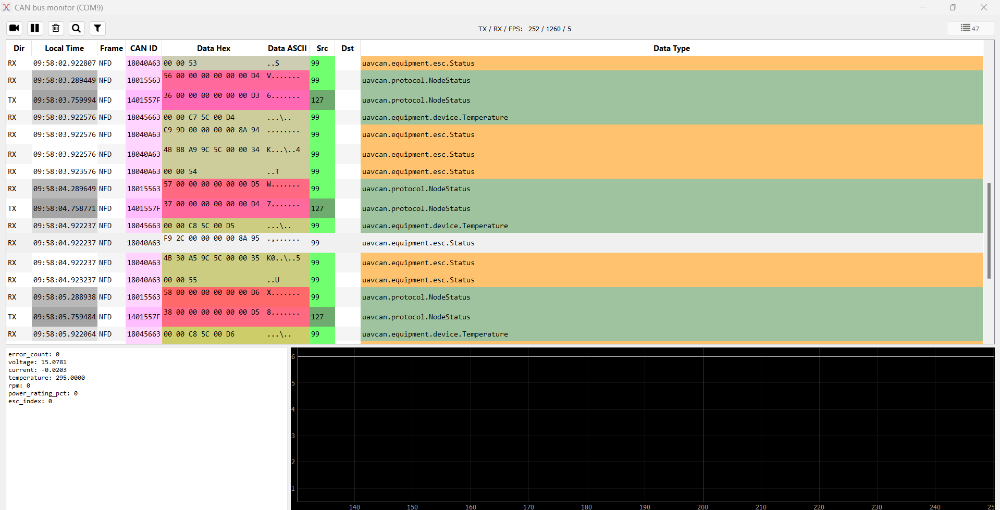
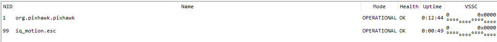

.. include:: ../text_colors.rst
.. toctree::

.. _dronecan_firmware_upgrade:

*****************************
DroneCAN Firmware Upgrade
*****************************

Necessary Applications/Hardware
=================================

Software
----------
In order to update your Vertiq module's firmware via DroneCAN, you must install the `DroneCAN GUI tool <https://dronecan.github.io/GUI_Tool/Overview/>`_. 
Simply follow the instructions at the link provided in order to install the application.

Hardware
-----------
In order to connect with the DroneCAN GUI tool, you will need an SLCAN device such as the `Zubax Babel <https://zubax.com/products/adapters/canface>`_ which 
will be used in each of the following examples. See the DroneCAN GUI tool's documentation to find more information on supported devices.

.. _dronecan_gui_basics:

DroneCAN GUI Tool Basics
============================
After opening the DroneCAN GUI tool, you are met with the following screen: 

Under *Select CAN Interface*, select the name of your connected USB-to-CAN device. In this case, the device is named USB Serial Device. 
By default, all DroneCAN enabled Vertiq devices have a bitrate of 500000 bits per second. If you have not changed your module's bitrate, you must configure 
*CAN bus bit rate* to 500000. Otherwise, you must set *CAN bus bit rate* to match the value set on your module. Select OK, and you will see the following window:

Here, you can view other devices detected on the bus, configure devices, and importantly here, trigger firmware updates. In order to interact with other DroneCAN nodes on the bus, 
the USB-to-CAN node needs its own unique node ID. To set your device's node ID, find *Set local node ID* in the top left, pick a node ID unique from all other devices on the 
bus (the default 127 is unique from the default Vertiq node ID of 99), and click the check mark.

Now, connect your module to your USB-to-CAN device, and power it on. You should see it appear in the list of *Online nodes*:

.. note:: 
    
    DroneCAN firmware updates are still possible when using your module's :ref:`DroneCAN plug-and-play features <dronecan_plug_and_play>`. Just ensure that your module has been 
    allocated an ID by the GUI as described in :ref:`dynamic_node_id_allocation`, and is detected on the bus before continuing.

Double click the module's node to find its DroneCAN node properties

From here, you can view the module's parameters by selecting *Fetch All*, you can reboot your module with *Restart*, or you can start a firmware update with *Update Firmware*.

.. _dronecan_upgrade_instructions:

Updating Firmware with the DroneCAN GUI
============================================
Now that you have a basic understanding of the DroneCAN GUI's layout and interactions, we can move on to updating firmware through the GUI tool. First, you must download the correct firmware for your 
module from `our website <https://www.vertiq.co/>`_. Take care to ensure that the firmware you download is meant for your module (size, Kv, firmware style, etc.). 
Failure to do so can result in severe damage to your module. Inside of the downloaded .zip archive, you should find a file called combined.bin as well as a file called app.bin. 

.. note::
    If your zip archive does not include a file named app.bin, you cannot update your module's firmware via DroneCAN. Future firmware releases will include app.bin files for all DroneCAN capable modules.

Now, extract the archive's files to a location of your choosing. You will need to find this location again in the next step. In this case, the files have been extracted 
to a folder called DroneCAN Upgrade Demo inside of the Documents folder.

Navigate back to the DroneCAN GUI, and open your module's *Node Properties* window. Select *Update Firmware*.

This will open a file dialogue. Navigate to the location of your extracted archive, and inside you will see the app.bin and combined.bin files.

**Select app.bin**, and click Open.

.. warning::
    It is crucial that you do not select combined.bin. Attempting to flash a combined application through the DroneCAN firmware upgrader will overwrite important module data such as calibration. 
    Even if :ref:`recovered through IQ Control Center <recovery_mode>`, the module may be unstable due to the deleted calibration data.

The DroneCAN GUI will immediately attempt to upgrade your module's firmware. You should see your module's mode enter ``SOFTWARE_UPDATE (3)`` mode indicating 
an ongoing file transfer:

After the upgrade is complete, your module will reboot and resume normal operation.

Viewing Firmware Upgrade Status with the Bus Monitor
---------------------------------------------------------
If you would like to view the details of the firmware upgrade process, you can use the DroneCAN GUI's *Bus Monitor* tool. You can find the Bus Monitor under Tools > Bus Monitor

The Bus Monitor tool allows you to view all DroneCAN messages being sent through the DroneCAN bus. For example, this is where you can view all of your connected 
modules' ESC statuses. In order to start monitoring the DroneCAN bus, click the camera icon in the top left:

With modules connected and powered on, you will see ``uavcan.equipment.esc.Status`` messages appear. Click on a message to view the decoded data in the bottom left.

In order to inspect firmware update status with the Bus Monitor tool, start capturing bus activity, then trigger a firmware upgrade. You will see the USB-to-CAN node 
transmit the ``uavcan.protocol.file.BeginFirmwareUpdate`` message, a handshake between the two nodes about the file's information through 
the ``uavcan.protocol.file.GetInfo`` message, and then finally, the transfer of file information from the USB-to-CAN node to the Vertiq node through the 
``uavcan.protocol.file.Read`` message.

Firmware Update While Connected with a Flight Controller
=============================================================
An important feature of CAN is that it is a fully bussable protocol. As such, multiple DroneCAN devices can be connected to the same bus simultaneously without issue. 
Suppose you have configured your DroneCAN hardware as recommended by `PX4's documentation <https://docs.px4.io/main/en/can/#wiring>`_.

Now, you would like to update your Vertiq module firmware without dismantling your vehicle. Simply add your USB-to-CAN device to the bus chain, and connect it to the DroneCAN GUI tool. 
In this example, we are connected to only one Vertiq module, do not have a GNSS device, and are using only one CAN output. So, our chain is as follows:

Take care to ensure that all CAN wiring is correct with proper termination. Refer to your module's family page for more information about hardware configuration and layout.

With this configuration, we expect to see the connected flight controller (in this case a Pixhawk) as well as our module connected through the DroneCAN GUI:

Now, you can update your Vertiq module's firmware exactly as described :ref:`above <dronecan_upgrade_instructions>`.