.. include:: ../text_colors.rst
.. toctree::

.. _dronecan_fc_tutorial:

##############################################
DroneCAN Integration with PX4 and ArduPilot
##############################################

This document provides a general procedure for integrating a Vertiq module with an ArduPilot or PX4 flight controller using DroneCAN, also known as UAVCANv0 or UAVCAN. 

Details on the DroneCAN protocol can be found on the `DroneCAN specification <https://dronecan.github.io/Specification/1._Introduction/>`_. For information on DroneCAN support on 
Vertiq modules, refer to the :ref:`dronecan_protocol` section.

.. note:: 
    
    If you intend on using DroneCAN and a :ref:`hobby protocol <hobby_protocol>` or :ref:`IFCI <controlling_ifci>` as :ref:`redundant sources <redundant_throttle_manual>`, please first read 
    :ref:`redundant_arming_interactions` in order to fully understand the arming interactions that may occur between the protocols.

Module Configuration and Enumeration
=============================================
Before interfacing your module with a flight controller via DroneCAN, it must be configured through :ref:`IQ Control Center <control_center_start_guide>`. The 
next sections describe the parameters that must be configured..

Bitrate
--------
Currently, Vertiq modules use a default DroneCAN bitrate of 500000 bit/s. It is possible to change this bitrate using the *DroneCAN Bitrate* parameter in 
IQ Control Center's Advanced tab as shown below. It is also configurable through a :ref:`DroneCAN configuration parameter <dronecan_bitrate_parameter>`. The module's 
configured bitrate must match the flight controller's.

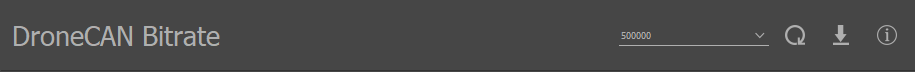

    DroneCAN Bitrate Parameter in IQ Control Center

For the purposes of this example, the bitrate is assumed to be 500000 bit/s.

Mode, Direction, and Limits
------------------------------
Descriptions of some important parameters for the module’s direction and mode and how to change them through IQ Control Center can be found in the :ref:`Motor Configuration section 
of the tutorial for flight controller integration using hobby protocols <hobby_fc_tutorial_motor_configuration>`. That tutorial is focused on using hobby protocols, but the details on configuring 
the module are still accurate for DroneCAN.

Node ID
---------
The node ID is a number the module will use to identify itself on the DroneCAN bus. **The node ID must be unique for each module, and none of the 
modules should use the same node ID as the flight controller.** Typically PX4 flight controllers will use node ID 1 by default, and ArduPilot flight controllers will 
use node ID 10 by default, so it is best to avoid those IDs.

If you are connecting your module to a previously configured bus with unknown node IDs, or simply want to avoid setting specific node IDs for each of your modules, you can use :ref:`DroneCAN's Dynamic Node ID Allocation feature supported by Vertiq modules <dynamic_node_id_allocation>`. 
To do so, simply set your module's Node ID to 0. Otherwise, you should assign the node ID of each module to some unique value from 1 to 127 excluding your flight controller's node ID. By default, the node ID of a Vertiq module is set to 99.

The entry in IQ Control Center to configure the node ID is the *DroneCAN Node ID*, and it can be found in the General tab, as shown below. Note that the module must be rebooted 
before a change to the node ID will take effect.

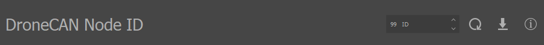

    DroneCAN Node ID Parameter in IQ Control Center

.. _dronecan_px4_tutorial_esc_index:

ESC Index
-------------
The ESC index determines the index of the value in a :ref:`uavcan.equipment.esc.RawCommand <dronecan_messages_raw_command>` message the motor will listen to. To be able to control each motor 
individually, each motor should have a unique ESC index. By default, the ESC index of Vertiq modules is set to 0.

**Vertiq modules do not currently support automatic ESC enumeration, it is necessary to manually assign an ESC index to each module on the bus.** Unlike the node IDs, it is not necessary to 
reboot the module for a change to the ESC index to take effect.

The `PX4 documentation <https://docs.px4.io/v1.11/en/peripherals/uavcan_escs.html#esc-setup>`_ provides some details on how to set up the ESC indices to integrate properly with your 
flight controller. Most importantly, the ESC indices should correspond with the motor numbers on the `Airframe Reference <https://docs.px4.io/v1.11/en/airframes/airframe_reference.html>`_ 
for your airframe, though generally the ESC index will be one less than the motor number because the ESC indices start from 0. Generally, each module should have a unique ESC index, 
and the indices should start at 0 and increment to the total number of modules minus one. 

As an example, imagine we were setting up a quadcopter with a `Quadrotor X <https://docs.px4.io/main/en/airframes/airframe_reference.html#quadrotor-x>`_ type airframe. Motor 1 is on the 
top right of that airframe.  When setting the ESC index on that module, it should be set  to 0, because the ESC indexing starts at 0, so the index of the module is always 1 less than 
the motor number on the airframe reference. Similarly, module 2 would have index 1, module 3 would have index 2, and module 4 would have index 3. So, in the Control Center, the 
ESC index of each module should be set to the appropriate value for its position on the airframe. 

.. note:: For versions of the PX4 firmware from v1.13.3 onward, the mapping between ESC Index and the motor number on the airframe must be configured by the user, so it is not strictly necessary to
    assign index 0 to motor 1 as described above. This convention is convenient however, and it will be used for the rest of this tutorial. See the
    :ref:`assign_esc_functions` section below for more details.

You can change the ESC Index of a module through the Control Center using *ESC Index* under the General tab, as shown below.

    DroneCAN ESC Index Parameter in IQ Control Center

Arming
----------

If you intend to leverage Vertiq's :ref:`Advanced Arming <manual_advanced_arming>`, there are two main options for controlling your module's armed state with DroneCAN. 
First, and recommended, is via DroneCAN's :ref:`ArmingStatus message <dronecan_arming_and_bypass>`, and second via throttle commands. When using the arming feature, modules must arm before they can spin.

Arming with ArmingStatus (Recommended)
^^^^^^^^^^^^^^^^^^^^^^^^^^^^^^^^^^^^^^^^

If your module is set to :ref:`use ArmingStatus to drive module arming <dronecan_arming_and_bypass>`, the module will arm on the status of your flight controller's reported ArmingStatus. 
Configuring your flight controller to output the ArmingStatus message is covered in the specific flight controller sections below.

.. note::
	
    When arming with the ArmingStatus message, you should disable your module's ability to arm with throttle. To do so, simply set :ref:`arm on throttle <arming_throttle_regions>` to 
    *Do Not Arm on Throttle*. If you do not disable arm on throttle, then your module can end up in a loop of arming and disarming which may lead to unexpected and potentially 
    dangerous behaviors. Ensuring that your module only arms and disarms based on your flight controller's armed state increases safety for you and your modules.

Arming with Throttle
^^^^^^^^^^^^^^^^^^^^^^

The default settings for Vertiq modules generally allow them to arm when they receive throttle commands between 0% and 12.5%, and by default both PX4 and ArduPilot send 0% commands when 
properly configured and disarmed. So, the default settings on Vertiq modules should allow them to arm immediately when they are connected to a properly configured flight controller on a DroneCAN bus. 

**Because of this, there is no need to change any arming parmeters to complete a basic integration with a PX4 or ArduPilot flight controller.** If you wish to take advantage of these arming
features for more complex integrations, refer to the :ref:`Advanced Arming <manual_advanced_arming>` section for more details.

Bypassing Arming
^^^^^^^^^^^^^^^^^^^

If do not want to use the arming feature at all (not recommended), you can configure your module to immediately apply all DroneCAN throttles to spinning.
If your module is set to :ref:`bypass arming on DroneCAN <dronecan_arming_and_bypass>`, then arming is not required for the module to spin when receiving DroneCAN commands.

CAN Bus Hardware Setup
=========================
Before attempting to communicate with the flight controller, make sure that the hardware for the CAN bus is set up correctly. CANH and CANL should be connected on the 
flight controller and all of the motors into one bus. There should also be a 120 ohm termination resistor between CANH and CANL on the bus. Refer to 
your module's family page for pinout information.

DroneCAN Integration with a PX4 Flight Controller
======================================================

.. _dronecan_px4_fc_configuration:

Flight Controller Configuration
--------------------------------------
.. warning:: 
    
    As PX4 is consistently updated, the steps shown below may not match those necessary for your version of PX4. We will point out some key version 
    differences that have been found during internal testing.

Once the motor is configured and the CAN bus is set up properly, the flight controller needs to be configured. The configurations discussed here were performed on a 
`Pixhawk 6C <https://docs.px4.io/main/en/flight_controller/pixhawk6c.html>`_ using PX4 v1.14.3 with `QGroundControl <http://qgroundcontrol.com/>`_. The image below shows the 
firmware version used when developing this tutorial in QGroundControl.

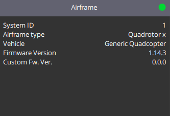

    PX4 Firmware Version Used for Tutorial Testing

.. note:: If your module is using :ref:`Advanced Arming <manual_advanced_arming>` with DroneCAN, then when you connect it to a bus with a properly configured flight controller 
    you may hear your module play its :ref:`arming song <arming_song>`. When exactly the module arms will depend on how its :ref:`arming <manual_advanced_arming>` configurations are set up. By default,
    Vertiq modules typically will arm on 0% commands, and by default PX4 will send 0% commands to its connected ESCs over DroneCAN when it is disarmed. So it is likely when
    using the default arming configurations the module may arm as soon as the flight controller is properly configured. If your module is set to 
    :ref:`bypass arming on DroneCAN <dronecan_arming_and_bypass>`, then it will never play its arming song and does not need to arm to spin. 

Enabling DroneCAN
---------------------
In QGroundControl, under Parameters in the Vehicle Setup menu, there is a parameter section labeled UAVCAN. If the ``UAVCAN_ENABLE`` is set to *Disabled*, it will be the only parameter available. For this example, 
``UAVCAN_ENABLE`` is set to 2 by default, so you will see various parameters available for configuration. In either case, you will only have to update the ``UAVCAN_ENABLE`` and 
``UAVCAN_BITRATE`` parameters in order to interact with your Vertiq module. ``UAVCAN_ENABLE`` configured to 2 enables support for DroneCAN sensors and dynamic node allocation. 
**For our modules, you must set** ``UAVCAN_ENABLE`` **to 3 ("Sensors and Actuators (ESCs) Automatic Config")**. This enables all features from 2, but also sets motor outputs 
to DroneCAN. ``UAVCAN_BITRATE`` is covered in the next section.

**You must reboot the flight controller before continuing.**

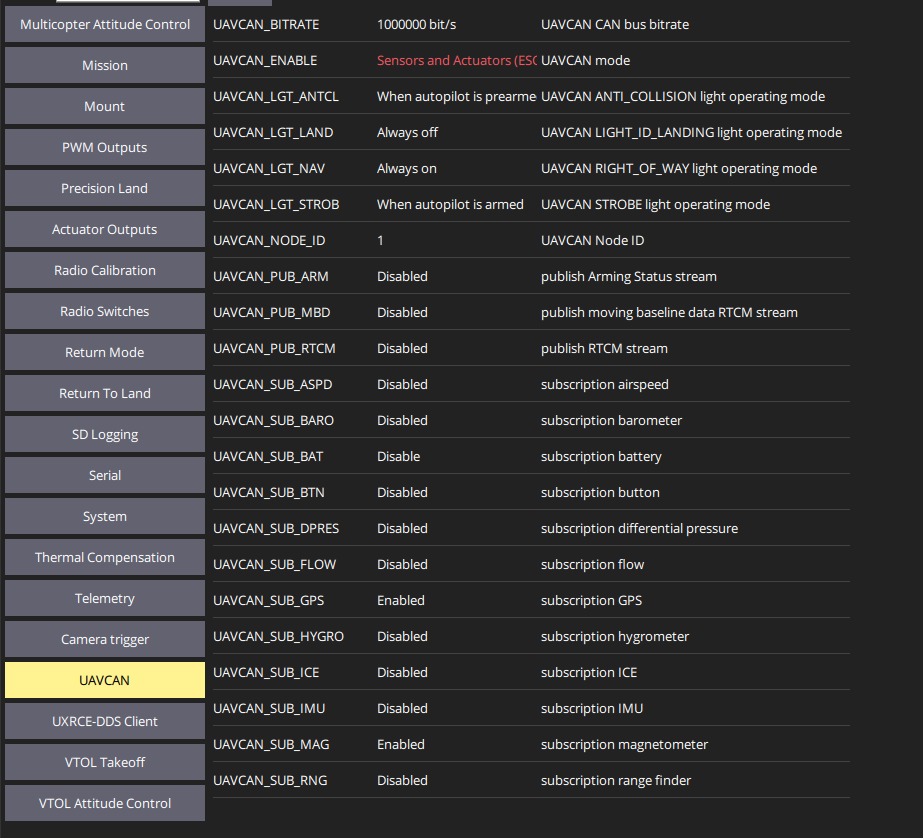

    UAVCAN Parameters in PX4

Setting Bitrate
-----------------
After enabling DroneCAN and rebooting the flight controller, re-open the UAVCAN section of Parameters in QGroundControl. If ``UAVCAN_ENABLE`` was disabled, more options should now be available for configuring DroneCAN.

The CAN bitrate of the flight controller needs to be changed to match the module's bitrate. Set ``UAVCAN_BITRATE`` to 500000 bit/s, and reboot the flight controller. 500000 bit/s is the 
default bitrate used by Vertiq modules and is used for this example. If your module is set to use a different bitrate, make sure to change the flight controller's bitrate to match. 
The image below shows the proper configuration of this parameter.

.. figure:: ../_static/tutorial_images/dronecan_px4_tutorial/px4_uavcan_bitrate.png
    :align: center
    :width: 60%
    :alt: UAVCAN_BITRATE in PX4

    UAVCAN_BITRATE in PX4

.. _enabling_dynamic_control_allocation:

.. _assign_esc_functions:

Assign ESC Functions in Actuators Tab
----------------------------------------
.. note:: This step is only required on versions of PX4 firmware greater than or equal to v1.13.3. On v1.13.2 and earlier, it is not necessary to set
    the functions of the actuator outputs. 

After rebooting the flight contorller, QGroundControl's Actuators tab should present UAVCAN as an option.

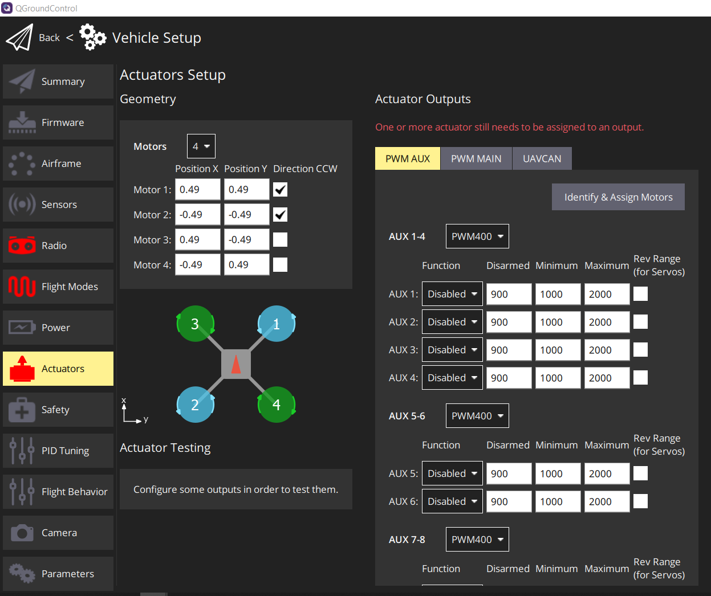

    Actuators Tab in QGroundControl

In the Actuators tab, in the Actuator Outputs section, select the UAVCAN tab. This view allows you to configure important DroneCAN parameters on the flight controller, including enabling 
DroneCAN and configuring the bitrate. The previous sections have already covered that part of the setup process, so there should be no need to change those.

The important settings to change here are the functions assigned to the ESCs. This view shows a list of ESCs with a function, a minimum, and maximum shown for each. This determines
which :ref:`ESC index <dronecan_px4_tutorial_esc_index>` corresponds to which motor on the airframe. Note that the ESC indices start from 0, while the ESC and motor numbers listed
in QGroundControl start from 1. So ESC 1 in QGroundControl corresponds to the module with an ESC index of 0. In the ESC list on the actuators tab, you must set the function corresponding
to each ESC index to the appropriate motor.

For example, if you had a module that you wanted to be motor 1 on the airframe, following the convention established in the :ref:`ESC index <dronecan_px4_tutorial_esc_index>` section, 
you should set its :ref:`ESC index <dronecan_px4_tutorial_esc_index>` to 0 in IQ Control Center. Then on the actuators tab, you should set ESC 1 to the Motor 1 function.
For the module you want to be motor 2, set its ESC index to be 1, and set ESC 2 to the Motor 2 function, and so on for the remaining modules.

.. note:: Depdending on your modules :ref:`arming <manual_advanced_arming>` configurations, you may hear the module play its :ref:`arming song <arming_song>` when you
    set the function for its ESC, if the module is connected to the bus. See the note in :ref:`dronecan_px4_fc_configuration` for more details on this.

For this example, only 1 motor was used during testing, with an ESC index of 0. The image below shows how the actuator tab was set up to accomodate this.

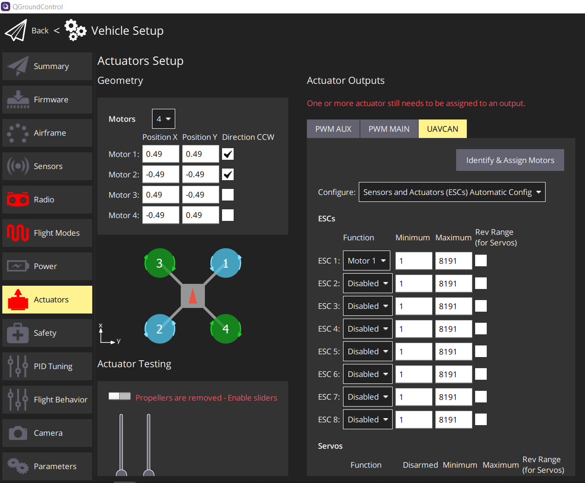

    Example Actuator Tab ESC Function Setup for 1 Module With ESC Index 0

If you prefer to interact directly with PX4 parameters, the functions can be assigned using the *UAVCAN_EC_FUNCX* parameters. An example of setting *UAVCAN_EC_FUNC1* is shown 
in the image below.

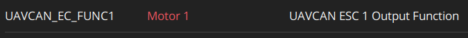

    UAVCAN_EC_FUNC1 Parameter Setup for 1 Module With ESC Index 0

The minimums and maximums set the range of values that will be sent in the :ref:`uavcan.equipment.esc.RawCommand <dronecan_messages_raw_command>` message to control the modules. Generally,
the default minimum and maximum are fine and should not need to be changed.

Enabling ArmingStatus
--------------------------
If your module's arming state is configured to be :ref:`driven by DroneCAN's ArmingStatus message <dronecan_arming_and_bypass>`, your flight controller must broadcast the ArmingStatus 
message at a regular interval. In order to enable the ArmingStatus message on your PX4 flight controller, you must do the following:

1. Connect your flight controller with QGroundControl, and navigate to the UAVCAN tab in Vehicle Setup
2. Find the ``UAVCAN_PUB_ARM`` parameter

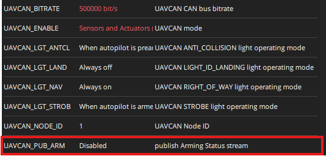

3. Set ``UAVCAN_PUB_ARM`` to ``Enabled`` and reboot your flight controller

Now, your flight controller will output the ArmingStatus message at 500ms intervals. As viewed in the DroneCAN GUI tool:

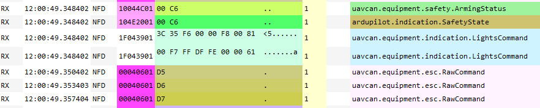

Other Configurations
------------------------
One other parameter of note is ``UAVCAN_NODE_ID``. This sets the flight controller's node ID. Generally, this can be left at its default of 1 as long as none of the 
modules on the bus have a node ID of 1.

There are various other configurations available under the UAVCAN section of Parameters, but none of them are essential for using DroneCAN with a Vertiq module. 
Refer to the `PX4 parameter reference documentation <https://docs.px4.io/main/en/advanced_config/parameter_reference.html>`_ for more information on each of these parameters, 
they may be useful in some applications.

Testing
---------
QGroundControl provides multiple helpful tools for testing if your motor is properly integrated with the flight controller over DroneCAN. 
The sections below describe some of these testing methods.

.. warning:: Before attempting any tests that may cause the module to spin, ensure any propellers are removed from the module and that the module is safely secured.

.. note:: For testing, it is important to understand if your module is using :ref:`Advanced Arming <manual_advanced_arming>` with DroneCAN. If your module is using Advanced
    Arming with DroneCAN, then it will need to arm before it can spin for any of these tests. By default, Vertiq modules typically will arm on commands from 0% to 7.5%, 
    and by default PX4 will send 0% commands to its connected ESCs over DroneCAN when it is disarmed. So it is likely when
    using the default arming configurations the module will immediately arm as soon as the flight controller is properly configured and on the same bus as the module. 
    Because of that, for the general default settings used on Vertiq modules arming should not be a concern when running these tests. It should be apparent when your module arms
    because it will play a :ref:`short arming song <arming_song>`. If you do experience issues where the module will not spin but you believe your configurations are correct, check the arming 
    configurations on your module. If your module is set to :ref:`bypass arming on DroneCAN <dronecan_arming_and_bypass>`, then it will never need to arm to spin when using DroneCAN.

Slider Setup Tests
^^^^^^^^^^^^^^^^^^^^^^

Older PX4 Firmware (v1.13.2 and earlier)
""""""""""""""""""""""""""""""""""""""""""""
Under the Motors tab in QGroundControl, there are sliders that can test if the modules will spin, and if the flight controller is configured to use DroneCAN properly. 
If DroneCAN is enabled, this test should send DroneCAN commands to control the modules.

To run the test, arm your safety switch if you have one, and click the horizontal slider at the bottom of the window to enable the motors. Make sure the Vertiq module 
is powered up and connected to the same CAN bus as the flight controller.

Then move the slider corresponding to the motor number of the module you wish to test. E.g. to test a module with an ESC index of 0, move slide 1. If configured correctly, 
the motor with the corresponding index should start spinning as you move the slider.

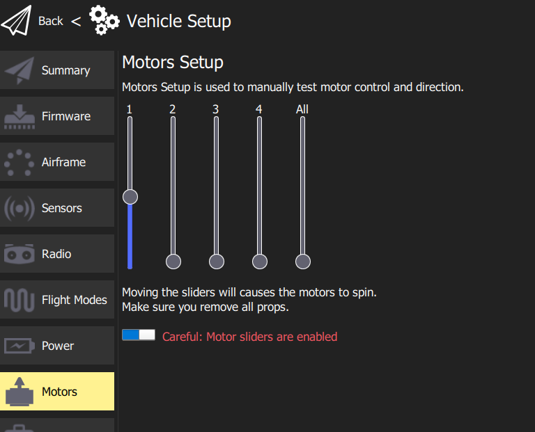

    Motor Test Sliders in Motors Tab

Newer PX4 Firmware (v1.13.3 and later)
"""""""""""""""""""""""""""""""""""""""""
Under the Actuators tab in QGroundControl, there are sliders in the Actuator Testing section that can be used to test if the flight controller and module have been
successfully integrated.

To run the test, arm your safety switch if you have one, and click the horizontal slider at the top of the Actuator Testing section to enable the motors. Make sure the Vertiq module 
is powered up and connected to the same CAN bus as the flight controller.

Then move the slider corresponding to the motor number of the module you wish to test. If configured correctly, the corresponding motor should spin as you move the slider. An
example of using this test is shown below.

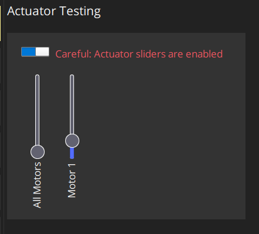

    Actuator Testing Sliders in Actuators

MAVLink Console
-------------------
The MAVlink console can also be used to check if your motor is sending out the expected status messages. To open the MAVLink console, on the home screen from QGroundControl 
click on the QGroundControl logo and select Analyze Tools from the Select Tool menu, as shown below.

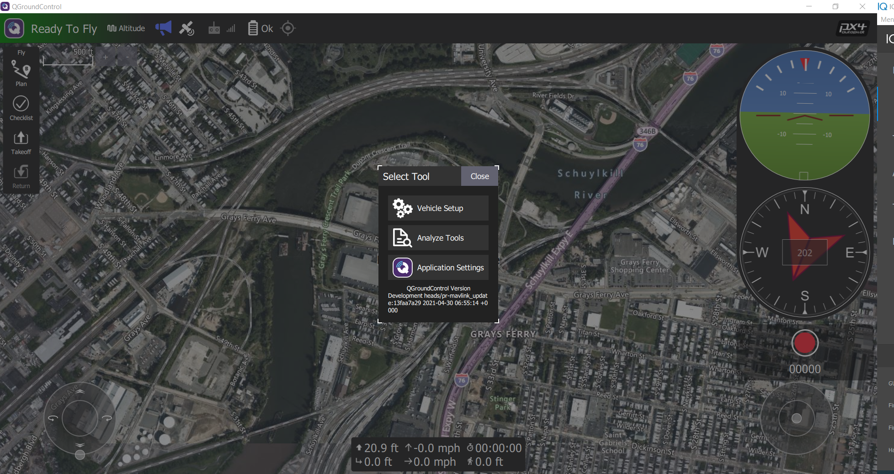

    Select Tool Menu in QGroundControl

In Analyze Tools, select the MAVLink Console. This makes it possible to execute various DroneCAN related commands through the flight controller. Confirm that the Vertiq module 
is powered on and is connected to the flight controller’s CAN bus. The image below shows what the console should look like when it is first opened.

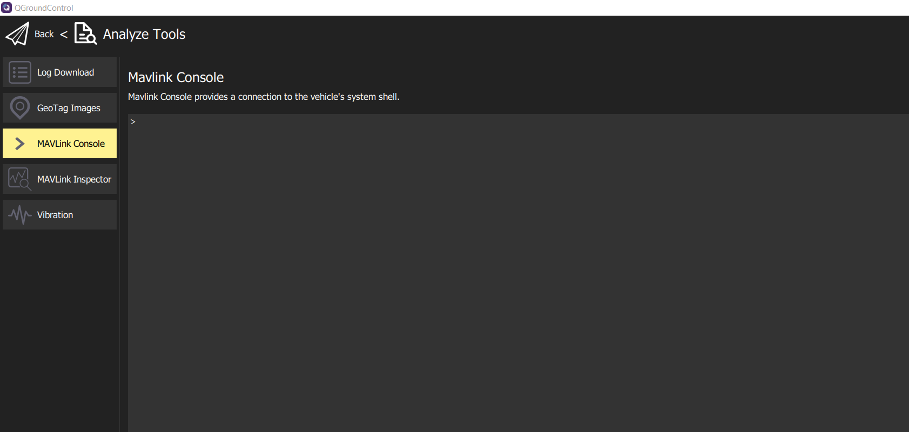

    MAVLink Console in QGroundControl

Check Node Status
^^^^^^^^^^^^^^^^^^^^
The status of the online nodes can be checked using the MAVLink console. This will indicate if the modules are successfully connected to the DroneCAN bus. Enter “uavcan status” into 
the console to check on the status of the connected DroneCAN nodes. This will print out data about the flight controller’s DroneCAN status. Of note is the listing 
of “Online nodes.” This should include information on all of the nodes connected to the flight controller, with their assigned node IDs and status. All of the nodes should report they 
are “OK” and “OPERATIONAL.” The code block below shows an example of using the "uavcan_status" command where two modules are connected to the flight controller, with node ID 5 and 127::

    uavcan status
    Pool allocator status:
        Capacity hard/soft: 500/250 blocks
        Reserved:  81 blocks
        Allocated: 26 blocks

    UAVCAN node status:
        Internal failures: 0
        Transfer errors:   1
        RX transfers:      1317
        TX transfers:      3383

    CAN1 status:
        HW errors: 1
        IO errors: 1
        RX frames: 919
        TX frames: 3800
    CAN2 status:
        HW errors: 50147
        IO errors: 53382
        RX frames: 0
        TX frames: 554

    ESC outputs:
    INFO  [mixer_module] Param prefix: UAVCAN_EC
    control latency: 0 events, 0us elapsed, 0.00us avg, min 0us max 0us 0.000us rms
    INFO  [mixer_module] Mixer loaded: no
    INFO  [mixer_module] Driver instance: 0
    Channel Configuration:
    Channel 0: value: 0, failsafe: 0, disarmed: 65535, min: 1, max: 8191
    Channel 1: value: 0, failsafe: 0, disarmed: 65535, min: 1, max: 8191
    Channel 2: value: 0, failsafe: 0, disarmed: 65535, min: 1, max: 8191
    Channel 3: value: 0, failsafe: 0, disarmed: 65535, min: 1, max: 8191
    Channel 4: value: 0, failsafe: 0, disarmed: 65535, min: 1, max: 8191
    Channel 5: value: 0, failsafe: 0, disarmed: 65535, min: 1, max: 8191
    Channel 6: value: 0, failsafe: 0, disarmed: 65535, min: 1, max: 8191
    Channel 7: value: 0, failsafe: 0, disarmed: 65535, min: 1, max: 8191
    Servo outputs:
    INFO  [mixer_module] Param prefix: UAVCAN_SV
    control latency: 0 events, 0us elapsed, 0.00us avg, min 0us max 0us 0.000us rms
    INFO  [mixer_module] Mixer loaded: no
    INFO  [mixer_module] Driver instance: 0
    Channel Configuration:
    Channel 0: value: 0, failsafe: 0, disarmed: 0, min: 0, max: 0
    Channel 1: value: 0, failsafe: 0, disarmed: 0, min: 0, max: 0
    Channel 2: value: 0, failsafe: 0, disarmed: 0, min: 0, max: 0
    Channel 3: value: 0, failsafe: 0, disarmed: 0, min: 0, max: 0
    Channel 4: value: 0, failsafe: 0, disarmed: 0, min: 0, max: 0
    Channel 5: value: 0, failsafe: 0, disarmed: 0, min: 0, max: 0
    Channel 6: value: 0, failsafe: 0, disarmed: 0, min: 0, max: 0
    Channel 7: value: 0, failsafe: 0, disarmed: 0, min: 0, max: 0

    Sensor 'gnss':
    name: uavcan_gnss

    Sensor 'mag':
    name: uavcan_mag

    Online nodes (Node ID, Health, Mode):
        5 OK         OPERAT    
        127 OK         OPERAT    

    uavcan: cycle time: 49750 events, 2398095us elapsed, 48.20us avg, min 13us max 152183us 730.617us rms
    uavcan: cycle interval: 49750 events, 2701.02us avg, min 26us max 152824us 1225.585us rms

.. _dronecan_px4_throttle_test_commands:

Test Throttle
-------------------

Older PX4 Firmware (v1.13.2 and earlier)
^^^^^^^^^^^^^^^^^^^^^^^^^^^^^^^^^^^^^^^^^^^^^^
It is also possible to test spinning the module in this console using the motor_test command. Typing “motor_test -h” in the console will provide help on how to use the command. 
As a basic example, to spin the motor with an ESC index of 1 at 20% of its maximum, you could use the command:: 

    motor_test test -m 1 -p 20

The image below shows some examples of using the motor_test command.

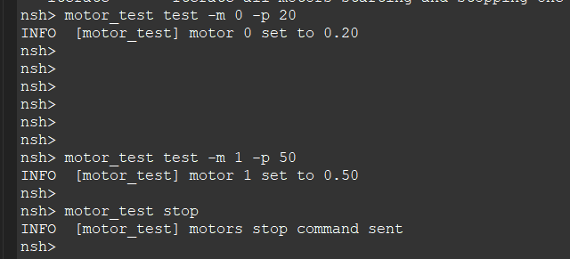

    Motor Test in MAVLink Console

Newer PX4 Firmware (v1.13.3 and later)
^^^^^^^^^^^^^^^^^^^^^^^^^^^^^^^^^^^^^^^^^^^
Integration with the module can be tested using the actuator_test command. Typing "actuator_test" in the console will provide help on how to use the command.

For example, to command motor 1 to spin at 5% for 5 seconds, you can send the command "actuator_test set -m 1 -v 0.05 -t 5". The code block below shows the output
of the help for the actuator_test command, as well as this example command::

    nsh> actuator_test 
    Usage: actuator_test <command> [arguments...]
    Commands:

    set           Set an actuator to a specific output value

    The actuator can be specified by motor, servo or function directly:
        [-m <val>]  Motor to test (1...8)
        [-s <val>]  Servo to test (1...8)
        [-f <val>]  Specify function directly
        -v <val>    value (-1...1)
        [-t <val>]  Timeout in seconds (run interactive if not set)
                    default: 0

    iterate-motors Iterate all motors starting and stopping one after the other

    iterate-servos Iterate all servos deflecting one after the other
    
    nsh> actuator_test set -m 1 -v 0.05 -t 5

Virtual Joysticks
---------------------
For a test that is closer to actual flight, the `Virtual Joysticks <https://docs.qgroundcontrol.com/master/en/SettingsView/VirtualJoystick.html>`_ in PX4 can be used to control connected 
modules while the flight controller is connected to a computer. `Enable the virtual joysticks <https://docs.qgroundcontrol.com/master/en/SettingsView/VirtualJoystick.html#enable-the-thumbsticks>`_ 
as detailed in the PX4 documentation, and ensure that all Vertiq modules are powered on and connected to the CAN bus.

Return to the home screen of PX4. If the flight controller is fully setup, it should say “Ready To Fly.” Lower the virtual throttle joystick to the bottom, click on where it 
says “Ready To Fly”, and arm the flight controller using the Arm button. Moving the virtual joysticks should cause the modules to respond as the flight controller begins 
sending commands. Switching to Manual mode may simplify this testing.

Configuring your Module with DroneCAN Via PX4
--------------------------------------------------------

QGroundControl provides a convenient method for viewing and configuring all DroneCAN devices detected on the bus. To use it:

1. Configure your flight controller for DroneCAN control as described in this document
2. Reboot your flight controller, and completely close QGroundControl
3. Connect your module to the flight controller's CAN connection, and power on both the flight controller and your module
4. Re-open QGroundControl
5. Navigate to Vehicle Setup by clicking the Q icon in the top left corner, and selecting Vehicle Setup
6. Click Parameters on the bottom left

    .. image:: ../_static/tutorial_images/dronecan_px4_tutorial/qgc_vehicle_setup.png
        :align: center
        
7. Click on Standard at the top of the list of parameter types in order to collapse the standard parameter list

    .. image:: ../_static/tutorial_images/dronecan_px4_tutorial/qgc_standard_button.png
        :align: center

8. You should now see a list of additional parameter types. On this list you should see ``Component X`` where ``X`` is your module's node ID

    .. image:: ../_static/tutorial_images/dronecan_px4_tutorial/qgc_component_99.png
        :align: center

9. Expand ``Component X``, and you will see Vertiq's available DroneCAN parameters

    .. image:: ../_static/tutorial_images/dronecan_px4_tutorial/qgc_dronecan_params.png
        :align: center

10. Now, you can configure your module's DroneCAN parameters exactly as you would standard PX4 parameters

.. warning:: Before attempting any tests that may cause the module to spin, ensure any propellers are removed from the module and that the module is safely secured.

As an example, select zero, and you will see the ``zero_behavior`` parameter. By default, this is set to 2 indicating that the module will treat 0% throttle commands 
the same as all other throttle commands. Notice that if you attempt to spin your module by hand, it will resist movement as it is being driven by a 
0% throttle. To learn more, see :ref:`zero_behavior`. For this example, we want the module to coast when sent 0% throttles. So, 
set ``zero_behavior`` to 0. Please note that ``zero_behavior`` is only applied while :ref:`bypassing arming <dronecan_arming_and_bypass>`.

    .. image:: ../_static/tutorial_images/dronecan_px4_tutorial/qgc_zero_behavior.png
        :align: center

Now, if you attempt to spin your module by hand, you will see that it spins freely. You have now successfully configured your module through DroneCAN 
by using PX4 and QGroundControl. This same process is applicable to all Vertiq DroneCAN parameters.

.. note::
    If your module powers off or is otherwise disconnected from the DroneCAN bus, it will no longer be reachable through QGroundControl's DroneCAN configuration, even if 
    reconnected. You must close and restart QGroundControl as in steps 3 and 4. For more information, see `PX4's DroneCAN configuration documentation <https://docs.px4.io/main/en/dronecan/#qgc-cannode-parameter-configuration>`_.

.. _dronecan_with_ardupilot:

DroneCAN Integration with an ArduPilot Flight Controller
=============================================================

Flight Controller Configuration
--------------------------------------

Once the motor is configured and the CAN bus is set up properly, the flight controller needs to be configured. The configurations discussed here were performed on a 
`Pixhawk 6C <https://docs.px4.io/main/en/flight_controller/pixhawk6c.html>`_ using ArduCopter v4.5.5 with `Mission Planner <https://ardupilot.org/planner/>`_ v1.3.80.

Enabling DroneCAN
-------------------
In order to use DroneCAN with an ArduPilot flight controller, you must first configure a CAN peripheral. To do so:

1. Connect your flight controller with Mission Planner
2. Navigate to Frame Type inside of the Setup tab to ensure you have selected a geometry. In general, this should match the shape of your actual vehicle, 
   but in this case, with a single module connected, we will arbitrarily select the generic quad "X"

   .. figure:: ../_static/tutorial_images/pwm_flight_controller/mp_frame.JPG
        :align: center

        Mission Planner Frame Type Selection

3. Open the Config tab, and select Full Parameter List
4. Using the search bar on the right hand side, search for ``CAN_P1_DRIVER``. This is the CAN peripheral that we will attach to DroneCAN, and in the case of 
   the Pixhawk 6C, aligns with the labeled CAN ports. In this example, we will use the CAN1 port, so set ``CAN_P1_DRIVER`` to ``1: First Driver``. After writing the parameter, 
   reboot your flight controller

   .. image:: ../_static/tutorial_images/dronecan_px4_tutorial/mission_planner_can_driver.png
        :align: center

5. Search for ``CAN_P1_BITRATE``. This is the bitrate that will be used on the DroneCAN bus. For this example, set this to 500000. Your flight controller's bitrate must match your module's
6. Reboot your flight controller, and then reconnect to Mission Planner
7. In the Full Parameter List search bar, search ``can_d1`` to find all parameters related to our CAN1 driver
   
   .. image:: ../_static/tutorial_images/dronecan_px4_tutorial/mission_planner_can1_params.png
        :align: center
        :height: 500

8. Set the following configurations if not already configured properly

    a. ``CAN_D1_PROTOCOL``: Set to 1 to use DroneCAN on the CAN1 port
    b. ``CAN_D1_UC_ESC_BM``: This is a bitmask that defines the ESC indices that will be transmitted with each raw command. In this example, we will only select ``ESC 1`` for our module with ESC Index 0
      
       .. image:: ../_static/tutorial_images/dronecan_px4_tutorial/mission_planner_esc_bitmask.png
        :align: center

    c. ``CAN_D1_UC_NODE``: Defines the DroneCAN node ID used by the flight controller. Ensure that this value is unique from all modules connected over DroneCAN

9. Make sure you have written all parameters, and reboot your flight controller

Enabling ArmingStatus
--------------------------
If your module's arming state is configured to be :ref:`driven by DroneCAN's ArmingStatus message <dronecan_arming_and_bypass>`, your flight controller must broadcast the ArmingStatus 
message at a regular interval. By default, ArduPilot flight controllers broadcast ArmingStatus messages at 500ms intervals, so no additional configuration is necessary.

As viewed through the DroneCAN GUI tool:

       .. image:: ../_static/tutorial_images/dronecan_px4_tutorial/ardupilot_armingstatus.png
        :align: center

Testing DroneCAN with your Module
---------------------------------------

.. warning:: Before attempting any tests that may cause the module to spin, ensure any propellers are removed from the module and that the module is safely secured.

With both the module and flight controller configured, you can now ensure that the two integrate as expected.

Motor Test
^^^^^^^^^^^^^^
.. note:: 
    
    If your module is using :ref:`Advanced Arming <manual_advanced_arming>` with DroneCAN, then when you connect it to a bus with a properly configured flight controller 
    you may hear your module play its :ref:`arming song <arming_song>`. When exactly the module arms will depend on how its :ref:`arming <manual_advanced_arming>` configurations are set up. By default,
    Vertiq modules typically will arm on 0% commands, and by default ArduPilot will send 0% commands to its connected ESCs over DroneCAN when it is disarmed. So it is likely when
    using the default arming configurations the module may arm as soon as the flight controller is properly configured. If your module is set to 
    :ref:`bypass arming on DroneCAN <dronecan_arming_and_bypass>`, then it will never play its arming song and does not need to arm to spin. 

1. Connect your flight controller to Mission Planner
2. Expand the Optional Hardware options under the setup tab, and select Motor Test. You will see the following

    .. figure:: ../_static/tutorial_images/pwm_flight_controller/mp_motor_test.png
        :align: center

        Motor Test Screen in Mission Planner

3. Connect your module's CAN connection to the flight controller, and power it on. For details on your module's CAN connections, refer to its module family page. As 
   noted above, depending on your module's configuration, you may hear your module arm immediately after power up
4. If your :ref:`safety switch is enabled <safety_switch_config>`, arm it
5. Using the default throttle and duration, select Test motor A. Your module should start spinning
6. Try some other throttle levels to see the module running at different speeds

.. _configuring_with_ardupilot:

Configuring your Module with DroneCAN Via ArduPilot
--------------------------------------------------------

Mission Planner provides a convenient method for viewing and configuring all DroneCAN devices detected on the bus. To use it, navigate to Optional Hardware under 
the Setup tab. There, you can find the DroneCAN/UAVCAN window.

    .. image:: ../_static/tutorial_images/dronecan_px4_tutorial/mission_planner_dronecan_page.png
        :align: center
        :height: 500

Now, to interact with your module, and other DroneCAN devices:

1. Select the flight controller's CAN peripheral being used to drive DroneCAN. In this case, we are using CAN1, so we select MAVlink-CAN1
2. Click MAVlink-CAN1, and the flight controller will automatically detect the devices on the bus. In this example, the Vertiq module is the only external 
   device connected, and appears as ``iq_motion.esc``.

    .. image:: ../_static/tutorial_images/dronecan_px4_tutorial/mission_planner_dronecan_config.png
        :align: center

3. To configure your module's DroneCAN parameters, select Menu and Parameters. A window will open displaying all of your module's DroneCAN parameters
   
    .. image:: ../_static/tutorial_images/dronecan_px4_tutorial/mission_planner_dronecan_params.png
        :align: center

4. To change a value, simply enter a new value under Value, and select Write Params