.. include:: ../text_colors.rst
.. toctree::

#######################################################################
Controlling Your Servo Module Using the DroneCAN ArrayCommand and PX4
#######################################################################

This tutorial walks you through the basic configuration of both a Vertiq module with servo firmware (v0.1.0 or later) as well as a PX4 flight controller in order to control your module's angular 
displacement via DroneCAN ArrayCommands.

***********************
Module Configuration
***********************

In this example, we are going to configure our module to act as a basic servo with the ability to move between [-pi, pi] radians as controlled by the flight controller. 
This example uses Vertiq's servo firmware, and is replicable on all servo firmware versioned 0.1.0 or later.

We are going to perform all configurations via the `DroneCAN GUI Tool <https://dronecan.github.io/GUI_Tool/Overview/>`_. Please note that it is also possible to configure these options using the :ref:`IQ Control Center <control_center_start_guide>`. 

First, we're going to set our module's ``zero angle``. This is, basically, the angle that your module will treat as 0 rad of displacement. You can read more about zero 
angle in our :ref:`angle control documentation <Zero Angle>`. To do so, manually rotate your module into the position you want as your 0 location. Then, in 
the DroneCAN GUI Tool, find ``sample_zero_angle``, and set it to 1. 

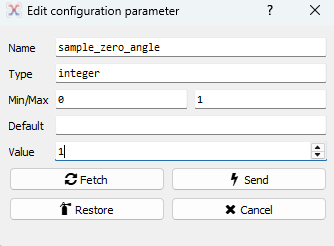

In IQ Control Center, sampling can be done in the General tab through the ``Sample Zero Angle`` parameter. Simply click the set button to sample your module's current position as its zero angle.

Once set, the value will automatically reset to 0, and your zero angle will be set and saved. All position commands will now be in relation to this point.

If desired, it is also possible to manually set your module's zero angle through ``Zero Angle``.

.. HERE FOR WHEN SPEED GETS THIS STUFF

.. Now, we want to make sure that the module will not respond to standard ESC commands. We do this to ensure that your module will not attempt to spin when receiving any 
.. RawCommand messages. If your module arms (or is bypassing arming), it will accept RawCommands as a command to move which can result in unexpected and potentially 
.. dangerous behaviors when combined with ArrayCommands, as the RawCommands and ArrayCommands will be sending conflicting commands to the module. To do so, we will set 
.. the following:

.. * arm_with_arming_status: 0
.. * dronecan_bypass_arming: 0
.. * arm_on_throttle: 0

.. In IQ Control Center, you can configure these by setting ``Arm On Throttle`` under the General tab to ``Do Not Arm On throttle``, and under the Advanced tab, setting 
.. ``Arming by DroneCAN ArmingStatus`` to ``Disabled`` and ``DroneCAN Bypass Arming`` to ``Normal Arming``.

.. .. image:: ../_static/tutorial_images/arraycommand_px4_tutorial/arm_on_throttle_control_center.png

.. .. image:: ../_static/tutorial_images/arraycommand_px4_tutorial/arm_with_arming_status_control_center.png

.. .. image:: ../_static/tutorial_images/arraycommand_px4_tutorial/bypass_arming_control_center.png

Now, we'll configure the module to respond to unitless ArrayCommands. First, we need to ensure that the module will accept provided Commands. To do so, we need to configure 
a proper ``actuator_id``. This can be any value [0, 255], and in this example, we will use 0. As viewed in the DroneCAN GUI:

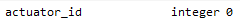

Next, we'll configure our positional endpoints. Here, we are going to set our minimum angular displacement to -3.14 rad and our maximum to 3.14 rad. 
These minimum and maximum configurations tell the module that it can move between [-3.14, 3.14] rad when receiving ArrayCommands. Find ``unitless_control_mode`` 
and set it to 3 (this tells your module to treat unitless controls as positional commands). Set ``unitless_control_minimum`` to -3.14 and ``unitless_control_maximum`` 
to 3.14 to set your desired positional bounds. As viewed in the DroneCAN GUI:

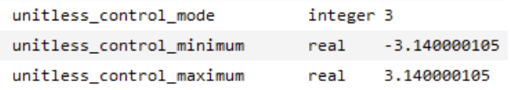

In IQ Control Center, these parameters are available on the General tab as ``Servo mode``, ``Unit maximum``, and ``Unit minimum``.

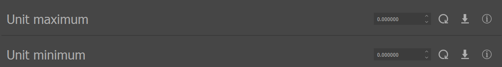

Before integrating with a flight controller, we can verify basic operation through the DroneCAN GUI tool. Navigate to *Panels > Actuator Panel*. You will see the following: 

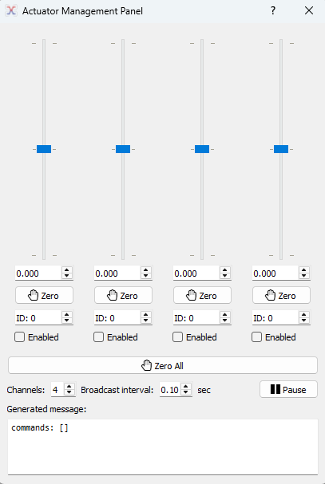

This panel allows you to send unitless commands to a specified Actuator ID. For this example, simply click the Enabled box under any of the sliders. You should see 
your module move as you move the slider, and it should move between [-3.14, 3.14] rad as you move the slider up and down.

******************
PX4 Configuration
******************

This example is running PX4 version 1.16.0 on a Pixhawk 6C, and uses QGroundControl (QGC) to connect with the flight controller.

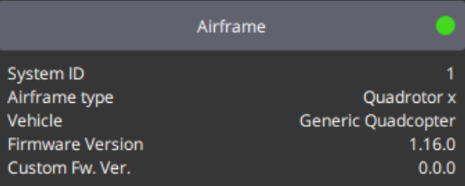

The following steps assume that you have or will complete all necessary vehicle setup (sensor calibration, power setup, etc.).

First, we're going to ensure that PX4 is configured to be able to send out the ArrayCommand message. Navigate to *Vehicle Configuration > Parameters > UAVCAN*.

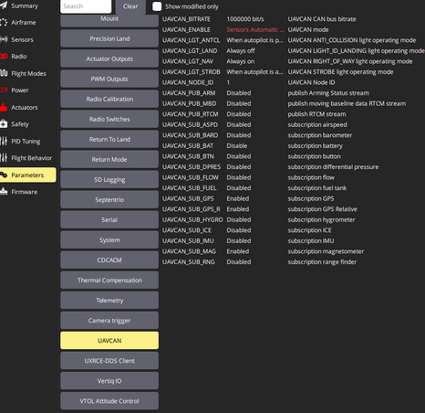

Ensure that UAVCAN_ENABLE is configured to *Sensors and Actuators (ESCs) Automatic Config*.

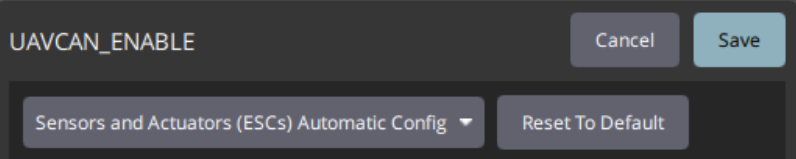

Next, make sure that your ``UAVCAN_BITRATE`` matches that set on our Vertiq module. By default Vertiq's modules use a bitrate of 500000.

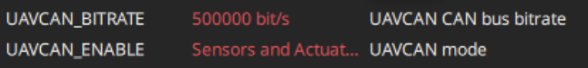

Reboot your flight controller.

Once reconnected to QGC, return to Vehicle Configuration, and navigate to the Actuators tab. There, under Actuator Outputs, select UAVCAN.

.. image:: ../_static/tutorial_images/arraycommand_px4_tutorial/uavcan_actuator_outputs_qgc.png

Scroll down to find the Servos output. For this example, we will map Servo 1 to Motor 1, but this output can be mapped to any actuator output like any PX4 output interface.

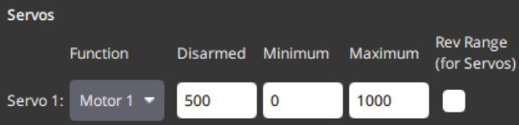

If we connect our flight controller to the DroneCAN GUI Tool's bus monitor, we can see that it is now outputting unitless ArrayCommands:

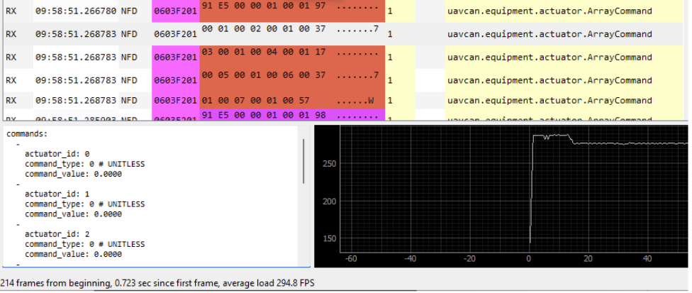

****************************
Basic Integration Testing
****************************

We'll now confirm that the flight controller can properly control your module. Connect your module to your flight controller's DroneCAN bus.

In QGroundControl navigate to the Actuators tab, and find Actuator Testing. If you have followed the instructions to this point, you should see the following:

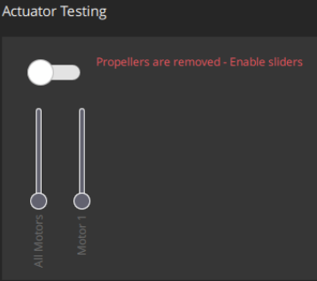

.. warning::
    Please remove all propellers from any module you plan on testing. Failure to do so can result in harm to you or others around you. Further, please ensure that your module 
    is secured to a stationary platform or surface before attempting to spin it. 

Making sure that your module is secured, enable the Actuator Testing output by moving the toggle switch right. When you move the Motor 1 slider up and down, you should see 
your module react accordingly.

This example is shown in the screen capture below. We use QGC to send commands to the module on the left hand side, and are plotting the observed angular displacement through 
the Vertiq Testing Tool on the right side. Note that the module moves between [-3.14, 3.14] rad as configured before.

.. raw:: html

    
    <video class='center_vid' controls><source src="../_static/tutorial_images/arraycommand_px4_tutorial/actuator_control_demo.mp4" type="video/mp4"></video>