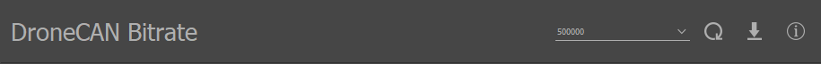
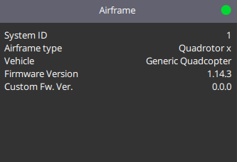
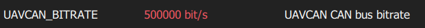
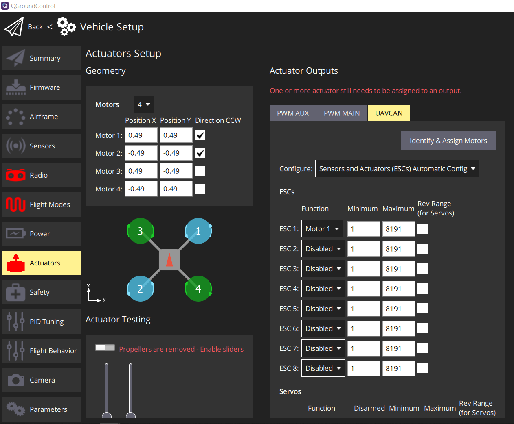
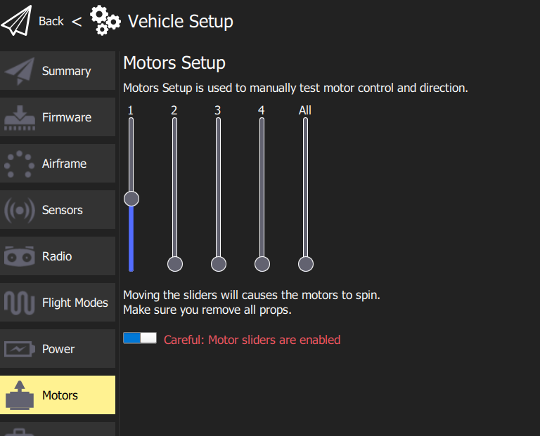
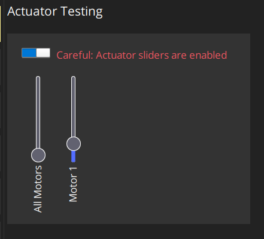
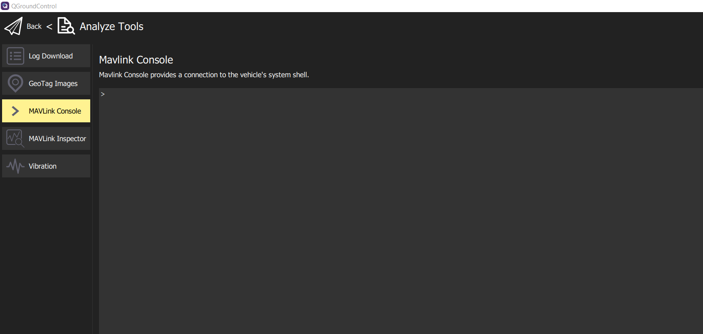

.. include:: ../text_colors.rst
.. toctree::

.. _dronecan_fc_tutorial:

****************************************************
DroneCAN Integration with a PX4 Flight Controller
****************************************************
This document provides a general procedure for integrating a Vertiq module with a PX4 flight controller using DroneCAN, also known as UAVCANv0 or UAVCAN. 

Details on the DroneCAN protocol can be found on the `DroneCAN specification <https://dronecan.github.io/Specification/1._Introduction/>`_. For information on DroneCAN support on 
Vertiq modules, refer to the :ref:`manual_dronecan` section of the Feature Reference Manual.

Module Configuration and Enumeration
=====================================
The first step in the process of setting up a Vertiq module is configuring it through the IQ Control Center. The sections below describe these parameters and give suggestions 
on how to set them up.

Bitrate
********
Currently on Vertiq modules, the bitrate for DroneCAN defaults to 500000 bit/s. It is possible to change this bitrate using the *DroneCAN Bitrate* parameter in 
IQ Control Center as shown below, or through a :ref:`DroneCAN configuration parameter <dronecan_bitrate_parameter>`. Whatever the bitrate on the module is set 
to must match the bitrate of the flight controller.

    DroneCAN Bitrate Parameter in IQ Control Center

For the purposes of this example, the bitrate is assumed to be 500000 bit/s.

Mode, Direction, and Limits
****************************
Descriptions of some important parameters for the module’s direction and mode and how to change them through the IQ Control Center can be found in the :ref:`Motor Configuration section 
of the tutorial for flight controller integration using hobby protocols <hobby_fc_tutorial_motor_configuration>`. That tutorial is focused on using hobby protocols, but the details on configuring 
the module are still accurate for DroneCAN.

Node ID
********
The node ID is a number the motor will use to identify itself on the DroneCAN bus. **The node ID must be unique for each module, and none of the 
modules should use the same node ID as the flight controller.** Typically PX4 flight controllers will use node ID 1 by default, so it is best to avoid that ID, and ID 0 is reserved. You should 
assign the node ID of each module to some unique value from 2 to 127. By default, the node ID of a Vertiq module is set to 99.

**Note that the PX4 documentation mentions dynamic node ID allocation with DroneCAN. Vertiq modules do not currently support dynamic node ID allocation, you must configure a 
static node ID for each module through the Control Center.** 

The entry in the IQ Control Center to configure the node ID is the *DroneCAN Node ID*, and it can be found in the General tab, as shown below. Note that the module must be rebooted 
before a change to the node ID will take effect.

    DroneCAN Node ID Parameter in IQ Control Center

.. _dronecan_px4_tutorial_esc_index:

ESC Index
**********
The ESC index determines the index of the value in a :ref:`uavcan.equipment.esc.RawCommand <dronecan_messages_raw_command>` message the motor will listen to. To be able to control each motor 
individually, each motor should have a unique ESC index. By default, the ESC index of Vertiq modules is set to 0.

**Vertiq modules do not currently support automatic ESC enumeration, it is necessary to manually assign an ESC index to each module on the bus.** Unlike the node IDs, it is not necessary to 
reboot the module for a change to the ESC index to take effect.

The `PX4 documentation <https://docs.px4.io/v1.11/en/peripherals/uavcan_escs.html#esc-setup>`_ provides some details on how to set up the ESC indices to integrate properly with your 
flight controller. Most importantly, the ESC indices should correspond with the motor numbers on the `Airframe Reference <https://docs.px4.io/v1.11/en/airframes/airframe_reference.html>`_ 
for your airframe, though generally the ESC index will be one less than the motor number because the ESC indices start from 0. Generally, each module should have a unique ESC index, 
and the indices should start at 0 and increment to the total number of modules minus one. 

As an example, imagine we were setting up a quadcopter with a `Quadrotor X <https://docs.px4.io/main/en/airframes/airframe_reference.html#quadrotor-x>`_ type airframe . Motor 1 is on the 
top right of that airframe.  When setting the ESC index on that module, it should be set  to 0, because the ESC indexing starts at 0, so the index of the module is always 1 less than 
the motor number on the airframe reference. Similarly, module 2 would have index 1, module 3 would have index 2, and module 4 would have index 3. So, in the Control Center, the 
ESC index of each module should be set to the appropriate value for its position on the airframe. 

.. note:: For versions of the PX4 firmware from v1.13.3 onward, the mapping between ESC Index and the motor number on the airframe must be configured by the user, so it is not strictly necessary to
    assign index 0 to motor 1 as described above. Sticking with this convention is convenient however, and it will be used for the rest of this tutorial. See the
    :ref:`assign_esc_functions` section below for more details.

You can change the ESC Index of a module through the Control Center using *ESC Index* under the General tab, as shown below.

    DroneCAN ESC Index Parameter in IQ Control Center

Arming
*******
Vertiq modules can use :ref:`Advanced Arming <manual_advanced_arming>` with DroneCAN to improve safety and allow for configurable disarming behaviors. To see if your module 
supports Advanced Arming, refer to the :ref:`Module Support section under Advanced Arming <arming_module_support>`. When using arming, modules must arm before they can spin.
The default settings for Vertiq modules generally allow them to arm when they receive throttle commands between 0% and 7.5%, and by default PX4 sends 0% commands when it is
disarmed. So the default settings on Vertiq modules should allow them to arm immediately when they are connected to a properly configured flight controller on a DroneCAN bus. 

**Because of this, there is no need to change any arming parmeters to complete a basic integration with a PX4 flight controller.** If you wish to take advantage of these arming
features for more complex integrations, refer to the :ref:`Advanced Arming <manual_advanced_arming>` section for more details.

If your module is set to :ref:`bypass arming on DroneCAN <dronecan_arming_and_bypass>`, then arming is not required for the module to spin when receiving DroneCAN commands.

CAN Bus Hardware Setup
=========================
Before attempting to communicate with the flight controller, make sure that the hardware for the CAN bus is set up correctly. CANH and CANL should be connected on the 
flight controller and all of the motors into one bus. There should also be a 120 ohm termination resistor between CANH and CANL on the bus. Refer to the datasheet
of your Vertiq module for details on the pinout.

.. _dronecan_px4_fc_configuration:

Flight Controller Configuration
================================
.. warning:: Between version 1.13.2 and 1.13.3 of the PX4 firmware, changes were made that require additonal steps to configure DroneCAN properly on the flight controller.
    Steps that changed between the versions will be specified in the following sections, but if you have previously integrated with Vertiq module with a PX4 flight controller
    on v1.13.2 or earlier, be aware that when you update your flight controller your integration process may have to change slightly.

Once the motor is configured and the CAN bus is set up properly, the flight controller needs to be configured. The configurations discussed here were performed on a 
`Pixhawk 4 <https://docs.px4.io/v1.11/en/flight_controller/pixhawk4.html>`_ using PX4 v1.13.3 with `QGroundControl <http://qgroundcontrol.com/>`_. The image below shows the 
firmware version used when developing this tutorial in QGroundControl.

    PX4 Firmware Version Used for Tutorial Testing

.. note:: If your module is using :ref:`Advanced Arming <manual_advanced_arming>` with DroneCAN, then when you connect it to a bus with a properly configured flight controller 
    you may hear your module play its arming song. When exactly the module arms will depend on how its :ref:`arming <manual_advanced_arming>` configurations are set up. By default,
    Vertiq modules typically will arm on 0% commands, and by default PX4 will send 0% commands to its connected ESCs over DroneCAN when it is disarmed. So it is likely when
    using the default arming configurations the module may arm as soon as the flight controller is properly configured. If your module is set to 
    :ref:`bypass arming on DroneCAN <dronecan_arming_and_bypass>`, which is currently the default for the Vertiq 8108, then it will never play its arming song 
    and does not need to arm to spin. 

Enabling DroneCAN
******************
In QGroundControl under Parameters in the Vehicle Setup menu, there is a parameter section labeled UAVCAN. Initially, this section will only show one parameter, *UAVCAN_ENABLE*. 
**Set** *UAVCAN_ENABLE* **to “Sensor and Actuators (ESCs) Automatic Config”**, which has a value of 3. This will enable DroneCAN for controlling motors. The image below shows what the 
parameters section in QGroundControl should look like.

.. figure:: ../_static/tutorial_images/dronecan_px4_tutorial/px4_uavcan_enable.png
    :align: center
    :width: 60%
    :alt: UAVCAN_ENABLE in PX4

    UAVCAN_ENABLE in PX4

Next, **reboot the flight controller before continuing.**

Seting Bitrate
***************
After enabling DroneCAN and rebooting the flight controller, re-open the UAVCAN section of Parameters in QGroundControl. More options should now be available for configuring DroneCAN.

The CAN bitrate of the flight controller needs to be changed to match the module's bitrate. Set *UAVCAN_BITRATE* to 500000 bit/s, and reboot the flight controller. 500000 bit/s is the 
default bitrate used by Vertiq modules and is used for this example. If your module is set to use a different bitrate, make sure to change the flight controller's bitrate to match. 
The image below shows the proper configuration of this parameter.

    UAVCAN_BITRATE in PX4

.. _enabling_dynamic_control_allocation:

Enabling Dynamic Control Allocation
************************************
.. note:: This step is only required on versions of PX4 firmware greater than or equal to v1.13.3. On v1.13.2 and earlier, it is not necessary to turn on dynamic control allocation or set
    the funtions of the actuator outputs. 

In order to assign each module to the correct ESC Index and function for DroneCAN, newer versions of the PX4 firmware require enabling dynamic control allocation. This can be done by setting
the *SYS_CTRL_ALLOC* parameter to *Enabled*, as shown in the image below. This will expose several other necessary parameters that must be set to use DroneCAN. 
**After setting** *SYS_CTRL_ALLOC*, **reboot your flight controller.**

    SYS_CTRL_ALLOC in PX4

.. _assign_esc_functions:

Assign ESC Functions in Actuators Tab
***************************************
.. note:: This step is only required on versions of PX4 firmware greater than or equal to v1.13.3. On v1.13.2 and earlier, it is not necessary to turn on dynamic control allocation or set
    the funtions of the actuator outputs. 

After :ref:`enabling dynamic control allocation <enabling_dynamic_control_allocation>` and rebooting the flight contorller, a new Actuators tab should be available in QGroundControl, as shown
in the image below.

.. figure:: ../_static/tutorial_images/dronecan_px4_tutorial/qgc_actuators_tab.png
    :align: center
    :width: 60%
    :alt: Actuators Tab in QGroundControl

    Actuators Tab in QGroundControl

In the Actuators tab, in the Actuator Outputs section, select the UAVCAN tab. This view allows you to configure important DroneCAN parameters on the flight controller, including enabling 
DroneCAN and configuring the bitrate. The previous sections have already covered that part of the setup process, so there should be no need to change those.

The important settings to change here are the functions assigned to the ESCs. This view shows a list of ESCs with a function, a minimum, and maximum shown for each. This determines
which :ref:`ESC index <dronecan_px4_tutorial_esc_index>` corresponds to which motor on the airframe. Note that the ESC indices start from 0, while the ESC and motor numbers listed
in QGroundControl start from 1. So ESC 1 in QGroundControl corresponds to the module with an ESC index of 0. In the ESC list on the actuators tab, you must set the function corresponding
to each ESC index to the appropriate motor.

For example, if you had a module that you wanted to be motor 1 on the airframe, following the convention established in the :ref:`ESC index <dronecan_px4_tutorial_esc_index>` section, 
you should set its :ref:`ESC index <dronecan_px4_tutorial_esc_index>` to 0 in the IQ Control Center. Then on the actuators tab, you should set ESC 1 to the Motor 1 function.
For the module you want to be motor 2, set its ESC index to be 1, and set ESC 2 to the Motor 2 function, and so on for the remaining modules.

.. note:: Depdending on your modules :ref:`arming <manual_advanced_arming>` configurations, you may hear the module play its arming song when you
    set the function for its ESC, if the module is connected to the bus. See the note in :ref:`dronecan_px4_fc_configuration` for more details on this.

For this example, only 1 motor was used during testing, with an ESC index of 0. The image below shows how the actuator tab was set up to accomodate this.

    Example Actuator Tab ESC Function Setup for 1 Module With ESC Index 0

If you prefer to interact directly with PX4 parameters, the functions can be assigned using the *UAVCAN_EC_FUNCX* parameters. An example of setting *UAVCAN_EC_FUNC1* is shown 
in the image below.

.. figure:: ../_static/tutorial_images/dronecan_px4_tutorial/px4_uavcan_ec_func1_parameter_qgc.png
    :align: center
    :width: 60%
    :alt: UAVCAN_EC_FUNC1 Parameter

    UAVCAN_EC_FUNC1 Parameter Setup for 1 Module With ESC Index 0

The minimums and maximums set the range of values that will be sent in the :ref:`uavcan.equipment.esc.RawCommand <dronecan_messages_raw_command>` message to control the modules. Generally,
the default minimum and maximum are fine and should not need to be changed.

Other Configurations
*********************
One other parameter of note is UAVCAN_NODE_ID. This sets the flight controller's node ID. Generally, this can be left at its default of 1 as long as none of the 
modules on the bus have a node ID of 1.

There are various other configurations available under the UAVCAN section of Parameters, but none of them are essential for using DroneCAN with a Vertiq module. 
Refer to the `PX4 parameter reference documentation <https://docs.px4.io/main/en/advanced_config/parameter_reference.html>`_ for more information on each of these parameters, 
they may be useful in some applications.

Testing
========
QGroundControl provides multiple helpful tools for testing if your motor is properly integrated with the flight controller over DroneCAN. 
The sections below describe some of these testing methods.

.. warning:: Before attempting any tests that may cause the module to spin, ensure any propellers are removed from the module and that the module is safely secured.

.. note:: For testing, it is important to understand if your module is using :ref:`Advanced Arming <manual_advanced_arming>` with DroneCAN. If your module is using Advanced
    Arming with DroneCAN, then it will need to arm before it can spin for any of these tests. By default, Vertiq modules typically will arm on commands from 0% to 7.5%, 
    and by default PX4 will send 0% commands to its connected ESCs over DroneCAN when it is disarmed. So it is likely when
    using the default arming configurations the module will immediately arm as soon as the flight controller is properly configured and on the same bus as the module. 
    Because of that, for the general default settings used on Vertiq modules arming should not be a concern when running these tests. It should be apparent when your module arms
    because it will play a short arming song. If you do experience issues where the module will not spin but you believe your configurations are correct, check the arming 
    configurations on your module. If your module is set to :ref:`bypass arming on DroneCAN <dronecan_arming_and_bypass>`, then it will never need to arm to spin when using DroneCAN.

Slider Setup Tests
********************
.. note:: Completing setup for DroneCAN on PX4 firmware v1.13.3 and later requires enabling dynamic control allocation, which replaces the Motor tab in QGroundControl with the
    Actuator tab. The sections below cover testing with both the Motor tab for older PX4 firmware and the Actuator tab for newer PX4 firmware. Note that it is possible to
    enable dynamic control allocation on older firmware, so it is possible to test using the actuator tab in that case as well, but it is not strictly necessary.

Older PX4 Firmware (v1.13.2 and earlier)
#########################################
Under the Motors tab in QGroundControl, there are sliders that can test if the modules will spin, and if the flight controller is configured to use DroneCAN properly. 
If DroneCAN is enabled, this test should send DroneCAN commands to control the modules.

To run the test, arm your safety switch if you have one, and click the horizontal slider at the bottom of the window to enable the motors. Make sure the Vertiq module 
is powered up and connected to the same CAN bus as the flight controller.

Then move the slider corresponding to the motor number of the module you wish to test. E.g. to test a module with an ESC index of 0, move slide 1. If configured correctly, 
the motor with the corresponding index should start spinning as you move the slider.

    Motor Test Sliders in Motors Tab

Newer PX4 Firmware (v1.13.3 and later)
#########################################
Under the Actuators tab in QGroundControl, there are sliders in the Actuator Testing section that can be used to test if the flight controller and module have been
successfully integrated.

To run the test, arm your safety switch if you have one, and click the horizontal slider at the top of the Actuator Testing section to enable the motors. Make sure the Vertiq module 
is powered up and connected to the same CAN bus as the flight controller.

Then move the slider corresponding to the motor number of the module you wish to test. If configured correctly, the corresponding motor should spin as you move the slider. An
example of using this test is shown below.

    Actuator Testing Sliders in Actuators

MAVLink Console
****************
The MAVlink console can also be used to check if your motor is sending out the expected status messages. To open the MAVLink console, on the home screen from QGroundControl 
click on the QGroundControl logo and select Analyze Tools from the Select Tool menu, as shown below.

.. figure:: ../_static/tutorial_images/dronecan_px4_tutorial/qgc_select_tools.png
    :align: center
    :width: 60%
    :alt: Select Tool Menu

    Select Tool Menu in QGroundControl

In Analyze Tools, select the MAVLink Console. This makes it possible to execute various DroneCAN related commands through the flight controller. Confirm that the Vertiq module 
is powered on and is connected to the flight controller’s CAN bus. The image below shows what the console should look like when it is first opened.

    MAVLink Console in QGroundControl

Check Node Status
##################
The status of the online nodes can be checked using the MAVLink console. This will indicate if the modules are successfully connected to the DroneCAN bus. Enter “uavcan status” into 
the console to check on the status of the connected DroneCAN nodes. This will print out data about the flight controller’s DroneCAN status. Of note is the listing 
of “Online nodes.” This should include information on all of the nodes connected to the flight controller, with their assigned node IDs and status. All of the nodes should report they 
are “OK” and “OPERATIONAL.” The code block below shows an example of using the "uavcan_status" command where two modules are connected to the flight controller, with node ID 5 and 127::

    uavcan status
    Pool allocator status:
        Capacity hard/soft: 500/250 blocks
        Reserved:  81 blocks
        Allocated: 26 blocks

    UAVCAN node status:
        Internal failures: 0
        Transfer errors:   1
        RX transfers:      1317
        TX transfers:      3383

    CAN1 status:
        HW errors: 1
        IO errors: 1
        RX frames: 919
        TX frames: 3800
    CAN2 status:
        HW errors: 50147
        IO errors: 53382
        RX frames: 0
        TX frames: 554

    ESC outputs:
    INFO  [mixer_module] Param prefix: UAVCAN_EC
    control latency: 0 events, 0us elapsed, 0.00us avg, min 0us max 0us 0.000us rms
    INFO  [mixer_module] Mixer loaded: no
    INFO  [mixer_module] Driver instance: 0
    Channel Configuration:
    Channel 0: value: 0, failsafe: 0, disarmed: 65535, min: 1, max: 8191
    Channel 1: value: 0, failsafe: 0, disarmed: 65535, min: 1, max: 8191
    Channel 2: value: 0, failsafe: 0, disarmed: 65535, min: 1, max: 8191
    Channel 3: value: 0, failsafe: 0, disarmed: 65535, min: 1, max: 8191
    Channel 4: value: 0, failsafe: 0, disarmed: 65535, min: 1, max: 8191
    Channel 5: value: 0, failsafe: 0, disarmed: 65535, min: 1, max: 8191
    Channel 6: value: 0, failsafe: 0, disarmed: 65535, min: 1, max: 8191
    Channel 7: value: 0, failsafe: 0, disarmed: 65535, min: 1, max: 8191
    Servo outputs:
    INFO  [mixer_module] Param prefix: UAVCAN_SV
    control latency: 0 events, 0us elapsed, 0.00us avg, min 0us max 0us 0.000us rms
    INFO  [mixer_module] Mixer loaded: no
    INFO  [mixer_module] Driver instance: 0
    Channel Configuration:
    Channel 0: value: 0, failsafe: 0, disarmed: 0, min: 0, max: 0
    Channel 1: value: 0, failsafe: 0, disarmed: 0, min: 0, max: 0
    Channel 2: value: 0, failsafe: 0, disarmed: 0, min: 0, max: 0
    Channel 3: value: 0, failsafe: 0, disarmed: 0, min: 0, max: 0
    Channel 4: value: 0, failsafe: 0, disarmed: 0, min: 0, max: 0
    Channel 5: value: 0, failsafe: 0, disarmed: 0, min: 0, max: 0
    Channel 6: value: 0, failsafe: 0, disarmed: 0, min: 0, max: 0
    Channel 7: value: 0, failsafe: 0, disarmed: 0, min: 0, max: 0

    Sensor 'gnss':
    name: uavcan_gnss

    Sensor 'mag':
    name: uavcan_mag

    Online nodes (Node ID, Health, Mode):
        5 OK         OPERAT    
        127 OK         OPERAT    

    uavcan: cycle time: 49750 events, 2398095us elapsed, 48.20us avg, min 13us max 152183us 730.617us rms
    uavcan: cycle interval: 49750 events, 2701.02us avg, min 26us max 152824us 1225.585us rms

Test Throttle
##############

Older PX4 Firmware (v1.13.2 and earlier)
-----------------------------------------
It is also possible to test spinning the module in this console using the motor_test command. Typing “motor_test -h” in the console will provide help on how to use the command. 
As a basic example, to spin the motor with an ESC index of 1 at 20% of its maximum, you could use the command:: 

    motor_test test -m 1 -p 20

The image below shows some examples of using the motor_test command.

.. figure:: ../_static/tutorial_images/dronecan_px4_tutorial/mavlink_console_motor_test.png
    :align: center
    :width: 60%
    :alt: Motor Test in MAVLink Console

    Motor Test in MAVLink Console

Newer PX4 Firmware (v1.13.3 and later)
---------------------------------------
Integration with the module can be tested using the actuator_test command. Typing "actuator_test" in the console will provide help on how to use the command.

For example, to command motor 1 to spin at 5% for 5 seconds, you can send the command "actuator_test set -m 1 -v 0.05 -t 5". The code block below shows the output
of the help for the actuator_test command, as well as this example command::

    nsh> actuator_test 
    Usage: actuator_test <command> [arguments...]
    Commands:

    set           Set an actuator to a specific output value

    The actuator can be specified by motor, servo or function directly:
        [-m <val>]  Motor to test (1...8)
        [-s <val>]  Servo to test (1...8)
        [-f <val>]  Specify function directly
        -v <val>    value (-1...1)
        [-t <val>]  Timeout in seconds (run interactive if not set)
                    default: 0

    iterate-motors Iterate all motors starting and stopping one after the other

    iterate-servos Iterate all servos deflecting one after the other
    
    nsh> actuator_test set -m 1 -v 0.05 -t 5

Virtual Joysticks
******************
For a test that is closer to actual flight, the `Virtual Joysticks <https://docs.qgroundcontrol.com/master/en/SettingsView/VirtualJoystick.html>`_ in PX4 can be used to control connected 
modules while the flight controller is connected to a computer. `Enable the virtual joysticks <https://docs.qgroundcontrol.com/master/en/SettingsView/VirtualJoystick.html#enable-the-thumbsticks>`_ 
as detailed in the PX4 documentation, and ensure that all Vertiq modules are powered on and connected to the CAN bus.

Return to the home screen of PX4. If the flight controller is fully setup, it should say “Ready To Fly.” Lower the virtual throttle joystick to the bottom, click on where it 
says “Ready To Fly”, and arm the flight controller using the Arm button. Moving the virtual joysticks should cause the modules to respond as the flight controller begins 
sending commands. Switching to Manual mode may simplify this testing.
