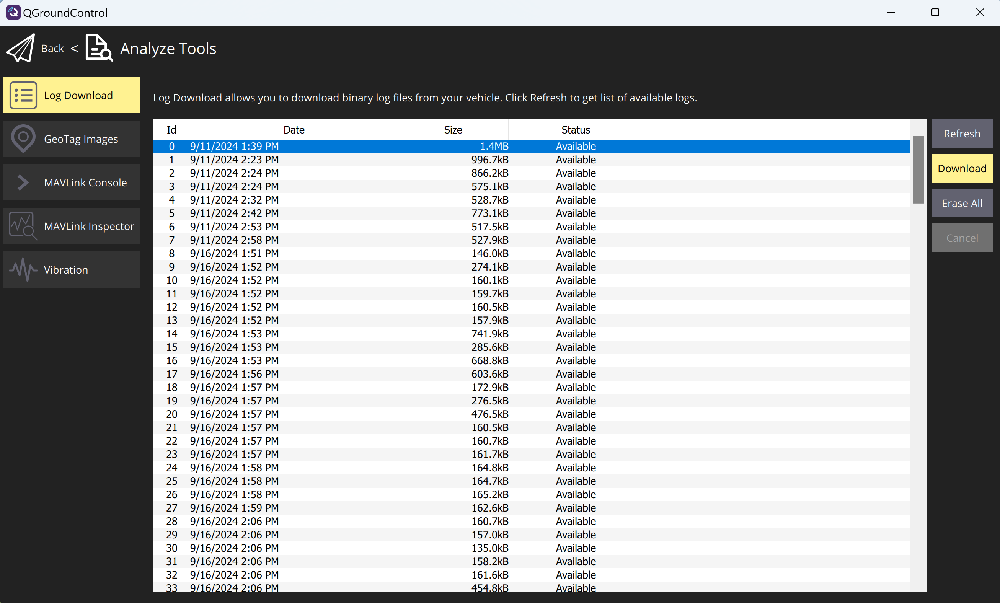
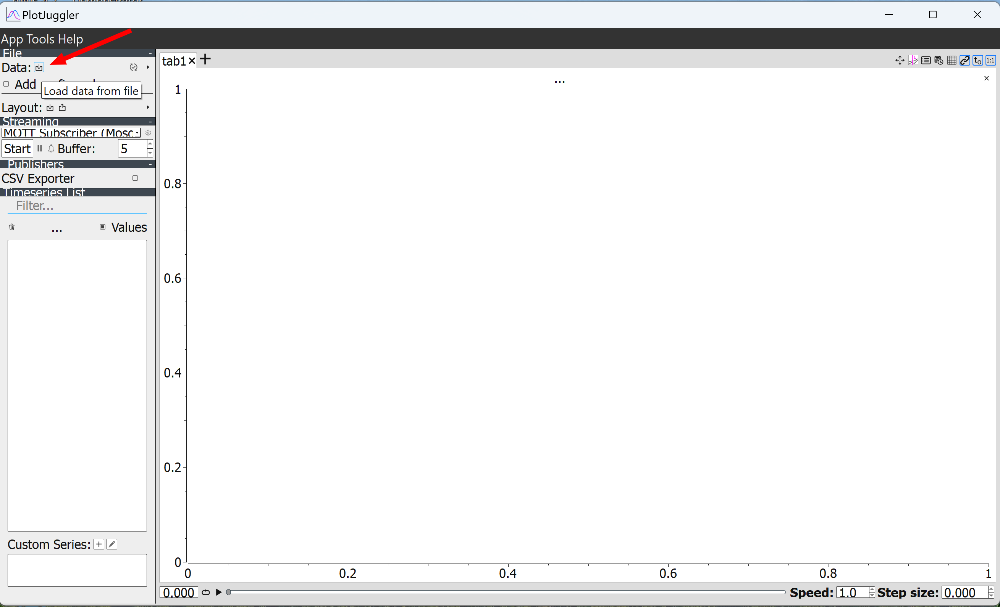
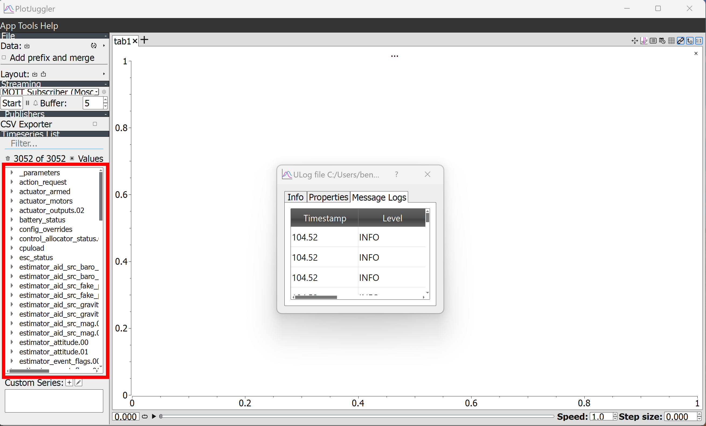
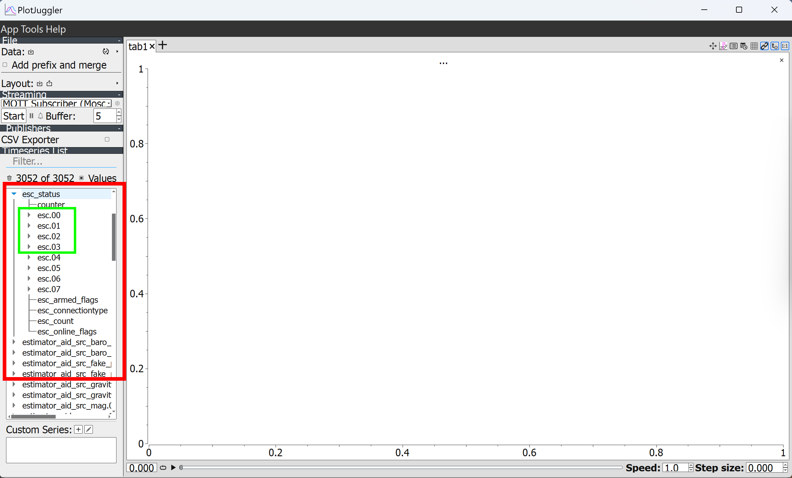
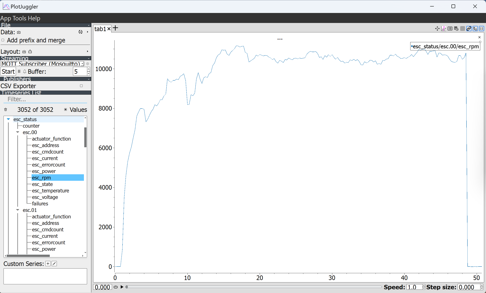
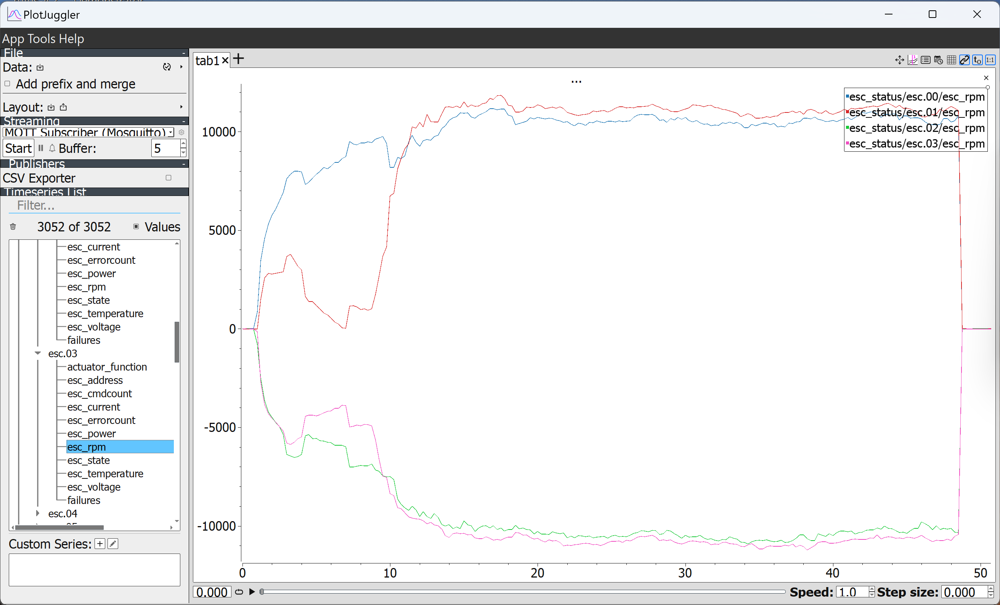

.. meta:: 
    :description: Learn how to export and analyze motor telemetry logs from a PX4 flight controller using QGroundControl and PlotJuggler. This guide covers downloading .ulg files and visualizing ESC status data. 
    :keywords: PX4, QGroundControl, flight controller logs, PlotJuggler, telemetry, .ulg, EscStatus, motor analysis, rpm logging, analyze tools

.. include:: ../text_colors.rst
.. toctree::

.. _ifci_log:

**************************************************************
Exporting Logs from PX4 Flight Controller using QGroundControl
**************************************************************

.. note::
    This tutorial is only applicable for PX4 firmware.

Exporting Logs 
==============

Motor telemetry data can be found in the flight controller logs if you are using PX4 firmware.  
Also, your PX4 firmware must have the EscStatus topic enabled for logging. Please refer to the `PX4 Logging documentation <https://docs.px4.io/main/en/dev_log/logging.html>`__ on how to configure which topics are logged.
This tutorial covers how to extract and view motor telemetry logs from your flight controller's SD card using QGroundControl.

Click the QGroundControl icon on the upper left-hand corner of the application.
Then, click "Analyze Tools" from the pop-up menu.

.. figure:: ../_static/tutorial_images/ifci_log/analyze_tools.png
    :align: center
    :alt: Analyze Tools

    QGroundControl Analyze Tools

Initially, there may be no logs displayed. If so, click the "Refresh" button to display the logs that are stored on the SD card in your flight controller.

.. figure:: ../_static/tutorial_images/ifci_log/refresh_button.png
    :align: center
    :alt: Refresh Button

    QGroundControl Refresh Logs

Then, select the log that you want to download, and click the "Download" button. 

    QGroundControl Download Logs

You can then choose where to download the selected log file through the file explorer. The log in this example is an .ulg file.

Viewing Logs
============

There are many ways to view .ulg files. We recommend using the open-source application `PlotJuggler <https://plotjuggler.io/>`_.
Using your browser, navigate to the `PlotJuggler GitHub page <https://github.com/facontidavide/PlotJuggler>`_ and download the application for your operating system.

After the installation completes, run PlotJuggler.

Locate the button to load the flight controller log file. It is located in the upper left-hand corner next to the "Data:" label. When you hover your cursor over the button, the tooltip that appears should display "Load data from file".
Click the button and select the .ulg flight controller log file.

    PlotJuggler Load Data Button

After your log file is loaded, the panel on the left-hand side will be populated with the topics that have been configured for logging.
Please refer to the `PX4 Logging documentation <https://docs.px4.io/main/en/dev_log/logging.html>`__ on how to configure which topics are logged.

    PlotJuggler Loaded Data

Locate and select "esc_status". A sub-menu of ESC values will be displayed.

    PlotJuggler ESC Status 

Select "esc.00" and a sub-menu will be displayed containing data for this specific ESC. Drag-and-drop "esc_rpm" the empty plot on the right. 

    PlotJuggler RPM data for "esc.00"

The plot of the rpm data of "esc.00" will be displayed, which is the RPM reported by the module. To view the throttle values that the flight controller is outputting to each module, see the `ActuatorOutputs topic <https://docs.px4.io/main/en/msg_docs/ActuatorOutputs.html>`_.
Repeat the step above for "esc.01", "esc.02", and "esc.03".

    PlotJuggler RPM data for all ESC values

Now you can compare the RPM data for all four modules. The same steps can be applied for the other ESC data types.

Additional Information About EscStatus Topic Numbering
======================================================
For firmware with IFCI enabled, the EscStatus topic values "esc.00", "esc.01", "esc.02", and "esc.03" map to the values selected for the VTQ_TELEM_IDS_1 or VTQ_TELEM_IDS_2 parameter in the firmware, starting with the lowest value.

For firmware with DroneCAN enabled, the EscStatus topic values map to the ESC index values.