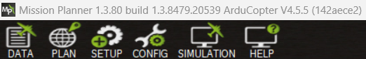
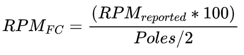

.. include:: ../text_colors.rst
.. toctree::

.. _fc_telemetry_tutorial:

****************************************************
Telemetry Integration with Flight Controllers
****************************************************
Vertiq modules support :ref:`ESC telemetry <manual_telemetry>` allowing them to report information back to a flight controller using telemetry messages.
For more details on the ESC telemetry supported by Vertiq modules, see the :ref:`ESC Telemetry <manual_telemetry>` section of the Feature Reference Manual.

This tutorial walks through how to configure a Vertiq module and a PX4 or ArduCopter flight controller to allow the flight controller to gather telemetry
data from the module.

Module Hardware, Firmware, and Software Versions
=================================================
This tutorial was created with a :ref:`Vertiq 81-08 G2 <vertiq_81xx_family>` module on speed firmware version 0.0.0. This tutorial should be applicable to any Vertiq module
that supports :ref:`ESC Telemetry <manual_telemetry>`. 

IQ Control Center version 1.6.0 was used to create this tutorial. The image below summarizes this version information.

    Version Information for Tutorial

Flight Controller Hardware
===========================
This tutorial was created using a `Pixhawk 6C <https://docs.px4.io/main/en/flight_controller/pixhawk6c.html>`_ flight controller. For receiving
DSHOT telemetry, the TELEM2 port was configured as a serial port and connected to the Telemetry pin of the 81-08. Refer your module's family page
to see how to connect for telemetry. TELEM2 was selected arbitrarily as the serial port to use for receiving ESC telemetry, any other available serial
port on your flight controller could be used. Refer to your flight controller's manual for pinout and port information.

.. _fc_telem_hardware_connection:

Connecting the Module and Flight Controller
===========================================
The Telemetry line of each Vertiq module in use should be connected to the RX pin of the serial port being used for ESC telemetry on your flight controller. 
Refer to your module's family page to see how to connect with the Telemetry line. For example, when creating this tutorial the TELEM2 port on 
the Pixhawk 6C was used to receive telemetry. The `pinout for TELEM2 on the Pixhawk 6C <https://docs.holybro.com/autopilot/pixhawk-6c/pixhawk-6c-ports#telem-2-port>`_
indicates that the RX pin for TELEM 2 is pin 3, so the Telemetry lines for the modules were connected to pin 3.

This is the same as the hardware setup used for receiving ESC Telemetry from BLHeli ESCs. Refer
to the ArduCopter documentation on `connecting ESC telemetry for BLHeli ESCs <https://ardupilot.org/copter/docs/common-blheli32-passthru.html#connecting-the-escs-telemetry-wire>`_ for more information.

Ardupilot and Mission Planner Configuration and Testing
=======================================================
The sections below cover how to set up telemetry integration on a flight controller using `ArduCopter <https://ardupilot.org/copter/>`_ firmware and `Mission Planner <https://ardupilot.org/planner/>`_.

ArduCopter and Mission Planner Versions
****************************************
This tutorial was created using ArduCopter version 4.5.5 and Mission Planner version 1.3.80, as shown below.

    ArduCopter and Mission Planner Versions for Tutorial

DSHOT Telemetry
****************

Configuring ArduCopter
#######################
Configure your Vertiq module and flight controller according to the :ref:`PWM and DSHOT Control with a Flight Controller <hobby_fc_tutorial>`,
following the steps for DSHOT with ArduCopter. Confirm that your module can be controlled by the flight controller before proceeding.

Once you have the basic DSHOT set up complete, you can move onto configuring telemetry. First, you must select a serial port to use for receiving
telemetry from the module. When creating this tutorial, the TELEM2 port on the `Pixhawk 6C <https://docs.holybro.com/autopilot/pixhawk-6c/pixhawk-6c-ports#telem-2-port>`_
was used. For more details on how to set up the hardware connection to this serial port, see the :ref:`fc_telem_hardware_connection` section above.

DSHOT telemetry with a Vertiq module uses the same type of connection as a BLHeli ESC, so `this page from the ArduCopter documentation on setting up telemetry
for BLHeli ESCs <https://ardupilot.org/copter/docs/common-blheli32-passthru.html#esc-telemetry>`_ is a useful reference. As specified on that page,
we first must set up the serial port that will be used to receive the telemetry. For this tutorial the TELEM2 port is being used, which for
the Pixhawk 6C `maps to SERIAL2 according to the ArduCopter documentation <https://ardupilot.org/plane/docs/common-holybro-pixhawk6X.html#uart-mapping>`_.

Since TELEM2 maps to SERIAL2, change the SERIAL2_PROTOCOL parameter to 16 in Mission Planner to set SERIAL2 to ESC Telemetry, as shown below.

    Setting SERIAL2_PROTOCOL to ESC Telemetry

The SERIAL2_BAUD parameter should also be set to match the baudrate of the Vertiq module. By default, Vertiq modules use a baudrate of 115200, so
set SERIAL2_BAUD to 115 as shown below.

    Setting SERIAL2_BAUD for 115200 Baudrate

The `ArduCopter documentation on setting up telemetry for BLHeli ESCs <hhttps://ardupilot.org/copter/docs/common-blheli32-passthru.html#esc-telemetry>`_
mentions configuring SERVO_BLH_TRATE and SERVO_BLH_POLES. These can be left at their defaults for a basic telemetry test setup. If you want a
higher telemetry update rate, you can change the SERVO_BLH_TRATE. For details on the effect of SERVO_BLH_POLES, see the :ref:`arducopter_erpm_vs_rpm`
section below.

After changing these parameters, reboot your flight controller.

Testing Telemetry
##################
Live ESC telemetry updates can be viewed in Mission Planner under the Status section of the DATA tab (available in the top left). After properly configuring the flight controller,
power on your connected Vertiq module. Select the Status section in the DATA tab, and scroll over to the esc1 section. The "esc1_curr", "esc1_rpm",
"esc1_temp", and "esc1_volt" entries should update with live telemetry information, as shown below. 

.. note::
    If you are using a safety switch, you must arm it in order to view live telemetry.

    Live Telemetry Updates in Mission Planner

To test telemetry when spinning, use the Motor Test tab to spin the module. **Before attempting to spin the
module ensure that your module is secured and does not have a propeller attached.** The image below shows an example of spinning the module at 5% throttle for 200 seconds,
which will keep the module spinning for an extended period, making it easier to check the telemetry.

    Motor Test in Mission Planner to Test Telemetry When Spinning

The image below shows telemetry data for a spinning module. Note the non-zero esc1_rpm value. For more information on how the flight controller calculates
the displayed RPM value based on the value reported by the module, see the :ref:`arducopter_erpm_vs_rpm` section below.

    Live Telemetry Updates in Mission Planner When Spinning

.. _arducopter_erpm_vs_rpm:

ERPM vs. RPM
##############
As of v4.5.5, ArduCopter flight controllers expect the DSHOT telemetry messages to match the `KISS ESC standard <https://www.rcgroups.com/forums/showatt.php?attachmentid=8524039&d=1450424877>`_.
That means that it expects the module to send ERPM/100. Vertiq modules by default, however, directly send RPM as covered in :ref:`ESC Telemetry <manual_telemetry>`.

There are two methods to deal with this. The first, and recommended, option is to configure your module to transmit the ERPM/100 value directly through its telemetry responses. This can be done by changing the value of **Timer Based Protocol RPM Reporting Style** 
in the Control Center's advanced tab:

.. note:: 
    This parameter is only available on firmware versions 0.2.0 and up.

Simply set this value to **eRPM/100**, and your module will automatically transmit the KISS ESC standard's form of telemetry, and your flight controller will manage it natively as it calculates RPM by:

    ERPM to RPM Conversion

Please note that you will still have to configure your flight controller to know the correct number of pole pairs present on your module. Using Mission Planner, you can set this value 
under SERVO_BLH_POLES.

The second option is to convert from ERPM to RPM manually. The flight controller is expecting to receive ERPM/100, so when it receives telemetry it tries to calculate RPM using the following formula shown above. This calculation can also be
seen in the `ArduCopter code for BLHeli telemetry parsing <https://github.com/ArduPilot/ardupilot/blob/master/libraries/AP_BLHeli/AP_BLHeli.cpp#L1447>`_.

Because Vertiq modules send RPM instead of ERPM, this conversion is unnecessary, and actually leads to the flight controller calculating the incorrect RPM by default.

As discussed in the :ref:`fc_telemetry_erpm_to_rpm` section for PX4 below, it is possible to work around this conversion issue by setting the number of motor poles to 200.
As of v4.5.5, ArduCopter flight controllers limit the maximum value of SERVO_BLH_POLES to 127, so it is not possible to apply this workaround when using
ArduCopter. As a result, the RPM value calculated by the flight controller will not be the module's true RPM, but any logged telemetry data can be converted
based on the formula above to get the actual RPM value.

Standard PWM Telemetry
***********************
Vertiq modules support sending ESC telemetry when using :ref:`Standard PWM <hobby_standard_pwm>` and :ref:`other analog protocols <hobby_other_protocols>`
as covered in the :ref:`ESC Telemetry <telemetry_analog_request>` section of the Feature Reference Manual. This telemetry is requested by sending a 
:ref:`30 microsecond pulse <telemetry_analog_request>` to the module over the throttle line.  

As of version 4.5.5 ArduCopter flight controllers do not seem to support this method of requesting ESC telemetry according to 
the `ArduCopter documentation (see the note on polling for telemetry data on non-DSHOT protocols) <https://ardupilot.org/copter/docs/common-esc-telemetry.html#esc-telemetry>`_.
The relevant note from the ArduCopter documentation is shown below.

    ArduCopter Note on ESC Telemetry for non-DSHOT Protocols

DroneCAN Telemetry
******************
For configuring your module, follow the module setup steps in the :ref:`tutorial for integrating a Vertiq module using DroneCAN with a flight controller <dronecan_fc_tutorial>`.
For flight controller setup, refer to :ref:`dronecan_with_ardupilot`.

After completing these steps, no additional configuration of the flight controller is required for it to receive ESC telemetry. As covered in the :ref:`ESC Telemetry <telemetry_dronecan>` 
section of the Feature Reference Manual, Vertiq modules constantly broadcast ESC telemetry messages on the DroneCAN bus when they are connected, and PX4
flight controllers are able to accept those messages.

The only additional configuration that may be useful is to adjust the :ref:`DroneCAN telemetry frequency <telemetry_dronecan_telemetry_frequency>` on
your Vertiq module to change how frequently telemetry updates are broadcast.

Check the Status section in the DATA tab of Mission Planner to see live telemetry updates from the module. Scroll over to the esc1 entries, they should be updating
as the module broadcasts its telemetry messages, as shown in the image below.

    DroneCAN Live Telemetry Updates in the Status Section of Mission Planner

To see a non-zero RPM you can spin the module from Mission Planner using the Motor Test tab as shown below. **Before attempting to spin the
module ensure that your module is secured and does not have a propeller attached.**

    Motor Test in Mission Planner to Test Telemetry When Spinning

Now if you check the telemetry updates in the Status section, the reported esc1_rpm should be non-zero as can be seen below. Unlike while using DSHOT, there are no issues converting from ERPM to RPM. 
The DroneCAN standard specifies sending a signed
RPM value, and Vertiq modules conform to this standard. So the flight controller should report the correct RPM value.

    DroneCAN Live Telemetry Updates in the Status Section of Mission Planner When Spinning

PX4 and QGroundControl Configuration and Testing
================================================
The sections below cover how to set up telemetry integration on a flight controller using `PX4 <https://px4.io/>`_ firmware and `QGroundControl <http://qgroundcontrol.com/>`_.

PX4 and QGroundControl Versions
********************************
This tutorial was created using PX4 version 1.14.3 and QGroundControl version 4.3.0, as shown below.

    PX4 Version for Tutorial

    QGroundControl Version for Tutorial

DSHOT Telemetry
****************

Configuring PX4
################
Configure your Vertiq module and flight controller according to the :ref:`PWM and DSHOT Control with a Flight Controller <hobby_fc_tutorial>`,
following the steps for DSHOT with PX4. Confirm that your module can be controlled by the flight controller before proceeding.

Once you have the basic DSHOT set up complete, you can move onto configuring telemetry. First, you must select a serial port to use for receiving
telemetry from the module. When creating this tutorial, the TELEM2 port on the `Pixhawk 6C <https://docs.holybro.com/autopilot/pixhawk-6c/pixhawk-6c-ports#telem-2-port>`_
was used. For more details on how to set up the hardware connection to this serial port, see the :ref:`fc_telem_hardware_connection` section above.

Now you must enable telemetry on the appropriate serial port on the flight controller. **Set the DSHOT_TEL_CFG parameter to TELEM 2 or the appropriate
serial port in QGroundControl, as shown below.** That is the only parameter that needs to be changed on the flight controller to start receiving DSHOT telemetry.
For more information on setting up DSHOT telemetry on a PX4 flight controller, refer to the `PX4 documentation <https://docs.px4.io/main/en/peripherals/dshot.html#telemetry>`_.

    DSHOT_TEL_CFG Parameter in QGroundControl

Testing Telemetry
##################
To test that telemetry is working, you can configure your `instrument panel <https://docs.qgroundcontrol.com/master/en/FlyView/FlyView.html#instrument_panel>`_ 
in QGroundControl to display live ESC Status values. For the example shown below, the instrument panel was configured to show Rpm1, Voltage1, and Current1
for ESCStatus, in order to show the RPM, Voltage, and Current values from the telemetry received from the module the flight controller considers Motor 1.
If your module is powered and connected to the flight controller properly, live values for these data points should be shown in the instrument panel as shown below.

    QGroundControl Instrument Panel Showing DSHOT Telemetry

To see what the telemetry would look like when spinning, you can use the "actuator_test" command in the MAVLink Console under Analyze Tools, as shown
in the code block below. **Before attempting to spin the module ensure that your module is secured and does not have a propeller attached.**

.. code::

    nsh> actuator_test set -m 1 -v 0.01

The image below shows an example of what the instrument panel may look like when the module is spinning. 

    QGroundControl Instrument Panel Showing DSHOT Telemetry When the Module is Spinning

Note that if you are using the default settings for MOT_POLE_COUNT, the RPM shown on the instrument panel will be significantly higher than the actual RPM of the module. This is because PX4 expects the module
to report ERPM, but Vertiq modules report RPM directly as covered in the :ref:`ESC Telemetry <manual_telemetry>` section of the Feature Reference Manual.
To learn how to adjust the MOT_POLE_COUNT to properly show RPM, see the :ref:`fc_telemetry_erpm_to_rpm` section below.

.. _fc_telemetry_erpm_to_rpm:

Converting ERPM to RPM Workarounds
###################################
As of v1.14.3, PX4 flight controllers expect the DSHOT telemetry messages to match the `KISS ESC standard <https://www.rcgroups.com/forums/showatt.php?attachmentid=8524039&d=1450424877>`_.
That means that it expects the module to send ERPM/100, while Vertiq modules, by default, directly send RPM as covered in :ref:`ESC Telemetry <manual_telemetry>`.

There are two methods to deal with this. The first, and recommended, option is to configure your module to transmit the ERPM/100 value directly through its telemetry responses. This can be done by changing the value of **Timer Based Protocol RPM Reporting Style** 
in the Control Center's advanced tab:

.. note:: 
    This parameter is only available on firmware versions 0.2.0 and up.

Simply set this value to **eRPM/100**, and your module will automatically transmit the KISS ESC standard's form of telemetry, and your flight controller will manage it natively as it calculates RPM by:

    ERPM to RPM Conversion

In order for your flight controller to correctly parse the eRPM data, you must also properly configure the flight controller's expected number of pole pairs. You can configure this with 
the MOT_POLE_COUNT parameter.

The second option is to convert from ERPM to RPM manually. The ERPM value should be divided by the pole count of the motor divided by 2. The flight controller is expecting to receive 
ERPM/100, so when it receives telemetry it tries to calculate RPM using the following formula shown above. This calculation can also be
seen in the `PX4 code for DSHOT parsing <https://github.com/PX4/PX4-Autopilot/blob/be03b7f098800d51281142cb0319cc37d36cfed2/src/drivers/dshot/DShot.cpp#L228>`_.

Because Vertiq modules, by default, send RPM instead of ERPM, this conversion is unnecessary, and actually leads to the flight controller calculating the incorrect RPM by default.
However, there is a workaround available on PX4 that makes it possible for the flight controller to calculate the correct RPM when using Vertiq modules. 

The conversion includes the number of poles on the motor. By setting the number of poles to 200, the conversion simplifies down to multiplying the reported RPM by 1.
This means that the received RPM is used without any conversion, which is what we want when using Vertiq modules. Because of this, if not using the first solution, it is recommended to set the MOT_POLE_COUNT 
to 200, as shown below, when using DSHOT telemetry with a Vertiq module. This is not the actual number of poles in the module, but the actual number of poles is irrelevant
when using telemetry with Vertiq modules since they report RPM instead of ERPM.

    MOT_POLE_COUNT to Properly Calculate RPM
    
After setting the MOT_POLE_COUNT to 200, the RPM values displayed in QGroundControl should be accurate.

Standard PWM Telemetry
***********************
Vertiq modules support sending ESC telemetry when using :ref:`Standard PWM <hobby_standard_pwm>` and :ref:`other analog protocols <hobby_other_protocols>`
as covered in the :ref:`ESC Telemetry <telemetry_analog_request>` section of the Feature Reference Manual. This telemetry is requested by sending a 
:ref:`30 microsecond pulse <telemetry_analog_request>` to the module over the throttle line.  

However, as of v1.14.3 PX4 flight controllers do not seem to support this method of requesting ESC telemetry according to the 
`PX4 documentation <https://docs.px4.io/main/en/peripherals/esc_motors.html#pwm>`_. The relevant portion of the `PX4 documentation <https://docs.px4.io/main/en/peripherals/esc_motors.html#pwm>`_
is reproduced below with the important sentence regarding ESC telemetry highlighted.

    PX4 Documentation on ESC Telemetry When Using Standard PWM

DroneCAN Telemetry
******************
First, follow the steps in the :ref:`tutorial for integrating a Vertiq module using DroneCAN with a PX4 flight controller <dronecan_fc_tutorial>`.
After that tutorial, you should be able to control your module from the flight controller using DroneCAN. After configuration, no additional
set up of the flight controller is required for it to receive ESC telemetry. As covered in the :ref:`ESC Telemetry <telemetry_dronecan>` 
section of the Feature Reference Manual, Vertiq modules constantly broadcast ESC telemetry messages on the DroneCAN bus when they are connected, and PX4
flight controllers are able to accept those messages.

The only additional configuration that may be useful is to adjust the :ref:`DroneCAN telemetry frequency <telemetry_dronecan_telemetry_frequency>` on
your Vertiq module to change how frequently telemetry updates are broadcast.

You can confirm that you are receiving ESC telemetry by using the `instrument panel <https://docs.qgroundcontrol.com/master/en/FlyView/FlyView.html#instrument_panel>`_ 
in QGroundControl to display live ESC Status values. For the example shown below, the instrument panel was configured to show Rpm1, Voltage1, and Current1
for ESCStatus, in order to show the RPM, Voltage, and Current values from the telemetry received from the module the flight controller considers Motor 1.
If your module is powered and connected to the flight controller properly, live values for these data points should be shown in the instrument panel as shown below.

    QGroundControl Instrument Panel Showing DroneCAN Telemetry

There are no issues with conversion from ERPM to RPM, as there are when using DSHOT, when using DroneCAN. The DroneCAN standard specifies sending a signed
RPM value, and Vertiq modules conform to this standard. So the flight controller should report the correct RPM value.

To see what the telemetry would look like when spinning, refer to the :ref:`throttle testing section on the DroneCAN with PX4 tutorial <dronecan_px4_throttle_test_commands>` 
for details on how to spin your module with QGroundControl.