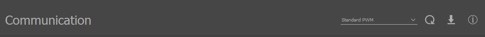

.. include:: ../text_colors.rst
.. toctree::

.. _hobby_calibration_tutorial:

***********************************************
Calibrating Modules With Analog Hobby Protocols
***********************************************

Vertiq modules can be controlled with analog :ref:`hobby protocols <manual_hobby>`, such as :ref:`Standard PWM <hobby_standard_pwm>` and :ref:`OneShot <hobby_other_protocols>`. 
These protocols send throttle commands to the module using a square wave or pulse of variable duration,
where the length of the wave determines the throttle input. For example, when using Standard PWM, by default Vertiq modules interpret a 
pulse of 1000 us as 0% throttle, and a pulse of 2000 us as 100% throttle. For more details on how a module can be configured to interpret 
throttle commands, refer to the :ref:`manual_throttle` section of the Feature Reference Manual.

However, the exact pulse duration used to represent the endpoints of the throttle range can vary between different controllers. One controller may consider 1000 us to 2000 us to be the 0%
to 100% range, but another may consider 950 us to 1950 us to be the range. For a controller to properly control a Vertiq module, they must agree on this input range. In some instances you
can edit the range used by the controller as discussed for Ardupilot and PX4 based flight controllers in this tutorial: :ref:`hobby_fc_tutorial`. 

Another reason why calibration may be necessary is due to clock inaccuracies. Vertiq 2306 modules do not have an external crystal, which reduces the accuracy of their clock. This can lead
to a 2306 measuring a pulse's duration differently than the controller, so they may not agree on exactly what throttle level is expected. Calibration allows the module and the controller to
clarify what the endpoints for the throttle commands should be.

Another option is to adjust the input range of the Vertiq module so that it matches the controller. This is commonly done on a range of ESCs, and is known as "calibration". This tutorial
will cover the calibration process for a Vertiq module.

Softare and Firmware Setup
==========================
To follow this tutorial, ensure that your **IQ Control Center is on version 1.2.6 or later**. Earlier versions lacked some of the calibration features that will be discussed. If you
are unfamiliar with the Control Center, refer to :ref:`control_center_tutorial` for basic usage information. 

If using a Vertiq 2306, it should be on **firmware version v0.0.26 or later**. If using a Vertiq 8108, it should be on **firmware version 0.0.5 or later**. Earlier versions of the firmware for these
modules had bugs that made calibration difficult and lacked some useful calibration parameters.

For this tutorial, you should set up your module to use the :ref:`Standard PWM <hobby_standard_pwm>` hobby protocol. Follow the instructions in :ref:`hobby_fc_tutorial` to set up your module for Standard PWM control
using Control Center and to connect your hardware to the module. That tutorial also covers how to set up some flight controllers for Standard PWM control.

Overview of Calibration Procedure
=================================
This section discusses at a high level how the calibration procedure for a module works. Later sections will walk through specific examples of performing calibration.

.. warning:: Ensure that the module is secured and there is no propeller attached before attempting calibration, as the module may spin

The steps to perform calibration are:

1. Power off the module. Check that your Standard PWM input is connected correctly to the module (see :ref:`hobby_fc_tutorial` for more details).
2. Raise your Standard PWM input to its maximum throttle level, and hold it there. If using an RC transmitter, this means holding the stick at maximum throttle.
3. Power on the module, and keep the Standard PWM input at its maximum level while waiting for the module to complete its startup song.
4. The module should begin looping through its 4-note "begin calibration" song.
5. Begin lowering the Standard PWM input. As you do, the module song should shift to the "calibration-in-progress" song. The new song plays the same notes as the previous song, but plays each note twice in a row and more quickly. If using an RC transmitter, begin lowering the throttle stick.
6. Keep lowering the Standard PWM input to its minimum level. The calibration-in-progress song should continue playing. If using an RC transmitter, push down the throttle stick as far as possible.
7. Once the Standard PWM input reaches its minimum level, hold it there briefly. Then begin raising the input again. 
8. The module should stop playing the calibration-in-progress song as you raise the input. Depending on your minimum and maximum input levels, the module may arm at this point and start spinning. 
   If the module doesn't arm, don't worry. The calibration song stopping is the important indicator that the calibration has been accepted.
9. If the module did not arm while raising the input, lower the input to its minimum again. The module should now arm. Raise the throttle and confirm the module spins.

The video below demonstrates the sounds a module makes as it is taken through the calibration process from start to finish. The module first plays the startup song, then the begin calibration
song, then the calibration-in-progress song, and finally plays the arming song and begins spinning:

.. raw:: html

    
    <video class='center_vid' controls><source src="../_static/tutorial_images/calibration_tutorial/calibration_procedure.mp4" type="video/mp4"></video>

Checking and Trimming Calibration with Control Center
=====================================================
The Control Center provides several useful parameters that can help us understand if a module calibrated properly. If you are unsure if calibration was completed successfully, check the parameters discussed below.
**Make sure you are using Control Center version 1.2.6 or later to take advantage of these parameters.** If you are unfamiliar with Control Center, refer to :ref:`control_center_tutorial`

The first parameter to check is the *Communication* parameter in the General tab. When you calibrate a module, it will set its communication type to the protocol that was used to 
calibrate if *Communication* was previously set to *Autodetect*. Check that the *Communication* setting matches the protocol you calibrated with. If *Communication* was explicitly
set to a value other than *Autodetect* prior to calibration, then its value should not change. The figure below shows the an example of the *Communication* parameter after
calibrating a module with the Standard PWM protocol. If you do wish to switch to using another protocol, you can simply change the selected Communication protocol.

    Communication Parameter in General Tab After Calibrating With Standard PWM

The next parameters of interest are in the Advanced tab. Open the Advanced tab, Clicking "Yes" when prompted. There are 4 relevant parameters here:

    * **Hobby Calibrated Communication Protocol**: This indicates what protocol the module has been calibrated with. If the module has not been calibrated, this will be set to *No Calibration*.
      A protocol does not need to be calibrated to use it on the module. If a protocol is not calibrated the module will use its default endpoints for that protocol. Only one protocol can be calibrated at a
      time. This parameter is **read-only**, you cannot change the calibrated protocol from Control Center, you need to go through the calibration process with the desired protocol to set this.
      This is a useful way to check that calibration was succesful. If this is at *No Calibration* after a calibration attempt, that indicates that the calibration did not complete successfully.
    * **Hobby Calibration High**: This parameter reports the pulse duration in us that is considered to be a 100% throttle command by the module. After calibration, you can compare this to what the
      top-end on your controller should be, and check that they are similar. You can also manually trim the top-end duration here if necessary by changing the value of this parameter.
      If the module is not calibrated, this will be set to 0 us.
    * **Hobby Calibration Low**: This parameter reports the pulse duration in us that is considered to be a 0% throttle command by the module. After calibration, you can compare this to what the
      low-end on your controller should be, and check that they are similar. You can also manually trim the low-end duration here if necessary by changing the value of this parameter.
      If the module is not calibrated, this will be set to 0 us.
    * **Hobby Calibration Reset**: This parameter allows you to clear all calibration settings from the module. This can be useful if you want to start completely fresh with calibration.

The figure below shows an example of what these parameters might look like after successfully calibrating using the Standard PWM protocol.

    Calibration Parameters in Advanced Tab After Calibrating With Standard PWM

Calibration With ArduCopter and Mission Planner Motor Test
==========================================================
If you are using a flight controller with the module, generally you will calibrate the flight controller using the RC transmitter you are using to interface with the flight controller. 
The `Overview of Calibration Procedure`_ section above covers how you would move the throttle to run through the calibration process if your RC transmitter and flight controller are 
set up. This calibration process is especially easy to complete with an RC transmitter if your flight controllers outputs are configured for RC Passthrough.

However, if you want an easy way to test out calibration without the need for an RC transmitter or if you don't use one at all, you can use the Motor Test functionality of ArduCopter
to run through calibration with just a flight controller, a Vertiq module, and a connector.

First, follow the steps laid out in :ref:`hobby_fc_tutorial` for setting up your Vertiq module and ArduCopter flight controller to communicate with each other using Standard PWM. Make sure to test
that the flight controller can spin the module before proceeding. **It is important to pay attention to the set up of the MOT_PWM_MIN and MOT_PWM_MAX parameters in the linked tutorial.
If the MOT_PWM_MAX parameter is too low, it may fail to trigger the module to start calibration. For example, if MOT_PWM_MAX is 1950 us, the calibration process may be difficult to start.**

.. warning:: Ensure that the module is secured and there is no propeller attached before attempting calibration, as the module may spin

Now, open Mission Planner and navigate to the Motor Test section under the Optional Hardware tab as covered in :ref:`hobby_fc_tutorial`. Then,
follow these steps:

    1. Power off the Vertiq module.
    2. Set the duration in Motor Test to 120s. The precise number here isn't critically important, this is just meant to hold each command for a long enough time to make it easy to manually change them.
    3. Set the Throttle % to 100%
    4. Click "Test All Motors" to start sending the 100% throttle commands
    5. Power on the Vertiq Module, and wait for it to start playing the begin calibration song.
    6. Lower the Throttle % to 0% and click "Test All Motors". The module song should switch to the calibration-in-progress song.
    7. Wait 5s, and then set the Throttle % to 50% and click "Test All Motors". The module should stop playing the calibration-in-progress song, indicating it completed calibration.
    8. Lower the Throttle % to 0% and click "Test All Motors". Confirm that the module plays the arming song. Note that if you have changed the arming parameters of the module from their default settings it may not arm on a 0% throttle command, see the :ref:`manual_advanced_arming` section of the Feature Reference Manual for more information.
    9. Try out different Throttle % settings to confirm the module spins when armed.
    10. Power cycle the module and check the Calibrated Protocol, high-end, and low-end duration settings in the Control Center as described in `Checking and Trimming Calibration with Control Center`_ to confirm the calibration was sucessful.

The figures below show what the Motor Test panel should look like at the beginning of the calibration procedure and what your calibration parameters in IQ Control Center should look like after a successful calibration,
though the exact high and low durations may be different.

    Mission Planner Motor Test at Start of Calibration Procedure

    Calibration Parameters in Advanced Tab After Calibrating With Standard PWM through Mission Planner

Calibration With PX4 and QGroundControl Motor Test
==================================================
As described in `Calibration With ArduCopter and Mission Planner Motor Test`_ above, typically you would use an RC transmitter to calibrate a module when connected to a flight controller.
But just as with ArduCopter and Mission Planner, you can also use PX4 and QGroundControl to easily try out calibration without the need for any RC transmitter setup. All you need is your Vertiq 
Module, a flight controller with PX4, and a computer with QGroundControl.

First, follow the steps laid out in :ref:`hobby_fc_tutorial` for setting up your Vertiq module and PX4 flight controller to communicate with each other using Standard PWM. Make sure to test
that the flight controller can communicate with the module before proceeding. **It is important to pay attention to the set up of the PWM_MAIN_MIN and PWM_MAIN_MAX parameters in the linked tutorial.
If the PWM_MAIN_MAX is too low it may fail to trigger the module to start calibration. For example, if MOT_PWM_MAX is 1950 us, the calibration process may be difficult to start.**

.. warning:: Ensure that the module is secured and there is no propeller attached before attempting calibration, as the module may spin.

Open QGroundControl, and wait for it to connect to your flight controller. Click on the Q in the upper-left corner, and then select "Analyze Tools". Select "MAVLink Console".
Then follow these steps:

    .. note:: If using dynamic control allocation with your flight controller (which is true when SYS_CTRL_ALLOC is enabled), you may need to use the "actuator_test" command instead of "motor_test". You can find details on using both "motor_test" and "actuator_test" on the :ref:`DroneCAN Integration Tutorial <dronecan_px4_throttle_test_commands>`.

    1. Power on your Vertiq module.
    2. In the console, enter "motor_test test -p 100".
    3. The module will briefly play the begin calibration song, and then stop.
    4. In the console, enter "motor_test test -p 0".
    5. The module will briefly play the calibration-in-progress song, and then stop.
    6. In the console, enter "motor_test test -p 50".
    7. The module should be calibrated now. To test it, enter "motor_test test -p 0" and confirm the module plays the arming song. Note that if you have changed the arming parameters of the module from their default settings it may not arm on a 0% throttle command, see the :ref:`manual_advanced_arming` section of the Feature Reference Manual for more information.
    8. In the console, enter "motor_test test -p 20" and confirm the module spins and then stops and plays the timeout song.
    9. Power off the module and close QGroundControl.
    10. Power the module back on, and connect to it with IQ Control Center. Check the Calibrated Protocol, high-end, and low-end duration settings in the Control Center as described in `Checking and Trimming Calibration with Control Center`_ to confirm the calibration was sucessful.

The figures below show the MAVLINK Console commands used during calibration, and the state of the calibration parameters in IQ Control Center after successfully calibrating a module witih Standard PWM.

    MAVLINK Console Commands for Calibration Procedure

    Calibration Parameters in Advanced Tab After Calibrating With Standard PWM through QGroundControl