.. include:: ../text_colors.rst
.. toctree::

.. _ifci_integration:

######################################################################################
Module Integration with PX4 and Ardupilot Using IQUART Flight Controller Interface
######################################################################################

The following tutorial will walk you through module and flight controller configuration in order to control your module using the :ref:`IQUART Flight Controller Interface <controlling_ifci>`. 
Provided are examples for both PX4 and ArduPilot flight controllers.

PX4 Set Up
==========

This example uses the Pixhawk 6C with a Vertiq 23-06 module on pulsing firmware v0.2.0. This will be used to demonstrate how to pulse a module with firmware and a flight controller. There are examples for both PX4 and ArduPilot.

.. note::
    If you have not already built PX4 or ArduPilot and flashed it to your flight controller, please complete :ref:`Setting Up PX4 and ArduPilot Firmware with IFCI intragration <ifci_px4_flight_controller>` before proceeding.

Configuring Your Vertiq Modules for Use with IFCI and PX4
---------------------------------------------------------
To use your Vertiq modules properly with IFCI, your modules must be flashed with a compatible firmware version. Please consult your module's family page to find if your module supports IFCI. After flashing the appropriate firmware, connect each module **individually** to IQ Control Center and set the :blue:`UART Baud Rate` and the :red:`Module ID`. As stated previously, we recommend that you use a baud rate of 921600. Both of these parameters will cause the motor to disconnect when set, so make sure you reconnect to the motor after each one is set. When the baud rate is changed you will have to adjust the baud rate in the IQ Control Center to be able to reconnect to the motor. For this reason we recommend changing the module ID and then changing the baud rate. This avoids needing to change the baud rate of IQ Control Center at all. Ensure that each module connected to the flight controller is set to a unique module ID. For this tutorial, we will be using the module IDs 0, 1, 2, and 3. Once all of the modules have different IDs and matching baud rates they can all be connected to IQ Control Center using a single USB port with the wiring diagram shown in the :ref:`Multiple Module Wiring guide<multiple_module_wiring>` if desired.

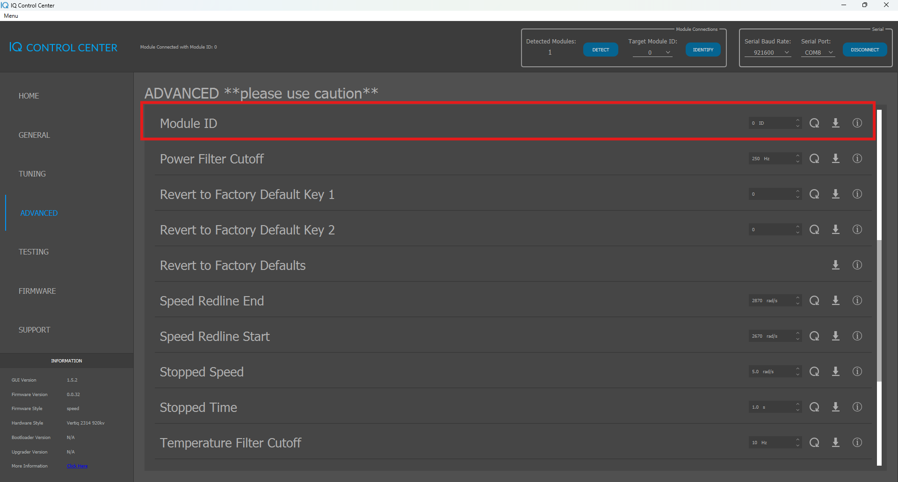

    Setting Module ID

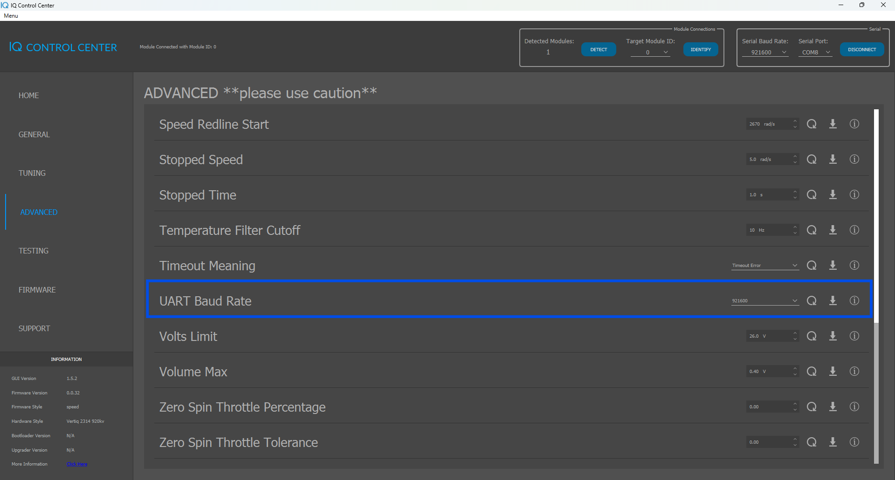

    Setting Baud Rate

.. note::
    Required Configuration Before Connecting with Multiple Modules
    https://iqmotion.readthedocs.io/en/latest/control_center_docs/control_center_start_guide.html#multi-module-config

With the modules set to unique module IDs, and the baud rate set to match the flight controller's, you can now connect your modules to the flight controller. To do this, find the flight controller's serial port that you configured to run Vertiq IO, and connect the TX of the serial port to each module's RX port. Connect the RX of the serial port to each module's TX port. Connect a common ground between the flight controller and each module.

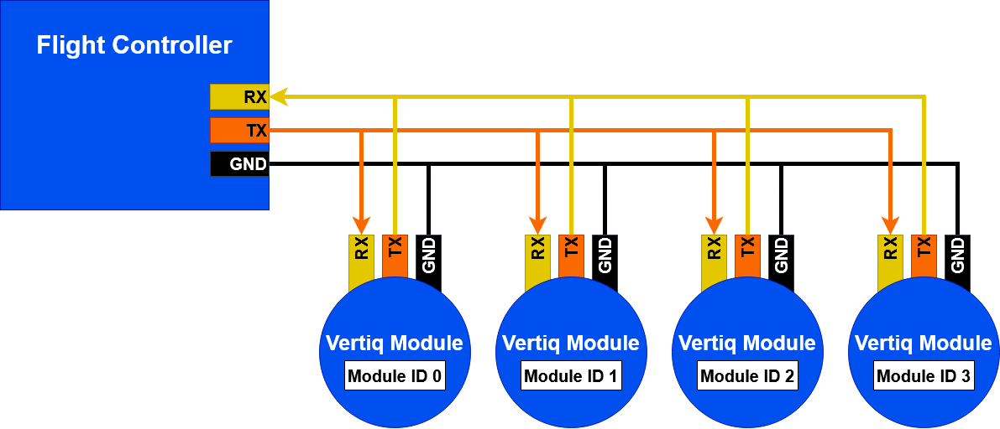

    Module Flight Control Wiring

Integration Setup
-----------------

.. warning::
    Please remove all propellers from any module you plan on testing. Failure to do so can result in harm to you or others around you. Further, please ensure that your modules are secured to a stationary platform or surface before attempting to spin them.

Connect your flight controller and motors as shown in the diagram above. Ensure that both the motors and flight controller are receiving power.  :ref:`A short set of tones<startup_song>` should play from each motor when powered on. Connect the flight controller to QGroundControl, navigate to the :red:`parameters menu`, and select the :blue:`Vertiq IO` subsection as shown below.

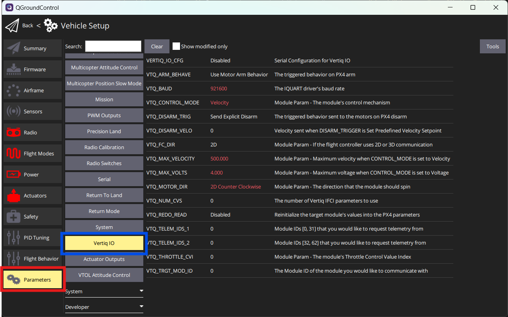

    PX4 Vertiq IO Parameters

The parameters available in this subsection either control how PX4 talks to the modules, or parameters that are specific to the module. Parameters that are specific to the module are indicated by ‘Module Param -’ in their description.

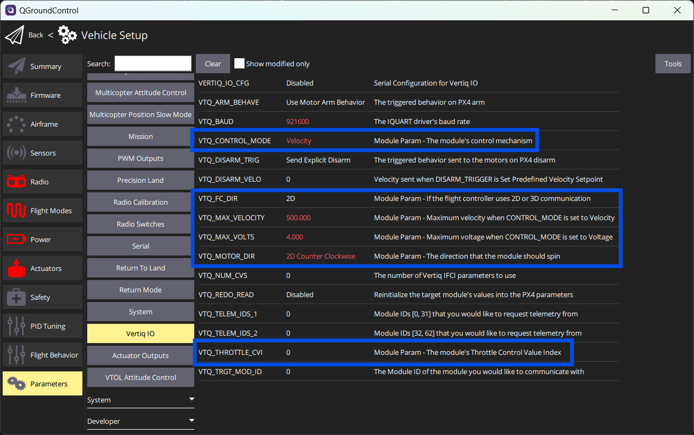

    PX4 Module Parameters

The :blue:`VTQ_TRGT_MOD_ID` parameter sets which module the Module Params are synchronized with. When this parameter is written, the Module Params will be fetched from the module with that module ID and the values displayed for the Module Params will be updated. If you would like to specifically synchronize those parameters without switching module IDs you can set :red:`VTQ_REDO_READ`. It will immediately set itself back to disabled, but the Module Params will synchronize.

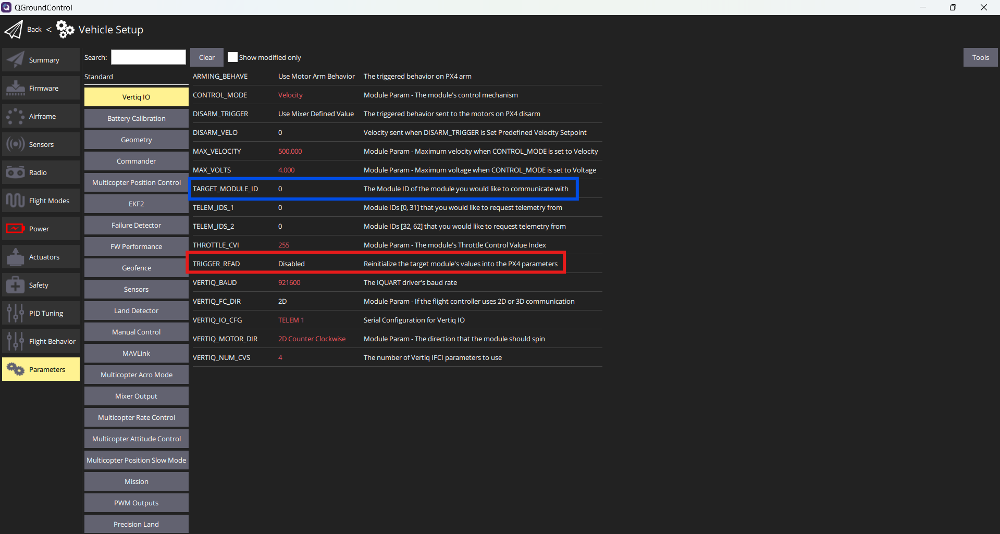

    PX4 Module Parameters

Sometimes if the link from your computer to your flight controller is slow, ``VTQ_REDO_READ`` will not immediately set itself back to disabled. In these cases it is recommended that you :red:`refresh the parameters`.

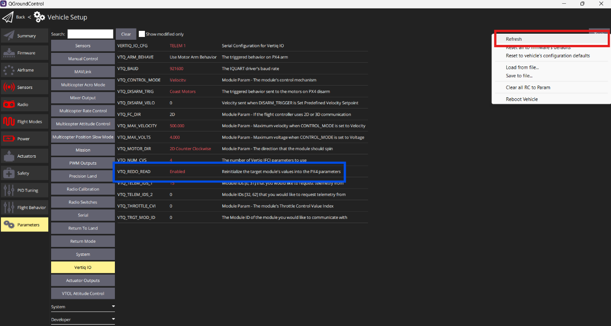

    Refreshing parameters when ``VTQ_REDO_READ`` is stuck !!!change to velocity!!!

In this example, we will set the module's input parser to Velocity mode. This means that received throttle commands are applied as a target velocity for the module to spin at. More information about the different throttle modes can be found in the :ref:`Throttle Mode documentation<throttle_mode>`. We will be setting up the motors to work as if the quadcopter is set up as in the diagram below.

.. _quad_image:
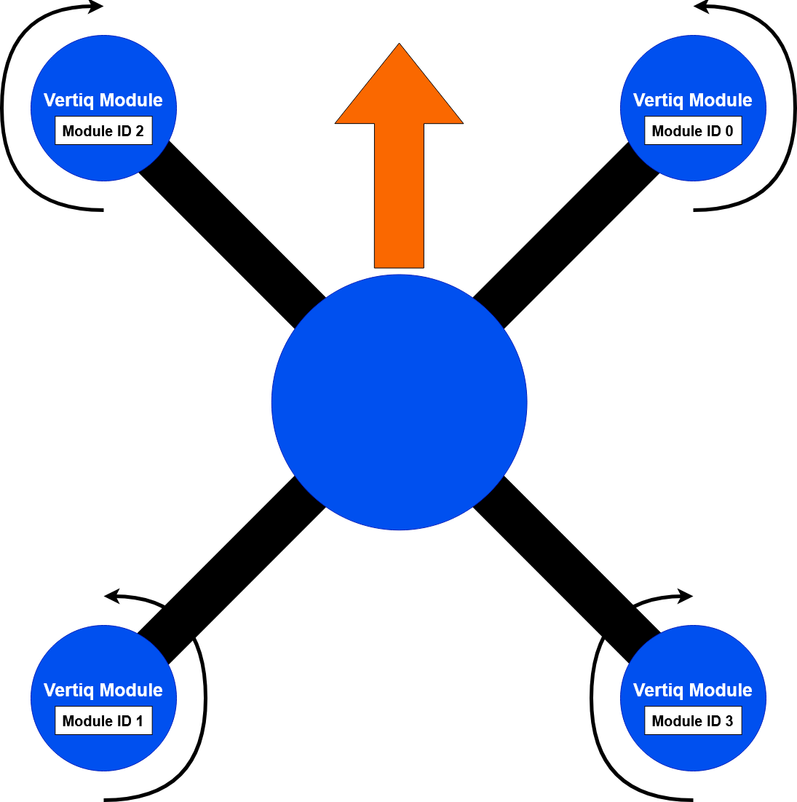

    Module Organization on Quadcopter

now, we will set the flight controller specific parameters. ``VTQ_ARM_BEHAVE`` can be left as the default “Use Motor Arm Behavior”. ``VTQ_DISARM_TRIG`` will be set to “Coast Motors”. This will turn the motor controllers off and allow the motors to spin freely. In ``VTQ_TELEM_IDS_1`` select 0, 1, 2, and 3 to indicate that the flight controller should request telemetry from those module IDs (because this is a bitset parameter, the actual number that is set will be 15). Set ``VTQ_NUM_CVS`` to 4. This means that your IFCI packet will be filled with 4 control signals and that the available control value indices will be 0, 1, 2, and 3. More can be read about this in the :ref:`IFCI documentation<controlling_ifci>`. After setting these parameters, reboot the flight controller.

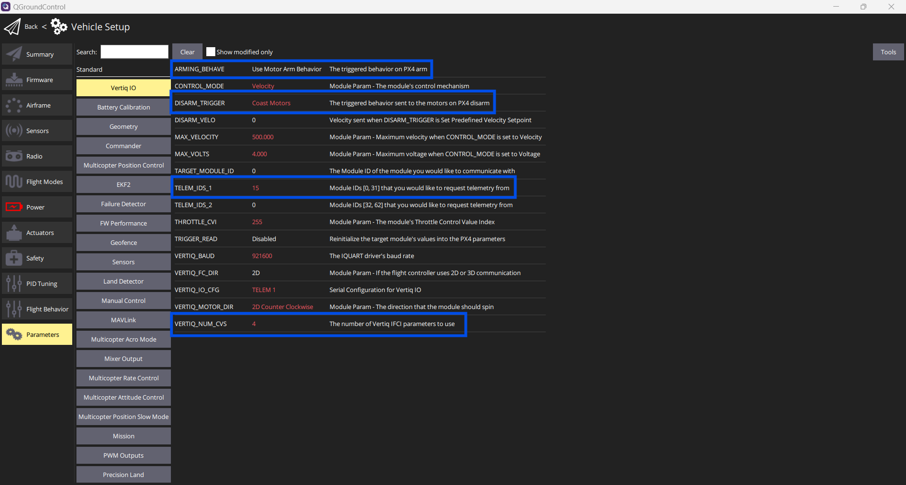

    PX4 Module Parameters

Next, the module parameters will be set. First the ``VTQ_TRGT_MOD_ID`` parameter will be set to 0. This means that we are interacting with the module with module ID 0. When ``VTQ_TRGT_MOD_ID`` is set, the Module Params should be reloaded. The ``VTQ_CONTROL_MODE`` parameter will be set to PWM. The ``VTQ_MAX_VELOCITY`` and ``VTQ_MAX_VOLTS`` parameters can be ignored because we are not controlling the motor with velocity or voltage mode. If ``VTQ_CONTROL_MODE`` is set to one of those, the MAX\_ parameter that it corresponds to needs to be set appropriately. More information about control mode and the related MAX\_ parameter can be found in the :ref:`Throttle Mode documentation<throttle_mode>`. ``VTQ_FC_DIR`` should be set to 2D. All of these parameters will be the same for all of the modules. The last two parameters ``VTQ_THROTTLE_CVI``, and ``VTQ_MOTOR_DIR`` will vary with each module. In our example, ``VTQ_THROTTLE_CVI`` will be set to match the module ID. Since we are currently setting module ID 0’s settings, we will set ``VTQ_THROTTLE_CVI`` to 0. CVI stands for Control Value Index and more information can be found in the :ref:`IFCI documentation<controlling_ifci>`. The CVI we set here indicates which CVI the motor is listening for in the IFCI control packet. ``VTQ_MOTOR_DIR`` will be set to 2D Counter Clockwise to match the :ref:`diagram of the quadcopter above<quad_image>`. Ensure the ``VTQ_MOTOR_DIR`` parameter matches the direction shown in the diagram for each module ID. This is then repeated for each module ID by selecting a new ``VTQ_TRGT_MOD_ID``. The resulting parameters for each module are shown below. Blue boxes are the parameters that match between modules, red are the ones that vary, and yellow is the module ID. After setting all of the parameters for one module, we recommend setting the ``VTQ_REDO_READ`` parameter to confirm that all of the Module Params have been set correctly. 

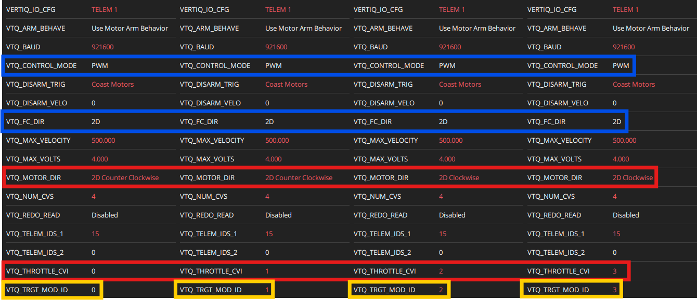

    All Modules Set Correctly

Actuator Setup
--------------

Now, we will configure PX4's internal representation of the quadcopter's geometry to match the IFCI outputs. Navigate to the :red:`actuator tab` of QGroundControl and ensure that the :blue:`Vertiq IO tab` shows up.

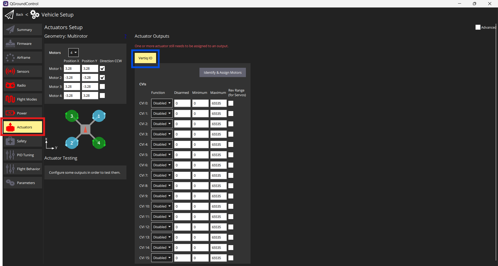

    Vertiq IO Tab Appears

The geometry section determines where the flight controller expects each motor on the aircraft, and what direction the flight controller expects that motor to be spinning. The Actuator Outputs section determines which motor defined in the geometry section is connected to which actuator. In this case, we want to associate Motors from the geometry section with our Modules. The CVIs in the Vertiq IO section of Actuator Outputs correspond to the CVIs set on each motor module in the previous section. In this example, we have set the CVIs such that we can associate Motor 1 with CVI 0, Motor 2 with CVI 1, Motor 3 with CVI 2, and Motor 4 with CVI 3.

.. note::
    If this is your first time configuring CVI values on a quadcopter, it is highly recommended to use values 0, 1, 2, 3 as the CVI values.
    Please refer to the :ref:`IFCI documentation <controlling_ifci>` to understand the difference between CVI values and Module IDs.

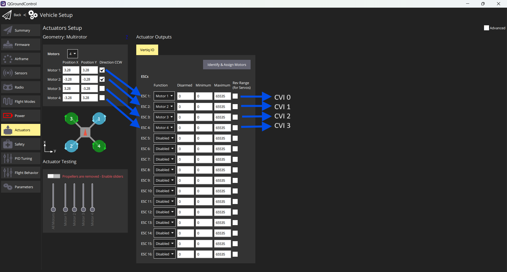

    Motor to Actuator to CVI Associations

If you accidentally put the wrong CVI on a motor you can just switch the motor functions in the actuator outputs section. If for example you accidentally set the front right motor (Module ID 0) as CVI 2 and the front left motor (Module ID 2) as CVI 0, then you can just set CVI 0 as Motor 3, and CVI 2 as Motor 1. You could also change the CVIs associated with each module, but we find that this is the most straightforward way to swap connections.

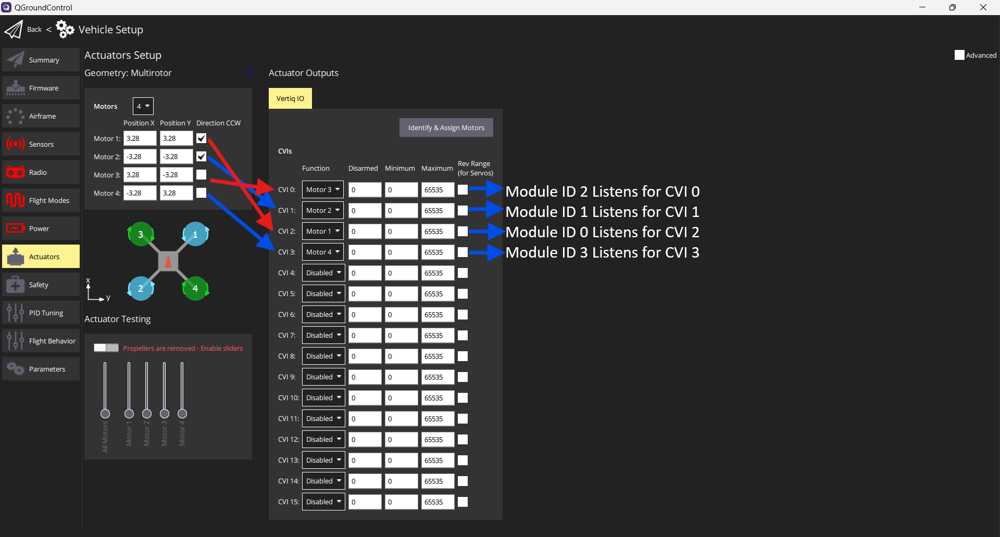

    Motor to Actuator to CVI Associations with Swap

Spin Testing
------------

.. warning::
    Please remove all propellers from any module you plan on testing. Failure to do so can result in harm to you or others around you. Further, please ensure that your module is secured to a stationary platform or surface before attempting to spin it. 

Now that the modules and flight controller have been configured, the modules can be tested. This is done in the same Actuators Tab in QGroundControl with the Actuator Testing section.

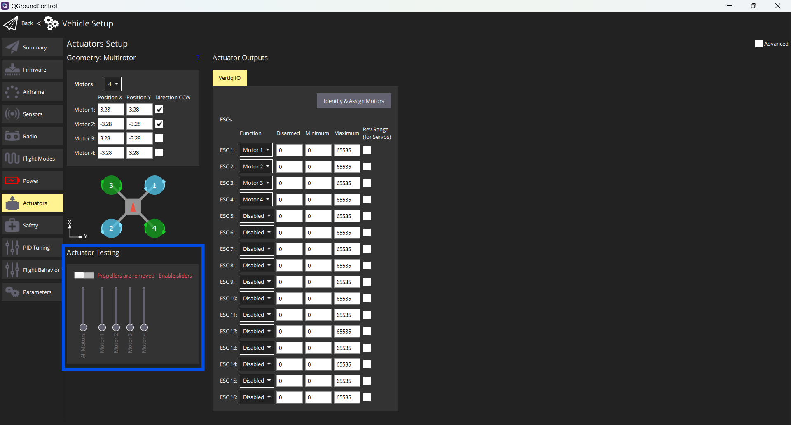

    Actuator Testing Section

Enable the actuator testing slider. The modules should arm when the testing slider is enabled. See the note below for more information on how arming works and how to confirm if the modules have armed. Now the sliders will control the modules that they correspond to. Slide each motor slider up individually and confirm that it corresponds to the expected module in the geometry picture. Additionally, confirm that it is spinning in the correct direction.

.. note::
    For testing, it is important to understand if your module is using :ref:`Advanced Arming <manual_advanced_arming>` with IFCI. If your module is using Advanced Arming with IFCI, then it will need to arm before it can spin for any of these tests. By default, Vertiq modules will arm after 10 consecutive throttle commands between 0% and 12.5% throttle. PX4 sends packets at 400Hz by default, so it will take 2.5ms for the motors to arm once the actuator testing slider is engaged and the motor sliders have remained at the bottom. Because of that, for the general default settings used on Vertiq modules, arming should not be a concern when running these tests. It should be apparent when your module arms because it will play a :ref:`short arming song <arming_song>`. If you do experience issues where the module will not spin but you believe your configurations are correct, check the arming configurations on your module.
 
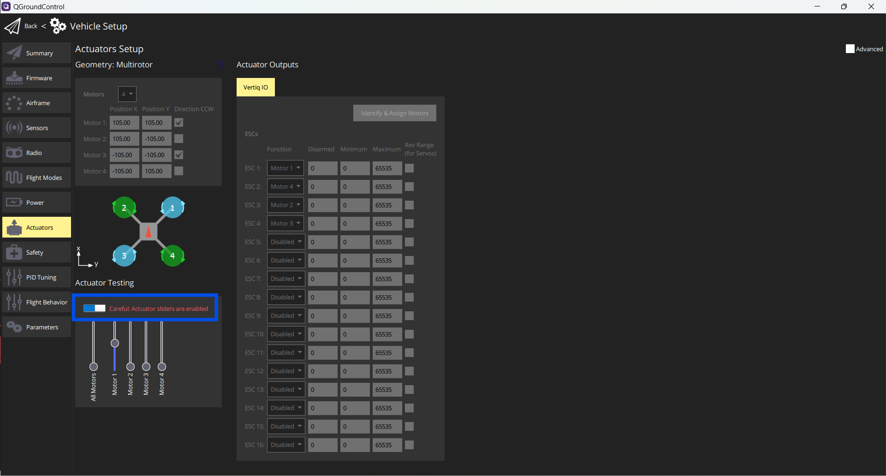

    Actuators Armed and Enabled

If the modules are incorrectly mapped you can rearrange the motor function associations as discussed in the previous section. If the direction of the motor is incorrect you will need to change the parameter ``VTQ_MOTOR_DIR`` for that module. For example, if motor 3 in the geometry image is spinning counterclockwise you need to determine which module ID that it is associated with (in our case module ID 2), and adjust the parameter by setting ``VTQ_TRGT_MOD_ID`` to 2 and then adjusting ``VTQ_MOTOR_DIR`` to 2D Clockwise.

PX4 with Pulsing a Module for Teetering or Flapping Propeller
-------------------------------------------------------------

First for this example, we will connect the PX4 flight controller to the motor over UART and connect the flight controller to a computer over USB. 

.. note::

    Be sure to complete :ref:`Setting Up PX4 and ArduPilot Firmware with IFCI Integration <ifci_px4_flight_controller>` if you have not already done so before proceeding.

In QGroundControl, go to Parameters then Vertiq IO. Set VTQ_NUM_CVS to 3 to account for the command value indices for throttle, x, and y that were previously set in Control Center :ref:`ifci_integration`.

Now, in Vertiq IO, set VTQ_VELO_CUTOFF to the desired velocity that prevents pulsing below the specified velocity. For the Control Value Indices (CVIs), set VTQ_THROTTLE_CIV to 0, VTQ_X_CVI to 1, and VTQ_Y_CVI to 2.

PX4 with Pulsing Module Zero Angle Calibration
----------------------------------------------

.. note::

    The desired angle for the zero angle will be chosen based on your vehicle specific set up.

To adjust the forward tilt angle, we will adjust the VTQ_ZERO_ANGLE parameter in the QGroundControl parameter menu where the units are radians. Increasing VTQ_ZERO_ANGLE rotates the propeller's tilt in the counterclockwise direction whereas decreasing VTQ_ZERO_ANGLE will rotate the propeller's tilt in the clockwise direction. If your propeller was rotated clockwise X degrees, you would first convert the X degrees to radians (X * 3.14159 / 180) = Y, resulting in Y radians. then add that to the current VTQ_ZERO_ANGLE parameter. In this example case, the current angle is Z as shown below.
Image of current VTQ_ZERO_ANGLE.
Y is then added to Z which is then written to the VTQ_ZERO_ANGLE parameter.

!!!Image of new VTQ_ZERO_ANGLE!!!

Now, go back to the QGroundControl's actuator tab, and we will perform the previous test again. Enable the testing slider and then increase the Motor 1 slider until it is near hover speed. Increase the Motor 2 slider so that you can observe the rotor tilting over a bit. The rotor should now be much closer to pointing forwards. If it is at your desired angle, you have calibrated the propeller angle properly. If it is not, then repeat the previous steps. Repeat the zero angle calibration steps until you have reached your desired angle

In the video below you can see a demonstration of using the Actuator tab in QGroundControl to spin and pulse a motor.

.. raw:: html

    
    <video class='center_vid' controls><source src="../_static/tutorial_images/ifci_integration/qgc_pulse_example.mp4" type="video/mp4"></video>

ArduPilot Set Up
================

Configuring Your Vertiq Modules for Use with ArduPilot
------------------------------------------------------

.. note::

    Be sure to complete :ref:`Setting Up PX4 and ArduPilot Firmware with IFCI Integration <ifci_px4_flight_controller>` if you have not already done so before proceeding.

First, connect to Mission Planner. Reset all settings to default using these instructions. This will automatically reboot the flight controller. When it’s completed its bootup, reconnect with Mission Planner. For this throttle only test, set the Frame Type to X:

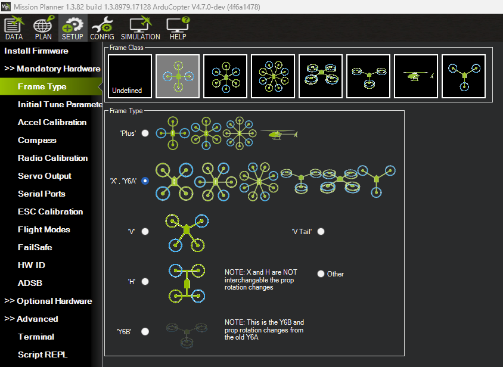

    Frame type selection

Now, go to CONFIG, and select the Full Parameter List. In the Search bar, enter VIQ to find Vertiq’s ArduCopter configuration options:

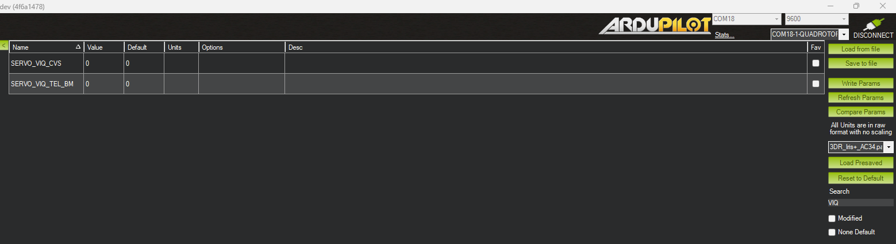

    Vertiq’s ArduCopter configuration options

.. note::

    Set your module’s CVIs to match this example. If this is your first time configuring CVI values on a quadcopter, it is highly recommended to use values 0, 1, 2, 3 as the CVI values.
    Please refer to the :ref:`IFCI documentation <controlling_ifci>` to understand the difference between CVI values and Module IDs.

For this basic throttle only test, only 1 Control Value is needed for the throttle output to the one connected module. Since there is only 1 CV, it is placed in index 0. Set SERVO_VIQ_CVS to 1, this parameter sets the number of control value indices where each index is needed to control a throttle value for a module. Since this module will not be pulsing, we only need a throttle index. We will also configure our flight controller to receive telemetry from our connected module. Since for this example, the module was reset to its factory default settings, the module currently has a `Module ID <https://iqmotion.readthedocs.io/en/latest/control_center_docs/control_center_start_guide.html#required-configuration-before-connecting-with-multiple-modules>`_ of 0. The lowest bit in the bitmask represents Module ID 0, so set SERVO_VIQ_TEL_BM to 1 :ref:`building ArduPilot <ifci_px4_flight_controller>`. Write these parameters..

Lastly, we must configure one of the flight controller’s UART peripherals to communicate using our :ref:`IQUART <uart_messaging>`. On the PixHawk 6C for this example we are going to connect to the TELEM2 port (which maps to `ArduPilot’s SERIAL2 <https://ardupilot.org/copter/docs/common-holybro-pixhawk6C.html#uart-mapping>`_). IQUART is protocol 47 in ArduPilot, so set SERIAL2_PROTOCOL (or the corresponding SERIALx port if SERIAL2 is not being used) to 47. You need to set this to match your module, and for this example, configure the serial port’s baud rate to 921600. Set SERIAL2_BAUD to 921:

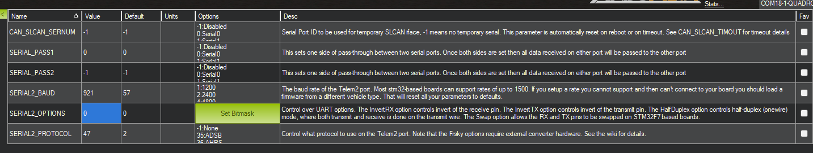

    Serial parameter options

Reboot the flight controller, power on the module, and connect the module’s serial port to the flight controller’s making sure that module TX goes to flight controller RX, and module RX goes to flight controller TX.

Now, navigate to the DATA tab in Mission Planner, and in the bottom left, find the Status window:

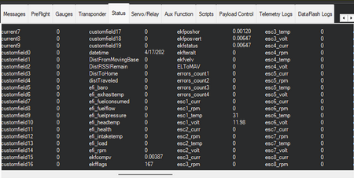

    ArduPilot status window

Here, you should see the module’s telemetry being reported as esc1_curr/rpm/etc. If the module is spun by hand, you should see that the reported RPM increases. If you do not see the telemetry updating, make sure the wire connections are correct, the telemetry bitmask includes module ID 0, and that all baud rates match.

ArduPilot has safety settings that may stop the module from spinning unless various conditions are met. For this tutorial, they are now going to be disabled. Go to the Full Parameters List again, and search for brd_safe. Set all of these parameters to 0, and reboot the flight controller.

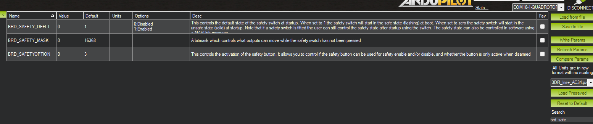

    ArduPilot safety options

.. warning::

    Before spinning, make sure there are no propellers on the module.

In Mission Planner, navigate to SETUP, Optional Hardware, and find Motor Test.

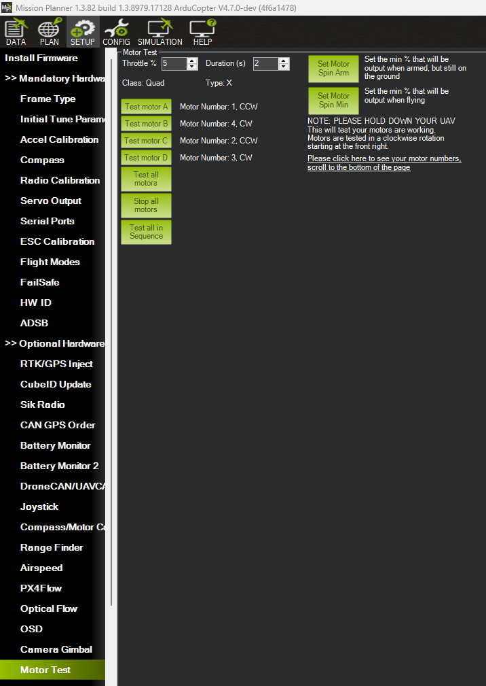

    ArduPilot motor test

Click Test Motor A, and the motor should spin. Be sure that your module is wired as illustrated below.

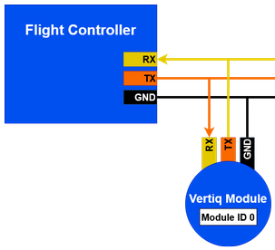

    ArduPilot motor test wiring diagram

ArduPilot with Pulsing a Module for Teetering or Flapping Propeller
-------------------------------------------------------------------

Now that we can perform basic control of, and telemetry reception from our module, we’ll configure the module and flight controller for pulsing.

Go to Mission Planner, and then go to the Full Parameter List, search viq\_, and set SERVO_VIQ_CVS to 3. For full pulsing control, each module requires 3 control values, one for throttle, one for X, and one for Y.

    ArduPilot command value indices