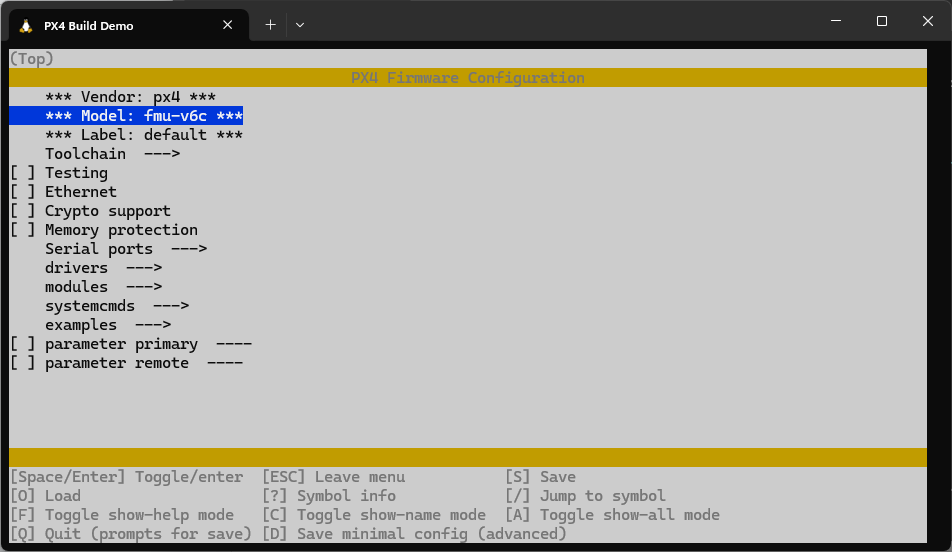
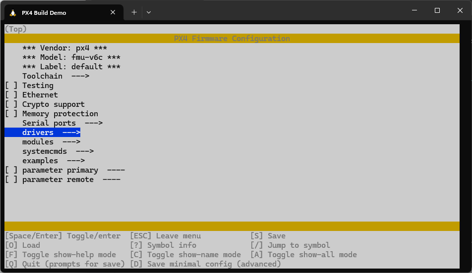
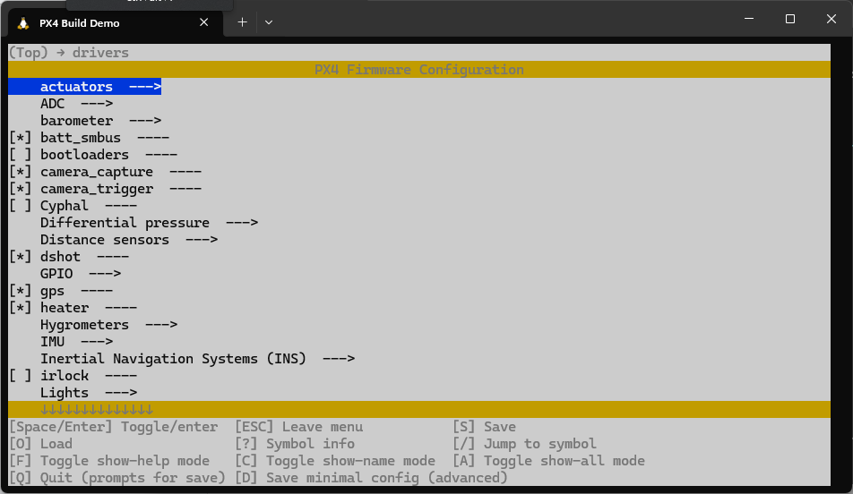
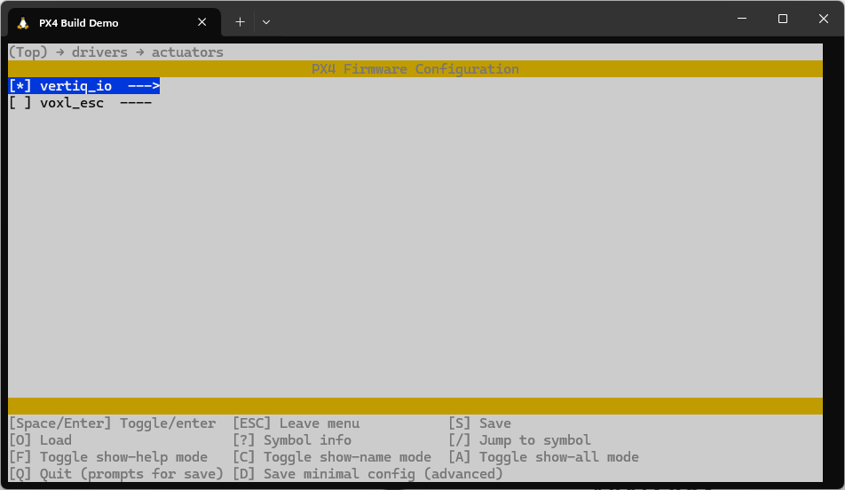
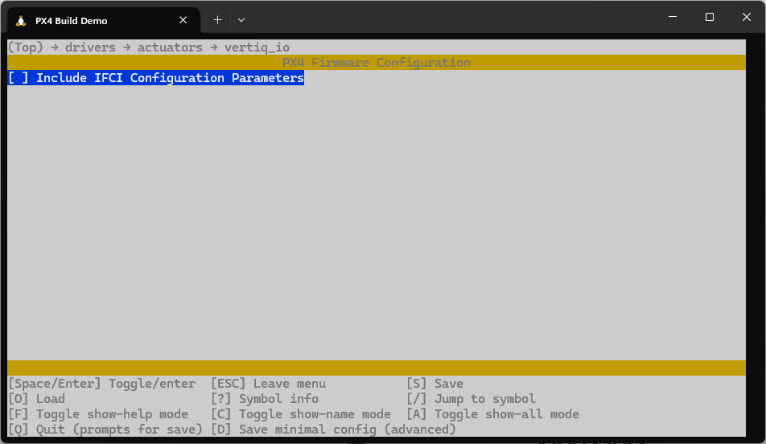
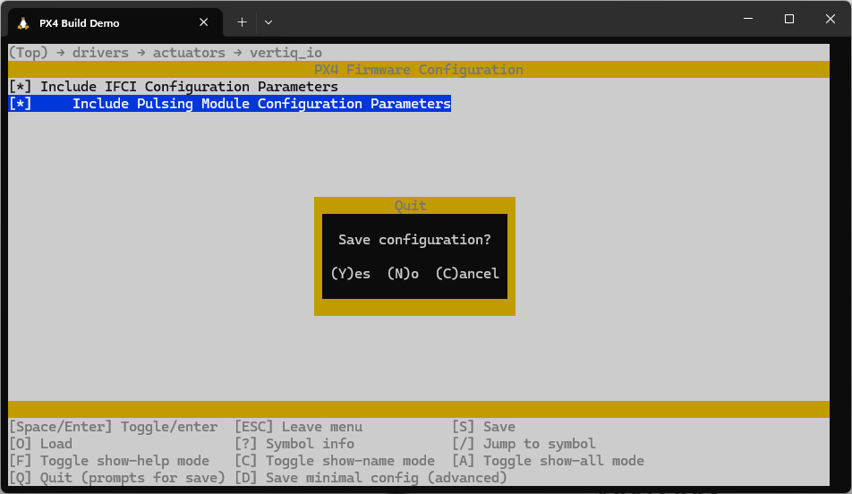
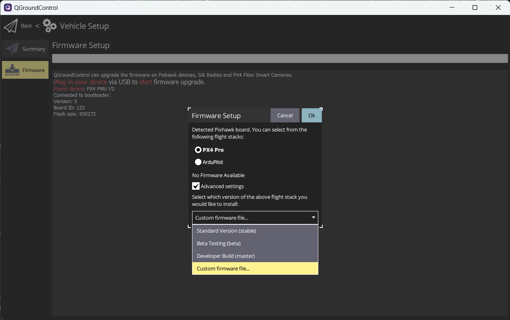
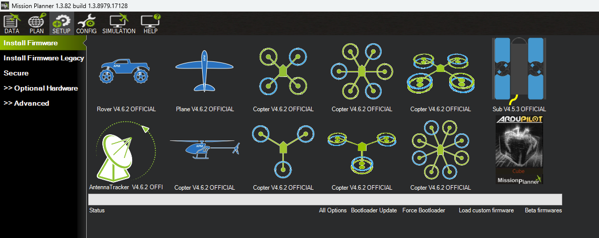

.. include:: ../text_colors.rst
.. toctree::

.. _ifci_px4_flight_controller:

***********************************************************
Setting Up PX4 and ArduPilot Firmware with IFCI Integration
***********************************************************

This tutorial covers how to configure and build `PX4 Autopilot <https://github.com/PX4/PX4-Autopilot>`_ for use with Vertiq’s :ref:`IQUART protocol <uart_messaging>`, and then set up the PX4 firmware to communicate with Vertiq's modules. With IQUART integrated into your flight controller, you gain the ability to control, configure, and receive telemetry from all connected modules through a single serial port. Please note that in order to control your module with IFCI through PX4, your module must support the :ref:`IQUART Flight Controller Interface (IFCI)<controlling_ifci>`. The features supported by your module and firmware style can be found on your module’s family page.

.. note::
    
    If you intend on using DroneCAN and a :ref:`IFCI <controlling_ifci>` as :ref:`redundant sources <redundant_throttle_manual>`, please first read 
    :ref:`redundant_arming_interactions` in order to fully understand the arming interactions that may occur between the protocols.

Setting Up the PX4 Toolchain
=============================

In order to build PX4, you must install the PX4 toolchain. We recommend that you follow `PX4's guides <https://docs.px4.io/main/en/dev_setup/dev_env.html>`__ in order to install the toolchain for your specific device.

.. once we are in px4, this whole section can be replaced with install px4 toolchain as described by them

Setting Up PX4 for IQUART and Building
=========================================

Once the toolchain is set up, you must change the settings for your board to turn on Vertiq IQUART integrations. To do this, enter your PX4 directory and use the command below, but replace ``<your-flight-control-board>`` with your flight control board's name.

.. code-block:: bash

    make <your-flight-control-board> boardconfig

For this example, we are building for the px4_fmu-v6c so we run the command below.

.. code-block:: bash

    make px4_fmu-v6c boardconfig

This should bring up the boardconfig window in the terminal. The 'Model' section should have your board name. In the image below we are using an ``fmu-v6c``.

    Main Board Config Page

Navigate to the ``drivers`` subsection with the arrow keys and press ``Enter`` to enter it.

    Selecting the Drivers Section

Navigate to the ``actuators`` submenu with the arrow keys and press ``Enter`` to enter it.

    Selecting the Actuators Section

Navigate to the ``vertiq_io`` subsection and press ``Space`` to select it. An asterisk should appear in the box. Once the asterisk is in the box, press ``Enter`` to enter the vertiq_io submenu.

    Selecting the vertiq_io Section

Inside the ``vertiq_io`` submenu one option should appear for including IFCI Configuration Parameters. Select this by pressing ``Space``.

    Include IFCI Parameters

When IFCI Configuration Parameters is selected, a second option will appear for including pulsing module configurations. If you plan on using `underactuated propellers <https://www.vertiq.co/upf-23-12>`_, select this as well.

When all of your desired configuration options are selected, press ``Q`` and then ``Y`` to save the configuration.

    Save the Configuration

Build the firmware with the following command, replacing ``your-flight-control-board`` with the name of your flight control board. This will be the same name as used in the :ref:`previous steps<ifci_px4_flight_controller>`.

.. code-block:: bash

    make <your-flight-control-board>

For this example, we are building for the px4_fmu-v6c so we run the command below.

.. code-block:: bash

    make px4_fmu-v6c

Your firmware file should appear in the ``PX4-Autopilot/build/your-flight-control-board_default`` folder as ``your-flight-control-board_default.px4``

.. warning::
    Adding the IFCI configuration features will increase the size of the PX4 build. This could make the build larger than the flash size available on your board.
    
    .. figure:: ../_static/tutorial_images/ifci_px4_flight_controller/large_code.png
        :align: center
        :scale: 50
        :alt: Oversized Code

        Oversized Code

    If the build is too large, you will have to turn off other features to fit the binary on your flight controller. We recommend excluding other output drivers (PWM, DShot, DroneCAN, etc.) that you will not be using. Features can be turned off through boardconfig exactly as you turned on Vertiq’s features.

    .. figure:: ../_static/tutorial_images/ifci_px4_flight_controller/disable_outputs.png
        :align: center
        :scale: 50
        :alt: DShot and PWM Location

        DShot and PWM Location

    With the build settings updated, rebuild the program. When the compiled program occupies under 100% of the flash size, you will be able to fully build the PX4 application.

    .. figure:: ../_static/tutorial_images/ifci_px4_flight_controller/small_code.png
        :align: center
        :scale: 50
        :alt: Trimmed Code

        Trimmed Code

Flashing PX4 to Your Flight Controller
======================================

Now you will need to flash your flight controller with the newly compiled ``.px4`` file. To do this, open QGroundControl, go to the vehicle settings menu, and enter the 'Firmware' menu. Once there, plug in your board, select the 'Advanced Settings' checkbox, and then the 'Custom Firmware' option. If QGroundControl does not show a pop-up, try unplugging all other USB devices that QGroundControl might confuse as a flight control board before attempting to plug your flight control board in again.

    Custom Firmware Selection

Pressing 'Ok' will cause a file explorer to appear. Find the ``your-flight-control-board_default.px4`` file that you built and select it. The flashing process should begin. 

Building ArduPilot Flight Controller Firmware
=============================================

.. note::

    Go here to set up ArduPilot following the `developer instructions <https://ardupilot.org/dev/>`_.

First, we will build our ArduPilot fork for your flight controller using the Master branch. Make sure you’ve set up an SSH key for GitHub,
then go to the `Vertiq ArduPilot repository <https://github.com/iq-motion-control/vertiq_ardupilot>`_.

In a WSL terminal, run the following:

.. code-block:: bash

    git clone git@github.com:iq-motion-control/vertiq_ardupilot.git --recursive

Navigate into the vertiq_ardupilot folder. In this example we're using the MatekH743 flight controller. 
You will need to adjust this command to build for your specific flight controller. More information for specific hardware is available on `Ardupilot's website <https://ardupilot.org/copter/docs/common-autopilots.html>`_. 
You can configure your build for your flight controller with the following: 

.. code-block:: bash

    ./waf configure --board MatekH743

Now build with:

.. code-block:: bash

    ./waf copter

Flashing ArduPilot to Your Flight Controller
============================================

Open Mission Planner, navigate to Setup, and Install Firmware

    Mission Planner firmware installation

Plug in your flight controller and Mission Planner should say that it found your board.
Select Load Custom Firmware, and select the .apj file you just built.
Once flashed, select Connect in the top right to connect with your flight controller.

Next steps
==========

To continue setting up a pulsing module follow the next steps:

#. :ref:`IFCI Integration with PX4 and ArduPilot <ifci_integration>`